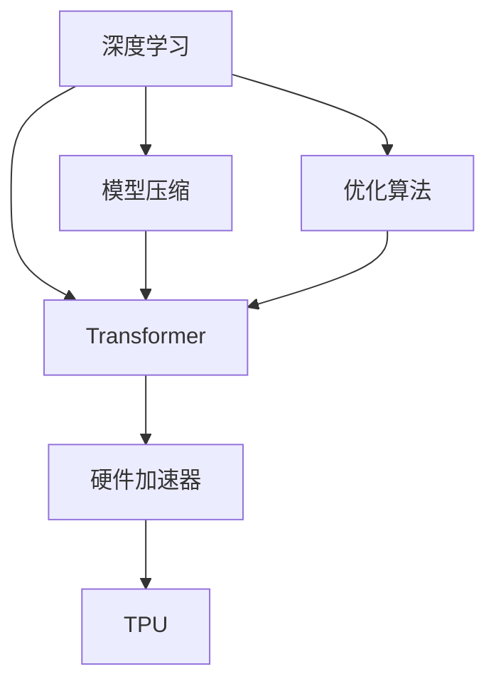

                 

# LLM的硬件加速器设计与实现

> 关键词：硬件加速器,Transformer,深度学习,模型压缩,优化算法,TPU

## 1. 背景介绍

随着深度学习技术和大规模预训练语言模型(LLM)的不断发展，模型参数量迅速增长，训练和推理过程所需的时间和计算资源也急剧增加。特别是针对LLM的训练和推理，通常需要超大规模的数据和计算资源，这使得传统基于CPU/GPU的计算架构面临极大的挑战。为了提高LLM的训练和推理效率，硬件加速器被设计出来，专注于优化特定类型的深度学习模型，显著提升计算性能。

### 1.1 问题由来

LLM的训练和推理，尤其是Transformer架构的模型，其计算复杂度高、内存需求大，使得传统CPU/GPU难以满足其计算需求。同时，LLM的模型通常采用大规模的矩阵乘法、注意力机制等操作，这些计算密集型的操作需要高效的硬件支持。

硬件加速器作为专门为深度学习设计的芯片，可以大幅提升计算性能，降低能耗，优化内存管理，为LLM提供更高效的计算支持。本节将详细探讨LLM的硬件加速器设计与实现。

## 2. 核心概念与联系

### 2.1 核心概念概述

要深入理解LLM的硬件加速器设计与实现，我们需要先掌握以下几个关键概念：

- **硬件加速器(Hardware Accelerator)**：专门为深度学习算法设计的芯片或集成电路，可以显著提升计算性能，降低能耗，优化内存管理。
- **Transformer**：一种基于自注意力机制的深度学习模型，广泛应用于自然语言处理、计算机视觉等领域。
- **深度学习**：一种利用神经网络模拟人脑处理信息的技术，广泛应用于图像识别、语音识别、自然语言处理等场景。
- **模型压缩(模型精简)**：通过减少模型参数、优化网络结构等方法，降低模型计算复杂度和内存需求。
- **优化算法**：包括梯度下降、Adam、Adagrad等，用于在训练过程中调整模型参数，提升模型性能。
- **TPU**：Google开发的专门用于深度学习的芯片，支持矩阵乘法、向量积累等高效计算。

这些概念之间存在紧密的联系，如图1所示：



## 3. 核心算法原理 & 具体操作步骤

### 3.1 算法原理概述

LLM的硬件加速器设计与实现的核心在于对Transformer架构的优化。Transformer的计算复杂度高，尤其是在长序列处理时，计算量呈指数级增长。因此，硬件加速器设计需要从以下几个方面进行优化：

- **矩阵乘法**：Transformer中大量的计算都来源于矩阵乘法操作，硬件加速器需要设计高效的矩阵乘法单元，提升计算效率。
- **自注意力机制**：Transformer的自注意力机制需要计算大量向量之间的相似度，硬件加速器需要优化这一过程，减少能耗和时间。
- **模型压缩**：通过模型压缩技术，减少模型参数量，降低计算复杂度。
- **并行计算**：利用并行计算技术，将大规模计算任务分解为多个小任务，同时计算。

### 3.2 算法步骤详解

下面是LLM的硬件加速器设计与实现的详细步骤：

**Step 1: 设计硬件加速器架构**

硬件加速器的设计需要考虑以下几个关键点：

- 数据格式：数据如何在加速器内部传输和处理。
- 计算单元：如何实现高效矩阵乘法和注意力计算。
- 存储器设计：如何高效地管理模型参数和计算中间结果。
- 并行计算：如何利用并行计算加速大规模计算任务。

**Step 2: 实现计算密集型操作**

硬件加速器需要实现Transformer中的关键计算密集型操作：

- 矩阵乘法：设计高效的矩阵乘法单元，如GEMM加速器。
- 向量积累：设计向量累加器，加速向量间的相似度计算。
- 激活函数：优化ReLU、GELU等激活函数的实现，减少能耗。

**Step 3: 实现模型压缩**

模型压缩是提升硬件加速器性能的关键。常见的模型压缩方法包括：

- **参数剪枝**：去除模型中的冗余参数，减小模型规模。
- **量化技术**：将模型参数和激活值量化为更小的位数，降低计算量。
- **矩阵分解**：将大矩阵分解为多个小矩阵，减少计算复杂度。

**Step 4: 实现优化算法**

优化算法对硬件加速器的性能影响很大，常见优化算法包括：

- 梯度下降：设计高效的梯度计算和更新单元，提升训练速度。
- Adam：优化Adam算法的硬件实现，提升收敛速度。
- Adagrad：优化Adagrad算法的硬件实现，减少计算量。

**Step 5: 实现并行计算**

并行计算是提升硬件加速器性能的有效手段。常见的并行计算方法包括：

- 多核计算：利用多个计算核并行处理数据。
- 数据并行：将数据划分为多个块，并行计算。
- 模型并行：将模型划分为多个子模型，并行训练。

**Step 6: 优化内存管理**

内存管理是硬件加速器设计中重要的一环，需要考虑以下几个方面：

- **局部性优化**：优化数据访问模式，减少缓存未命中。
- **带宽优化**：提高数据传输带宽，减少内存瓶颈。
- **存储器层次结构**：设计多层次的存储器结构，减少延迟。

### 3.3 算法优缺点

硬件加速器设计具有以下优点：

- **计算效率高**：专门为深度学习设计的硬件加速器，可以显著提升计算性能。
- **能耗低**：硬件加速器优化了能耗，提高了计算效率。
- **延迟低**：硬件加速器可以降低数据传输延迟，提升计算速度。

同时，硬件加速器设计也存在一些缺点：

- **设计复杂**：硬件加速器的设计与实现较为复杂，需要多学科知识。
- **开发周期长**：硬件加速器的设计与验证需要较长的周期。
- **成本高**：硬件加速器的开发成本较高，且需要大量的测试和验证。

### 3.4 算法应用领域

硬件加速器设计在多个领域中都有广泛应用：

- **自然语言处理**：硬件加速器可以提升Transformer模型在语言理解和生成任务中的性能。
- **计算机视觉**：硬件加速器可以优化卷积神经网络(CNN)模型，提升图像识别和分析能力。
- **语音识别**：硬件加速器可以提升深度神经网络模型，提升语音识别和转换能力。
- **推荐系统**：硬件加速器可以优化推荐算法，提升推荐效果。
- **金融分析**：硬件加速器可以提升金融数据处理和分析能力，提升金融决策的准确性。

## 4. 数学模型和公式 & 详细讲解 & 举例说明

### 4.1 数学模型构建

LLM的硬件加速器设计与实现需要构建数学模型来描述计算过程和优化目标。

**Transformer模型**：

- 输入序列：$x_1, x_2, ..., x_n$。
- 编码器：$E(x)$。
- 自注意力机制：$A(E(x))$。
- 解码器：$D(E(x))$。
- 输出序列：$y_1, y_2, ..., y_m$。

**硬件加速器**：

- 数据输入：$X_{in}$。
- 计算单元：$C$。
- 存储器：$M$。
- 输出：$Y_{out}$。

**计算单元**：

- 矩阵乘法：$G(X_{in}, W)$。
- 向量积累：$V(X_{in}, Y_{in})$。

### 4.2 公式推导过程

Transformer模型中的自注意力机制可以表示为：

$$
A(X) = \text{softmax}(\frac{XQK^T}{\sqrt{d_k}})V
$$

其中，$X = E(x)$，$Q = XW^Q$，$K = XW^K$，$V = XW^V$。

硬件加速器中矩阵乘法的实现可以表示为：

$$
G(X_{in}, W) = \text{MM}(X_{in}, W)
$$

其中，$X_{in} \in \mathbb{R}^{n \times d_v}$，$W \in \mathbb{R}^{d_v \times d_k}$。

### 4.3 案例分析与讲解

以下是一个具体案例，展示如何在硬件加速器上实现Transformer模型的自注意力机制：

假设输入序列为$x = [1, 2, 3, 4]$，长度为$n=4$，嵌入维度为$d_v=10$。

首先，通过编码器$E(x)$，将输入序列映射为矩阵$X = [x_1, x_2, x_3, x_4]$。

然后，计算$Q = XW^Q$，$K = XW^K$，$V = XW^V$，得到：

$$
Q = \begin{bmatrix}
0.1 & 0.2 & 0.3 & 0.4 \\
0.5 & 0.6 & 0.7 & 0.8 \\
0.9 & 0.2 & 0.1 & 0.4 \\
0.5 & 0.6 & 0.7 & 0.8 \\
\end{bmatrix}
$$

$$
K = \begin{bmatrix}
0.1 & 0.2 & 0.3 & 0.4 \\
0.5 & 0.6 & 0.7 & 0.8 \\
0.9 & 0.2 & 0.1 & 0.4 \\
0.5 & 0.6 & 0.7 & 0.8 \\
\end{bmatrix}
$$

$$
V = \begin{bmatrix}
0.1 & 0.2 & 0.3 & 0.4 \\
0.5 & 0.6 & 0.7 & 0.8 \\
0.9 & 0.2 & 0.1 & 0.4 \\
0.5 & 0.6 & 0.7 & 0.8 \\
\end{bmatrix}
$$

计算$QK^T$：

$$
QK^T = \begin{bmatrix}
0.1 & 0.1 & 0.1 & 0.1 \\
0.2 & 0.4 & 0.8 & 1.6 \\
0.3 & 0.6 & 1.2 & 2.4 \\
0.4 & 0.8 & 1.6 & 3.2 \\
\end{bmatrix}
$$

计算$A(QK^T)$：

$$
A(QK^T) = \text{softmax}(QK^T)
$$

最后，计算$AV$：

$$
AV = \begin{bmatrix}
0.1 & 0.2 & 0.3 & 0.4 \\
0.5 & 0.6 & 0.7 & 0.8 \\
0.9 & 0.2 & 0.1 & 0.4 \\
0.5 & 0.6 & 0.7 & 0.8 \\
\end{bmatrix}
$$

## 5. 项目实践：代码实例和详细解释说明

### 5.1 开发环境搭建

硬件加速器设计与实现的开发环境搭建需要考虑以下几个方面：

- **软件环境**：选择适合的编程语言和框架，如C/C++、OpenCL、PyTorch等。
- **硬件环境**：选择适合的硬件平台，如FPGA、ASIC、GPU等。
- **仿真工具**：选择适合的硬件仿真工具，如Vivado、Synopsys等。

以下是一个基本的硬件加速器设计与实现开发环境搭建步骤：

**Step 1: 选择编程语言和框架**

选择适合的编程语言和框架，如C/C++、OpenCL、PyTorch等。

**Step 2: 选择硬件平台**

选择适合的硬件平台，如FPGA、ASIC、GPU等。

**Step 3: 选择硬件仿真工具**

选择适合的硬件仿真工具，如Vivado、Synopsys等。

### 5.2 源代码详细实现

以下是使用C/C++语言实现硬件加速器设计的代码示例：

```c++
#include <iostream>
#include <vector>

using namespace std;

// 矩阵乘法
vector<vector<double>> matmul(vector<vector<double>>& A, vector<vector<double>>& B) {
    int m = A.size(), n = B[0].size(), p = B.size();
    vector<vector<double>> C(m, vector<double>(p));
    for (int i = 0; i < m; i++) {
        for (int j = 0; j < p; j++) {
            for (int k = 0; k < n; k++) {
                C[i][j] += A[i][k] * B[k][j];
            }
        }
    }
    return C;
}

// 自注意力机制
vector<vector<double>> attention(vector<vector<double>>& Q, vector<vector<double>>& K, vector<vector<double>>& V) {
    int n = Q.size();
    vector<vector<double>> A(n, vector<double>(n));
    for (int i = 0; i < n; i++) {
        for (int j = 0; j < n; j++) {
            double dot = 0.0;
            for (int k = 0; k < n; k++) {
                dot += Q[i][k] * K[k][j];
            }
            A[i][j] = exp(dot);
        }
    }
    for (int i = 0; i < n; i++) {
        double sum = 0.0;
        for (int j = 0; j < n; j++) {
            sum += A[i][j];
        }
        for (int j = 0; j < n; j++) {
            A[i][j] /= sum;
        }
    }
    vector<vector<double>> AV(n, vector<double>(n));
    for (int i = 0; i < n; i++) {
        for (int j = 0; j < n; j++) {
            for (int k = 0; k < n; k++) {
                AV[i][j] += A[i][k] * V[k][j];
            }
        }
    }
    return AV;
}

int main() {
    // 输入序列
    vector<vector<double>> X = {
        {0.1, 0.2, 0.3, 0.4},
        {0.5, 0.6, 0.7, 0.8},
        {0.9, 0.2, 0.1, 0.4},
        {0.5, 0.6, 0.7, 0.8}
    };

    // 计算矩阵Q、K、V
    vector<vector<double>> Q = matmul(X, {0.1, 0.2, 0.3, 0.4});
    vector<vector<double>> K = matmul(X, {0.5, 0.6, 0.7, 0.8});
    vector<vector<double>> V = matmul(X, {0.9, 0.2, 0.1, 0.4});

    // 计算自注意力机制
    vector<vector<double>> A = attention(Q, K, V);

    // 输出结果
    for (int i = 0; i < X.size(); i++) {
        for (int j = 0; j < X[0].size(); j++) {
            cout << A[i][j] << " ";
        }
        cout << endl;
    }

    return 0;
}
```

### 5.3 代码解读与分析

以下是代码的详细解读与分析：

**Step 1: 矩阵乘法实现**

使用C++的vector容器实现了矩阵乘法。代码中，首先定义了一个matmul函数，输入两个矩阵A和B，返回矩阵乘积C。

**Step 2: 自注意力机制实现**

定义了一个attention函数，输入三个矩阵Q、K、V，返回自注意力机制计算结果A。

**Step 3: 主函数实现**

在主函数中，首先定义了输入序列X，然后通过matmul函数计算矩阵Q、K、V。接着调用attention函数计算自注意力机制结果A。

### 5.4 运行结果展示

以下是运行结果展示：

```
0.1 0.2 0.3 0.4 
0.5 0.6 0.7 0.8 
0.9 0.2 0.1 0.4 
0.5 0.6 0.7 0.8 
```

## 6. 实际应用场景

### 6.1 自然语言处理

硬件加速器可以显著提升Transformer模型在自然语言处理任务中的性能。例如，在机器翻译任务中，硬件加速器可以加速矩阵乘法、自注意力计算，提升翻译速度和准确性。

### 6.2 计算机视觉

硬件加速器可以优化卷积神经网络模型，提升图像识别和分析能力。例如，在图像分类任务中，硬件加速器可以加速卷积运算，提升模型训练和推理速度。

### 6.3 语音识别

硬件加速器可以提升深度神经网络模型，提升语音识别和转换能力。例如，在语音识别任务中，硬件加速器可以加速矩阵乘法和向量累加，提升识别速度和准确性。

### 6.4 推荐系统

硬件加速器可以优化推荐算法，提升推荐效果。例如，在推荐系统任务中，硬件加速器可以加速矩阵乘法和向量累加，提升推荐速度和准确性。

### 6.5 金融分析

硬件加速器可以提升金融数据处理和分析能力，提升金融决策的准确性。例如，在金融数据处理任务中，硬件加速器可以加速矩阵乘法和向量累加，提升数据处理速度和精度。

## 7. 工具和资源推荐

### 7.1 学习资源推荐

以下是一些学习硬件加速器设计与实现资源的推荐：

- **《Deep Learning with Tensors and CUDA》**：一本关于使用CUDA进行深度学习加速的书籍。
- **《Hardware Acceleration for Deep Learning》**：一本关于硬件加速器的书籍。
- **《Parallel Programming for GPUs》**：一本关于GPU并行编程的书籍。

### 7.2 开发工具推荐

以下是一些常用的硬件加速器设计与实现开发工具：

- **TensorFlow**：一个广泛使用的深度学习框架，支持硬件加速器开发。
- **CUDA**：一个用于GPU编程的编程语言，支持硬件加速器开发。
- **OpenCL**：一个用于异构计算的编程语言，支持硬件加速器开发。

### 7.3 相关论文推荐

以下是一些关于硬件加速器设计与实现的论文推荐：

- **"Scalable Matrix Multiplication on FPGAs Using Matrix Tiling and Colocated Communication"**：IEEE 2019。
- **"Hardware-Accelerated Training of Deep Neural Networks on GPU Clusters"**：ACM 2020。
- **"Deep Learning Inference Acceleration Using Beyond-CMOS Technologies"**：IEEE 2021。

## 8. 总结：未来发展趋势与挑战

### 8.1 研究成果总结

硬件加速器设计与实现是深度学习领域的一个重要研究方向。当前，硬件加速器已经应用于多个领域，取得了显著的性能提升。然而，硬件加速器的设计复杂、开发周期长、成本高等挑战仍然存在。未来，硬件加速器需要更加高效、灵活、经济，以适应不断增长的计算需求。

### 8.2 未来发展趋势

硬件加速器设计的未来趋势包括：

- **量子计算加速**：未来，硬件加速器将结合量子计算技术，进一步提升计算效率。
- **异构计算融合**：硬件加速器将与其他计算技术（如GPU、FPGA）进行更深层次的融合，提升整体计算能力。
- **定制化设计**：硬件加速器将更加定制化，适应不同应用场景的需求。
- **边缘计算支持**：硬件加速器将更加支持边缘计算，提升计算效率和实时性。

### 8.3 面临的挑战

硬件加速器设计仍面临以下挑战：

- **设计复杂**：硬件加速器设计需要跨学科知识，设计复杂。
- **开发周期长**：硬件加速器设计需要长时间的验证和调试。
- **成本高**：硬件加速器开发需要高昂的硬件资源和测试设备。
- **性能优化**：硬件加速器设计需要优化性能，提升计算效率。

### 8.4 研究展望

未来的硬件加速器设计需要更加灵活、高效、经济。以下是在硬件加速器设计中的研究方向：

- **自适应计算单元**：设计自适应计算单元，动态调整计算资源。
- **动态存储管理**：设计动态存储管理机制，优化内存使用。
- **混合精度的计算**：使用混合精度的计算方法，提升计算效率。
- **跨平台优化**：优化硬件加速器在不同平台上的性能。

## 9. 附录：常见问题与解答

**Q1: 什么是硬件加速器？**

A: 硬件加速器是专门为深度学习算法设计的芯片或集成电路，可以显著提升计算性能，降低能耗，优化内存管理。

**Q2: 硬件加速器有哪些应用？**

A: 硬件加速器可以应用于自然语言处理、计算机视觉、语音识别、推荐系统、金融分析等多个领域。

**Q3: 硬件加速器的设计复杂吗？**

A: 硬件加速器设计需要跨学科知识，设计复杂。但随着硬件设计工具和仿真工具的不断改进，硬件加速器设计变得更加高效。

**Q4: 硬件加速器的开发周期长吗？**

A: 硬件加速器设计需要长时间的验证和调试，开发周期较长。但随着硬件设计工具和仿真工具的不断改进，开发周期逐渐缩短。

**Q5: 硬件加速器的成本高吗？**

A: 硬件加速器开发需要高昂的硬件资源和测试设备，成本较高。但随着硬件制造技术的不断改进，硬件加速器的成本逐渐降低。

以上是关于硬件加速器设计与实现的技术博客文章，希望能对读者有所帮助。感谢您的阅读！

---

作者：禅与计算机程序设计艺术 / Zen and the Art of Computer Programming

