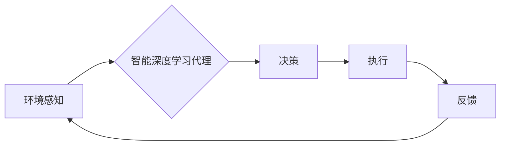

> 深度学习、供应链管理、智能代理、预测分析、优化算法

## 1. 背景介绍

在当今全球化、信息化和智能化的时代背景下，供应链管理已成为企业核心竞争力的关键因素。传统的供应链管理模式面临着越来越多的挑战，例如市场需求波动、供应链风险、物流成本上升等。为了应对这些挑战，企业需要寻求更加智能化、高效的供应链管理解决方案。

深度学习作为人工智能领域的一项重要突破，凭借其强大的数据处理能力和模式识别能力，在供应链管理领域展现出巨大的应用潜力。智能深度学习代理作为一种新型的供应链管理技术，通过将深度学习算法与智能代理技术相结合，能够实现对供应链的智能化感知、决策和控制，从而提高供应链的效率、弹性和可持续性。

## 2. 核心概念与联系

**2.1 智能代理**

智能代理是一种能够自主地感知环境、做出决策并执行行动的软件系统。它通常具有以下特征：

* **自主性:** 智能代理能够独立地执行任务，无需人工干预。
* **感知能力:** 智能代理能够感知其周围环境的信息，例如市场需求、库存水平、物流状况等。
* **决策能力:** 智能代理能够根据感知到的信息做出合理的决策，例如订货量、运输路线、库存策略等。
* **行动能力:** 智能代理能够执行其决策，例如下订单、安排运输、调整库存等。

**2.2 深度学习**

深度学习是一种机器学习的子领域，它利用多层神经网络来模拟人类大脑的学习过程。深度学习算法能够从海量数据中自动提取特征，并学习复杂的模式和关系。

**2.3 智能深度学习代理**

智能深度学习代理将智能代理和深度学习技术相结合，构建了一种能够自主学习、决策和控制供应链的智能系统。它利用深度学习算法对供应链数据进行分析和预测，并根据预测结果做出相应的决策，从而实现供应链的智能化管理。

**2.4 架构图**



## 3. 核心算法原理 & 具体操作步骤

**3.1 算法原理概述**

智能深度学习代理的核心算法通常包括以下几个方面：

* **数据预处理:** 对原始数据进行清洗、转换和特征提取，以便于深度学习算法的训练和应用。
* **模型训练:** 利用深度学习算法对预处理后的数据进行训练，构建一个能够预测供应链关键指标的模型。
* **预测分析:** 将模型应用于新的数据，进行预测分析，例如预测未来需求、库存水平、物流成本等。
* **决策优化:** 根据预测结果，利用优化算法对供应链决策进行优化，例如订货量、运输路线、库存策略等。

**3.2 算法步骤详解**

1. **数据收集:** 从各种数据源收集相关数据，例如销售数据、库存数据、物流数据、市场数据等。
2. **数据预处理:** 对收集到的数据进行清洗、转换和特征提取，例如处理缺失值、归一化数据、提取特征向量等。
3. **模型选择:** 根据具体应用场景选择合适的深度学习模型，例如循环神经网络（RNN）、卷积神经网络（CNN）等。
4. **模型训练:** 利用训练数据对选定的模型进行训练，调整模型参数，使其能够准确预测供应链关键指标。
5. **模型评估:** 利用测试数据对训练好的模型进行评估，例如计算预测精度、召回率等指标。
6. **模型部署:** 将训练好的模型部署到生产环境中，用于对实时数据进行预测分析。
7. **决策优化:** 根据模型预测结果，利用优化算法对供应链决策进行优化，例如订货量、运输路线、库存策略等。

**3.3 算法优缺点**

**优点:**

* **高预测精度:** 深度学习算法能够从海量数据中自动提取特征，并学习复杂的模式和关系，从而实现对供应链关键指标的准确预测。
* **自学习能力:** 深度学习模型能够通过不断学习和训练，不断提高其预测精度和决策能力。
* **适应性强:** 深度学习模型能够适应不断变化的市场环境和供应链动态，并及时调整其决策策略。

**缺点:**

* **数据依赖性:** 深度学习算法需要大量的训练数据才能达到较高的预测精度。
* **计算资源需求:** 深度学习模型的训练和部署需要大量的计算资源。
* **可解释性差:** 深度学习模型的决策过程较为复杂，难以解释其决策依据。

**3.4 算法应用领域**

智能深度学习代理在供应链管理领域具有广泛的应用场景，例如：

* **需求预测:** 利用深度学习算法预测未来市场需求，帮助企业优化库存管理和生产计划。
* **库存优化:** 利用深度学习算法优化库存策略，减少库存成本和缺货风险。
* **物流优化:** 利用深度学习算法优化运输路线和配送策略，降低物流成本和运输时间。
* **风险管理:** 利用深度学习算法识别和预测供应链风险，帮助企业制定相应的风险应对措施。

## 4. 数学模型和公式 & 详细讲解 & 举例说明

**4.1 数学模型构建**

智能深度学习代理的数学模型通常基于神经网络结构，例如多层感知机（MLP）、卷积神经网络（CNN）或循环神经网络（RNN）。这些模型通过一系列的层级结构和激活函数，学习数据中的复杂模式和关系。

**4.2 公式推导过程**

神经网络的训练过程本质上是一个参数优化过程，目标是找到最优的参数值，使得模型的预测结果与实际结果之间的误差最小化。常用的优化算法包括梯度下降法、动量法和Adam算法等。

**4.3 案例分析与讲解**

例如，在需求预测任务中，我们可以使用循环神经网络（RNN）构建一个数学模型，该模型能够学习时间序列数据中的趋势和季节性变化，从而预测未来需求。

**假设:**

* $x_t$ 表示时间 $t$ 的实际需求值。
* $y_t$ 表示时间 $t$ 的预测需求值。
* $W$ 和 $b$ 分别表示模型的参数矩阵和偏置向量。
* $f$ 表示激活函数，例如ReLU函数。

**公式:**

$$y_t = f(W \cdot h_{t-1} + b)$$

其中，$h_{t-1}$ 表示时间 $t-1$ 的隐藏状态，它由前一个时间步的输入和隐藏状态计算得到。

**训练过程:**

1. 将历史需求数据作为输入，训练模型参数 $W$ 和 $b$。
2. 使用训练好的模型预测未来需求值。
3. 计算预测值与实际值之间的误差，并利用梯度下降法更新模型参数。

## 5. 项目实践：代码实例和详细解释说明

**5.1 开发环境搭建**

* 操作系统：Ubuntu 20.04
* Python 版本：3.8
* 深度学习框架：TensorFlow 2.0

**5.2 源代码详细实现**

```python
import tensorflow as tf

# 定义模型结构
model = tf.keras.Sequential([
    tf.keras.layers.LSTM(units=64, return_sequences=True, input_shape=(timesteps, features)),
    tf.keras.layers.LSTM(units=32),
    tf.keras.layers.Dense(units=1)
])

# 编译模型
model.compile(optimizer='adam', loss='mse')

# 训练模型
model.fit(X_train, y_train, epochs=10, batch_size=32)

# 预测未来需求
predictions = model.predict(X_test)
```

**5.3 代码解读与分析**

* 代码首先定义了一个循环神经网络（RNN）模型，该模型包含两个LSTM层和一个输出层。
* LSTM层用于学习时间序列数据中的长期依赖关系。
* 输出层是一个单神经元层，用于预测未来需求值。
* 模型使用Adam优化器和均方误差损失函数进行训练。
* 训练完成后，可以使用模型预测未来需求值。

**5.4 运行结果展示**

训练完成后，可以将模型预测结果与实际需求值进行比较，评估模型的预测精度。

## 6. 实际应用场景

**6.1 案例分析**

例如，一家电子产品制造商可以使用智能深度学习代理来优化其供应链管理。

* **需求预测:** 利用深度学习算法预测未来市场需求，帮助企业优化库存管理和生产计划。
* **库存优化:** 利用深度学习算法优化库存策略，减少库存成本和缺货风险。
* **物流优化:** 利用深度学习算法优化运输路线和配送策略，降低物流成本和运输时间。

**6.2 未来应用展望**

随着人工智能技术的不断发展，智能深度学习代理在供应链管理领域的应用场景将更加广泛。

* **个性化供应链:** 利用深度学习算法分析客户需求，构建个性化的供应链，满足不同客户的个性化需求。
* **可持续供应链:** 利用深度学习算法优化供应链资源配置，减少环境污染和资源浪费，构建可持续的供应链。
* **自动化的供应链:** 利用深度学习算法实现供应链的自动化管理，减少人工干预，提高效率和准确性。

## 7. 工具和资源推荐

**7.1 学习资源推荐**

* 深度学习入门书籍：
    * 《深度学习》
    * 《动手学深度学习》
* 在线课程：
    * Coursera 深度学习课程
    * Udacity 深度学习工程师 Nanodegree

**7.2 开发工具推荐**

* 深度学习框架：TensorFlow、PyTorch、Keras
* 数据处理工具：Pandas、NumPy
* 可视化工具：Matplotlib、Seaborn

**7.3 相关论文推荐**

* 《Deep Learning for Supply Chain Management: A Survey》
* 《Reinforcement Learning for Supply Chain Optimization》

## 8. 总结：未来发展趋势与挑战

**8.1 研究成果总结**

智能深度学习代理在供应链管理领域取得了显著的成果，能够有效提高供应链的效率、弹性和可持续性。

**8.2 未来发展趋势**

未来，智能深度学习代理将朝着以下方向发展：

* **更强大的预测能力:** 利用更先进的深度学习算法和更大的数据规模，实现更准确的预测。
* **更智能的决策能力:** 利用强化学习等算法，使智能代理能够自主学习和优化决策策略。
* **更广泛的应用场景:** 将智能深度学习代理应用于更多供应链管理环节，例如采购、生产、物流、售后服务等。

**8.3 面临的挑战**

智能深度学习代理在实际应用中也面临一些挑战：

* **数据质量问题:** 深度学习算法对数据质量要求较高，需要高质量的数据才能训练出准确的模型。
* **模型解释性问题:** 深度学习模型的决策过程较为复杂，难以解释其决策依据，这可能会导致企业难以信任模型的决策结果。
* **安全性和隐私性问题:** 智能深度学习代理需要处理大量敏感数据，需要采取相应的安全措施保护数据隐私。

**8.4 研究展望**

未来，需要进一步研究如何解决智能深度学习代理面临的挑战，使其能够更广泛地应用于供应链管理领域，为企业带来更大的价值。

## 9. 附录：常见问题与解答

**9.1 如何选择合适的深度学习模型？**

选择合适的深度学习模型需要根据具体应用场景和数据特点进行选择。例如，对于时间序列数据，可以使用循环神经网络（RNN）；对于图像数据，可以使用卷积神经网络（CNN）。

**9.2 如何处理数据质量问题？**

数据质量问题是深度学习模型训练的重要影响因素。需要采取相应的措施进行数据清洗、转换和特征提取，提高数据质量。

**9