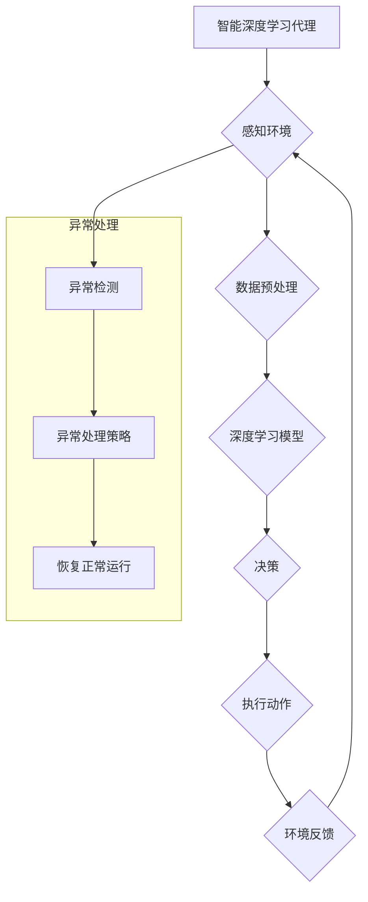

> 深度学习、异常处理、容错、智能代理、机器学习、人工智能

## 1. 背景介绍

在当今数据爆炸的时代，人工智能（AI）正以惊人的速度发展，深度学习作为AI的核心技术之一，在图像识别、自然语言处理、语音识别等领域取得了突破性的进展。然而，深度学习模型也面临着一些挑战，其中异常处理和容错能力不足是较为突出的一点。

深度学习模型通常是基于海量数据训练的，一旦遇到未见过的数据或异常情况，模型的性能就会急剧下降，甚至出现错误预测。这在一些关键领域，例如医疗诊断、金融交易、自动驾驶等，可能导致严重的后果。因此，如何提高深度学习模型的异常处理和容错能力，使其能够在复杂、不确定环境中更加可靠地运行，成为一个重要的研究课题。

## 2. 核心概念与联系

**2.1 智能深度学习代理**

智能深度学习代理是指能够自主学习、决策和执行任务的智能体，其核心是深度学习模型。智能代理通常具有以下特征：

* **感知能力:** 通过传感器或其他方式获取环境信息。
* **决策能力:** 基于感知信息和自身知识，做出决策。
* **执行能力:** 执行决策，改变环境或自身状态。
* **学习能力:** 通过经验积累和数据反馈，不断改进决策策略。

**2.2 异常处理与容错**

异常处理是指在程序运行过程中，遇到意外情况时采取措施，避免程序崩溃或产生错误结果。容错是指系统能够在部分组件发生故障时，仍然能够正常运行或部分功能正常运行的能力。

**2.3 核心概念联系**

智能深度学习代理的异常处理与容错能力是其可靠性和安全性至关重要的因素。当代理在执行任务时遇到异常情况，例如传感器数据异常、环境变化剧烈等，需要能够及时识别异常，采取相应的措施，避免造成损失。

**2.4 Mermaid 流程图**



## 3. 核心算法原理 & 具体操作步骤

### 3.1 算法原理概述

深度学习模型的异常处理与容错通常采用以下几种方法：

* **异常检测:** 利用深度学习模型识别数据或行为的异常模式。
* **鲁棒性训练:** 通过训练数据增强和正则化等技术，提高模型对异常数据的鲁棒性。
* **模型冗余:** 使用多个深度学习模型并行运行，并通过投票或融合等方法提高模型的容错能力。
* **自修复机制:** 设计自适应的机制，能够根据异常情况自动调整模型参数或结构，恢复正常运行。

### 3.2 算法步骤详解

**3.2.1 异常检测算法**

1. **数据预处理:** 对原始数据进行清洗、转换和特征提取，以便于模型训练和异常检测。
2. **模型训练:** 使用异常检测算法，例如孤立森林、局部异常值检测等，训练深度学习模型，使其能够识别异常数据模式。
3. **异常检测:** 将新数据输入到训练好的模型中，根据模型的输出结果判断数据是否为异常。

**3.2.2 鲁棒性训练算法**

1. **数据增强:** 对训练数据进行随机噪声添加、图像旋转、数据仿射变换等操作，增加数据的多样性，提高模型对异常数据的鲁棒性。
2. **正则化:** 在模型训练过程中，添加正则化项，例如L1正则化、L2正则化等，防止模型过拟合，提高模型的泛化能力。
3. **对抗训练:** 使用对抗样本攻击模型，并根据攻击结果调整模型参数，提高模型对对抗样本的鲁棒性。

**3.2.3 模型冗余算法**

1. **模型训练:** 训练多个深度学习模型，每个模型使用不同的训练数据或模型结构。
2. **模型融合:** 将多个模型的预测结果进行融合，例如投票融合、加权融合等，提高模型的容错能力。

### 3.3 算法优缺点

| 算法 | 优点 | 缺点 |
|---|---|---|
| 异常检测 | 能够识别未知的异常模式 | 需要大量的异常数据进行训练 |
| 鲁棒性训练 | 提高模型对异常数据的鲁棒性 | 训练时间较长，计算资源消耗较大 |
| 模型冗余 | 提高模型的容错能力 | 需要训练多个模型，存储和计算资源消耗较大 |

### 3.4 算法应用领域

* **医疗诊断:** 识别患者的异常症状，辅助医生进行诊断。
* **金融交易:** 检测欺诈交易，防止金融损失。
* **自动驾驶:** 识别道路上的异常情况，避免事故发生。
* **工业控制:** 监控设备运行状态，及时发现故障。

## 4. 数学模型和公式 & 详细讲解 & 举例说明

### 4.1 数学模型构建

**4.1.1 异常检测模型**

假设数据样本为 $x \in R^n$，其中 $n$ 为特征维度。异常检测模型的目标是学习一个函数 $f(x)$，将数据样本映射到一个异常得分 $s(x)$，其中 $s(x)$ 越大，表示数据样本越异常。

常用的异常检测模型包括：

* **孤立森林:** 基于树结构的异常检测算法，通过计算数据样本在森林中的孤立度来判断异常性。
* **局部异常值检测:** 基于数据样本的局部密度来判断异常性。

**4.1.2 鲁棒性训练模型**

鲁棒性训练模型的目标是提高模型对异常数据的鲁棒性，可以使用以下方法：

* **数据增强:** 对训练数据进行随机噪声添加、图像旋转、数据仿射变换等操作，增加数据的多样性。
* **正则化:** 在模型训练过程中，添加正则化项，例如L1正则化、L2正则化等，防止模型过拟合，提高模型的泛化能力。

### 4.2 公式推导过程

**4.2.1 孤立森林算法**

孤立森林算法的核心思想是，异常样本在数据集中相对孤立，其在森林中的孤立度较高。

假设数据样本 $x$ 在森林中被分割成 $k$ 个节点，则 $x$ 的孤立度 $i(x)$ 定义为：

$$i(x) = \frac{1}{k}$$

其中 $k$ 为 $x$ 在森林中被分割的节点数。

孤立度越小，表示样本越孤立，越可能是异常样本。

**4.2.2 局部异常值检测算法**

局部异常值检测算法基于数据样本的局部密度来判断异常性。

假设数据样本 $x$ 的 $k$ 近邻为 $N_k(x)$，则 $x$ 的局部密度 $d(x)$ 定义为：

$$d(x) = \frac{1}{|N_k(x)|}$$

其中 $|N_k(x)|$ 为 $x$ 的 $k$ 近邻的数量。

局部密度越低，表示样本越孤立，越可能是异常样本。

### 4.3 案例分析与讲解

**4.3.1 异常检测案例**

假设我们有一个金融交易数据集，需要检测欺诈交易。可以使用孤立森林算法对数据进行异常检测。

训练好的孤立森林模型可以将交易数据映射到异常得分，得分越高，表示交易越可能是欺诈交易。

**4.3.2 鲁棒性训练案例**

假设我们有一个图像识别模型，需要识别不同类型的物体。可以使用数据增强和正则化技术提高模型对噪声图像的鲁棒性。

通过对训练图像进行随机噪声添加，可以使模型能够更好地识别噪声图像中的物体。

## 5. 项目实践：代码实例和详细解释说明

### 5.1 开发环境搭建

* 操作系统: Ubuntu 20.04
* Python 版本: 3.8
* 深度学习框架: TensorFlow 2.0

### 5.2 源代码详细实现

```python
# 异常检测示例代码 (使用孤立森林算法)

from sklearn.ensemble import IsolationForest

# 准备数据
data = ...

# 训练模型
model = IsolationForest()
model.fit(data)

# 预测异常值
predictions = model.predict(data)

# 打印异常值
print(predictions)
```

### 5.3 代码解读与分析

* `IsolationForest` 是 TensorFlow 中的孤立森林算法实现。
* `fit()` 方法用于训练模型，`predict()` 方法用于预测异常值。
* `predictions` 变量包含每个数据样本的预测结果，-1 表示异常值，1 表示正常值。

### 5.4 运行结果展示

运行代码后，将输出每个数据样本的预测结果，可以根据结果判断哪些数据样本是异常值。

## 6. 实际应用场景

### 6.1 医疗诊断

深度学习模型可以用于识别患者的异常症状，例如皮肤病、癌症等，辅助医生进行诊断。

### 6.2 金融交易

深度学习模型可以用于检测欺诈交易，例如信用卡盗刷、网络钓鱼等，防止金融损失。

### 6.3 自动驾驶

深度学习模型可以用于识别道路上的异常情况，例如行人突然出现、车辆突然变道等，避免事故发生。

### 6.4 未来应用展望

随着深度学习技术的不断发展，其在异常处理与容错领域的应用将更加广泛。例如：

* **自适应异常检测:** 基于机器学习算法，能够根据环境变化自动调整异常检测模型，提高检测精度。
* **联邦学习:** 在保护数据隐私的前提下，利用多个设备的计算资源共同训练异常检测模型，提高模型的泛化能力。
* **强化学习:** 利用强化学习算法，训练智能代理能够在异常情况下做出最佳决策，提高其容错能力。

## 7. 工具和资源推荐

### 7.1 学习资源推荐

* **书籍:**
    * 深度学习
    * 人工智能：一种现代方法
* **在线课程:**
    * Coursera: 深度学习
    * Udacity: 深度学习工程师
* **博客:**
    * TensorFlow Blog
    * PyTorch Blog

### 7.2 开发工具推荐

* **深度学习框架:** TensorFlow, PyTorch
* **数据处理工具:** Pandas, NumPy
* **可视化工具:** Matplotlib, Seaborn

### 7.3 相关论文推荐

* **Isolation Forest**
* **Local Outlier Factor**
* **Adversarial Training for Robust Deep Learning**

## 8. 总结：未来发展趋势与挑战

### 8.1 研究成果总结

深度学习模型在异常处理与容错领域取得了显著进展，例如异常检测算法、鲁棒性训练技术、模型冗余策略等。

### 8.2 未来发展趋势

未来，深度学习模型的异常处理与容错能力将进一步提升，主要趋势包括：

* **自适应异常检测:** 基于机器学习算法，能够根据环境变化自动调整异常检测模型。
* **联邦学习:** 在保护数据隐私的前提下，利用多个设备的计算资源共同训练异常检测模型。
* **强化学习:** 利用强化学习算法，训练智能代理能够在异常情况下做出最佳决策。

### 8.3 面临的挑战

深度学习模型的异常处理与容错能力仍然面临一些挑战，例如：

* **数据稀缺:** 异常数据通常比较稀缺，难以训练出高性能的异常检测模型。
* **对抗攻击:** 攻击者可以设计对抗样本，攻击深度学习模型，使其产生错误预测