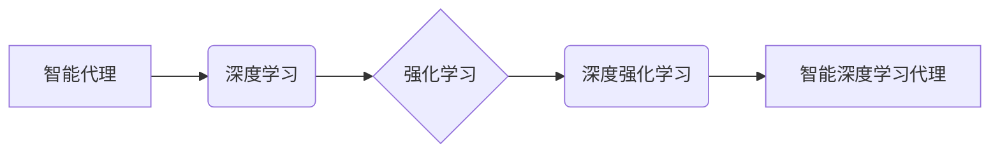

> 深度学习、智能代理、神经网络、强化学习、机器学习、算法原理、实践应用

## 1. 背景介绍

人工智能（AI）正以惊人的速度发展，深度学习作为其核心技术，在图像识别、自然语言处理、语音识别等领域取得了突破性进展。智能代理，作为AI领域的重要研究方向，旨在构建能够自主学习、决策和行动的智能体。深度学习算法为构建智能代理提供了强大的工具，使其能够从海量数据中学习，并根据环境反馈不断优化行为策略。

本文将深入探讨深度学习算法在构建智能深度学习代理的基础，涵盖核心概念、算法原理、数学模型、代码实现以及实际应用场景。

## 2. 核心概念与联系

**2.1 智能代理**

智能代理是指能够感知环境、做出决策并执行行动的软件系统。它通常具有以下特征：

* **自主性:** 智能代理能够独立地做出决策，无需人工干预。
* **学习能力:** 智能代理能够从经验中学习，不断改进其行为策略。
* **适应性:** 智能代理能够适应不断变化的环境，调整其行为策略以实现目标。

**2.2 深度学习**

深度学习是一种机器学习的子领域，它利用多层神经网络来模拟人类大脑的学习过程。深度学习算法能够从复杂的数据中提取特征，并学习复杂的模式。

**2.3 强化学习**

强化学习是一种机器学习方法，它通过奖励和惩罚机制来训练智能代理。智能代理在环境中采取行动，根据环境反馈获得奖励或惩罚，并根据这些反馈调整其行为策略以最大化奖励。

**2.4 深度强化学习**

深度强化学习将深度学习和强化学习相结合，利用深度神经网络来构建智能代理的行为策略，并通过强化学习算法进行训练。

**2.5 智能深度学习代理**

智能深度学习代理是指利用深度学习算法和强化学习算法构建的智能代理。它能够从环境中学习，并根据环境反馈不断优化行为策略，实现自主学习、决策和行动。

**2.6  核心概念关系图**



## 3. 核心算法原理 & 具体操作步骤

### 3.1  算法原理概述

深度强化学习算法的核心思想是利用深度神经网络来构建智能代理的行为策略，并通过强化学习算法进行训练。

* **价值函数:** 价值函数用来评估智能代理在特定状态下采取特定行动的长期回报。
* **策略网络:** 策略网络是一个深度神经网络，它根据当前状态输出智能代理采取行动的概率分布。
* **目标网络:** 目标网络是一个与策略网络结构相同的深度神经网络，它用来评估价值函数。

训练过程如下：

1. 智能代理在环境中采取行动，并获得环境反馈（奖励或惩罚）。
2. 智能代理根据环境反馈更新价值函数和策略网络的权重。
3. 重复步骤1和2，直到智能代理的行为策略达到预定的目标。

### 3.2  算法步骤详解

1. **初始化:** 初始化价值函数和策略网络的权重。
2. **环境交互:** 智能代理与环境交互，根据策略网络输出的概率分布选择行动。
3. **奖励获取:** 智能代理根据环境反馈获得奖励或惩罚。
4. **价值更新:** 使用Bellman方程更新价值函数。
5. **策略更新:** 使用策略梯度算法更新策略网络的权重。
6. **目标网络更新:** 定期更新目标网络的权重，使其与策略网络的权重保持一致。
7. **重复步骤2-6:** 重复以上步骤，直到智能代理的行为策略达到预定的目标。

### 3.3  算法优缺点

**优点:**

* 能够学习复杂的策略。
* 能够适应不断变化的环境。
* 能够在没有明确规则的环境中学习。

**缺点:**

* 训练过程可能非常耗时和资源密集。
* 难以解释智能代理的行为决策。
* 容易陷入局部最优解。

### 3.4  算法应用领域

深度强化学习算法在以下领域具有广泛的应用前景：

* **机器人控制:** 训练机器人自主学习控制运动，完成复杂的任务。
* **游戏人工智能:** 训练游戏中的AI对手，使其能够与人类玩家进行更具挑战性的对抗。
* **金融交易:** 训练智能代理进行股票交易，实现自动投资和风险管理。
* **医疗诊断:** 训练智能代理辅助医生进行疾病诊断，提高诊断准确率。

## 4. 数学模型和公式 & 详细讲解 & 举例说明

### 4.1  数学模型构建

深度强化学习算法的核心数学模型是价值函数和策略网络。

* **价值函数:** 价值函数 $V(s)$ 表示智能代理在状态 $s$ 下的期望长期回报。
* **策略网络:** 策略网络是一个深度神经网络，它根据当前状态 $s$ 输出智能代理采取行动 $a$ 的概率分布 $\pi(a|s)$。

### 4.2  公式推导过程

**Bellman方程:**

$$V(s) = \max_a \left[ r(s,a) + \gamma \sum_{s'} P(s'|s,a) V(s') \right]$$

其中:

* $r(s,a)$ 是智能代理在状态 $s$ 采取行动 $a$ 后获得的奖励。
* $\gamma$ 是折扣因子，控制未来奖励的权重。
* $P(s'|s,a)$ 是从状态 $s$ 采取行动 $a$ 到达状态 $s'$ 的概率。

**策略梯度算法:**

$$\theta = \theta + \alpha \nabla_{\theta} J(\theta)$$

其中:

* $\theta$ 是策略网络的参数。
* $\alpha$ 是学习率。
* $J(\theta)$ 是策略网络的奖励函数。

### 4.3  案例分析与讲解

**游戏AlphaGo:**

AlphaGo 是 DeepMind 公司开发的围棋人工智能，它利用深度强化学习算法取得了人类围棋冠军的胜利。AlphaGo 的训练过程包括：

1. 使用监督学习算法训练一个价值网络，评估棋盘状态的价值。
2. 使用强化学习算法训练一个策略网络，选择最佳行动。
3. 将价值网络和策略网络组合在一起，形成一个完整的 AlphaGo 代理。

AlphaGo 的训练过程需要大量的计算资源和时间，但最终取得了令人瞩目的成果。

## 5. 项目实践：代码实例和详细解释说明

### 5.1  开发环境搭建

* Python 3.x
* TensorFlow 或 PyTorch 深度学习框架
* OpenAI Gym 或其他强化学习环境

### 5.2  源代码详细实现

```python
import tensorflow as tf
import numpy as np

# 定义价值网络
class ValueNetwork(tf.keras.Model):
    def __init__(self):
        super(ValueNetwork, self).__init__()
        self.dense1 = tf.keras.layers.Dense(128, activation='relu')
        self.dense2 = tf.keras.layers.Dense(64, activation='relu')
        self.output = tf.keras.layers.Dense(1)

    def call(self, state):
        x = self.dense1(state)
        x = self.dense2(x)
        return self.output(x)

# 定义策略网络
class PolicyNetwork(tf.keras.Model):
    def __init__(self):
        super(PolicyNetwork, self).__init__()
        self.dense1 = tf.keras.layers.Dense(128, activation='relu')
        self.dense2 = tf.keras.layers.Dense(64, activation='relu')
        self.output = tf.keras.layers.Dense(num_actions, activation='softmax')

    def call(self, state):
        x = self.dense1(state)
        x = self.dense2(x)
        return self.output(x)

# 定义智能代理
class Agent:
    def __init__(self, env, value_network, policy_network):
        self.env = env
        self.value_network = value_network
        self.policy_network = policy_network

    def act(self, state):
        probs = self.policy_network(state)
        action = np.random.choice(np.arange(probs.shape[1]), p=probs.numpy())
        return action

    def learn(self, state, action, reward, next_state):
        # 更新价值网络和策略网络
        # ...

# 创建环境
env = gym.make('CartPole-v1')

# 创建价值网络和策略网络
value_network = ValueNetwork()
policy_network = PolicyNetwork()

# 创建智能代理
agent = Agent(env, value_network, policy_network)

# 训练智能代理
for episode in range(num_episodes):
    state = env.reset()
    done = False
    while not done:
        action = agent.act(state)
        next_state, reward, done, _ = env.step(action)
        agent.learn(state, action, reward, next_state)
        state = next_state
        env.render()

env.close()
```

### 5.3  代码解读与分析

* 代码首先定义了价值网络和策略网络的结构，并使用 TensorFlow 框架进行实现。
* 然后定义了智能代理类，包含环境交互、行动选择和学习更新等方法。
* 最后创建了智能代理，并使用 OpenAI Gym 环境进行训练。

### 5.4  运行结果展示

训练完成后，智能代理能够在环境中完成任务，例如控制小车保持平衡。

## 6. 实际应用场景

### 6.1  机器人控制

深度强化学习算法可以训练机器人自主学习控制运动，完成复杂的任务，例如：

* **自主导航:** 训练机器人自主导航在复杂环境中，避开障碍物，到达目标位置。
* **物抓取:** 训练机器人自主抓取物体，例如将物品从一个位置移动到另一个位置。
* **手术机器人:** 训练机器人辅助医生进行手术，提高手术精度和效率。

### 6.2  游戏人工智能

深度强化学习算法可以训练游戏中的AI对手，使其能够与人类玩家进行更具挑战性的对抗，例如：

* **围棋:** AlphaGo 利用深度强化学习算法取得了人类围棋冠军的胜利。
* **策略游戏:** 训练AI对手在策略游戏中，例如星际争霸、炉石传说等，与人类玩家进行对抗。
* **角色扮演游戏:** 训练AI角色在角色扮演游戏中，例如魔兽世界、最终幻想等，与玩家互动，提供更丰富的游戏体验。

### 6.3  金融交易

深度强化学习算法可以训练智能代理进行股票交易，实现自动投资和风险管理，例如：

* **股票预测:** 训练智能代理预测股票价格走势，并根据预测结果进行交易。
* **风险管理:** 训练智能代理管理投资组合的风险，避免过度投资或亏损。
* **自动交易:** 训练智能代理自动执行交易指令，提高交易效率和准确性。

### 6.4  未来应用展望

深度强化学习算法在未来将有更广泛的应用前景，例如：

* **医疗诊断:** 训练智能代理辅助医生进行疾病诊断，提高诊断准确率。
* **个性化教育:** 训练智能代理根据学生的学习情况提供个性化的学习方案。
* **自动驾驶:** 训练自动驾驶汽车自主驾驶，提高交通安全和效率。

## 7. 工具和资源推荐

### 7.1  学习资源推荐

* **书籍:**
    * Deep Reinforcement Learning Hands-On by Maxim Lapan
    * Reinforcement Learning: An Introduction by Richard S. Sutton and Andrew G. Barto
* **在线课程:**
    * Deep Reinforcement Learning Specialization by DeepLearning.AI
    * Reinforcement Learning by David Silver (University of