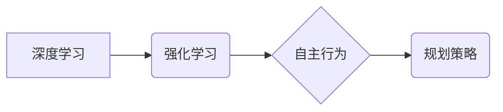

> 深度学习，自主行为，规划策略，强化学习，神经网络，决策树，机器人

## 1. 背景介绍

在人工智能领域，深度学习算法取得了令人瞩目的成就，在图像识别、自然语言处理等领域展现出强大的能力。然而，深度学习模型在自主行为和规划策略方面仍然面临着挑战。自主行为是指智能体能够根据环境信息做出决策并执行行动，而规划策略则是指智能体制定行动序列以实现特定目标。

传统的规划算法通常依赖于精确的模型和规则，但现实世界往往是复杂、不确定和动态的。深度学习算法能够从大量数据中学习复杂的模式和关系，因此在处理不确定性和动态环境方面具有优势。

## 2. 核心概念与联系

**2.1 深度学习**

深度学习是一种机器学习的子领域，它利用多层神经网络来模拟人类大脑的学习过程。深度学习模型能够从大量数据中学习复杂的特征和表示，从而实现对复杂问题的建模和解决。

**2.2 强化学习**

强化学习是一种机器学习的范式，它通过奖励和惩罚机制来训练智能体学习最佳行为策略。智能体在环境中采取行动，根据环境反馈获得奖励或惩罚，并根据这些反馈调整其行为策略以最大化累积奖励。

**2.3  自主行为与规划策略**

自主行为是指智能体能够根据环境信息做出决策并执行行动，而规划策略则是指智能体制定行动序列以实现特定目标。

**2.4  核心概念关系图**



## 3. 核心算法原理 & 具体操作步骤

**3.1 算法原理概述**

深度强化学习 (Deep Reinforcement Learning, DRL) 结合了深度学习和强化学习的优势，通过深度神经网络学习智能体的行为策略。DRL 算法的核心是利用深度神经网络来估计状态价值函数和动作价值函数，并根据这些函数更新智能体的行为策略。

**3.2 算法步骤详解**

1. **环境建模:** 建立一个模拟真实世界的环境，定义智能体的状态空间、动作空间和奖励函数。
2. **神经网络构建:** 设计一个深度神经网络，用于估计状态价值函数和动作价值函数。
3. **训练过程:** 智能体在环境中进行交互，根据环境反馈获得奖励或惩罚。利用梯度下降算法更新神经网络的权重，以最大化累积奖励。
4. **策略评估:** 在训练完成后，评估智能体的行为策略在环境中的表现。
5. **策略部署:** 将训练好的行为策略部署到实际应用场景中。

**3.3 算法优缺点**

**优点:**

* 能够学习复杂的非线性关系。
* 能够处理高维状态空间和动作空间。
* 能够适应动态变化的环境。

**缺点:**

* 训练过程可能非常耗时和资源密集。
* 容易陷入局部最优解。
* 需要大量的训练数据。

**3.4 算法应用领域**

* 机器人控制
* 游戏人工智能
* 自动驾驶
* 金融交易
* 医疗诊断

## 4. 数学模型和公式 & 详细讲解 & 举例说明

**4.1 数学模型构建**

深度强化学习算法的核心是利用深度神经网络来估计状态价值函数和动作价值函数。

* **状态价值函数 (State-Value Function):**  表示在给定状态下，智能体能够获得的预期累积奖励。
* **动作价值函数 (Action-Value Function):** 表示在给定状态下采取特定动作的预期累积奖励。

**4.2 公式推导过程**

* **Bellman方程:**  Bellman方程是强化学习的核心公式，它描述了状态价值函数和动作价值函数之间的关系。

$$
V(s) = \max_{\alpha} \sum_{s'} P(s' | s, \alpha) [r(s, \alpha, s') + \gamma V(s')]
$$

其中:

* $V(s)$ 是状态 $s$ 的价值函数。
* $\alpha$ 是智能体采取的动作。
* $P(s' | s, \alpha)$ 是从状态 $s$ 采取动作 $\alpha$ 进入状态 $s'$ 的概率。
* $r(s, \alpha, s')$ 是从状态 $s$ 采取动作 $\alpha$ 进入状态 $s'$ 的奖励。
* $\gamma$ 是折扣因子，控制未来奖励的权重。

**4.3 案例分析与讲解**

假设一个智能体在玩一个简单的游戏，游戏环境包含两个状态： "开始" 和 "结束"。智能体可以采取两种动作： "前进" 和 "后退"。

* 从状态 "开始" 采取动作 "前进" 可以进入状态 "结束"，获得奖励 1。
* 从状态 "开始" 采取动作 "后退" 可以回到状态 "开始"，获得奖励 0。

利用 Bellman方程，我们可以计算出状态 "开始" 的价值函数。

**4.4 深度神经网络模型**

深度神经网络可以用来估计状态价值函数和动作价值函数。常见的深度神经网络架构包括：

* 多层感知机 (Multilayer Perceptron, MLP)
* 深度卷积神经网络 (Deep Convolutional Neural Network, DCNN)
* 深度循环神经网络 (Deep Recurrent Neural Network, DRNN)

## 5. 项目实践：代码实例和详细解释说明

**5.1 开发环境搭建**

* Python 3.x
* TensorFlow 或 PyTorch
* OpenAI Gym

**5.2 源代码详细实现**

```python
import gym
import tensorflow as tf

# 定义深度神经网络模型
model = tf.keras.models.Sequential([
    tf.keras.layers.Dense(64, activation='relu', input_shape=(env.observation_space.shape[0],)),
    tf.keras.layers.Dense(64, activation='relu'),
    tf.keras.layers.Dense(env.action_space.n)
])

# 定义损失函数和优化器
optimizer = tf.keras.optimizers.Adam()
loss_fn = tf.keras.losses.MeanSquaredError()

# 训练循环
for episode in range(num_episodes):
    state = env.reset()
    done = False
    total_reward = 0

    while not done:
        # 选择动作
        action = model.predict(state[None, :])[0]
        action = tf.argmax(action).numpy()

        # 执行动作并获取奖励和下一个状态
        next_state, reward, done, _ = env.step(action)

        # 更新目标值
        target = reward
        if not done:
            target = reward + gamma * tf.reduce_max(model.predict(next_state[None, :])[0])

        # 计算损失
        with tf.GradientTape() as tape:
            prediction = model.predict(state[None, :])
            loss = loss_fn(target, prediction[0])

        # 更新模型参数
        gradients = tape.gradient(loss, model.trainable_variables)
        optimizer.apply_gradients(zip(gradients, model.trainable_variables))

        # 更新状态
        state = next_state

        # 更新总奖励
        total_reward += reward

    print(f"Episode {episode+1}, Total Reward: {total_reward}")

# 保存模型
model.save('trained_model.h5')
```

**5.3 代码解读与分析**

* 代码首先定义了深度神经网络模型，并使用 Adam 优化器和均方误差损失函数进行训练。
* 训练循环中，智能体在环境中进行交互，根据环境反馈更新模型参数。
* 目标值是奖励加上折扣因子乘以下一个状态的价值函数。
* 损失函数计算模型预测值与目标值之间的误差。
* 模型参数通过反向传播算法更新。

**5.4 运行结果展示**

训练完成后，可以将训练好的模型部署到实际应用场景中，并观察智能体的行为表现。

## 6. 实际应用场景

**6.1 机器人控制**

深度强化学习算法可以用于训练机器人控制策略，使机器人能够自主地完成复杂的任务，例如导航、抓取和组装。

**6.2 游戏人工智能**

深度强化学习算法已被成功应用于游戏人工智能，例如 AlphaGo 和 AlphaZero，这些算法能够战胜人类顶尖棋手。

**6.3 自动驾驶**

深度强化学习算法可以用于训练自动驾驶系统的控制策略，使车辆能够在复杂道路环境中安全行驶。

**6.4 金融交易**

深度强化学习算法可以用于开发自动交易系统，根据市场数据做出交易决策。

**6.5 医疗诊断**

深度强化学习算法可以用于辅助医生进行医疗诊断，例如识别疾病和预测患者的病情发展。

**6.6 未来应用展望**

深度强化学习算法在未来将有更广泛的应用，例如：

* 个性化教育
* 智能家居
* 医疗机器人
* 科学研究

## 7. 工具和资源推荐

**7.1 学习资源推荐**

* **书籍:**
    * Deep Reinforcement Learning Hands-On by Maxim Lapan
    * Reinforcement Learning: An Introduction by Richard S. Sutton and Andrew G. Barto
* **在线课程:**
    * Deep Reinforcement Learning Specialization by DeepLearning.AI
    * Reinforcement Learning by David Silver (University of DeepMind)

**7.2 开发工具推荐**

* **TensorFlow:** https://www.tensorflow.org/
* **PyTorch:** https://pytorch.org/
* **OpenAI Gym:** https://gym.openai.com/

**7.3 相关论文推荐**

* Deep Q-Network (DQN)
* Policy Gradient Methods
* Proximal Policy Optimization (PPO)

## 8. 总结：未来发展趋势与挑战

**8.1 研究成果总结**

深度强化学习算法取得了显著的进展，在多个领域取得了突破性成果。

**8.2 未来发展趋势**

* **更强大的模型:** 研究更强大的深度神经网络架构，例如 Transformer 和 Graph Neural Networks，以提高算法的学习能力和泛化能力。
* **更有效的训练方法:** 研究更有效的训练方法，例如分布式训练和迁移学习，以加速算法训练速度和降低训练成本。
* **更安全的算法:** 研究更安全的深度强化学习算法，以避免算法出现不可预测的行为。

**8.3 面临的挑战**

* **数据效率:** 深度强化学习算法需要大量的训练数据，而获取高质量的训练数据仍然是一个挑战。
* **可解释性:** 深度强化学习算法的决策过程往往难以解释，这限制了算法在安全关键应用中的应用。
* **样本复杂度:** 深度强化学习算法的样本复杂度很高，这意味着需要大量的训练样本才能达到良好的性能。

**8.4 研究展望**

未来，深度强化学习算法将继续朝着更强大、更安全、更可解释的方向发展，并在更多领域发挥重要作用。


## 9. 附录：常见问题与解答

**9.1 什么是深度强化学习？**

深度强化学习 (Deep Reinforcement Learning, DRL) 是一种机器学习的范式，它结合了深度学习和强化学习的优势，通过深度神经网络学习智能体的行为策略。

**9.2 深度强化学习算法有哪些？**

常见的深度强化学习算法包括：

* Deep Q-Network (DQN)
* Policy Gradient Methods
* Proximal Policy Optimization (PPO)

**9.3 深度强化学习算法的应用场景有哪些？**

深度强化学习算法的应用场景包括：

* 机器人控制
* 游戏人工智能
* 自动驾驶
* 金融交易
* 医疗诊断

**9.4 深度强化学习算法的优势和劣势是什么？**

**优势:**

* 能够学习复杂的非线性关系。
* 能够处理高维状态空间和动作空间。
* 能够适应动态变化的环境。

**劣势:**

