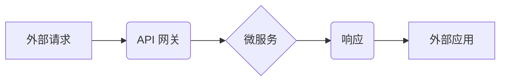

> API 网关，微服务架构，API 管理，安全，性能，监控，流量控制

## 1. 背景介绍

随着互联网技术的快速发展，应用程序的开发模式也发生了巨大变化。微服务架构逐渐成为主流，应用程序被拆分成多个独立的服务，这些服务之间通过 API 进行通信。API 网关作为微服务架构的关键组成部分，承担着连接外部世界和内部服务的桥梁角色，其功能和优势越来越受到重视。

传统的单体架构应用程序中，API 直接暴露在外部，这带来了许多安全、性能和管理方面的挑战。随着微服务架构的兴起，API 网关应运而生，它为微服务架构提供了统一的入口，并提供了许多重要的功能，例如：

* **流量管理：** 控制 API 的访问流量，防止服务被过载。
* **安全防护：** 对 API 进行身份验证和授权，保护敏感数据。
* **监控和日志记录：** 收集 API 的访问日志，方便进行监控和故障排查。
* **协议转换：** 支持不同协议的 API 调用，例如 HTTP 和 gRPC。
* **缓存和负载均衡：** 提高 API 的性能和可用性。

## 2. 核心概念与联系

API 网关是连接外部世界和微服务架构的桥梁，它位于微服务架构的外部，负责接收外部请求，并将其转发到相应的微服务。

**API 网关的架构**



**API 网关的功能**

* **路由：** 根据请求的路径和方法，将请求转发到相应的微服务。
* **安全：** 对 API 进行身份验证和授权，确保只有授权的用户才能访问特定的 API。
* **流量管理：** 控制 API 的访问流量，防止服务被过载。
* **监控和日志记录：** 收集 API 的访问日志，方便进行监控和故障排查。
* **缓存：** 缓存 API 的响应结果，提高 API 的性能。
* **协议转换：** 支持不同协议的 API 调用，例如 HTTP 和 gRPC。

## 3. 核心算法原理 & 具体操作步骤

### 3.1  算法原理概述

API 网关的核心算法主要包括路由算法、安全算法和流量管理算法。

* **路由算法：** 根据请求的路径和方法，将请求转发到相应的微服务。常用的路由算法包括正则表达式匹配、哈希路由和树形路由。
* **安全算法：** 对 API 进行身份验证和授权，确保只有授权的用户才能访问特定的 API。常用的安全算法包括 OAuth 2.0、JWT 和 API 密钥。
* **流量管理算法：** 控制 API 的访问流量，防止服务被过载。常用的流量管理算法包括漏斗算法、限流算法和熔断算法。

### 3.2  算法步骤详解

**路由算法示例：正则表达式匹配**

1. API 网关收到外部请求。
2. API 网关解析请求的路径和方法。
3. API 网关使用正则表达式匹配请求路径，找到匹配的路由规则。
4. API 网关根据路由规则，将请求转发到相应的微服务。

**安全算法示例：OAuth 2.0**

1. 用户向 API 网关发起请求，需要授权访问某个微服务。
2. API 网关将用户重定向到授权服务器，进行身份验证。
3. 用户在授权服务器授权访问，授权服务器颁发访问令牌。
4. 用户返回 API 网关，携带访问令牌。
5. API 网关验证访问令牌的有效性，并允许用户访问相应的微服务。

**流量管理算法示例：限流算法**

1. API 网关收到外部请求。
2. API 网关根据请求的来源和时间，计算请求的流量。
3. 如果请求的流量超过预设的阈值，API 网关拒绝请求。
4. 如果请求的流量在阈值内，API 网关允许请求通过。

### 3.3  算法优缺点

**路由算法**

* **正则表达式匹配：** 灵活、可定制，但性能较低。
* **哈希路由：** 性能高，但路由规则难以维护。
* **树形路由：** 性能中等，路由规则易于维护。

**安全算法**

* **OAuth 2.0：** 安全性高，标准化程度高，但配置复杂。
* **JWT：** 轻量级、易于实现，但安全性相对较低。
* **API 密钥：** 简单易用，但安全性较低。

**流量管理算法**

* **漏斗算法：** 简单易用，但控制粒度较粗。
* **限流算法：** 控制粒度细，但可能导致请求被拒绝。
* **熔断算法：** 提高系统稳定性，但可能导致用户体验下降。

### 3.4  算法应用领域

API 网关的算法广泛应用于各种领域，例如：

* **电商平台：** 控制商品访问流量，防止网站崩溃。
* **金融系统：** 对金融交易进行安全验证，防止欺诈行为。
* **社交网络：** 管理用户访问权限，保护用户隐私。
* **云计算平台：** 控制 API 的访问频率，防止服务被滥用。

## 4. 数学模型和公式 & 详细讲解 & 举例说明

### 4.1  数学模型构建

API 网关的流量管理算法通常基于数学模型，例如：

* **漏斗算法：** 使用漏斗模型，将请求流量限制在预设的阈值内。
* **限流算法：** 使用滑动窗口算法，统计一段时间内的请求数量，并根据统计结果限制请求流量。
* **熔断算法：** 使用阈值和时间窗口，判断服务是否出现故障，并根据判断结果限制请求流量。

### 4.2  公式推导过程

**限流算法公式：**

```latex
Q = min(R, T)
```

其中：

* $Q$：允许通过的请求数量。
* $R$：当前请求数量。
* $T$：预设的阈值。

**熔断算法公式：**

```latex
F = \begin{cases}
    True, & \text{if } \frac{E}{T} > \theta \\
    False, & \text{otherwise}
\end{cases}
```

其中：

* $F$：熔断状态。
* $E$：服务故障次数。
* $T$：时间窗口。
* $\theta$：预设的故障阈值。

### 4.3  案例分析与讲解

**限流算法案例：**

假设预设的阈值为 100 个请求/秒，当前请求数量为 150 个请求/秒，则允许通过的请求数量为 100 个请求/秒。

**熔断算法案例：**

假设服务故障次数为 5 次，时间窗口为 1 分钟，预设的故障阈值为 3 次/分钟，则服务处于熔断状态。

## 5. 项目实践：代码实例和详细解释说明

### 5.1  开发环境搭建

* 操作系统：Linux
* 编程语言：Go
* 工具：Docker、Kubernetes

### 5.2  源代码详细实现

```go
package main

import (
\t"net/http"
\t"fmt"
)

func main() {
\thttp.HandleFunc("/", handler)
\tfmt.Println("API Gateway started on port 8080")
\thttp.ListenAndServe(":8080", nil)
}

func handler(w http.ResponseWriter, r *http.Request) {
\t// 路由逻辑
\t// ...

\t// 安全逻辑
\t// ...

\t// 流量管理逻辑
\t// ...

\t// 调用微服务
\t// ...

\t// 返回响应
\t// ...
}
```

### 5.3  代码解读与分析

* `main` 函数：启动 API 网关，监听 8080 端口。
* `handler` 函数：处理 HTTP 请求，包含路由、安全、流量管理和微服务调用等逻辑。

### 5.4  运行结果展示

启动 API 网关后，访问 http://localhost:8080/，可以查看 API 网关的响应结果。

## 6. 实际应用场景

API 网关在微服务架构中扮演着至关重要的角色，它可以应用于各种场景，例如：

* **电商平台：** 控制商品访问流量，防止网站崩溃。
* **金融系统：** 对金融交易进行安全验证，防止欺诈行为。
* **社交网络：** 管理用户访问权限，保护用户隐私。
* **云计算平台：** 控制 API 的访问频率，防止服务被滥用。

### 6.4  未来应用展望

随着微服务架构的普及，API 网关的应用场景将会更加广泛。未来，API 网关还将具备以下功能：

* **人工智能驱动的流量管理：** 利用机器学习算法，智能地控制 API 的流量。
* **服务发现和注册：** 自动发现和注册微服务，提高服务的可用性和可靠性。
* **API 监控和分析：** 提供更详细的 API 监控和分析数据，帮助开发人员更好地理解和优化 API 的性能。

## 7. 工具和资源推荐

### 7.1  学习资源推荐

* **书籍：**
    * API Gateway Design and Implementation
    * Microservices Patterns
* **博客：**
    * https://www.nginx.com/blog/
    * https://www.apimatic.com/blog/

### 7.2  开发工具推荐

* **Kong:** https://konghq.com/
* **Tyk:** https://tyk.io/
* **Apigee:** https://www.apigee.com/

### 7.3  相关论文推荐

* **API Gateway Design and Implementation:** https://www.researchgate.net/publication/329973504_API_Gateway_Design_and_Implementation
* **Microservices Patterns:** https://www.oreilly.com/library/view/microservices-patterns/9781492034137/

## 8. 总结：未来发展趋势与挑战

### 8.1  研究成果总结

API 网关作为微服务架构的关键组成部分，已经取得了显著的成果。它为微服务架构提供了统一的入口，并提供了许多重要的功能，例如流量管理、安全防护、监控和日志记录等。

### 8.2  未来发展趋势

未来，API 网关将朝着以下方向发展：

* **人工智能驱动的流量管理：** 利用机器学习算法，智能地控制 API 的流量。
* **服务发现和注册：** 自动发现和注册微服务，提高服务的可用性和可靠性。
* **API 监控和分析：** 提供更详细的 API 监控和分析数据，帮助开发人员更好地理解和优化 API 的性能。

### 8.3  面临的挑战

API 网关的发展也面临着一些挑战：

* **复杂性：** API 网关的功能越来越复杂，开发和维护难度越来越高。
* **安全风险：** API 网关是攻击者的目标，需要不断加强安全防护。
* **性能优化：** API 网关需要保证高性能，才能满足微服务架构的需求。

### 8.4  研究展望

未来，我们需要继续研究和探索 API 网关的新的功能和应用场景，并解决其面临的挑战，使其更好地服务于微服务架构的发展。

## 9. 附录：常见问题与解答

* **Q：API 网关和负载均衡器有什么区别？**

* **A：** API 网关和负载均衡器都是用于提高服务的可用性和性能的工具，但它们的功能和作用不同。负载均衡器主要负责将请求分发到不同的服务器，而 API 网关则负责对请求进行路由、安全验证、流量管理等操作。

* **Q：如何选择合适的 API 网关？**

* **A：** 选择合适的 API 网关需要考虑以下因素：功能需求、性能要求、安全级别、成本预算等。

* **Q：如何部署 API 网关