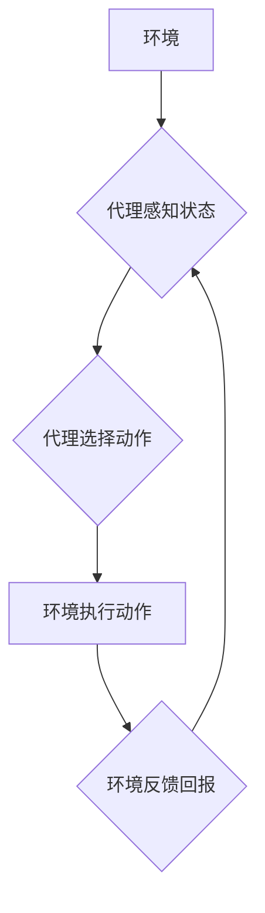

> AI代理，智能体，强化学习，决策算法，环境交互，状态空间，策略梯度，深度强化学习

## 1. 背景介绍

在人工智能领域，代理的概念扮演着至关重要的角色。代理可以被理解为一个能够感知环境、采取行动并根据反馈进行学习的智能体。它代表着AI系统与外部世界交互的桥梁，是实现AI应用的关键要素。

随着人工智能技术的不断发展，代理的概念也得到了广泛的应用，例如：

* **游戏AI：** 代理可以学习游戏规则，制定策略并与人类玩家进行对抗。
* **机器人控制：** 代理可以控制机器人的运动和行为，使其能够完成各种任务。
* **自动驾驶：** 代理可以感知道路环境，做出驾驶决策，实现自动驾驶功能。
* **金融交易：** 代理可以分析市场数据，制定交易策略，进行自动交易。

这些应用场景都体现了代理在AI中的重要性。

## 2. 核心概念与联系

**2.1 代理的概念**

代理是一个能够感知环境、采取行动并根据反馈进行学习的智能体。它可以被视为一个独立的实体，拥有自己的目标和行为策略。

**2.2 环境的概念**

环境是指代理所处的外部世界，它包含代理可以感知到的信息以及代理可以采取行动的影响范围。

**2.3 状态的概念**

状态是指代理在环境中所处的当前情况，它包含了环境中所有相关的信息。

**2.4 动作的概念**

动作是指代理可以采取的行动，这些行动会影响环境的状态。

**2.5 回报的概念**

回报是指代理在环境中采取行动后获得的奖励或惩罚，它反映了代理行为的好坏。

**2.6 策略的概念**

策略是指代理根据当前状态选择动作的规则，它决定了代理的行为方式。

**2.7 强化学习的概念**

强化学习是一种机器学习方法，它通过代理与环境的交互，学习最优的策略，以最大化累积的回报。

**2.8 代理与环境的交互流程**

代理与环境的交互是一个循环的过程：

1. 代理感知环境的状态。
2. 代理根据策略选择一个动作。
3. 代理执行动作，环境状态发生变化。
4. 环境向代理提供回报。
5. 代理根据回报更新策略。

**2.9 Mermaid 流程图**



## 3. 核心算法原理 & 具体操作步骤

### 3.1 算法原理概述

强化学习算法的核心思想是通过代理与环境的交互，学习一个最优的策略，以最大化累积的回报。

强化学习算法通常包括以下几个关键要素：

* **状态空间:** 所有可能的环境状态的集合。
* **动作空间:** 代理可以采取的所有动作的集合。
* **奖励函数:** 奖励代理采取特定动作在特定状态下的函数。
* **策略:** 代理根据当前状态选择动作的规则。

强化学习算法的目标是找到一个策略，使得代理在与环境交互的过程中，能够获得最大的累积回报。

### 3.2 算法步骤详解

1. **初始化:** 初始化代理的策略，通常使用随机策略。
2. **环境交互:** 代理与环境进行交互，感知环境状态，选择动作并执行。
3. **回报更新:** 环境反馈回报，代理根据回报更新策略。
4. **策略更新:** 使用更新策略，代理在下次交互中选择动作。
5. **重复步骤2-4:** 重复以上步骤，直到代理的策略收敛，即不再显著地改变。

### 3.3 算法优缺点

**优点:**

* 可以学习复杂的行为策略。
* 不需要明确的规则和模型。
* 可以适应动态变化的环境。

**缺点:**

* 训练时间长，需要大量的样本数据。
* 容易陷入局部最优解。
* 难以解释代理的行为决策。

### 3.4 算法应用领域

* **游戏AI:** 学习游戏策略，与人类玩家对抗。
* **机器人控制:** 控制机器人的运动和行为，完成各种任务。
* **自动驾驶:** 感知道路环境，做出驾驶决策，实现自动驾驶功能。
* **金融交易:** 分析市场数据，制定交易策略，进行自动交易。

## 4. 数学模型和公式 & 详细讲解 & 举例说明

### 4.1 数学模型构建

强化学习的数学模型主要包括以下几个方面：

* **状态空间:**  用集合 S 表示，其中每个元素 s 代表一个环境状态。
* **动作空间:** 用集合 A 表示，其中每个元素 a 代表一个代理可以采取的动作。
* **奖励函数:** 用函数 R(s, a) 表示，它描述了代理在状态 s 下采取动作 a 后获得的奖励。
* **策略:** 用函数 π(s) 表示，它描述了代理在状态 s 下选择动作 a 的概率。

### 4.2 公式推导过程

强化学习的目标是找到一个最优的策略 π*，使得代理在与环境交互的过程中，能够获得最大的累积回报。

累积回报的定义为：

$$
R_t = \sum_{k=t}^{T} \gamma^k r_{k}
$$

其中：

* $R_t$ 是从时间步 t 开始的累积回报。
* $r_k$ 是在时间步 k 获得的奖励。
* $\gamma$ 是折扣因子，控制未来奖励的权重。
* $T$ 是终止时间。

最优策略的定义为：

$$
\pi^* = \arg\max_{\pi} \mathbb{E}_{\pi}[R_t]
$$

其中：

* $\mathbb{E}_{\pi}[R_t]$ 是根据策略 π 获得的累积回报的期望值。

### 4.3 案例分析与讲解

**举例说明：**

假设有一个代理在迷宫中寻找出口，环境状态表示为代理当前位置，动作空间包括向上、向下、向左、向右四个方向。奖励函数为：

* 当代理到达出口时，奖励为 100。
* 当代理移动到一个障碍物时，奖励为 -10。
* 其他情况下，奖励为 0。

代理可以使用强化学习算法学习最优的策略，找到从起点到出口的路径。

## 5. 项目实践：代码实例和详细解释说明

### 5.1 开发环境搭建

* Python 3.x
* TensorFlow 或 PyTorch
* OpenAI Gym

### 5.2 源代码详细实现

```python
import gym
import tensorflow as tf

# 定义代理模型
class Agent(tf.keras.Model):
    def __init__(self):
        super(Agent, self).__init__()
        self.dense1 = tf.keras.layers.Dense(64, activation='relu')
        self.dense2 = tf.keras.layers.Dense(64, activation='relu')
        self.output = tf.keras.layers.Dense(4, activation='softmax')

    def call(self, state):
        x = self.dense1(state)
        x = self.dense2(x)
        return self.output(x)

# 初始化代理模型
agent = Agent()

# 定义损失函数和优化器
loss_fn = tf.keras.losses.CategoricalCrossentropy()
optimizer = tf.keras.optimizers.Adam(learning_rate=0.001)

# 训练代理模型
for episode in range(1000):
    state = env.reset()
    done = False
    while not done:
        # 选择动作
        action_probs = agent(state)
        action = tf.random.categorical(tf.math.log(action_probs), num_samples=1)[0, 0]

        # 执行动作
        next_state, reward, done, _ = env.step(action)

        # 更新代理模型
        with tf.GradientTape() as tape:
            action_probs = agent(state)
            loss = loss_fn(tf.one_hot(action, depth=4), action_probs)
        gradients = tape.gradient(loss, agent.trainable_variables)
        optimizer.apply_gradients(zip(gradients, agent.trainable_variables))

        state = next_state

# 测试代理模型
state = env.reset()
while True:
    action_probs = agent(state)
    action = tf.random.categorical(tf.math.log(action_probs), num_samples=1)[0, 0]
    state, reward, done, _ = env.step(action)
    env.render()
    if done:
        break
```

### 5.3 代码解读与分析

* 代码首先定义了一个代理模型，该模型使用深度神经网络结构，输入环境状态，输出动作概率分布。
* 然后，代码定义了损失函数和优化器，用于训练代理模型。
* 训练过程是一个循环，代理在环境中与环境交互，根据环境反馈更新模型参数。
* 最后，代码测试了训练好的代理模型，并展示了代理在环境中的行为。

### 5.4 运行结果展示

运行代码后，代理将在环境中进行交互，并尝试完成任务。例如，在迷宫环境中，代理将尝试找到出口。

## 6. 实际应用场景

### 6.1 游戏AI

强化学习在游戏AI领域有着广泛的应用，例如：

* **AlphaGo:** DeepMind 使用强化学习算法训练的 AlphaGo 击败了世界围棋冠军。
* **Dota 2:** OpenAI Five 使用强化学习算法训练的 Dota 2 团队击败了职业玩家。

### 6.2 机器人控制

强化学习可以用于控制机器人完成各种任务，例如：

* **机器人导航:** 使机器人能够在复杂环境中自主导航。
* **机器人抓取:** 使机器人能够抓取和移动物体。
* **机器人手术:** 使机器人能够辅助医生进行手术。

### 6.3 自动驾驶

强化学习可以用于训练自动驾驶系统，例如：

* **路径规划:** 使自动驾驶汽车能够规划安全有效的路径。
* **决策控制:** 使自动驾驶汽车能够做出正确的驾驶决策。
* **环境感知:** 使自动驾驶汽车能够感知周围环境。

### 6.4 金融交易

强化学习可以用于金融交易，例如：

* **策略制定:** 使交易系统能够制定有效的交易策略。
* **风险管理:** 使交易系统能够有效地管理风险。
* **投资组合优化:** 使交易系统能够优化投资组合。

### 6.5 未来应用展望

强化学习在未来将有更广泛的应用，例如：

* **医疗保健:** 用于诊断疾病、制定治疗方案。
* **教育:** 用于个性化学习、智能辅导。
* **科学研究:** 用于探索复杂系统、加速科学发现。

## 7. 工具和资源推荐

### 7.1 学习资源推荐

* **书籍:**
    * Reinforcement Learning: An Introduction by Richard S. Sutton and Andrew G. Barto
    * Deep Reinforcement Learning Hands-On by Maxim Lapan
* **在线课程:**
    * Deep Reinforcement Learning Specialization by DeepLearning.AI
    * Reinforcement Learning by David Silver (University of DeepMind)

### 7.2 开发工具推荐

* **TensorFlow:** 开源深度学习框架，支持强化学习算法的实现。
* **PyTorch:** 开源深度学习框架，支持强化学习算法的实现。
* **OpenAI Gym:** 强化学习环境库，提供各种标准的强化学习环境。

### 7.3 相关论文推荐

* **Deep Q-Network (DQN):** Mnih et al. (2015)
* **Proximal Policy Optimization (PPO):** Schulman et al. (2017)
* **Trust Region Policy Optimization (TRPO):** Schulman et al. (2015)

## 8. 总结：未来发展趋势与挑战

### 8.1 研究成果总结

近年来，强化学习取得了显著的进展，在游戏AI、机器人控制、自动驾驶等领域取得了突破性成果。

### 8.