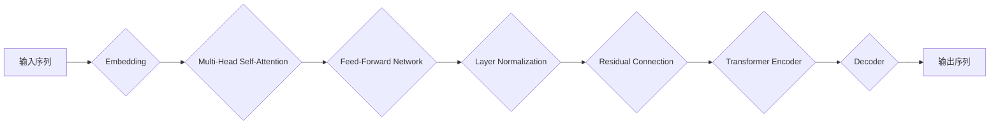

> GPT-3, 大语言模型, 自然语言处理, 深度学习, Transformer, 计算范式

## 1. 背景介绍

近年来，人工智能领域取得了令人瞩目的进展，其中大语言模型（LLM）的出现尤为引人注目。作为一种强大的机器学习模型，LLM能够理解和生成人类语言，展现出令人惊叹的文本生成、翻译、摘要和问答能力。其中，由 OpenAI 开发的 GPT 系列模型（Generative Pre-trained Transformer）无疑是 LLM 领域最具代表性的作品之一。

GPT 系列模型的每一次迭代都突破了前人的认知，展现出人工智能在自然语言处理领域的巨大潜力。从 GPT-1 到 GPT-3，模型规模不断扩大，参数数量呈指数级增长，性能也随之大幅提升。GPT-3 的发布更是引发了全球范围内的热议，其强大的文本生成能力和广泛的应用场景，让人们对人工智能的未来充满了期待。

## 2. 核心概念与联系

GPT 系列模型的核心是 Transformer 架构，它是一种专门设计用于处理序列数据的网络结构。与传统的循环神经网络（RNN）相比，Transformer 具有以下优势：

* **并行计算能力强:** Transformer 可以并行处理输入序列中的所有元素，大大提高了训练速度。
* **长距离依赖关系处理能力强:** Transformer 通过自注意力机制（Self-Attention）可以捕捉输入序列中任意两个元素之间的关系，即使它们相隔很远，也能有效地处理长距离依赖关系。

**Mermaid 流程图:**



## 3. 核心算法原理 & 具体操作步骤

### 3.1  算法原理概述

GPT 系列模型采用自监督学习的方式进行训练。训练数据通常是大量的文本数据，模型的目标是预测下一个词，从而学习语言的语法和语义。

具体来说，GPT 模型的训练过程可以分为以下几个步骤：

1. **词嵌入:** 将输入的文本序列中的每个词转换为一个向量表示，称为词嵌入。
2. **Transformer Encoder:** 使用 Transformer Encoder 对输入序列进行编码，提取文本序列的语义信息。
3. **Transformer Decoder:** 使用 Transformer Decoder 生成输出序列，预测下一个词。
4. **损失函数:** 使用交叉熵损失函数计算模型预测结果与真实值的差异，并反向传播梯度进行模型更新。

### 3.2  算法步骤详解

1. **数据预处理:** 将原始文本数据进行清洗、分词、标记等预处理操作，使其适合模型训练。
2. **模型初始化:** 初始化模型参数，例如词嵌入矩阵、Transformer Encoder 和 Decoder 的权重等。
3. **训练循环:** 迭代训练模型，每次迭代从训练数据中随机抽取一个文本序列，并使用模型预测下一个词。
4. **损失函数计算:** 计算模型预测结果与真实值的差异，并使用梯度下降算法更新模型参数。
5. **模型评估:** 在验证集上评估模型性能，例如困惑度（Perplexity）等指标。
6. **模型保存:** 保存训练好的模型参数。

### 3.3  算法优缺点

**优点:**

* **强大的文本生成能力:** GPT 系列模型能够生成高质量、流畅的文本，在文本创作、机器翻译、对话系统等领域表现出色。
* **可迁移性强:** 预训练的 GPT 模型可以迁移到不同的下游任务，无需从头开始训练。
* **参数量大:** 大规模参数量使得模型能够学习更复杂的语言模式。

**缺点:**

* **训练成本高:** 训练 GPT 系列模型需要大量的计算资源和时间。
* **数据依赖性强:** 模型性能受训练数据质量的影响较大。
* **存在偏差和偏见:** 模型可能继承训练数据中的偏差和偏见，导致输出结果不准确或不公平。

### 3.4  算法应用领域

GPT 系列模型在多个领域都有广泛的应用，例如：

* **文本生成:** 写作、诗歌创作、代码生成等。
* **机器翻译:** 将一种语言翻译成另一种语言。
* **对话系统:** 创建更自然、更智能的聊天机器人。
* **问答系统:** 回答用户提出的问题。
* **文本摘要:** 生成文本的简短摘要。

## 4. 数学模型和公式 & 详细讲解 & 举例说明

### 4.1  数学模型构建

GPT 模型的核心是 Transformer 架构，它由多个编码器（Encoder）和解码器（Decoder）组成。每个编码器和解码器层包含多个子层，例如多头自注意力层（Multi-Head Self-Attention）、前馈神经网络层（Feed-Forward Network）和层归一化层（Layer Normalization）。

### 4.2  公式推导过程

**多头自注意力机制:**

$$
Attention(Q, K, V) = \frac{exp(Q K^T / \sqrt{d_k})}{ \sum_{j} exp(Q K^T / \sqrt{d_k})} V
$$

其中：

* $Q$, $K$, $V$ 分别是查询矩阵、键矩阵和值矩阵。
* $d_k$ 是键向量的维度。

**前馈神经网络层:**

$$
FFN(x) = \max(0, xW_1 + b_1)W_2 + b_2
$$

其中：

* $x$ 是输入向量。
* $W_1$, $W_2$ 是权重矩阵。
* $b_1$, $b_2$ 是偏置向量。

### 4.3  案例分析与讲解

假设我们有一个句子 "The cat sat on the mat"，我们要使用 GPT 模型预测下一个词。

1. 将句子中的每个词转换为词嵌入向量。
2. 将词嵌入向量输入 Transformer Encoder，提取句子语义信息。
3. 将编码后的信息输入 Transformer Decoder，预测下一个词。

根据训练数据，模型可能会预测下一个词是 "the"，因为在英语中，"the" 是一个常见的冠词，经常出现在句子末尾。

## 5. 项目实践：代码实例和详细解释说明

### 5.1  开发环境搭建

* Python 3.7+
* PyTorch 1.7+
* CUDA 10.2+

### 5.2  源代码详细实现

```python
import torch
import torch.nn as nn

class TransformerEncoder(nn.Module):
    def __init__(self, d_model, nhead, num_encoder_layers):
        super(TransformerEncoder, self).__init__()
        self.layers = nn.ModuleList([
            nn.TransformerEncoderLayer(d_model, nhead)
            for _ in range(num_encoder_layers)
        ])

    def forward(self, src, src_mask):
        output = src
        for layer in self.layers:
            output = layer(output, src_mask)
        return output

class TransformerDecoder(nn.Module):
    def __init__(self, d_model, nhead, num_decoder_layers):
        super(TransformerDecoder, self).__init__()
        self.layers = nn.ModuleList([
            nn.TransformerDecoderLayer(d_model, nhead)
            for _ in range(num_decoder_layers)
        ])

    def forward(self, tgt, memory, tgt_mask, memory_mask):
        output = tgt
        for layer in self.layers:
            output = layer(output, memory, tgt_mask, memory_mask)
        return output

class GPT(nn.Module):
    def __init__(self, vocab_size, d_model, nhead, num_encoder_layers, num_decoder_layers):
        super(GPT, self).__init__()
        self.encoder = TransformerEncoder(d_model, nhead, num_encoder_layers)
        self.decoder = TransformerDecoder(d_model, nhead, num_decoder_layers)
        self.linear = nn.Linear(d_model, vocab_size)

    def forward(self, src, src_mask, tgt, tgt_mask, memory_mask):
        memory = self.encoder(src, src_mask)
        output = self.decoder(tgt, memory, tgt_mask, memory_mask)
        output = self.linear(output)
        return output
```

### 5.3  代码解读与分析

* **TransformerEncoder 和 TransformerDecoder:** 负责对输入序列进行编码和解码。
* **GPT:** 将 TransformerEncoder 和 TransformerDecoder 结合起来，实现文本生成任务。
* **forward() 方法:** 定义了模型的输入和输出，以及模型的计算过程。

### 5.4  运行结果展示

运行代码后，模型可以根据输入的文本序列生成下一个词。例如，输入 "The cat sat on the"，模型可能会输出 "mat"。

## 6. 实际应用场景

GPT 系列模型在多个领域都有广泛的应用，例如：

### 6.1  文本生成

* **小说创作:** GPT-3 可以根据给定的提示生成小说、诗歌等创意文本。
* **代码生成:** GPT-3 可以根据自然语言描述生成代码，帮助程序员提高开发效率。
* **广告文案创作:** GPT-3 可以根据产品信息生成吸引人的广告文案。

### 6.2  机器翻译

* **跨语言沟通:** GPT-3 可以将一种语言翻译成另一种语言，帮助人们跨越语言障碍进行沟通。
* **文档翻译:** GPT-3 可以将文档翻译成不同的语言，方便不同语言的读者理解。

### 6.3  对话系统

* **聊天机器人:** GPT-3 可以构建更自然、更智能的聊天机器人，提供更人性化的服务。
* **虚拟助手:** GPT-3 可以作为虚拟助手，帮助用户完成各种任务，例如设置提醒、查询信息等。

### 6.4  未来应用展望

随着 GPT 模型的不断发展，其应用场景将会更加广泛，例如：

* **个性化教育:** 根据学生的学习情况，提供个性化的学习内容和辅导。
* **医疗诊断:** 辅助医生进行疾病诊断，提高诊断准确率。
* **科学研究:** 帮助科学家进行数据分析和模型构建，加速科学研究进程。

## 7. 工具和资源推荐

### 7.1  学习资源推荐

* **OpenAI 官方文档:** https://openai.com/blog/gpt-3/
* **HuggingFace Transformers 库:** https://huggingface.co/transformers/
* **DeepLearning.AI 课程:** https://www.deeplearning.ai/

### 7.2  开发工具推荐

* **PyTorch:** https://pytorch.org/
* **TensorFlow:** https://www.tensorflow.org/

### 7.3  相关论文推荐

* **Attention Is All You Need:** https://arxiv.org/abs/1706.03762
* **Language Models are Few-Shot Learners:** https://arxiv.org/abs/2005.14165

## 8. 总结：未来发展趋势与挑战

### 8.1  研究成果总结

GPT 系列模型的出现标志着人工智能在自然语言处理领域的重大突破。其强大的文本生成能力和广泛的应用场景，为我们提供了无限的可能性。

### 8.2  未来发展趋势

* **模型规模进一步扩大:** 未来，GPT 模型的规模将会进一步扩大，参数量将会达到天文数字，从而提升模型的性能和能力。
* **多模态学习:** 未来，GPT 模型将会融合多模态数据，例如文本、图像、音频等，实现更全面的理解和生成。
* **可解释性增强:** 未来，研究人员将会致力于提高 GPT 模型的可解释性，让模型的决策过程更加透明和可理解。

### 8.3  面临的挑战

* **数据安全和隐私