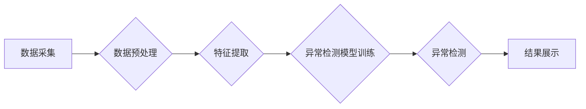

> Anomaly Detection, 异常检测, 数据挖掘, 机器学习, 统计学, 算法原理, 代码实例, Python

## 1. 背景介绍

在当今数据爆炸的时代，异常检测（Anomaly Detection）作为一种重要的数据挖掘技术，在各个领域发挥着越来越重要的作用。它旨在识别数据集中与众不同的数据点，这些数据点可能代表着异常事件、欺诈行为、系统故障等。

异常检测应用广泛，例如：

* **金融领域:** 识别信用卡欺诈、洗钱等异常交易。
* **网络安全领域:** 检测网络入侵、恶意软件攻击等异常行为。
* **工业领域:** 发现设备故障、生产过程异常等。
* **医疗领域:** 识别患者的异常生理指标，例如血压、体温等。

传统的异常检测方法主要依赖于手工设计的规则，但随着数据的复杂性和多样性增加，手工规则难以满足需求。近年来，机器学习算法在异常检测领域取得了显著进展，能够自动学习数据模式，并识别出潜在的异常数据点。

## 2. 核心概念与联系

异常检测的核心概念是“正常”和“异常”。

* **正常数据:** 符合预期模式的数据，占数据集中大部分比例。
* **异常数据:** 与正常数据显著不同的数据，可能代表着异常事件或错误。

异常检测的目标是区分正常数据和异常数据，并对异常数据进行标记或分类。

**异常检测流程:**



## 3. 核心算法原理 & 具体操作步骤

### 3.1  算法原理概述

常见的异常检测算法包括：

* **基于统计的算法:** 
    * **Z-score:** 计算数据点与均值的距离，超过一定阈值的点被认为是异常数据。
    * **IQR:** 计算数据点的四分位间距，超过一定范围的点被认为是异常数据。
* **基于机器学习的算法:**
    * **k-Nearest Neighbors (k-NN):** 计算数据点与最近k个邻居的距离，距离较大的点被认为是异常数据。
    * **Isolation Forest:** 将数据点随机隔离，隔离次数较多的点被认为是异常数据。
    * **One-Class SVM:** 使用支持向量机训练一个模型，该模型能够识别出正常数据，而异常数据则被分类为“其他”。

### 3.2  算法步骤详解

以Z-score算法为例，详细说明其步骤：

1. **数据预处理:** 对数据进行清洗、缺失值处理、标准化等操作，确保数据质量。
2. **计算均值和标准差:** 计算数据集中所有数据的均值和标准差。
3. **计算Z-score:** 对于每个数据点，计算其与均值的距离，并除以标准差，得到Z-score值。
4. **设定阈值:** 根据实际情况设定一个阈值，例如3。
5. **识别异常数据:** 如果数据点的Z-score值大于阈值，则将其标记为异常数据。

### 3.3  算法优缺点

**Z-score算法:**

* **优点:** 计算简单，易于理解和实现。
* **缺点:** 对数据分布敏感，对异常数据分布不均匀的数据集效果较差。

### 3.4  算法应用领域

Z-score算法广泛应用于金融、网络安全、医疗等领域，用于识别异常交易、入侵行为、异常生理指标等。

## 4. 数学模型和公式 & 详细讲解 & 举例说明

### 4.1  数学模型构建

Z-score算法的数学模型如下：

$$Z = \frac{x - \mu}{\sigma}$$

其中：

* $Z$ 是数据点的Z-score值。
* $x$ 是数据点的值。
* $\mu$ 是数据集中所有数据的均值。
* $\sigma$ 是数据集中所有数据的标准差。

### 4.2  公式推导过程

Z-score公式的推导过程如下：

1. 首先，计算数据点与均值的距离：$x - \mu$。
2. 然后，将距离除以标准差：$(x - \mu) / \sigma$。

标准差代表了数据集中数据的离散程度，因此将距离除以标准差可以将数据点与均值的距离标准化，得到Z-score值。

### 4.3  案例分析与讲解

假设我们有一组数据：

[10, 12, 15, 18, 20, 22, 25, 28, 30, 32]

计算该数据集的均值和标准差：

* $\mu = 19$
* $\sigma = 5$

对于数据点28，其Z-score值为：

$$Z = \frac{28 - 19}{5} = 1.8$$

由于Z-score值大于1，因此可以认为数据点28是异常数据。

## 5. 项目实践：代码实例和详细解释说明

### 5.1  开发环境搭建

本项目使用Python语言进行开发，需要安装以下库：

* NumPy
* Scikit-learn

可以使用pip命令安装：

```bash
pip install numpy scikit-learn
```

### 5.2  源代码详细实现

```python
import numpy as np
from sklearn.neighbors import KNeighborsClassifier
from sklearn.model_selection import train_test_split

# 生成示例数据
X = np.array([[1, 2], [2, 3], [3, 4], [4, 5], [5, 6], [10, 10], [15, 15]])
y = np.array([0, 0, 0, 0, 0, 1, 1])

# 将数据划分为训练集和测试集
X_train, X_test, y_train, y_test = train_test_split(X, y, test_size=0.2, random_state=42)

# 创建KNN模型
knn = KNeighborsClassifier(n_neighbors=3)

# 训练模型
knn.fit(X_train, y_train)

# 预测测试集数据
y_pred = knn.predict(X_test)

# 评估模型性能
print(f"准确率: {knn.score(X_test, y_test)}")
```

### 5.3  代码解读与分析

* 代码首先生成示例数据，其中包含正常数据和异常数据。
* 然后，将数据划分为训练集和测试集，用于训练和评估模型。
* 创建KNN模型，并设置邻居数量为3。
* 训练模型，并使用测试集数据进行预测。
* 最后，评估模型性能，例如准确率。

### 5.4  运行结果展示

运行代码后，会输出模型的准确率。

## 6. 实际应用场景

### 6.1  金融领域

* **信用卡欺诈检测:** 识别信用卡交易中的异常行为，例如高额交易、跨境交易等。
* **洗钱检测:** 识别洗钱交易中的异常模式，例如多次小额交易、资金来源不明等。

### 6.2  网络安全领域

* **入侵检测:** 识别网络攻击中的异常行为，例如恶意代码执行、端口扫描等。
* **恶意软件检测:** 识别恶意软件的特征，例如文件行为、网络通信等。

### 6.3  工业领域

* **设备故障预测:** 识别设备运行中的异常数据，例如温度、压力等，预测设备故障。
* **生产过程异常检测:** 识别生产过程中异常的生产数据，例如产量、质量等，及时进行调整。

### 6.4  未来应用展望

随着人工智能技术的不断发展，异常检测技术将应用于更多领域，例如：

* **医疗诊断:** 识别患者的异常生理指标，辅助医生进行诊断。
* **交通安全:** 识别驾驶员疲劳驾驶、酒驾等异常行为，提高交通安全。
* **环境监测:** 识别环境污染中的异常数据，及时采取措施。

## 7. 工具和资源推荐

### 7.1  学习资源推荐

* **书籍:**
    * Anomaly Detection: A Survey
    * Introduction to Machine Learning
* **在线课程:**
    * Coursera: Machine Learning
    * edX: Anomaly Detection

### 7.2  开发工具推荐

* **Python:** 
    * Scikit-learn
    * TensorFlow
    * PyTorch

### 7.3  相关论文推荐

* **Anomaly Detection: A Survey**
* **Isolation Forest**
* **One-Class SVM**

## 8. 总结：未来发展趋势与挑战

### 8.1  研究成果总结

异常检测技术近年来取得了显著进展，特别是机器学习算法在该领域取得了突破性进展。

### 8.2  未来发展趋势

未来异常检测技术的发展趋势包括：

* **更鲁棒的算法:** 能够处理更复杂、更不规则的数据集。
* **更有效的解释性:** 能够解释模型的预测结果，提高可解释性。
* **更个性化的检测:** 能够根据用户的需求定制异常检测模型。

### 8.3  面临的挑战

异常检测技术仍然面临一些挑战，例如：

* **数据质量问题:** 异常数据往往是稀疏的，难以获取足够的数据进行训练。
* **定义异常的模糊性:** 异常的定义往往是主观的，难以量化。
* **模型解释性问题:** 许多机器学习模型的内部机制难以理解，难以解释模型的预测结果。

### 8.4  研究展望

未来研究方向包括：

* **开发更鲁棒的异常检测算法:** 能够处理更复杂、更不规则的数据集。
* **提高模型的解释性:** 能够解释模型的预测结果，提高可解释性。
* **研究异常检测在不同领域的应用:** 探索异常检测在更多领域中的应用潜力。

## 9. 附录：常见问题与解答

### 9.1  常见问题

* **如何选择合适的异常检测算法？**

选择合适的异常检测算法需要根据具体的数据集和应用场景进行选择。

* **如何评估异常检测模型的性能？**

常用的评估指标包括准确率、召回率、F1-score等。

* **如何处理异常数据？**

处理异常数据的方法包括：删除、修正、标记等。

### 9.2  解答

* **如何选择合适的异常检测算法？**

选择合适的异常检测算法需要根据具体的数据集和应用场景进行选择。例如，对于高维数据，可以使用Isolation Forest算法；对于分类问题，可以使用One-Class SVM算法。

* **如何评估异常检测模型的性能？**

常用的评估指标包括准确率、召回率、F1-score等。准确率是指模型正确识别异常数据的比例，召回率是指模型识别出所有异常数据的比例，F1-score是准确率和召回率的调和平均值。

* **如何处理异常数据？**

处理异常数据的方法包括：删除、修正、标记等。删除异常数据可能会导致数据丢失，修正异常数据需要人工干预，标记异常数据可以用于训练模型。


作者：禅与计算机程序设计艺术 / Zen and the Art of Computer Programming 
<end_of_turn>