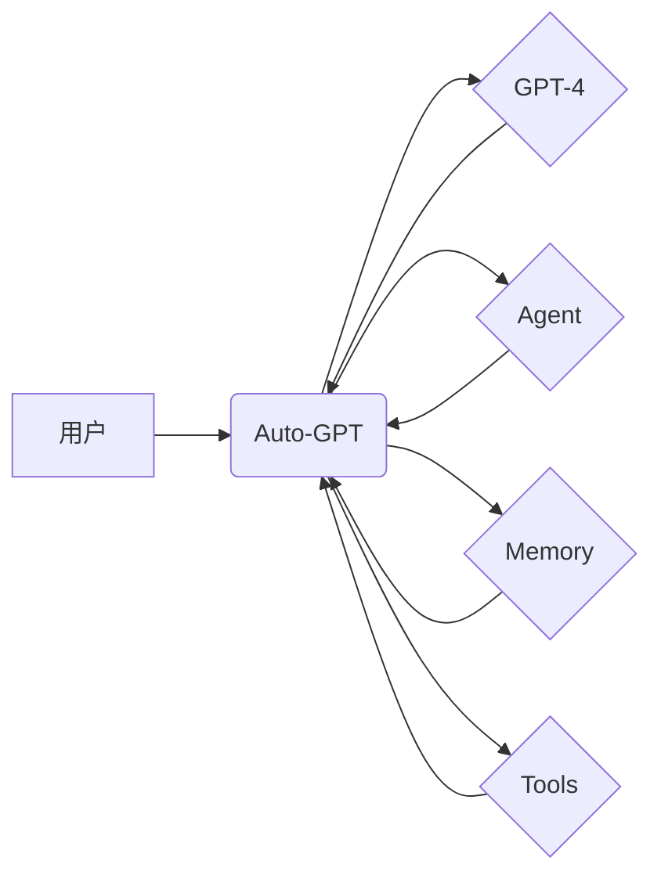

> Auto-GPT, 
> 开源AI, 
> 自动化, 
> 语言模型, 
> GPT-4, 
> 应用场景

## 1. 背景介绍

近年来，人工智能技术取得了飞速发展，尤其是大型语言模型（LLM）的出现，为人工智能的应用带来了革命性的变革。其中，GPT-4 作为目前最先进的文本生成模型之一，展现出强大的文本理解和生成能力，引发了广泛的关注和研究。

然而，GPT-4 的强大能力仅仅局限于文本生成层面，无法直接进行复杂的自动化任务。为了解决这一问题，开发人员创造了 Auto-GPT，一个基于 GPT-4 的开源人工智能系统，旨在实现自主学习、规划和执行任务的能力。

Auto-GPT 的出现标志着人工智能迈向更智能、更自主的阶段，它将彻底改变我们与人工智能交互的方式，并为各种领域带来革命性的应用。

## 2. 核心概念与联系

Auto-GPT 的核心概念是将 GPT-4 与其他人工智能技术结合，构建一个能够自主完成复杂任务的系统。

**核心概念：**

* **GPT-4:**  作为 Auto-GPT 的核心引擎，负责文本理解、生成和推理。
* **Agent:** Auto-GPT 的核心组件，负责规划、执行和管理任务。
* **Memory:**  用于存储任务相关信息和历史记录，帮助 Agent 更好地理解上下文和做出决策。
* **Tools:**  Auto-GPT 可以调用外部工具，例如搜索引擎、数据库和 API，以获取更多信息和完成特定任务。

**架构图：**

## 3. 核心算法原理 & 具体操作步骤

### 3.1  算法原理概述

Auto-GPT 的核心算法基于强化学习和循环神经网络。

* **强化学习:**  Agent 通过与环境交互，学习完成任务的最佳策略。
* **循环神经网络:**  GPT-4 作为循环神经网络，能够理解和生成具有上下文依赖性的文本。

Auto-GPT 的工作流程可以概括为以下步骤：

1. **用户输入任务:** 用户向 Auto-GPT 提供一个任务描述。
2. **Agent 规划任务:** Agent 分析任务描述，并分解成一系列子任务。
3. **GPT-4 生成行动:** Agent 根据子任务，向 GPT-4 请求行动建议。
4. **执行行动:** Auto-GPT 执行 GPT-4 生成的行动，并获取反馈信息。
5. **更新记忆:** Auto-GPT 将反馈信息存储到记忆中，以便 Agent 在后续决策中参考。
6. **重复步骤 2-5:**  Agent 持续规划、执行和学习，直到完成任务。

### 3.2  算法步骤详解

1. **任务分解:** Agent 将用户输入的任务分解成一系列更小的、可执行的任务。
2. **行动生成:** Agent 根据任务描述和记忆，向 GPT-4 请求行动建议。GPT-4 会根据其训练数据和上下文信息，生成一系列可能的行动方案。
3. **行动选择:** Agent 根据行动方案的预期效果和风险，选择最合适的行动方案。
4. **行动执行:** Auto-GPT 执行选定的行动方案，并获取反馈信息。
5. **反馈处理:** Auto-GPT 将反馈信息存储到记忆中，并根据反馈信息调整后续的行动规划。

### 3.3  算法优缺点

**优点:**

* **自主性:** Auto-GPT 可以自主学习、规划和执行任务，无需人工干预。
* **灵活性:** Auto-GPT 可以调用外部工具，扩展其功能和应用场景。
* **可扩展性:** Auto-GPT 的架构设计灵活，可以根据需要添加新的功能和组件。

**缺点:**

* **可靠性:** Auto-GPT 仍然处于早期阶段，其可靠性和稳定性有待提高。
* **安全性:** Auto-GPT 的自主性也带来潜在的安全风险，需要加强安全防护措施。
* **伦理问题:** Auto-GPT 的应用可能引发一些伦理问题，需要进行深入探讨和规范。

### 3.4  算法应用领域

Auto-GPT 的应用领域非常广泛，包括：

* **内容创作:** 自动生成文章、故事、诗歌等内容。
* **代码生成:** 自动生成代码，提高开发效率。
* **数据分析:** 自动分析数据，发现隐藏的模式和趋势。
* **客户服务:** 自动回复客户咨询，提高服务效率。
* **教育:** 自动生成学习材料，个性化教学。

## 4. 数学模型和公式 & 详细讲解 & 举例说明

### 4.1  数学模型构建

Auto-GPT 的核心算法基于强化学习，其数学模型可以概括为以下公式：

$$
R_t = f(s_t, a_t)
$$

其中：

* $R_t$ 表示在时间步 $t$ 的奖励值。
* $s_t$ 表示在时间步 $t$ 的状态。
* $a_t$ 表示在时间步 $t$ 执行的动作。
* $f$ 表示奖励函数，用于评估动作在特定状态下的效果。

### 4.2  公式推导过程

强化学习的目标是找到一个策略 $\pi$，使得在长期内获得最大的总奖励。

策略 $\pi$ 可以表示为一个概率分布，即在给定状态 $s$ 时，执行动作 $a$ 的概率。

$$
\pi(a|s)
$$

强化学习算法通过不断地与环境交互，更新策略 $\pi$，使其能够最大化总奖励。

常用的强化学习算法包括 Q-学习、SARSA 和 Deep Q-Network (DQN)。

### 4.3  案例分析与讲解

假设 Auto-GPT 正在执行一个任务，目标是找到一个特定的文件。

* **状态:** Auto-GPT 的状态可以包括当前目录、已搜索的文件列表等信息。
* **动作:** Auto-GPT 可以执行的动作包括搜索文件、切换目录等。
* **奖励:** 当 Auto-GPT 找到目标文件时，奖励值会很高；否则，奖励值会很低。

通过不断地搜索和学习，Auto-GPT 会逐渐找到一个最优的策略，能够以最快的速度找到目标文件。

## 5. 项目实践：代码实例和详细解释说明

### 5.1  开发环境搭建

Auto-GPT 的开发环境需要包含以下软件：

* Python 3.8 或更高版本
* PyTorch 或 TensorFlow
* OpenAI API 

### 5.2  源代码详细实现

Auto-GPT 的源代码主要包含以下几个部分：

* **Agent 类:** 负责规划、执行和管理任务。
* **Memory 类:** 用于存储任务相关信息和历史记录。
* **Tools 类:** 提供对外部工具的访问接口。
* **GPT-4 接口:** 用于调用 GPT-4 的 API。

### 5.3  代码解读与分析

Auto-GPT 的代码实现主要基于 Python，并使用了一些深度学习库，例如 PyTorch 或 TensorFlow。

代码中定义了多个类，分别负责不同的功能模块。

例如，Agent 类负责规划任务，并根据任务描述和记忆，向 GPT-4 请求行动建议。

### 5.4  运行结果展示

Auto-GPT 的运行结果可以根据任务的不同而有所不同。

例如，如果用户输入的任务是“写一篇关于人工智能的文章”，那么 Auto-GPT 会生成一篇关于人工智能的文章。

## 6. 实际应用场景

### 6.1  内容创作

Auto-GPT 可以自动生成各种类型的文本内容，例如文章、故事、诗歌、剧本等。

### 6.2  代码生成

Auto-GPT 可以根据用户需求自动生成代码，提高开发效率。

### 6.3  数据分析

Auto-GPT 可以自动分析数据，发现隐藏的模式和趋势。

### 6.4  未来应用展望

Auto-GPT 的应用场景非常广泛，未来可能会在更多领域得到应用，例如：

* **个性化教育:** 自动生成个性化的学习材料，提高学习效率。
* **医疗诊断:** 辅助医生进行诊断，提高诊断准确率。
* **科学研究:** 自动进行科学实验，加速科研进度。

## 7. 工具和资源推荐

### 7.1  学习资源推荐

* **OpenAI API 文档:** https://platform.openai.com/docs/api-reference
* **PyTorch 文档:** https://pytorch.org/docs/stable/
* **TensorFlow 文档:** https://www.tensorflow.org/

### 7.2  开发工具推荐

* **VS Code:** https://code.visualstudio.com/
* **Jupyter Notebook:** https://jupyter.org/

### 7.3  相关论文推荐

* **Auto-GPT:** https://github.com/Significant-Gravitas/Auto-GPT

## 8. 总结：未来发展趋势与挑战

### 8.1  研究成果总结

Auto-GPT 的出现标志着人工智能迈向更智能、更自主的阶段。

它将彻底改变我们与人工智能交互的方式，并为各种领域带来革命性的应用。

### 8.2  未来发展趋势

未来，Auto-GPT 可能会朝着以下方向发展：

* **更强大的模型:** 使用更强大的语言模型，例如 GPT-5 或其更高版本。
* **更复杂的推理能力:** 增强 Auto-GPT 的推理能力，使其能够解决更复杂的任务。
* **更安全的系统:** 加强 Auto-GPT 的安全防护措施，防止其被恶意利用。

### 8.3  面临的挑战

Auto-GPT 的发展也面临着一些挑战：

* **可靠性:** Auto-GPT 仍然处于早期阶段，其可靠性和稳定性有待提高。
* **安全性:** Auto-GPT 的自主性也带来潜在的安全风险，需要加强安全防护措施。
* **伦理问题:** Auto-GPT 的应用可能引发一些伦理问题，需要进行深入探讨和规范。

### 8.4  研究展望

未来，我们需要继续研究和探索 Auto-GPT 的潜力，使其能够更好地服务于人类社会。

## 9. 附录：常见问题与解答

**常见问题:**

* Auto-GPT 是否开源？

**解答:**  是的，Auto-GPT 是开源的。

* Auto-GPT 需要多少计算资源？

**解答:**  Auto-GPT 的计算资源需求取决于任务的复杂度和使用的模型大小。

* Auto-GPT 是否可以用于任何类型的任务？

**解答:**  Auto-GPT 可以用于许多类型的任务，但并非所有类型的任务都适合使用 Auto-GPT。

**作者：禅与计算机程序设计艺术 / Zen and the Art of Computer Programming**

<end_of_turn>