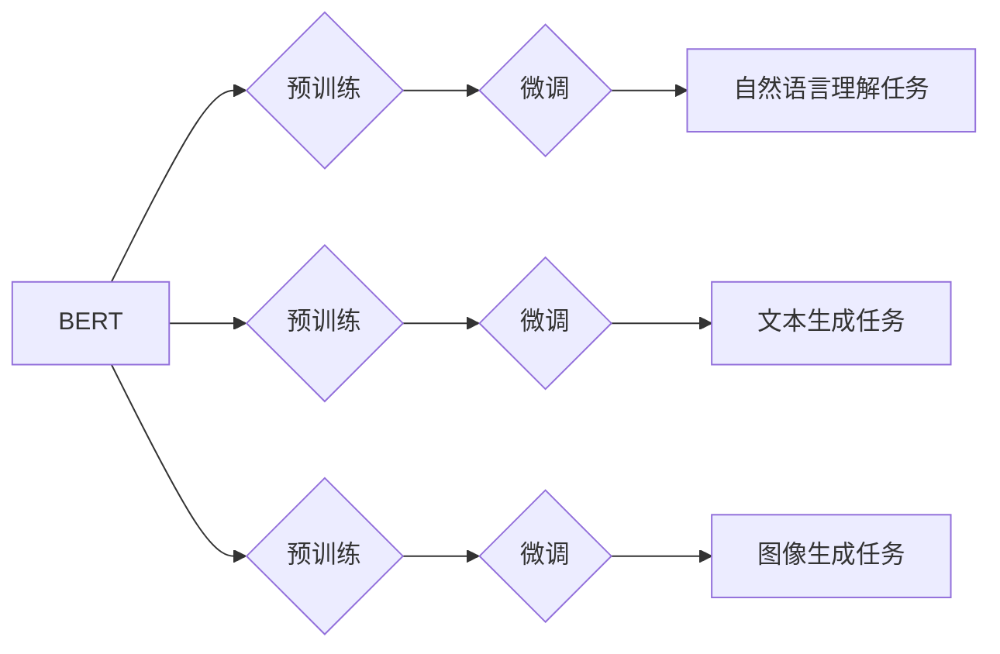

> BERT, DALL-E, GPT-3, 自然语言处理, 图像生成, 大模型, 深度学习, Transformer

## 1. 背景介绍

近年来，人工智能领域取得了令人瞩目的进展，其中深度学习技术扮演着至关重要的角色。大型语言模型（LLM）的出现，特别是BERT、DALL-E和GPT-3等模型的突破性进展，标志着人工智能进入了一个新的时代。这些模型展现出惊人的能力，能够理解和生成人类语言，甚至可以创作出逼真的图像。

BERT（Bidirectional Encoder Representations from Transformers）是谷歌开发的一种基于Transformer架构的预训练语言模型。它通过双向编码机制，能够更好地理解上下文信息，在自然语言理解任务中取得了显著的成果。

DALL-E（DALL-E 2）是由OpenAI开发的文本到图像生成模型。它能够根据自然语言描述生成逼真的图像，展现出强大的图像生成能力。

GPT-3（Generative Pre-trained Transformer 3）是OpenAI开发的另一款大型语言模型，拥有1750亿个参数。它能够进行各种自然语言处理任务，包括文本生成、翻译、问答等，并展现出令人惊叹的文本生成能力。

## 2. 核心概念与联系

BERT、DALL-E和GPT-3都是基于深度学习技术的强大模型，它们的核心概念和联系如下：

* **Transformer架构:** BERT和GPT-3都基于Transformer架构，这种架构能够有效地处理序列数据，并捕捉长距离依赖关系。
* **预训练:** 这三种模型都采用了预训练技术，在海量文本数据上进行预训练，学习了语言的语法和语义知识。
* **微调:** 预训练模型可以通过微调的方式，针对特定任务进行进一步训练，提高模型性能。

**Mermaid 流程图:**



## 3. 核心算法原理 & 具体操作步骤

### 3.1  算法原理概述

BERT、DALL-E和GPT-3都基于深度学习算法，其核心原理是通过多层神经网络学习数据中的模式和关系。

* **BERT:** BERT使用Transformer架构，通过双向编码机制，学习文本中的上下文信息。它使用Masked Language Modeling（MLM）和Next Sentence Prediction（NSP）两种预训练任务，训练模型理解语言的语义和语法。

* **DALL-E:** DALL-E使用一种基于变分自编码器的图像生成模型，它将文本描述编码成一个向量，然后使用解码器生成相应的图像。

* **GPT-3:** GPT-3使用Transformer架构，通过自回归的方式生成文本。它在海量文本数据上进行预训练，学习了语言的语法和语义知识，能够生成流畅、连贯的文本。

### 3.2  算法步骤详解

* **BERT:**

1. 将输入文本分割成单词序列。
2. 使用嵌入层将单词映射到向量空间。
3. 将单词向量输入Transformer编码器，进行双向编码。
4. 使用输出层将编码后的向量映射到目标任务的输出空间。

* **DALL-E:**

1. 将文本描述编码成一个向量。
2. 使用解码器生成图像像素。
3. 使用损失函数衡量生成的图像与目标图像之间的差异。
4. 通过反向传播算法更新模型参数。

* **GPT-3:**

1. 将输入文本分割成单词序列。
2. 使用嵌入层将单词映射到向量空间。
3. 将单词向量输入Transformer解码器，进行自回归生成。
4. 使用损失函数衡量生成的文本与目标文本之间的差异。
5. 通过反向传播算法更新模型参数。

### 3.3  算法优缺点

* **BERT:**

    * **优点:** 能够更好地理解上下文信息，在自然语言理解任务中表现出色。
    * **缺点:** 计算量较大，训练成本高。

* **DALL-E:**

    * **优点:** 能够生成逼真的图像，具有强大的图像生成能力。
    * **缺点:** 生成图像的质量可能存在不稳定性，需要大量的计算资源。

* **GPT-3:**

    * **优点:** 能够生成流畅、连贯的文本，在文本生成任务中表现出色。
    * **缺点:** 可能生成包含偏见或错误信息的文本，需要进行仔细的评估和筛选。

### 3.4  算法应用领域

* **BERT:** 自然语言理解任务，例如文本分类、情感分析、问答系统等。
* **DALL-E:** 图像生成、图像编辑、艺术创作等。
* **GPT-3:** 文本生成、机器翻译、代码生成、聊天机器人等。

## 4. 数学模型和公式 & 详细讲解 & 举例说明

### 4.1  数学模型构建

BERT、DALL-E和GPT-3都基于深度学习模型，其数学模型构建主要包括以下几个方面：

* **嵌入层:** 将单词映射到向量空间，每个单词对应一个唯一的向量表示。
* **Transformer编码器/解码器:** 使用多层注意力机制和前馈神经网络，学习文本的上下文信息和语义关系。
* **损失函数:** 用于衡量模型预测结果与真实值的差异，例如交叉熵损失函数。

### 4.2  公式推导过程

由于篇幅限制，这里只列举一些关键公式，详细推导过程可以参考相关论文和书籍。

* **注意力机制:**

$$
Attention(Q, K, V) = \frac{exp(Q \cdot K^T / \sqrt{d_k})}{softmax(Q \cdot K^T / \sqrt{d_k})} \cdot V
$$

其中，Q、K、V分别代表查询矩阵、键矩阵和值矩阵，$d_k$代表键向量的维度。

* **交叉熵损失函数:**

$$
Loss = - \sum_{i=1}^{N} y_i \cdot log(p_i)
$$

其中，$y_i$代表真实标签，$p_i$代表模型预测的概率。

### 4.3  案例分析与讲解

BERT在自然语言理解任务中取得了显著的成果，例如在GLUE基准测试中，BERT模型在多个任务上都取得了state-of-the-art的结果。DALL-E能够根据自然语言描述生成逼真的图像，例如可以根据描述“一只戴着帽子的小狗在草地上玩耍”生成相应的图像。GPT-3能够生成流畅、连贯的文本，例如可以根据提示“写一首关于春天的诗”生成一首诗。

## 5. 项目实践：代码实例和详细解释说明

### 5.1  开发环境搭建

* 安装Python和必要的库，例如TensorFlow、PyTorch等。
* 下载预训练模型的权重文件。

### 5.2  源代码详细实现

由于篇幅限制，这里只提供一个简单的BERT文本分类代码示例，详细代码实现可以参考相关开源项目。

```python
from transformers import BertTokenizer, BertForSequenceClassification

# 加载预训练模型和分词器
tokenizer = BertTokenizer.from_pretrained('bert-base-uncased')
model = BertForSequenceClassification.from_pretrained('bert-base-uncased', num_labels=2)

# 预处理文本
text = "这是一个积极的句子。"
inputs = tokenizer(text, return_tensors='pt')

# 进行预测
outputs = model(**inputs)
logits = outputs.logits
predicted_class = logits.argmax().item()

# 输出预测结果
print(f"预测结果: {predicted_class}")
```

### 5.3  代码解读与分析

* 使用`transformers`库加载预训练模型和分词器。
* 使用`tokenizer`将文本进行预处理，转换为模型可识别的格式。
* 使用`model`进行预测，获取模型输出的logits。
* 使用`argmax()`函数获取logits中最大值对应的类标签。

### 5.4  运行结果展示

运行上述代码，可以得到预测结果，例如输出“预测结果: 1”，表示文本被预测为正类。

## 6. 实际应用场景

### 6.1  自然语言理解

* **文本分类:** 将文本归类到预定义的类别，例如情感分析、主题分类等。
* **问答系统:** 根据给定的问题，从文本中找到相应的答案。
* **机器翻译:** 将文本从一种语言翻译成另一种语言。

### 6.2  图像生成

* **艺术创作:** 生成新的艺术作品，例如绘画、雕塑等。
* **图像编辑:** 修改图像的某些部分，例如添加物体、改变背景等。
* **游戏开发:** 生成游戏场景、角色等。

### 6.3  文本生成

* **聊天机器人:** 与用户进行自然语言对话。
* **内容创作:** 生成新闻文章、博客文章、小说等。
* **代码生成:** 根据自然语言描述生成代码。

### 6.4  未来应用展望

随着人工智能技术的不断发展，BERT、DALL-E和GPT-3等模型将有更广泛的应用场景，例如：

* **个性化教育:** 根据学生的学习情况，提供个性化的学习内容和辅导。
* **医疗诊断:** 辅助医生进行疾病诊断，提高诊断准确率。
* **科学研究:** 加速科学研究的进程，例如药物研发、材料科学等。

## 7. 工具和资源推荐

### 7.1  学习资源推荐

* **书籍:**
    * 《深度学习》
    * 《自然语言处理》
    * 《Transformer模型》
* **在线课程:**
    * Coursera
    * edX
    * fast.ai

### 7.2  开发工具推荐

* **TensorFlow:** 开源深度学习框架。
* **PyTorch:** 开源深度学习框架。
* **Hugging Face Transformers:** 预训练模型库和工具。

### 7.3  相关论文推荐

* BERT: Pre-training of Deep Bidirectional Transformers for Language Understanding
* DALL-E: Creating Images from Text
* GPT-3: Language Models are Few-Shot Learners

## 8. 总结：未来发展趋势与挑战

### 8.1  研究成果总结

BERT、DALL-E和GPT-3等模型的出现，标志着人工智能领域取得了重大突破，展现出强大的能力，能够理解和生成人类语言，甚至可以创作出逼真的图像。这些模型的成功，得益于深度学习技术的进步，特别是Transformer架构的提出。

### 8.2  未来发展趋势

* **模型规模更大:** 未来模型规模将继续扩大，拥有更多的参数，从而提高模型的性能。
* **多模态学习:** 将文本、图像、音频等多种模态数据融合在一起，训练更强大的多模态模型。
* **可解释性增强:** 研究如何提高模型的可解释性，让模型的决策过程更加透明。

### 8.3  面临的挑战

* **数据获取和标注:** 训练大型模型需要海量数据，数据获取和标注成本很高。
* **计算资源:** 训练大型模型需要大量的计算资源，成本高昂。
* **伦理问题:** 大模型的应用可能带来一些伦理问题，例如信息泄露、偏见放大等，需要谨慎对待。

### 8.4  研究展望

未来，人工智能领域将继续朝着更智能、更安全、更可解释的方向发展。大型模型将扮演越来越重要的角色，推动人工智能技术的发展和应用。


## 9. 附录：常见问题与解答

* **Q: BERT、DALL-E和GPT-3有什么区别？**

* **A:** BERT主要用于自然语言理解任务，DALL-E用于图像生成任务，GPT-3用于文本生成任务。

* **Q: 如何使用预训练模型？**

* **A:** 可以使用开源库，例如`transformers`，加载预训练模型的