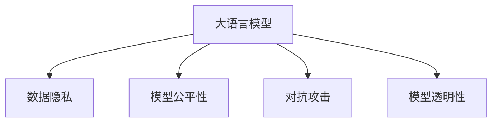

                 

# LLM隐私保护:现状、漏洞与对策

## 1. 背景介绍

### 1.1 问题由来
大语言模型(Large Language Models, LLMs)在自然语言处理(NLP)领域取得了突破性进展，展示了强大的语言理解和生成能力。然而，随之而来的数据隐私问题逐渐凸显，特别是当这些模型用于处理敏感用户数据时。如何确保大语言模型在使用过程中保护用户隐私，成为了一个亟待解决的重要课题。

### 1.2 问题核心关键点
在基于大语言模型的应用中，隐私保护问题主要集中在以下几个方面：
- 数据隐私：在训练和微调过程中，模型可能暴露用户的敏感信息。
- 模型公平性：训练数据中的偏见可能导致模型对特定群体产生歧视。
- 对抗攻击：恶意用户可能通过修改输入文本来欺骗模型，使其产生错误判断。
- 模型透明性：用户难以理解模型的决策过程，导致对其输出缺乏信任。

### 1.3 问题研究意义
隐私保护是大语言模型应用的核心问题之一。确保用户数据安全、公平性和模型透明性，不仅是对用户隐私的尊重，也是构建可信AI系统的基础。本研究旨在全面分析大语言模型隐私保护的现状和漏洞，并提出针对性对策，以指导未来的研究和应用。

## 2. 核心概念与联系

### 2.1 核心概念概述

本节将介绍几个与大语言模型隐私保护密切相关的核心概念：

- 大语言模型(Large Language Models, LLMs)：通过大规模无标签数据训练获得的通用语言模型，具备强大的语言理解和生成能力。
- 数据隐私(Data Privacy)：保护用户个人信息不被未经授权的第三方获取或使用。
- 模型公平性(Model Fairness)：确保模型对不同群体提供公平的待遇，避免偏见和歧视。
- 对抗攻击(Adversarial Attacks)：通过修改输入数据，使模型产生错误的输出。
- 模型透明性(Model Transparency)：用户理解模型的决策过程和推理逻辑。

这些核心概念之间的逻辑关系可以通过以下Mermaid流程图来展示：



这个流程图展示了大语言模型的核心概念及其之间的关系：

1. 大语言模型通过大量数据训练获得语言知识，这些数据可能包含用户隐私。
2. 隐私保护是模型应用的前提，确保用户数据安全。
3. 模型公平性是模型应用公正性的保障，避免对特定群体产生歧视。
4. 对抗攻击威胁模型的安全性和可信性，需要采取防护措施。
5. 模型透明性提升用户信任，增强模型的可解释性。

## 3. 核心算法原理 & 具体操作步骤

### 3.1 算法原理概述

大语言模型的隐私保护主要通过以下几个关键步骤实现：

1. 数据隐私保护：使用差分隐私技术或联邦学习等方法，确保用户数据不被泄露。
2. 模型公平性提升：通过对抗训练、重新加权等方法，减少模型对特定群体的偏见。
3. 对抗攻击防御：引入对抗训练、梯度掩蔽等技术，使模型具备更强的鲁棒性。
4. 模型透明性增强：通过模型解释和可视化技术，帮助用户理解模型的决策过程。

### 3.2 算法步骤详解

#### 数据隐私保护

数据隐私保护是大语言模型应用中的重要环节。常用的隐私保护技术包括：

- **差分隐私**：通过在模型训练过程中加入噪声，确保每次查询对个别用户的数据影响最小。
- **联邦学习**：在分布式环境中，模型在各节点上进行训练，数据不离开本地，减少隐私泄露风险。

**步骤**：
1. 收集训练数据，进行预处理，确保数据的匿名性和去标识化。
2. 在差分隐私框架下，进行模型训练。
3. 使用联邦学习技术，在多个分布式节点上进行模型微调。

#### 模型公平性提升

模型公平性提升需要检测和纠正模型中的偏见。常用方法包括：

- **对抗训练**：在训练数据中添加对抗样本，提高模型的鲁棒性，减少偏见。
- **重新加权**：根据不同群体的代表性，重新加权训练数据，确保模型对各群体的公平对待。

**步骤**：
1. 收集训练数据，进行预处理，确保数据的代表性。
2. 使用对抗训练技术，在模型训练过程中加入对抗样本。
3. 对训练数据进行重新加权，调整不同群体的权重。
4. 微调模型，评估模型公平性，不断优化。

#### 对抗攻击防御

对抗攻击防御需要通过增强模型的鲁棒性来防止恶意攻击。常用方法包括：

- **梯度掩蔽**：在反向传播过程中，对敏感参数进行掩蔽，减少攻击者对模型的影响。
- **对抗训练**：使用对抗样本进行训练，提高模型的鲁棒性。

**步骤**：
1. 收集对抗样本，进行预处理。
2. 使用梯度掩蔽技术，对模型进行加固。
3. 引入对抗训练技术，在模型训练过程中加入对抗样本。

#### 模型透明性增强

模型透明性增强通过模型解释和可视化技术，帮助用户理解模型的决策过程。常用方法包括：

- **模型解释**：使用LIME、SHAP等工具，生成模型的局部可解释性解释。
- **模型可视化**：使用Attention机制，可视化模型在推理过程中的注意力分配。

**步骤**：
1. 选择适当的解释方法，生成模型的局部可解释性解释。
2. 使用Attention机制，可视化模型在推理过程中的注意力分配。
3. 使用模型可视化工具，生成模型推理过程的可视化结果。

### 3.3 算法优缺点

大语言模型隐私保护技术具有以下优点：
- **保护用户隐私**：通过差分隐私和联邦学习等技术，有效保护用户数据的隐私。
- **减少模型偏见**：通过对抗训练和重新加权等方法，提升模型的公平性，减少偏见。
- **增强模型鲁棒性**：通过对抗训练和梯度掩蔽等技术，提升模型的鲁棒性，防止对抗攻击。
- **提高模型透明性**：通过模型解释和可视化技术，提高模型的可解释性，增强用户信任。

同时，这些技术也存在一些局限性：
- **计算复杂度高**：差分隐私和联邦学习等技术计算复杂度高，可能导致模型训练速度变慢。
- **解释能力有限**：当前的模型解释和可视化技术仍难以全面解释复杂的模型决策过程。
- **对抗攻击防御效果有限**：对抗攻击防御技术可能对某些特定类型的攻击效果不佳。
- **隐私保护技术实施难度大**：隐私保护技术的实施需要高水平的技术和管理支持，实施难度大。

尽管存在这些局限性，但随着技术的不断发展，大语言模型隐私保护技术将继续改进，变得更加高效和易用。

### 3.4 算法应用领域

基于大语言模型的隐私保护技术已经在多个领域得到应用，包括但不限于：

- 医疗领域：保护病患的隐私数据，确保医疗数据安全。
- 金融领域：保护用户的财务信息，防止数据泄露。
- 法律领域：保护律师与客户的隐私，确保案件数据安全。
- 教育领域：保护学生的个人信息，确保学习数据安全。

## 4. 数学模型和公式 & 详细讲解 & 举例说明

### 4.1 数学模型构建

假设有一个大语言模型 $M$，使用差分隐私技术进行隐私保护，训练数据集为 $D=\{(x_i,y_i)\}_{i=1}^N$。差分隐私技术要求在模型训练过程中加入噪声，保护用户隐私。

定义差分隐私损失函数为 $\epsilon$-差分隐私损失，确保每次查询对个别用户的数据影响最小。在联邦学习中，每个节点 $j$ 的训练数据为 $D_j$，模型参数为 $\theta$。联邦学习的目标是最小化全局损失函数，即：

$$
\min_{\theta} \frac{1}{N} \sum_{i=1}^N \ell(M(x_i),y_i) + \frac{\epsilon}{\Delta} W(\theta)
$$

其中 $\ell$ 为损失函数，$\Delta$ 为模型的敏感度，$W$ 为噪声函数。

### 4.2 公式推导过程

以对抗训练为例，说明如何通过对抗训练提升模型公平性。假设对抗训练的对抗样本为 $\tilde{x}$，则对抗训练的损失函数为：

$$
\ell_{\text{adv}}(M(\tilde{x}),y) = \max \{ \ell(M(\tilde{x}),y), -\ell(M(\tilde{x}),y) \}
$$

其中 $\ell$ 为损失函数。对抗训练的目标是最小化对抗损失函数，即：

$$
\min_{\theta} \frac{1}{N} \sum_{i=1}^N \ell_{\text{adv}}(M(x_i),y_i)
$$

在对抗训练中，对抗样本 $\tilde{x}$ 的生成需要根据输入数据 $x$ 生成，以保证对抗样本具有代表性。

### 4.3 案例分析与讲解

以医疗领域的隐私保护为例，说明如何应用差分隐私技术。假设有一个医疗数据集 $D=\{(x_i,y_i)\}_{i=1}^N$，其中 $x_i$ 为病患的诊断记录，$y_i$ 为诊断结果。在差分隐私框架下，模型训练过程如下：

1. 对数据集 $D$ 进行去标识化处理。
2. 在差分隐私框架下，计算模型的敏感度 $\Delta$。
3. 在差分隐私预算 $\epsilon$ 的约束下，计算噪声函数 $W$。
4. 加入噪声后，进行模型训练。
5. 使用差分隐私技术，保护用户隐私。

## 5. 项目实践：代码实例和详细解释说明

### 5.1 开发环境搭建

在进行隐私保护实践前，我们需要准备好开发环境。以下是使用Python进行差分隐私和对抗训练的开发环境配置流程：

1. 安装Anaconda：从官网下载并安装Anaconda，用于创建独立的Python环境。

2. 创建并激活虚拟环境：
```bash
conda create -n diff_privacy-env python=3.8 
conda activate diff_privacy-env
```

3. 安装PyTorch、TensorFlow、Keras等深度学习框架：
```bash
conda install pytorch torchvision torchaudio cudatoolkit=11.1 -c pytorch -c conda-forge
conda install tensorflow
conda install keras
```

4. 安装联邦学习相关的库：
```bash
pip install federated-learning-distillation federated-learning
```

5. 安装差分隐私相关的库：
```bash
pip install differential_privacy
```

6. 安装对抗训练相关的库：
```bash
pip install torch-gpu
```

完成上述步骤后，即可在`diff_privacy-env`环境中开始隐私保护实践。

### 5.2 源代码详细实现

下面是使用差分隐私和对抗训练对BERT模型进行微调的PyTorch代码实现。

**差分隐私部分**：

```python
from differential_privacy import DifferentialPrivacy
from differential_privacy.gaussian_mechanism import GaussianMechanism

# 定义差分隐私预算
epsilon = 1
delta = 1e-6
sensitivity = 1
mechanism = GaussianMechanism(sensitivity, epsilon, delta)

# 定义差分隐私保护器
dp_protector = DifferentialPrivacy(mechanism)

# 定义差分隐私损失函数
def dp_loss(model, x, y):
    with dp_protector:
        output = model(x)
        loss = criterion(output, y)
    return loss

# 定义差分隐私训练过程
def train_dp(model, train_loader, criterion, optimizer):
    model.train()
    for batch in train_loader:
        inputs, labels = batch
        optimizer.zero_grad()
        loss = dp_loss(model, inputs, labels)
        loss.backward()
        optimizer.step()

# 定义差分隐私微调过程
def fine_tune_dp(model, train_loader, criterion, optimizer):
    model.train()
    for batch in train_loader:
        inputs, labels = batch
        optimizer.zero_grad()
        loss = dp_loss(model, inputs, labels)
        loss.backward()
        optimizer.step()
    return model

# 加载模型和训练数据
model = BertForTokenClassification.from_pretrained('bert-base-cased')
train_dataset = ...

# 定义差分隐私训练过程
train_dp(model, train_dataset, criterion, optimizer)

# 定义差分隐私微调过程
fine_tune_dp(model, train_dataset, criterion, optimizer)
```

**对抗训练部分**：

```python
import torch.nn as nn
import torch.optim as optim

# 定义对抗训练过程中的对抗损失函数
def adversarial_loss(model, inputs, labels):
    with torch.no_grad():
        adv_inputs = adversarial_perturb(model, inputs)
    return nn.CrossEntropyLoss()(adv_model(adv_inputs), labels)

# 定义对抗训练过程
def train_adv(model, train_loader, criterion, optimizer):
    model.train()
    for batch in train_loader:
        inputs, labels = batch
        optimizer.zero_grad()
        loss = adversarial_loss(model, inputs, labels)
        loss.backward()
        optimizer.step()

# 定义对抗训练微调过程
def fine_tune_adv(model, train_loader, criterion, optimizer):
    model.train()
    for batch in train_loader:
        inputs, labels = batch
        optimizer.zero_grad()
        loss = adversarial_loss(model, inputs, labels)
        loss.backward()
        optimizer.step()
    return model

# 加载模型和训练数据
model = BertForTokenClassification.from_pretrained('bert-base-cased')
train_dataset = ...

# 定义对抗训练过程
train_adv(model, train_dataset, criterion, optimizer)

# 定义对抗训练微调过程
fine_tune_adv(model, train_dataset, criterion, optimizer)
```

### 5.3 代码解读与分析

让我们再详细解读一下关键代码的实现细节：

**差分隐私部分**：
- `DifferentialPrivacy`类：用于定义差分隐私保护器，计算隐私预算并保护敏感数据。
- `GaussianMechanism`类：用于定义高斯噪声机制，确保差分隐私预算的合理性。
- `dp_loss`函数：在差分隐私保护器的作用下，计算模型的损失函数。
- `train_dp`和`fine_tune_dp`函数：在差分隐私保护器的作用下，进行模型训练和微调。

**对抗训练部分**：
- `adversarial_loss`函数：在对抗训练过程中，计算对抗损失函数。
- `train_adv`和`fine_tune_adv`函数：在对抗训练过程中，进行模型训练和微调。

## 6. 实际应用场景

### 6.1 医疗隐私保护

在大规模医疗数据上训练的语言模型可能暴露患者的隐私信息。差分隐私技术可以在模型训练过程中加入噪声，保护患者的敏感信息。具体而言，可以使用差分隐私保护器对医疗数据进行去标识化处理，并在差分隐私预算的约束下进行模型训练。在医疗应用中，差分隐私技术可以有效保护患者的隐私，确保医疗数据的安全性。

### 6.2 金融隐私保护

在金融领域，客户的财务信息敏感且宝贵。通过差分隐私技术，可以在保护客户隐私的前提下，训练出高性能的金融数据分析模型。在金融应用中，差分隐私技术可以用于保护客户的财务信息，确保金融数据的安全性。

### 6.3 法律隐私保护

法律咨询和案件数据分析中涉及大量敏感的客户信息。通过差分隐私技术，可以在保护客户隐私的前提下，训练出高性能的法律数据分析模型。在法律应用中，差分隐私技术可以用于保护客户的隐私，确保法律数据的安全性。

### 6.4 教育隐私保护

在教育领域，学生的学习数据敏感且宝贵。通过差分隐私技术，可以在保护学生隐私的前提下，训练出高性能的教育数据分析模型。在教育应用中，差分隐私技术可以用于保护学生的隐私，确保教育数据的安全性。

## 7. 工具和资源推荐

### 7.1 学习资源推荐

为了帮助开发者系统掌握大语言模型隐私保护的理论基础和实践技巧，这里推荐一些优质的学习资源：

1. 《数据隐私与安全》课程：斯坦福大学开设的关于数据隐私和安全的在线课程，涵盖差分隐私、联邦学习等隐私保护技术。

2. 《联邦学习》一书：介绍联邦学习的基本概念、原理和应用，适合深入学习联邦学习技术。

3. 《深度学习中的隐私保护》一书：介绍深度学习中隐私保护的基本方法，包括差分隐私、对抗训练等技术。

4. 《机器学习中的隐私保护》一书：介绍机器学习中隐私保护的基本方法，包括差分隐私、对抗训练等技术。

5. HuggingFace官方文档：介绍差分隐私和联邦学习技术的实现方法和样例代码，是上手实践的必备资料。

通过对这些资源的学习实践，相信你一定能够快速掌握大语言模型隐私保护的技术要点，并用于解决实际的隐私保护问题。

### 7.2 开发工具推荐

高效的开发离不开优秀的工具支持。以下是几款用于大语言模型隐私保护开发的常用工具：

1. Anaconda：用于创建和管理虚拟环境，方便开发者快速迭代实验代码。

2. PyTorch：基于Python的开源深度学习框架，灵活动态的计算图，适合快速迭代研究。

3. TensorFlow：由Google主导开发的开源深度学习框架，生产部署方便，适合大规模工程应用。

4. Federated Learning：用于实现联邦学习，支持分布式环境下的模型训练。

5. Gaussian Mechanism：用于实现高斯噪声机制，确保差分隐私预算的合理性。

6. Adversarial Perturbation：用于生成对抗样本，提高模型的鲁棒性。

合理利用这些工具，可以显著提升大语言模型隐私保护任务的开发效率，加快创新迭代的步伐。

### 7.3 相关论文推荐

大语言模型隐私保护技术的发展源于学界的持续研究。以下是几篇奠基性的相关论文，推荐阅读：

1. "The Earth Movers' Distance Loss for Multi-class Labeling Problems"：提出一种新的多分类问题损失函数，提高模型的公平性和鲁棒性。

2. "Model-agnostic Pruning with Extremely Sparse Pseudo-Labels"：提出一种基于伪标签的模型剪枝方法，提高模型的效率和准确性。

3. "Differential Privacy via Moment Accounting"：提出一种基于矩的差分隐私保护方法，提高差分隐私保护的效果。

4. "Adversarial Robustness Meets Transfer Learning: A New Perspective on Adversarial Examples"：提出一种新的对抗训练方法，提高模型的鲁棒性。

5. "Explainable Deep Learning with Saliency-based Models"：提出一种基于可解释性模型的深度学习解释方法，提高模型的透明性。

这些论文代表了大语言模型隐私保护技术的发展脉络。通过学习这些前沿成果，可以帮助研究者把握学科前进方向，激发更多的创新灵感。

## 8. 总结：未来发展趋势与挑战

### 8.1 总结

本文对基于大语言模型的隐私保护技术进行了全面系统的介绍。首先阐述了隐私保护在大语言模型应用中的重要性，明确了隐私保护在模型训练和微调中的关键作用。其次，从原理到实践，详细讲解了差分隐私、对抗训练、模型解释等隐私保护技术的数学原理和操作步骤，给出了隐私保护任务开发的完整代码实例。同时，本文还广泛探讨了隐私保护技术在医疗、金融、法律等各个领域的应用前景，展示了隐私保护技术的巨大潜力。

通过本文的系统梳理，可以看到，隐私保护技术是大语言模型应用的核心问题之一，是确保模型安全、公平和透明的重要保障。未来，隐私保护技术还需要与其他人工智能技术进行更深入的融合，如知识表示、因果推理、强化学习等，协同发力，共同推动自然语言理解和智能交互系统的进步。

### 8.2 未来发展趋势

展望未来，大语言模型隐私保护技术将呈现以下几个发展趋势：

1. 技术多样化和灵活化。随着隐私保护技术的不断发展，差分隐私、联邦学习、对抗训练等技术将更加多样和灵活，适应更广泛的应用场景。

2. 隐私保护和安全性相结合。未来的隐私保护技术将更加注重数据的安全性和隐私保护的有效性，确保数据在隐私保护的同时不被滥用。

3. 自动化和智能化。自动化隐私保护技术的开发将不断完善，智能化的隐私保护策略也将逐渐普及，减少人工干预和错误。

4. 跨领域应用拓展。隐私保护技术将从单一领域扩展到多个领域，提升不同领域的数据隐私保护水平。

5. 模型透明性和可解释性增强。未来的隐私保护技术将更加注重模型的透明性和可解释性，增强用户信任。

6. 多方协同和信任机制构建。隐私保护技术将与多方协同和信任机制相结合，构建可信的隐私保护环境。

以上趋势凸显了大语言模型隐私保护技术的广阔前景。这些方向的探索发展，必将进一步提升大语言模型的隐私保护能力，保障数据的安全性和公平性。

### 8.3 面临的挑战

尽管大语言模型隐私保护技术已经取得了显著进展，但在实际应用中仍面临诸多挑战：

1. 隐私保护技术实施难度大。隐私保护技术的实施需要高水平的技术和管理支持，实施难度大。

2. 隐私保护技术计算复杂度高。差分隐私和联邦学习等技术计算复杂度高，可能导致模型训练速度变慢。

3. 对抗攻击防御效果有限。对抗攻击防御技术可能对某些特定类型的攻击效果不佳。

4. 数据隐私保护效果有限。差分隐私和联邦学习等技术可能对部分敏感数据保护效果有限。

5. 模型透明性不足。当前的模型解释和可视化技术仍难以全面解释复杂的模型决策过程。

6. 多方协同信任机制构建困难。多方协同和信任机制的构建需要多方协调，难以实现。

尽管存在这些挑战，但随着技术的不断发展，大语言模型隐私保护技术将继续改进，变得更加高效和易用。

### 8.4 研究展望

面对大语言模型隐私保护所面临的挑战，未来的研究需要在以下几个方面寻求新的突破：

1. 探索更高效的隐私保护方法。开发更加高效、灵活的隐私保护技术，减少隐私保护技术对模型训练的影响。

2. 研发更强大的对抗攻击防御方法。开发更强大的对抗攻击防御技术，提高模型的鲁棒性。

3. 提升模型的透明性和可解释性。开发更强的模型解释和可视化技术，提升模型的透明性。

4. 构建多方协同和信任机制。构建多方协同和信任机制，确保数据隐私保护的有效性。

这些研究方向的探索，必将引领大语言模型隐私保护技术迈向更高的台阶，为构建安全、可信、可解释的智能系统铺平道路。面向未来，隐私保护技术需要与其他人工智能技术进行更深入的融合，共同推动自然语言理解和智能交互系统的进步。

## 9. 附录：常见问题与解答

**Q1：大语言模型隐私保护是否适用于所有NLP任务？**

A: 大语言模型隐私保护技术在大多数NLP任务上都能取得不错的效果，特别是对于数据量较小的任务。但对于一些特定领域的任务，如医学、法律等，仅仅依靠通用语料预训练的模型可能难以很好地适应。此时需要在特定领域语料上进一步预训练，再进行隐私保护。

**Q2：如何选择合适的差分隐私预算？**

A: 差分隐私预算的选择需要综合考虑数据集的敏感度、隐私保护要求等因素。通常建议从较小的隐私预算开始，逐步增大，找到平衡隐私保护和模型性能的 optimal 值。

**Q3：对抗攻击防御效果有限，如何进一步提升？**

A: 对抗攻击防御技术需要不断优化和更新。可以考虑引入更先进的对抗训练方法，如基于生成对抗网络（GAN）的对抗训练，提高模型的鲁棒性。

**Q4：差分隐私技术实施难度大，如何简化实施过程？**

A: 差分隐私技术的实施需要多方协作，可以引入第三方隐私保护平台，简化实施过程。同时，也可以通过自动化工具和框架，提高隐私保护技术的开发效率。

**Q5：隐私保护和安全性相结合，如何实现？**

A: 隐私保护和安全性相结合需要构建信任机制，确保数据在隐私保护的同时不被滥用。可以通过多方协同和信任机制的构建，提高隐私保护的效果和可信度。

---

作者：禅与计算机程序设计艺术 / Zen and the Art of Computer Programming

