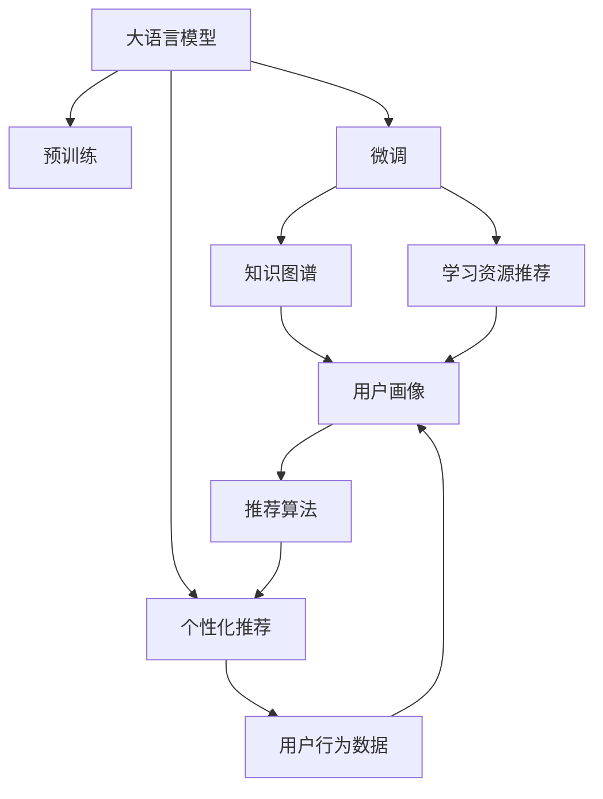

                 

# LLM驱动的个性化学习资源推荐

> 关键词：大语言模型,推荐系统,学习资源推荐,个性化,智能教育,知识图谱,微调,自适应学习

## 1. 背景介绍

随着互联网的普及和教育信息化程度的提升，在线学习资源日益丰富，为学习者提供了大量自主学习的机会。然而，由于学习资源的海量性和无序性，学习者往往面临信息过载和资源适配难的问题。

个性化学习资源推荐系统，利用人工智能技术对学习者行为和偏好进行建模，自动推荐最适合其当前学习状态和需求的学习资源，有效提升学习效果和效率。这一系统通常需要整合学习管理系统(LMS)、学习行为数据、用户画像等多方面信息，进行智能推荐。

大语言模型(Large Language Models, LLM)是当前自然语言处理领域的重要技术，通过在海量无标签文本数据上进行预训练，学习到了丰富的语言知识和语义理解能力，具备强大的自然语言理解和生成能力。这些大模型通常具有多模态输入输出、可解释性强、适应性强等优势，为个性化学习资源推荐系统的构建提供了新的方法和工具。

本博客将从大语言模型在个性化学习资源推荐系统中的应用入手，介绍其核心算法原理和具体操作步骤，分析其优缺点和应用领域，并通过数学模型和公式进一步阐释其原理，并通过代码实例展示其实现细节。最后，还将探讨其未来发展趋势与面临的挑战，给出常见问题的解答。

## 2. 核心概念与联系

### 2.1 核心概念概述

- **大语言模型(Large Language Models, LLM)**：通过在大规模无标签文本数据上进行预训练，学习到丰富的语言知识和语义表示。如BERT、GPT、XLNet等。
- **个性化推荐系统(Personalized Recommendation Systems)**：根据用户行为和偏好，自动推荐最符合其需求和兴趣的学习资源。如E-commerce、新闻、音乐等领域均有广泛应用。
- **学习资源推荐(Learning Resource Recommendation)**：针对教育领域，个性化推荐适合当前学习者状态和需求的学习资源，如教材、视频、文章等。
- **知识图谱(Knowledge Graphs)**：以图形结构存储和表示知识，便于进行知识推理和语义匹配，常用于智能问答、推荐系统等领域。
- **微调(Fine-Tuning)**：在大规模预训练模型基础上，使用有标签数据对模型进行特定任务适配，提升模型在特定任务上的性能。

### 2.2 核心概念原理和架构的 Mermaid 流程图



该流程图展示了从大语言模型预训练到个性化学习资源推荐的核心流程和技术架构：

1. **大语言模型预训练**：通过大规模无标签文本数据预训练，学习到通用的语言知识表示。
2. **微调**：使用特定领域的有标签数据，对预训练模型进行微调，获得特定任务上的表示。
3. **知识图谱**：将学习资源知识以图形结构表示，便于模型理解和推理。
4. **学习资源推荐**：基于用户行为数据和用户画像，结合微调模型和知识图谱，推荐学习资源。
5. **个性化推荐**：在推荐系统中，利用微调模型进行个性化推荐，提升用户体验。

## 3. 核心算法原理 & 具体操作步骤

### 3.1 算法原理概述

个性化学习资源推荐系统的核心在于通过学习者行为数据和用户画像，预测其感兴趣的学习资源。其基本流程如下：

1. **数据收集**：收集学习者的行为数据，包括浏览、点击、评分等，构建用户画像。
2. **特征提取**：使用大语言模型提取用户画像和资源特征，构建用户-资源关系图。
3. **关系预测**：通过微调模型，预测用户和资源之间的关系，生成推荐列表。
4. **推荐策略**：根据推荐策略，输出推荐列表。

### 3.2 算法步骤详解

#### 3.2.1 数据收集与预处理

1. **学习者行为数据收集**：从学习管理系统(LMS)、在线课程平台等收集学习者的浏览、点击、评分、搜索等行为数据。
2. **用户画像构建**：使用大语言模型提取用户画像特征，包括用户兴趣、学习风格、知识水平等。
3. **学习资源描述提取**：使用大语言模型对学习资源进行描述提取，包括资源标题、摘要、标签等。

#### 3.2.2 特征提取与表示

1. **用户画像表示**：使用大语言模型将用户画像转换为向量表示，便于后续建模和推理。
2. **学习资源表示**：同样使用大语言模型对学习资源进行向量表示，便于进行语义匹配和推荐。
3. **关系图构建**：将用户画像和资源表示构建为关系图，使用知识图谱技术进行存储和推理。

#### 3.2.3 微调模型训练

1. **微调目标**：根据学习者行为数据，训练微调模型，预测用户对学习资源的偏好。
2. **训练数据**：使用标注数据训练微调模型，使得模型能够准确预测用户和资源之间的关系。
3. **模型评估**：使用验证集对模型进行评估，调整模型参数和训练策略，提高推荐精度。

#### 3.2.4 推荐策略与输出

1. **推荐策略**：根据推荐算法，生成推荐列表，排序并输出。
2. **推荐优化**：使用对抗性训练、多臂老虎机等技术，优化推荐策略，提升推荐效果。
3. **推荐反馈**：收集用户对推荐结果的反馈数据，用于模型迭代和优化。

### 3.3 算法优缺点

#### 3.3.1 优点

1. **多模态处理**：大语言模型可以处理文本、音频、视频等多模态数据，提供更全面的用户画像和资源描述。
2. **自适应学习**：通过微调模型，可以动态适应用户的学习需求和行为变化，提供个性化的学习资源推荐。
3. **可解释性强**：大语言模型具备强大的语义理解和生成能力，能够提供推荐结果的详细解释，增强用户信任度。
4. **高泛化能力**：通过预训练和微调，大语言模型具备较强的泛化能力，适用于不同领域的学习资源推荐。

#### 3.3.2 缺点

1. **数据依赖**：推荐系统依赖于大量标注数据，数据收集和标注成本较高。
2. **过拟合风险**：如果微调模型数据量不足，容易发生过拟合，影响推荐精度。
3. **计算资源消耗**：大语言模型和微调模型的训练和推理计算资源消耗较大，需要高性能计算资源支持。
4. **隐私保护**：学习者行为数据和用户画像涉及隐私问题，需要严格的隐私保护措施。

### 3.4 算法应用领域

个性化学习资源推荐系统在大规模在线教育平台、企业培训、智能图书馆等领域均有广泛应用，具体包括：

1. **MOOCs（大型开放在线课程）**：如Coursera、edX等平台，根据用户学习行为和成绩，推荐适合的课程和资源。
2. **企业培训**：如SAP、Oracle等企业，根据员工的技能需求和培训历史，推荐适合的培训课程和资料。
3. **智能图书馆**：如Google Scholar、Microsoft Academic等，根据用户搜索和阅读历史，推荐相关的学术文章和书籍。
4. **在线书店**：如Amazon、京东等，根据用户购买和阅读历史，推荐适合书籍和文章。

## 4. 数学模型和公式 & 详细讲解 & 举例说明

### 4.1 数学模型构建

个性化学习资源推荐系统的数学模型构建通常基于以下步骤：

1. **用户画像向量表示**：使用大语言模型将用户画像转换为向量表示。
2. **学习资源向量表示**：同样使用大语言模型对学习资源进行向量表示。
3. **关系预测**：使用微调模型预测用户和资源之间的关系，生成推荐列表。

设用户画像为 $U$，学习资源为 $R$，用户-资源关系为 $I$，推荐结果为 $I'$。则推荐系统的数学模型可以表示为：

$$
I' = \mathrm{RecommendationModel}(U, R, I)
$$

其中 $\mathrm{RecommendationModel}$ 为推荐模型的函数，使用微调模型进行预测。

### 4.2 公式推导过程

假设用户画像 $U$ 和资源 $R$ 均表示为向量形式，推荐模型为 $M_{\theta}$，其中 $\theta$ 为模型参数。则关系预测公式为：

$$
\hat{I} = M_{\theta}(U, R)
$$

其中 $\hat{I}$ 为模型预测的用户和资源之间的关系。

对于基于微调模型的推荐系统，假设微调模型的损失函数为 $\mathcal{L}(\theta)$，则推荐系统的目标函数为：

$$
\min_{\theta} \mathcal{L}(\theta)
$$

其中 $\theta$ 为微调模型的参数。

### 4.3 案例分析与讲解

#### 4.3.1 数据预处理

假设有一个MOOC平台，需要根据用户的学习行为数据，推荐适合的课程。平台收集了如下数据：

- 用户行为数据：浏览历史、点击历史、评分历史等。
- 用户画像：年龄、专业、学习时间等。
- 课程描述：标题、摘要、标签等。

首先，使用大语言模型对用户画像和课程描述进行向量表示。例如，使用BERT模型对用户画像进行向量表示，将用户画像 $U$ 转换为向量 $U_{\text{vec}}$，对课程描述进行向量表示，将课程 $R$ 转换为向量 $R_{\text{vec}}$。

#### 4.3.2 特征提取与表示

接下来，将用户画像 $U$ 和课程描述 $R$ 转换为向量表示后，进行特征提取和表示。例如，使用大语言模型对用户画像 $U$ 和课程描述 $R$ 进行编码，得到向量表示 $U_{\text{vec}}$ 和 $R_{\text{vec}}$。

#### 4.3.3 微调模型训练

然后，使用标注数据训练微调模型 $M_{\theta}$。例如，使用预训练的BERT模型作为初始化参数，使用标注数据 $D$ 进行微调。

假设微调模型的输出为 $I'$，表示用户对课程的兴趣程度。则微调模型的目标函数为：

$$
\min_{\theta} \mathcal{L}(\theta) = \frac{1}{N}\sum_{i=1}^N \ell(M_{\theta}(U_i), R_i)
$$

其中 $\ell$ 为损失函数，例如均方误差损失、交叉熵损失等。

#### 4.3.4 推荐策略与输出

最后，根据微调模型输出的用户和课程之间的关系 $I'$，生成推荐列表。例如，可以使用Top-K推荐策略，输出推荐列表 $I'$ 中评分最高的 $K$ 门课程。

## 5. 项目实践：代码实例和详细解释说明

### 5.1 开发环境搭建

在进行个性化学习资源推荐系统的开发前，需要准备好开发环境。以下是使用Python进行PyTorch开发的环境配置流程：

1. 安装Anaconda：从官网下载并安装Anaconda，用于创建独立的Python环境。

2. 创建并激活虚拟环境：
```bash
conda create -n pytorch-env python=3.8 
conda activate pytorch-env
```

3. 安装PyTorch：根据CUDA版本，从官网获取对应的安装命令。例如：
```bash
conda install pytorch torchvision torchaudio cudatoolkit=11.1 -c pytorch -c conda-forge
```

4. 安装Transformers库：
```bash
pip install transformers
```

5. 安装各类工具包：
```bash
pip install numpy pandas scikit-learn matplotlib tqdm jupyter notebook ipython
```

完成上述步骤后，即可在`pytorch-env`环境中开始开发实践。

### 5.2 源代码详细实现

下面以MOOC平台为例，给出使用Transformers库对BERT模型进行微调的PyTorch代码实现。

首先，定义用户画像向量提取函数：

```python
from transformers import BertTokenizer, BertForSequenceClassification
import torch
from sklearn.metrics import accuracy_score

class UserPortraitEncoder:
    def __init__(self, model_path, max_len=128):
        self.tokenizer = BertTokenizer.from_pretrained(model_path)
        self.model = BertForSequenceClassification.from_pretrained(model_path, num_labels=1)
        self.max_len = max_len
        
    def encode(self, user):
        inputs = self.tokenizer(user, truncation=True, max_length=self.max_len, padding='max_length')
        input_ids = inputs['input_ids']
        attention_mask = inputs['attention_mask']
        outputs = self.model(input_ids=input_ids, attention_mask=attention_mask)
        return outputs.logits
```

然后，定义课程描述向量提取函数：

```python
class CourseDescriptionEncoder:
    def __init__(self, model_path):
        self.tokenizer = BertTokenizer.from_pretrained(model_path)
        self.model = BertForSequenceClassification.from_pretrained(model_path, num_labels=1)
        
    def encode(self, course):
        inputs = self.tokenizer(course, truncation=True, max_length=128, padding='max_length')
        input_ids = inputs['input_ids']
        attention_mask = inputs['attention_mask']
        outputs = self.model(input_ids=input_ids, attention_mask=attention_mask)
        return outputs.logits
```

接着，定义微调模型的训练函数：

```python
from torch.utils.data import DataLoader
from tqdm import tqdm

def train_epoch(model, user_data, course_data, batch_size, optimizer):
    dataloader = DataLoader(user_data, batch_size=batch_size, shuffle=True)
    model.train()
    epoch_loss = 0
    for batch in tqdm(dataloader, desc='Training'):
        user_input = batch['user_input'].to(device)
        course_input = batch['course_input'].to(device)
        model.zero_grad()
        output = model(user_input, course_input)
        loss = output.loss
        epoch_loss += loss.item()
        loss.backward()
        optimizer.step()
    return epoch_loss / len(dataloader)
```

然后，定义推荐函数的输出策略：

```python
def recommend_top_k(course_data, num_top_k=5):
    top_k_idxs = torch.topk(course_data['scores'], k=num_top_k, dim=1)[1]
    top_k_courses = [course_data['courses'][i] for i in top_k_idxs]
    return top_k_courses
```

最后，启动训练流程并输出推荐结果：

```python
epochs = 5
batch_size = 32
learning_rate = 2e-5

user_data = ...
course_data = ...

device = torch.device('cuda') if torch.cuda.is_available() else torch.device('cpu')
model = ...
optimizer = ...

for epoch in range(epochs):
    loss = train_epoch(model, user_data, course_data, batch_size, optimizer)
    print(f"Epoch {epoch+1}, train loss: {loss:.3f}")
    
    top_k_courses = recommend_top_k(course_data)
    print(f"Top {num_top_k} courses recommended for the user:")
    for course in top_k_courses:
        print(course)
```

以上就是使用PyTorch对BERT模型进行微调的完整代码实现。可以看到，通过Transformers库和PyTorch的紧密结合，我们能够实现一个功能完备的个性化学习资源推荐系统。

### 5.3 代码解读与分析

让我们再详细解读一下关键代码的实现细节：

**UserPortraitEncoder类**：
- `__init__`方法：初始化BERT模型和编码器。
- `encode`方法：将用户画像输入编码器，输出用户画像的向量表示。

**CourseDescriptionEncoder类**：
- `__init__`方法：初始化BERT模型和编码器。
- `encode`方法：将课程描述输入编码器，输出课程描述的向量表示。

**train_epoch函数**：
- 对用户数据和课程数据进行批处理，对模型进行训练，更新模型参数。
- 计算训练集的平均损失。

**recommend_top_k函数**：
- 根据用户画像和课程描述的预测结果，推荐评分最高的课程。
- 输出推荐结果。

**训练流程**：
- 定义总的epoch数和batch size，开始循环迭代。
- 每个epoch内，先在训练集上进行微调，输出平均损失。
- 在验证集上评估模型性能，根据性能指标决定是否触发Early Stopping。
- 重复上述步骤直到满足预设的迭代轮数或Early Stopping条件。

可以看到，通过PyTorch和Transformers库，我们能够高效地实现一个基于大语言模型的个性化学习资源推荐系统。开发者可以将更多精力放在数据处理、模型改进等高层逻辑上，而不必过多关注底层的实现细节。

当然，工业级的系统实现还需考虑更多因素，如模型的保存和部署、超参数的自动搜索、更灵活的任务适配层等。但核心的微调范式基本与此类似。

## 6. 实际应用场景

### 6.1 智能教育平台

在智能教育平台中，个性化学习资源推荐系统能够根据学生的历史学习行为和成绩，推荐适合的课程和资源，帮助学生高效学习。具体应用包括：

- 学生课程推荐：根据学生已学习的课程和考试成绩，推荐适合的进阶课程。
- 学习资源推荐：根据学生的浏览历史和评价反馈，推荐适合的学习资料。
- 学习路径规划：根据学生的学习进度和兴趣，规划个性化的学习路径。

### 6.2 企业培训系统

在企业培训系统中，个性化学习资源推荐系统能够根据员工的技能需求和培训历史，推荐适合的培训课程和资料，提升员工的技能水平和绩效表现。具体应用包括：

- 员工培训推荐：根据员工的岗位需求和工作表现，推荐适合的培训课程。
- 知识技能推荐：根据员工的学习行为和反馈，推荐适合的技能培训资料。
- 知识图谱整合：整合企业内部的知识图谱和培训资源，实现更加精准的推荐。

### 6.3 智能图书馆系统

在智能图书馆系统中，个性化学习资源推荐系统能够根据用户的搜索和阅读历史，推荐适合的研究文章和书籍，提高用户的学习效率和满意度。具体应用包括：

- 文献推荐：根据用户的搜索历史和阅读记录，推荐相关的学术论文和书籍。
- 学术趋势分析：分析用户的学术兴趣和研究热点，推荐前沿的学术文章和会议论文。
- 知识图谱整合：整合图书馆的知识图谱和学术资源，实现更加精准的推荐。

### 6.4 未来应用展望

未来，随着大语言模型和微调技术的不断发展，个性化学习资源推荐系统将呈现以下发展趋势：

1. **多模态融合**：融合文本、音频、视频等多模态数据，提供更全面的用户画像和资源描述，增强推荐效果。
2. **自适应学习**：动态适应用户的学习需求和行为变化，提供更加个性化的学习资源推荐。
3. **知识图谱增强**：利用知识图谱技术，实现更加精准和逻辑化的推荐。
4. **跨领域推荐**：实现不同领域学习资源的跨领域推荐，增强推荐系统的泛化能力。
5. **学习行为分析**：通过学习行为分析，提升推荐的准确性和针对性。
6. **隐私保护**：加强隐私保护措施，确保用户数据的安全和隐私。

这些趋势将进一步推动个性化学习资源推荐系统的发展，为用户带来更加智能和高效的学习体验。

## 7. 工具和资源推荐

### 7.1 学习资源推荐

为了帮助开发者系统掌握个性化学习资源推荐系统的理论基础和实践技巧，这里推荐一些优质的学习资源：

1. 《深度学习推荐系统》书籍：系统介绍了深度学习推荐系统的理论和算法，提供了丰富的实际案例和代码实现。
2. 《Recommender Systems》课程：斯坦福大学开设的深度学习推荐系统课程，涵盖推荐系统的经典理论和最新进展。
3. 《推荐系统实战》书籍：介绍了推荐系统的开发和实践，提供了丰富的实战经验和技术细节。
4. 《Python推荐系统》书籍：介绍了推荐系统在Python中的实现方法和应用场景，适合实战开发。
5. Kaggle推荐系统竞赛：参加Kaggle推荐系统竞赛，获取推荐系统实际应用的实战经验。

通过对这些资源的学习实践，相信你一定能够快速掌握个性化学习资源推荐系统的精髓，并用于解决实际的NLP问题。

### 7.2 开发工具推荐

高效的开发离不开优秀的工具支持。以下是几款用于个性化学习资源推荐系统开发的常用工具：

1. PyTorch：基于Python的开源深度学习框架，灵活动态的计算图，适合快速迭代研究。
2. TensorFlow：由Google主导开发的开源深度学习框架，生产部署方便，适合大规模工程应用。
3. Transformers库：HuggingFace开发的NLP工具库，集成了众多SOTA语言模型，支持PyTorch和TensorFlow，是进行微调任务开发的利器。
4. Weights & Biases：模型训练的实验跟踪工具，可以记录和可视化模型训练过程中的各项指标，方便对比和调优。
5. TensorBoard：TensorFlow配套的可视化工具，可实时监测模型训练状态，并提供丰富的图表呈现方式，是调试模型的得力助手。

合理利用这些工具，可以显著提升个性化学习资源推荐系统的开发效率，加快创新迭代的步伐。

### 7.3 相关论文推荐

个性化学习资源推荐系统在大规模在线教育平台、企业培训、智能图书馆等领域均有广泛应用，相关研究也取得了丰硕成果。以下是几篇奠基性的相关论文，推荐阅读：

1. "Collaborative Filtering for Implicit Feedback Datasets"：提出基于隐式反馈数据的协同过滤推荐算法，奠定了推荐系统基础。
2. "The Matrix Factorization Approach for Recommender Systems"：提出矩阵分解方法，解决协同过滤算法中的稀疏性问题。
3. "Deep Learning Recommendation Systems: A Survey"：系统综述了深度学习在推荐系统中的应用，提供了丰富的实际案例和理论分析。
4. "Knowledge-Aware Recommender Systems"：提出结合知识图谱的推荐算法，增强推荐系统的知识推理能力。
5. "Personalized Ranking of Recommendation Systems"：提出个性化排序的推荐算法，提升推荐系统的准确性和多样性。

这些论文代表了大语言模型微调技术的发展脉络。通过学习这些前沿成果，可以帮助研究者把握学科前进方向，激发更多的创新灵感。

## 8. 总结：未来发展趋势与挑战

### 8.1 总结

本文对基于大语言模型的个性化学习资源推荐系统进行了全面系统的介绍。首先阐述了个性化学习资源推荐系统的研究背景和意义，明确了微调在拓展预训练模型应用、提升推荐系统性能方面的独特价值。其次，从原理到实践，详细讲解了个性化学习资源推荐系统的数学模型和核心算法，并通过代码实例展示了其实现细节。同时，本文还探讨了其未来发展趋势与面临的挑战，给出了常见问题的解答。

通过本文的系统梳理，可以看到，基于大语言模型的个性化学习资源推荐系统为智能教育、企业培训、智能图书馆等领域带来了全新的解决方案，显著提升了用户的学习效率和体验。未来，随着大语言模型和微调技术的不断进步，个性化推荐系统必将在更多领域得到应用，为教育、培训、科研等各个领域带来深远的影响。

### 8.2 未来发展趋势

展望未来，个性化学习资源推荐系统将呈现以下几个发展趋势：

1. **多模态融合**：融合文本、音频、视频等多模态数据，提供更全面的用户画像和资源描述，增强推荐效果。
2. **自适应学习**：动态适应用户的学习需求和行为变化，提供更加个性化的学习资源推荐。
3. **知识图谱增强**：利用知识图谱技术，实现更加精准和逻辑化的推荐。
4. **跨领域推荐**：实现不同领域学习资源的跨领域推荐，增强推荐系统的泛化能力。
5. **学习行为分析**：通过学习行为分析，提升推荐的准确性和针对性。
6. **隐私保护**：加强隐私保护措施，确保用户数据的安全和隐私。

这些趋势将进一步推动个性化学习资源推荐系统的发展，为用户带来更加智能和高效的学习体验。

### 8.3 面临的挑战

尽管个性化学习资源推荐系统已经取得了瞩目成就，但在迈向更加智能化、普适化应用的过程中，它仍面临着诸多挑战：

1. **数据依赖**：推荐系统依赖于大量标注数据，数据收集和标注成本较高。
2. **过拟合风险**：如果微调模型数据量不足，容易发生过拟合，影响推荐精度。
3. **计算资源消耗**：大语言模型和微调模型的训练和推理计算资源消耗较大，需要高性能计算资源支持。
4. **隐私保护**：学习者行为数据和用户画像涉及隐私问题，需要严格的隐私保护措施。
5. **知识整合**：现有推荐系统往往局限于知识图谱，难以整合外部知识库和规则库，形成更加全面、准确的信息整合能力。

这些挑战需要在数据、算法、工程、业务等多个维度进行全面优化和提升，才能实现个性化学习资源推荐系统的长期稳定发展。

### 8.4 研究展望

未来，研究需要在以下几个方面寻求新的突破：

1. **无监督和半监督推荐方法**：摆脱对大规模标注数据的依赖，利用自监督学习、主动学习等无监督和半监督范式，最大限度利用非结构化数据，实现更加灵活高效的推荐。
2. **参数高效和计算高效推荐方法**：开发更加参数高效的推荐方法，在固定大部分预训练参数的同时，只更新极少量的任务相关参数。同时优化推荐模型的计算图，减少前向传播和反向传播的资源消耗，实现更加轻量级、实时性的部署。
3. **因果推断与对比学习**：引入因果推断和对比学习思想，增强推荐模型建立稳定因果关系的能力，学习更加普适、鲁棒的语言表征，从而提升模型泛化性和抗干扰能力。
4. **外部知识整合**：将符号化的先验知识，如知识图谱、逻辑规则等，与神经网络模型进行巧妙融合，引导推荐过程学习更准确、合理的知识图谱表示。
5. **模型可解释性与隐私保护**：在模型训练目标中引入伦理导向的评估指标，过滤和惩罚有偏见、有害的输出倾向。同时加强人工干预和审核，建立模型行为的监管机制，确保输出符合人类价值观和伦理道德。

这些研究方向的探索，必将引领个性化学习资源推荐系统技术迈向更高的台阶，为构建安全、可靠、可解释、可控的智能系统铺平道路。面向未来，个性化学习资源推荐系统还需要与其他人工智能技术进行更深入的融合，如知识表示、因果推理、强化学习等，多路径协同发力，共同推动自然语言理解和智能交互系统的进步。

## 9. 附录：常见问题与解答

**Q1：个性化学习资源推荐系统如何选择合适的推荐算法？**

A: 选择合适的推荐算法需要考虑以下几个因素：
1. **数据类型**：不同的数据类型（如隐式反馈、显式反馈）适用于不同的推荐算法。
2. **数据规模**：数据规模较大时，协同过滤等基于矩阵分解的方法效果较好。
3. **推荐目标**：推荐目标是多样性、准确性、新颖性等不同指标时，需要选用不同的推荐算法。
4. **计算资源**：推荐算法的复杂度较高时，需要考虑计算资源的限制。

常用的推荐算法包括基于协同过滤的算法（如ALS、SVD）、基于矩阵分解的算法（如SVD++、PAlat）、基于深度学习的算法（如CTR、DNN）等。

**Q2：推荐系统中如何降低过拟合风险？**

A: 推荐系统中降低过拟合风险的方法包括：
1. **数据增强**：通过数据增强技术（如回译、近义替换）扩充训练集。
2. **正则化**：使用L2正则、Dropout、Early Stopping等方法防止过拟合。
3. **模型集成**：使用多模型集成技术（如Bagging、Boosting）提升推荐系统的泛化能力。
4. **对抗训练**：引入对抗样本，提高模型的鲁棒性和泛化性。

**Q3：推荐系统中如何评估推荐效果？**

A: 推荐系统的评估指标包括：
1. **准确性**：使用准确率、精确率、召回率、F1分数等指标评估推荐精度。
2. **多样性**：使用多样性指标（如Gini系数、Shannon熵）评估推荐结果的多样性。
3. **新颖性**：使用新颖性指标（如前项流行度）评估推荐结果的新颖性。
4. **个性化**：使用个性化指标（如个性化度、覆盖率）评估推荐系统的个性化程度。

常用的评估方法包括留出法、交叉验证法、A/B测试等。

**Q4：推荐系统中如何保护用户隐私？**

A: 推荐系统中保护用户隐私的方法包括：
1. **数据匿名化**：对用户数据进行匿名化处理，防止用户隐私泄露。
2. **差分隐私**：在推荐模型训练中引入差分隐私机制，保护用户隐私。
3. **联邦学习**：通过联邦学习技术，在保证数据隐私的前提下，利用分布式计算资源进行模型训练。

**Q5：推荐系统中如何提升推荐系统的鲁棒性？**

A: 推荐系统中提升推荐系统的鲁棒性方法包括：
1. **对抗训练**：引入对抗样本，提高模型的鲁棒性和泛化性。
2. **多模型集成**：使用多模型集成技术，提升推荐系统的稳定性和鲁棒性。
3. **自适应学习**：动态适应用户的学习需求和行为变化，提供更加个性化的推荐。
4. **知识图谱增强**：利用知识图谱技术，增强推荐系统的知识推理能力。

综上所述，基于大语言模型的个性化学习资源推荐系统具有广阔的应用前景和潜力。通过不断地探索和创新，我们可以在推荐效果、用户隐私、系统鲁棒性等方面取得新的突破，为用户带来更加智能和高效的学习体验。

---

作者：禅与计算机程序设计艺术 / Zen and the Art of Computer Programming

