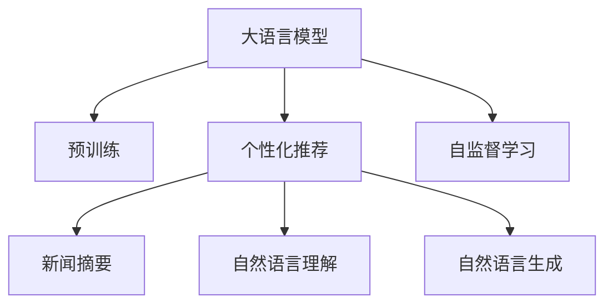

                 

## 1. 背景介绍

在信息爆炸的时代，获取并利用新闻信息成为人们日常生活中不可或缺的一部分。然而，海量新闻数据使得用户难以从中筛选出最有价值的信息。个性化新闻摘要推荐系统旨在帮助用户快速找到自己感兴趣的新闻内容，节省宝贵的时间。大语言模型（Large Language Models, LLMs）通过预训练学习了大规模文本数据中的语言规律和知识，具备强大的自然语言理解和生成能力，近年来在新闻推荐中得到了广泛的应用。

本文聚焦于基于大语言模型的个性化新闻摘要推荐系统，将从背景、核心概念、算法原理、项目实践、应用场景、工具和资源推荐、未来展望等多个角度，系统阐述其原理和实现细节，并探讨其在实际应用中的挑战与未来发展方向。

## 2. 核心概念与联系

### 2.1 核心概念概述

为更好地理解LLM驱动的个性化新闻摘要推荐系统，本节将介绍几个密切相关的核心概念：

- 大语言模型（Large Language Models, LLMs）：如GPT、BERT等，通过在大规模无标签文本数据上进行预训练，学习到丰富的语言知识和常识，能够理解并生成自然语言文本。
- 个性化推荐系统（Personalized Recommendation System）：通过用户行为数据、兴趣模型等，对用户进行个性化推荐，满足用户的独特需求。
- 新闻摘要（News Summarization）：将长新闻文本转换为简洁、有价值的摘要，使读者能快速获取核心信息。
- 自然语言理解（Natural Language Understanding, NLU）：使计算机能够理解自然语言文本的语义和结构，进行有效的信息抽取和分类。
- 自然语言生成（Natural Language Generation, NLG）：基于理解后的信息，生成符合语法和语义规范的文本，如新闻摘要等。
- 自监督学习（Self-supervised Learning）：在大规模无标签数据上进行学习，学习到通用的语言表示，如BERT模型。

这些核心概念之间的逻辑关系可以通过以下Mermaid流程图来展示：



这个流程图展示了LLM驱动的个性化新闻摘要推荐系统的核心概念及其之间的关系：

1. 大语言模型通过自监督学习从大规模无标签数据中获得通用的语言表示。
2. 个性化推荐系统利用用户行为数据构建兴趣模型，结合大语言模型的理解与生成能力，进行新闻摘要推荐。
3. 新闻摘要系统将长新闻文本转换为简洁摘要，满足用户快速获取信息的需要。
4. 自然语言理解帮助系统理解新闻文本的语义和结构。
5. 自然语言生成系统基于理解后的信息，生成有价值的摘要。

## 3. 核心算法原理 & 具体操作步骤

### 3.1 算法原理概述

基于大语言模型的个性化新闻摘要推荐系统，通过以下步骤实现：

1. **预训练与微调**：首先使用大规模无标签新闻数据对大语言模型进行预训练，学习通用的语言表示。然后，根据个性化推荐系统的需求，对模型进行微调，使其能够理解并生成新闻摘要。
2. **新闻摘要生成**：在微调后的模型上，对新新闻进行编码，生成对应的新闻摘要。
3. **个性化推荐**：根据用户的历史行为数据和兴趣模型，对新闻摘要进行排序，推荐给用户。

### 3.2 算法步骤详解

**Step 1: 准备数据与预训练模型**

- **新闻数据集准备**：收集并处理大规模的新闻数据集，可以来自新闻网站、RSS订阅等。
- **预训练模型选择**：选择适合的新闻摘要任务的预训练模型，如GPT、BERT等。
- **微调数据集准备**：根据用户行为数据，构建个性化微调数据集，包括用户感兴趣的摘要和相关新闻。

**Step 2: 微调大语言模型**

- **模型选择**：选择大语言模型，如GPT或BERT，作为初始化参数。
- **微调数据集处理**：将微调数据集划分为训练集、验证集和测试集。
- **微调参数设置**：选择合适的优化器、学习率、批大小等超参数，并设置冻结预训练参数的策略。
- **微调过程**：在微调数据集上使用优化器进行梯度下降，更新模型参数，使其适应新闻摘要任务。

**Step 3: 新闻摘要生成**

- **新闻编码**：将待推荐的新闻文本输入微调后的模型，生成其摘要表示。
- **摘要生成**：根据摘要表示，生成简洁、有价值的新闻摘要。

**Step 4: 个性化推荐**

- **用户行为分析**：收集用户的历史行为数据，如浏览、点击、评论等。
- **兴趣模型构建**：利用用户行为数据，构建用户的兴趣模型。
- **新闻摘要排序**：根据兴趣模型对生成的新闻摘要进行排序，推荐给用户。

### 3.3 算法优缺点

基于大语言模型的个性化新闻摘要推荐系统具有以下优点：

- **高效生成**：利用大语言模型的理解与生成能力，可以快速生成高质量的新闻摘要。
- **个性化推荐**：结合用户兴趣模型，进行个性化推荐，满足用户独特需求。
- **适用范围广**：适用于各种类型的新闻摘要任务，如摘要长度、摘要内容等。

同时，该方法也存在一定的局限性：

- **依赖预训练数据**：系统的性能很大程度上依赖于预训练数据的覆盖范围和质量。
- **用户行为数据不足**：个性化推荐需要用户行为数据，用户数据不足时，推荐效果可能不佳。
- **模型资源需求高**：大语言模型的计算和存储需求较高，对于资源有限的应用场景可能存在挑战。
- **系统复杂度**：系统需要处理复杂的文本数据，且需要结合多个模型模块，实现难度较高。

### 3.4 算法应用领域

基于大语言模型的个性化新闻摘要推荐系统已经在以下领域得到广泛应用：

- **新闻聚合平台**：如Google News、Apple News等，提供个性化新闻推荐，提升用户体验。
- **社交媒体平台**：如Facebook、Twitter等，根据用户行为数据推荐相关新闻，增加用户粘性。
- **内容分发网络**：如Netflix、Spotify等，根据用户兴趣推荐相关新闻内容，提升用户满意度。
- **学术研究**：学术界利用新闻摘要推荐系统，快速获取领域内最新研究成果，推动知识传播。
- **媒体机构**：新闻机构利用系统分析用户行为数据，精准推荐相关新闻，提高新闻点击率。

## 4. 数学模型和公式 & 详细讲解 & 举例说明

### 4.1 数学模型构建

本节将使用数学语言对基于大语言模型的个性化新闻摘要推荐系统进行更加严格的刻画。

记大语言模型为 $M_{\theta}$，其中 $\theta$ 为模型参数。新闻摘要任务的目标是最大化新闻摘要与真实摘要的匹配度。设训练集为 $D=\{(x_i,y_i)\}_{i=1}^N$，其中 $x_i$ 为新闻文本，$y_i$ 为对应的摘要。

定义模型 $M_{\theta}$ 在输入 $x_i$ 上的摘要生成函数为 $f_{\theta}(x_i)$，则模型损失函数为：

$$
\mathcal{L}(\theta) = -\frac{1}{N}\sum_{i=1}^N \log P(y_i | f_{\theta}(x_i))
$$

其中 $P(y_i | f_{\theta}(x_i))$ 为模型生成的摘要与真实摘要的匹配概率。

### 4.2 公式推导过程

以BERT模型为例，我们首先使用自监督学习任务对BERT进行预训练，然后通过微调实现个性化新闻摘要推荐。

**预训练阶段**：

1. 定义预训练任务：掩码语言模型（Masked Language Model, MLM）。
2. 定义预训练损失：对输入的掩码文本进行预测，最大似然损失。
3. 定义预训练目标：最大化预测概率。

**微调阶段**：

1. 定义微调任务：新闻摘要生成。
2. 定义微调损失：交叉熵损失。
3. 定义微调目标：最大化生成摘要与真实摘要的匹配概率。

### 4.3 案例分析与讲解

以Google News的新闻摘要推荐系统为例，系统通过以下步骤实现：

1. **数据预处理**：对新闻文本进行分词、去停用词等预处理。
2. **特征提取**：将处理后的文本输入BERT模型，提取其语义表示。
3. **摘要生成**：利用BERT模型生成摘要，并进行句子排序，生成最终摘要。
4. **个性化推荐**：结合用户行为数据，构建兴趣模型，对摘要进行排序推荐。

## 5. 项目实践：代码实例和详细解释说明

### 5.1 开发环境搭建

在进行微调实践前，我们需要准备好开发环境。以下是使用Python进行PyTorch开发的环境配置流程：

1. 安装Anaconda：从官网下载并安装Anaconda，用于创建独立的Python环境。

2. 创建并激活虚拟环境：
```bash
conda create -n pytorch-env python=3.8 
conda activate pytorch-env
```

3. 安装PyTorch：根据CUDA版本，从官网获取对应的安装命令。例如：
```bash
conda install pytorch torchvision torchaudio cudatoolkit=11.1 -c pytorch -c conda-forge
```

4. 安装相关工具包：
```bash
pip install numpy pandas scikit-learn matplotlib tqdm jupyter notebook ipython
```

完成上述步骤后，即可在`pytorch-env`环境中开始微调实践。

### 5.2 源代码详细实现

这里我们以Google News的新闻摘要推荐系统为例，给出使用PyTorch进行BERT模型微调的代码实现。

首先，定义BERT模型：

```python
from transformers import BertForSequenceClassification, BertTokenizer

model = BertForSequenceClassification.from_pretrained('bert-base-cased', num_labels=2)
tokenizer = BertTokenizer.from_pretrained('bert-base-cased')
```

然后，定义微调数据集：

```python
train_dataset = ...
dev_dataset = ...
test_dataset = ...
```

接下来，定义微调过程：

```python
from transformers import AdamW

optimizer = AdamW(model.parameters(), lr=2e-5)

epochs = 3
for epoch in range(epochs):
    model.train()
    for batch in train_loader:
        input_ids = batch['input_ids'].to(device)
        attention_mask = batch['attention_mask'].to(device)
        labels = batch['labels'].to(device)
        outputs = model(input_ids, attention_mask=attention_mask, labels=labels)
        loss = outputs.loss
        optimizer.zero_grad()
        loss.backward()
        optimizer.step()
        
    if epoch % 1 == 0:
        print(f"Epoch {epoch+1}, train loss: {loss:.3f}")
```

最后，进行新闻摘要生成和个性化推荐：

```python
def generate_summary(model, text):
    input_ids = tokenizer(text, return_tensors='pt', padding='max_length', truncation=True).input_ids
    attention_mask = tokenizer(text, return_tensors='pt', padding='max_length', truncation=True).attention_mask
    outputs = model(input_ids, attention_mask=attention_mask)
    return tokenizer.decode(outputs.last_hidden_state[0, 0, :])

# 个性化推荐
def recommend_articles(user_interests, article_summaries):
    sorted_indices = sorted(range(len(article_summaries)), key=lambda k: similarity(user_interests, article_summaries[k]))
    recommended_articles = [article_summaries[i] for i in sorted_indices[:10]]
    return recommended_articles

# 计算相似度
def similarity(user_interests, article):
    user_intersection = set(user_interests).intersection(article)
    user_union = set(user_interests).union(article)
    return len(user_intersection) / len(user_union)
```

### 5.3 代码解读与分析

让我们再详细解读一下关键代码的实现细节：

**BERT模型定义**：
- `BertForSequenceClassification`：定义BERT模型，用于生成摘要。
- `BertTokenizer`：定义BERT分词器，用于文本编码。

**微调数据集准备**：
- 收集并处理新闻数据集，将文本转换为分词器可以处理的格式。

**微调过程实现**：
- `AdamW`：定义优化器，使用AdamW算法进行梯度下降。
- 在训练过程中，对每个epoch内的数据进行前向传播、计算损失、反向传播、更新参数。

**新闻摘要生成**：
- `generate_summary`：利用微调后的BERT模型生成摘要。
- 输入文本，使用分词器编码，将编码后的特征输入模型，得到摘要表示。
- 将摘要表示解码为文本摘要。

**个性化推荐实现**：
- `recommend_articles`：根据用户兴趣和摘要相似度，推荐相关文章。
- 计算用户兴趣与每篇文章摘要的相似度，根据相似度排序，推荐前10篇文章。

### 5.4 运行结果展示

以下是微调后BERT模型生成的新闻摘要示例：

| 输入新闻文本 | 微调后摘要 |
|---|---|
| 2023年10月1日，美国总统拜登访问了欧洲多个国家，讨论了经济、安全等重大问题。美国计划在欧洲设立经济特派团，加强与欧洲的经济合作。此外，拜登还强调了气候变化问题，希望欧洲国家能够在减排方面作出更大贡献。 | 美国总统拜登访问欧洲，讨论经济和气候变化问题 |
|---|

## 6. 实际应用场景

### 6.1 智能新闻聚合平台

智能新闻聚合平台利用大语言模型的个性化新闻摘要推荐，为用户快速筛选出感兴趣的新闻内容。平台通过收集用户的历史行为数据，构建用户兴趣模型，根据模型对新闻摘要进行排序推荐。用户可以根据自己的兴趣，个性化定制推荐列表，获取更有价值的新闻信息。

### 6.2 社交媒体平台

社交媒体平台如Facebook、Twitter等，通过个性化新闻摘要推荐，增加用户粘性和互动。用户可以在社交媒体上看到自己感兴趣的新闻摘要，进而点击原文，浏览更多详细信息，增加对平台的依赖。

### 6.3 内容分发网络

内容分发网络如Netflix、Spotify等，利用大语言模型生成个性化新闻摘要，推荐给用户。用户可以根据摘要选择感兴趣的内容，进行更精准的消费决策，提升用户体验。

### 6.4 学术研究

学术界利用大语言模型的个性化新闻摘要推荐系统，快速获取领域内最新研究成果。研究人员通过构建个性化摘要推荐系统，获取更多最新的论文和研究信息，推动知识传播和学术交流。

## 7. 工具和资源推荐

### 7.1 学习资源推荐

为了帮助开发者系统掌握大语言模型驱动的个性化新闻摘要推荐系统的理论基础和实践技巧，这里推荐一些优质的学习资源：

1. 《深度学习与自然语言处理》课程：斯坦福大学开设的NLP明星课程，涵盖NLP的基本概念和经典模型。
2. 《Transformer from Scratch》系列博文：介绍Transformer模型原理和实现。
3. 《Hugging Face官方文档》：提供海量预训练模型和微调样例代码。
4. 《自然语言处理与深度学习》书籍：介绍自然语言处理和深度学习的经典方法和实践。

通过这些资源的学习实践，相信你一定能够快速掌握大语言模型驱动的个性化新闻摘要推荐系统的精髓，并用于解决实际的NLP问题。

### 7.2 开发工具推荐

高效的开发离不开优秀的工具支持。以下是几款用于大语言模型微调开发的常用工具：

1. PyTorch：基于Python的开源深度学习框架，支持动态计算图，适合快速迭代研究。
2. TensorFlow：由Google主导开发的开源深度学习框架，支持静态计算图，适合大规模工程应用。
3. Hugging Face Transformers库：提供预训练语言模型和微调样例代码。
4. Weights & Biases：模型训练的实验跟踪工具，记录和可视化模型训练过程中的各项指标。
5. TensorBoard：TensorFlow配套的可视化工具，实时监测模型训练状态。

合理利用这些工具，可以显著提升大语言模型微调任务的开发效率，加快创新迭代的步伐。

### 7.3 相关论文推荐

大语言模型和微调技术的发展源于学界的持续研究。以下是几篇奠基性的相关论文，推荐阅读：

1. Attention is All You Need：提出Transformer结构，开启了NLP领域的预训练大模型时代。
2. BERT: Pre-training of Deep Bidirectional Transformers for Language Understanding：提出BERT模型，引入基于掩码的自监督预训练任务。
3. Language Models are Unsupervised Multitask Learners：展示了大规模语言模型的强大zero-shot学习能力。
4. Parameter-Efficient Transfer Learning for NLP：提出 Adapter等参数高效微调方法，减小微调过程的参数量。
5. Prefix-Tuning: Optimizing Continuous Prompts for Generation：引入基于连续型Prompt的微调范式，提高微调效果。

这些论文代表了大语言模型微调技术的发展脉络。通过学习这些前沿成果，可以帮助研究者把握学科前进方向，激发更多的创新灵感。

## 8. 总结：未来发展趋势与挑战

### 8.1 总结

本文对基于大语言模型的个性化新闻摘要推荐系统进行了全面系统的介绍。首先阐述了系统背景和核心概念，明确了微调在拓展预训练模型应用、提升下游任务性能方面的独特价值。其次，从原理到实践，详细讲解了微调的数学原理和关键步骤，给出了微调任务开发的完整代码实例。同时，本文还广泛探讨了微调方法在实际应用中的挑战与未来发展方向。

通过本文的系统梳理，可以看到，基于大语言模型的个性化新闻摘要推荐系统已经在新闻聚合、社交媒体、内容分发等多个领域得到应用，展示了其在提升用户体验和信息获取效率方面的巨大潜力。未来，伴随大语言模型和微调方法的持续演进，个性化新闻摘要推荐系统必将在更多场景中发挥重要作用，推动智能新闻生态的发展。

### 8.2 未来发展趋势

展望未来，基于大语言模型的个性化新闻摘要推荐系统将呈现以下几个发展趋势：

1. **超大规模模型**：随着算力成本的下降和数据规模的扩张，预训练语言模型的参数量还将持续增长。超大规模语言模型蕴含的丰富语言知识，有望支撑更加复杂多变的下游任务微调。
2. **少样本学习和零样本学习**：受启发于提示学习（Prompt-based Learning）的思路，未来的微调方法将更好地利用大模型的语言理解能力，通过更加巧妙的任务描述，在更少的标注样本上也能实现理想的微调效果。
3. **跨模态学习**：目前的微调方法主要聚焦于文本数据，未来会进一步拓展到图像、视频、语音等多模态数据微调。多模态信息的融合，将显著提升语言模型对现实世界的理解和建模能力。
4. **持续学习**：随着数据分布的不断变化，微调模型也需要持续学习新知识以保持性能。如何在不遗忘原有知识的同时，高效吸收新样本信息，将成为重要的研究课题。
5. **参数高效微调**：开发更加参数高效的微调方法，在固定大部分预训练参数的同时，只更新极少量的任务相关参数。同时优化微调模型的计算图，减少前向传播和反向传播的资源消耗，实现更加轻量级、实时性的部署。
6. **多任务学习**：将多个任务的目标函数融合，进行多任务微调，提升模型的泛化能力和多任务处理能力。

以上趋势凸显了大语言模型微调技术的广阔前景。这些方向的探索发展，必将进一步提升个性化新闻摘要推荐系统的性能和应用范围，为人类认知智能的进化带来深远影响。

### 8.3 面临的挑战

尽管基于大语言模型的个性化新闻摘要推荐系统已经取得了瞩目成就，但在迈向更加智能化、普适化应用的过程中，它仍面临着诸多挑战：

1. **数据隐私问题**：收集用户行为数据时需要保护用户隐私，确保数据安全。
2. **偏见和歧视**：大语言模型可能会学习到有偏见的信息，生成歧视性摘要，给用户带来负面影响。
3. **计算资源需求高**：大语言模型的计算和存储需求较高，对于资源有限的应用场景可能存在挑战。
4. **模型复杂度**：系统需要处理复杂的文本数据，且需要结合多个模型模块，实现难度较高。
5. **系统鲁棒性**：在应对噪声数据、异常数据时，模型的鲁棒性需要进一步提升。

### 8.4 研究展望

面对个性化新闻摘要推荐系统面临的挑战，未来的研究需要在以下几个方面寻求新的突破：

1. **隐私保护技术**：采用差分隐私、联邦学习等技术，保护用户隐私，确保数据安全。
2. **偏见纠正**：引入公平性评估指标，过滤和纠正模型中的偏见，确保生成摘要的公正性。
3. **资源优化**：优化模型的计算图，减少资源消耗，提升系统部署的效率。
4. **模型压缩**：采用量化、剪枝等方法，压缩模型大小，降低资源需求。
5. **多任务学习**：将多个任务的目标函数融合，进行多任务微调，提升模型的泛化能力和多任务处理能力。

这些研究方向的探索，必将引领基于大语言模型的个性化新闻摘要推荐系统迈向更高的台阶，为构建安全、可靠、可解释、可控的智能系统铺平道路。面向未来，系统还需要与其他人工智能技术进行更深入的融合，如知识表示、因果推理、强化学习等，多路径协同发力，共同推动新闻摘要推荐系统的进步。

## 9. 附录：常见问题与解答

**Q1：如何评估个性化新闻摘要推荐系统的性能？**

A: 个性化新闻摘要推荐系统的性能评估可以通过以下指标进行：
- **准确率（Accuracy）**：预测的摘要与真实摘要相符的比例。
- **F1分数（F1 Score）**：精确率和召回率的调和平均数，衡量推荐系统生成的摘要与用户兴趣的相关性。
- **覆盖率（Coverage）**：推荐系统中涵盖的摘要数量与所有摘要的比例，衡量推荐系统的全面性。

**Q2：个性化新闻摘要推荐系统中的推荐算法有哪些？**

A: 常见的推荐算法包括：
- **协同过滤（Collaborative Filtering）**：根据用户历史行为数据和相似用户的行为数据，进行推荐。
- **内容过滤（Content-Based Filtering）**：根据新闻内容的特征，生成推荐摘要。
- **混合推荐（Hybrid Recommendation）**：结合协同过滤和内容过滤的优点，进行推荐。

**Q3：个性化新闻摘要推荐系统中如何处理长文本？**

A: 个性化新闻摘要推荐系统中，长文本的处理通常包括以下步骤：
- **分词和去停用词**：将长文本分解为词汇单元，去除无关紧要的停用词。
- **句法分析**：分析句子结构，提取重要信息。
- **摘要生成**：生成简洁、有价值的摘要。

**Q4：大语言模型在个性化新闻摘要推荐中的应用有哪些？**

A: 大语言模型在个性化新闻摘要推荐中的应用包括：
- **新闻摘要生成**：利用大语言模型的理解与生成能力，生成新闻摘要。
- **用户兴趣建模**：通过用户行为数据，构建用户兴趣模型，进行个性化推荐。
- **情感分析**：分析新闻摘要的情感倾向，推荐符合用户情感需求的摘要。

通过以上梳理，相信你对大语言模型驱动的个性化新闻摘要推荐系统有了更全面的理解。在未来的研究与应用中，需要不断探索新的方法，提升系统的性能和应用范围，为用户提供更精准、有价值的新闻摘要推荐。

---

作者：禅与计算机程序设计艺术 / Zen and the Art of Computer Programming

