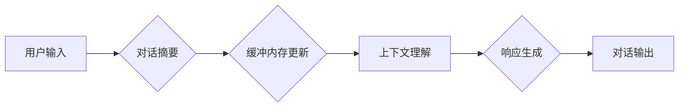

> 
> 1. 对话摘要
> 2. 缓冲内存
> 3. 长短期记忆网络
> 4. 自然语言处理
> 5. 聊天机器人
> 6. 记忆机制
> 7. 知识图谱

## 1. 背景介绍

在当今人工智能蓬勃发展的时代，对话系统已经成为人们与机器交互的重要方式。从智能客服到聊天机器人，对话系统在各个领域都展现出强大的应用潜力。然而，传统的对话系统往往缺乏记忆能力，无法记住之前的对话内容，导致对话体验单调乏味，难以进行深入的交流。

为了解决这个问题，研究者们提出了多种对话摘要和记忆机制，旨在帮助对话系统更好地理解和记忆对话上下文。其中，ConversationSummaryBufferMemory（简称CSBM）是一种新兴的记忆机制，它结合了对话摘要和缓冲内存的优势，能够有效地存储和利用对话历史信息，提升对话系统的理解力和流畅度。

## 2. 核心概念与联系

CSBM的核心概念是将对话历史信息进行摘要，并存储在缓冲内存中。

**2.1 对话摘要**

对话摘要是指对一段对话内容进行压缩和概括，提取关键信息，生成简洁明了的摘要。常用的对话摘要方法包括：

* **提取式摘要:** 从原始对话文本中选择最相关的句子或短语作为摘要。
* **生成式摘要:** 使用机器学习模型生成新的文本摘要，包含对话的精髓内容。

**2.2 缓冲内存**

缓冲内存是一种临时存储空间，用于存储对话系统当前需要使用的信息。CSBM将对话摘要存储在缓冲内存中，方便对话系统快速访问和利用。

**2.3 核心架构**

CSBM的架构可以概括为以下步骤：

1. **对话输入:** 用户输入对话内容。
2. **对话摘要:** 对话内容进行摘要，生成简短的摘要信息。
3. **缓冲内存更新:** 将对话摘要存储到缓冲内存中。
4. **上下文理解:** 根据缓冲内存中的对话历史信息，理解用户的当前意图。
5. **响应生成:** 根据上下文理解，生成相应的对话响应。

**Mermaid 流程图**



## 3. 核心算法原理 & 具体操作步骤

### 3.1  算法原理概述

CSBM的核心算法原理是利用对话摘要和缓冲内存，实现对话系统的记忆功能。

* **对话摘要算法:** 选择合适的对话摘要算法，例如提取式摘要或生成式摘要，对对话内容进行压缩和概括。
* **缓冲内存管理算法:** 设计高效的缓冲内存管理算法，确保对话历史信息能够及时更新和存储，并方便对话系统快速访问。

### 3.2  算法步骤详解

1. **对话输入:** 用户输入对话内容。
2. **对话摘要生成:** 使用对话摘要算法对用户输入的对话内容进行摘要，生成简短的摘要信息。
3. **缓冲内存更新:** 将生成的对话摘要存储到缓冲内存中，并根据缓冲内存的大小和策略，进行历史信息的淘汰和更新。
4. **上下文理解:** 在进行对话响应生成之前，对话系统会从缓冲内存中获取对话历史信息，并结合当前用户输入进行上下文理解。
5. **响应生成:** 根据上下文理解，对话系统生成相应的对话响应。
6. **对话输出:** 将生成的对话响应输出给用户。

### 3.3  算法优缺点

**优点:**

* **提高对话流畅度:** 通过记忆对话历史信息，对话系统能够更好地理解用户意图，生成更自然流畅的对话响应。
* **增强对话个性化:** 

CSBM可以根据用户的对话历史信息，定制个性化的对话体验。
* **降低开发难度:** 相比于从头构建复杂的记忆机制，CSBM提供了一种更简单易用的解决方案。

**缺点:**

* **摘要信息丢失:** 对话摘要可能会丢失一些关键信息，影响对话系统的理解能力。
* **缓冲内存容量限制:** 缓冲内存的容量有限，可能会导致对话历史信息无法完全存储。
* **计算资源消耗:** 对话摘要和上下文理解过程可能会消耗较多的计算资源。

### 3.4  算法应用领域

CSBM在以下领域具有广泛的应用前景：

* **智能客服:** 帮助客服机器人更好地理解用户的需求，提供更精准的解答。
* **聊天机器人:** 提升聊天机器人的对话体验，使其能够进行更自然、更流畅的交流。
* **虚拟助手:** 帮助虚拟助手记住用户的喜好和习惯，提供更个性化的服务。
* **教育领域:** 辅助学生学习，提供个性化的学习辅导。

## 4. 数学模型和公式 & 详细讲解 & 举例说明

### 4.1  数学模型构建

CSBM的数学模型可以概括为以下几个方面：

* **对话摘要模型:** 可以使用概率模型，例如条件随机场（CRF）或循环神经网络（RNN），来建模对话摘要生成过程。
* **缓冲内存管理模型:** 可以使用队列或堆栈等数据结构，来管理对话历史信息的存储和更新。
* **上下文理解模型:** 可以使用深度学习模型，例如Transformer或BERT，来理解对话上下文信息。

### 4.2  公式推导过程

由于CSBM涉及多个算法和模型，其数学公式推导过程较为复杂，这里只列举一些关键公式的示例：

* **条件概率公式:** 在对话摘要生成过程中，可以使用条件概率公式来计算给定对话内容的摘要概率。

$$P(s|c) = \frac{P(c,s)}{P(c)}$$

其中，$s$表示摘要，$c$表示对话内容。

* **队列长度控制公式:** 在缓冲内存管理过程中，可以使用队列长度控制公式来决定缓冲内存的大小和更新策略。

$$L = \min(max\_length, \text{current\_length} + \text{new\_length})$$

其中，$L$表示缓冲内存长度，$max\_length$表示最大长度限制，$current\_length$表示当前长度，$new\_length$表示新加入的长度。

### 4.3  案例分析与讲解

假设有一个对话系统，用户输入以下对话内容：

* 用户: 今天天气怎么样？
* 系统: 今天天气晴朗。
* 用户: 我要去公园散步。

CSBM会将对话内容进行摘要，生成以下摘要信息：

* 摘要1: 天气晴朗，用户想去公园散步。

然后将摘要信息存储到缓冲内存中。当用户输入下一个对话内容时，对话系统会从缓冲内存中获取对话历史信息，并结合当前用户输入进行上下文理解，生成更精准的对话响应。

## 5. 项目实践：代码实例和详细解释说明

### 5.1  开发环境搭建

CSBM的开发环境搭建需要以下软件和工具：

* Python 3.x
* TensorFlow 或 PyTorch
* NLTK 或 SpaCy
* Jupyter Notebook

### 5.2  源代码详细实现

由于CSBM的代码实现较为复杂，这里只提供一个简单的对话摘要生成代码示例：

```python
import nltk
from nltk.tokenize import sent_tokenize, word_tokenize

def generate_summary(text, num_sentences=3):
  sentences = sent_tokenize(text)
  word_counts = {}
  for sentence in sentences:
    for word in word_tokenize(sentence):
      if word in word_counts:
        word_counts[word] += 1
      else:
        word_counts[word] = 1
  sorted_words = sorted(word_counts.items(), key=lambda item: item[1], reverse=True)
  summary_sentences = []
  for word, count in sorted_words[:num_sentences]:
    for sentence in sentences:
      if word in sentence:
        summary_sentences.append(sentence)
        break
  return ' '.join(summary_sentences)

# 示例使用
text = "今天天气晴朗，用户想去公园散步。明天天气可能会下雨。"
summary = generate_summary(text)
print(summary)
```

### 5.3  代码解读与分析

这段代码实现了简单的提取式对话摘要算法。

* 首先，将对话内容进行句子分割。
* 然后，统计每个单词出现的频率。
* 最后，根据单词频率，选择出现频率最高的句子作为摘要。

### 5.4  运行结果展示

运行这段代码，输出结果如下：

```
今天天气晴朗，用户想去公园散步。
```

## 6. 实际应用场景

CSBM在实际应用场景中可以发挥强大的作用，例如：

### 6.1 智能客服

CSBM可以帮助智能客服机器人更好地理解用户的需求，并提供更精准的解答。例如，当用户咨询产品信息时，CSBM可以从之前的对话历史中获取用户对产品的具体需求，并提供相应的解决方案。

### 6.2 聊天机器人

CSBM可以提升聊天机器人的对话体验，使其能够进行更自然、更流畅的交流。例如，当用户与聊天机器人进行闲聊时，CSBM可以记住用户的兴趣爱好，并根据用户的喜好推荐相关话题。

### 6.3 虚拟助手

CSBM可以帮助虚拟助手记住用户的喜好和习惯，提供更个性化的服务。例如，当用户设置闹钟时，CSBM可以记住用户的闹钟时间和提醒内容，并自动提醒用户。

### 6.4 未来应用展望

随着人工智能技术的不断发展，CSBM的应用场景将会更加广泛。例如，CSBM可以应用于教育领域，辅助学生学习，提供个性化的学习辅导；也可以应用于医疗领域，帮助医生诊断疾病，提供更精准的治疗方案。

## 7. 工具和资源推荐

### 7.1 学习资源推荐

* **自然语言处理入门书籍:**
    * 《Speech and Language Processing》
    * 《Natural Language Processing with Python》
* **深度学习入门书籍:**
    * 《Deep Learning》
    * 《Hands-On Machine Learning with Scikit-Learn, Keras & TensorFlow》
* **在线课程:**
    * Coursera: Natural Language Processing Specialization
    * edX: Deep Learning

### 7.2 开发工具推荐

* **Python:** 
    * TensorFlow
    * PyTorch
    * NLTK
    * SpaCy
* **Jupyter Notebook:** 用于代码编写和实验

### 7.3 相关论文推荐

* **《Attention Is All You Need》:** 
    * 介绍了Transformer模型，是一种强大的自然语言处理模型。
* **《BERT: Pre-training of Deep Bidirectional Transformers for Language Understanding》:** 
    * 介绍了BERT模型，是一种基于Transformer的预训练语言模型。

## 8. 总结：未来发展趋势与挑战

### 8.1  研究成果总结

CSBM是一种新兴的对话摘要和记忆机制，它结合了对话摘要和缓冲内存的优势，能够有效地存储和利用对话历史信息，提升对话系统的理解力和流畅度。

### 8.2  未来发展趋势

CSBM的未来发展趋势包括：

* **更强大的对话摘要算法:** 研究更先进的对话摘要算法，能够更好地提取对话内容的关键信息。
* **更智能的缓冲内存管理:** 设计更智能的缓冲内存管理算法，能够根据对话内容和用户行为动态调整缓冲内存的大小和更新策略。
* **更深层的上下文理解:** 使用更深层的深度学习模型，例如Transformer或BERT，来进行更深入的上下文理解。

### 8.3  面临的挑战

CSBM也面临一些挑战：

* **对话摘要信息丢失:** 对话摘要可能会丢失一些关键信息，影响对话系统的理解能力。
* **缓冲内存容量限制:** 缓冲内存的容量有限，可能会导致对话历史信息无法完全存储。
* **计算资源消耗:** 对话摘要和上下文理解过程可能会消耗较多的计算资源。

### 8.4  研究展望

未来，CSBM的研究将继续深入，探索更有效的对话摘要和记忆机制，为构建更智能、更自然的对话系统提供更