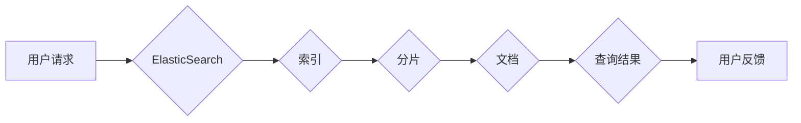

ElasticSearch, 索引, 分片, 映射, 查询, 聚合, 存储, 分布式, NoSQL

## 1. 背景介绍

在当今数据爆炸的时代，高效地存储、检索和分析海量数据成为了企业和研究机构面临的重大挑战。传统的关系型数据库在处理大规模数据时存在效率低下、扩展困难等问题。为了解决这些问题，分布式 NoSQL 数据库应运而生，其中 ElasticSearch 作为一款开源、高性能的搜索和分析引擎，凭借其强大的功能和灵活的架构，在海量数据处理领域获得了广泛应用。

ElasticSearch 基于 Lucene 搜索引擎，采用分片和复制机制，实现高可用性和水平扩展。它支持多种数据类型，包括文本、数字、日期、地理位置等，并提供丰富的查询和聚合功能，能够满足各种数据分析需求。

## 2. 核心概念与联系

ElasticSearch 的核心概念包括索引、分片、映射、文档、查询和聚合等。

**2.1 索引 (Index)**

索引类似于数据库中的表，用于组织和存储数据。每个索引包含多个分片。

**2.2 分片 (Shard)**

分片是索引的物理分块，数据被均匀地分布在不同的分片中。分片可以水平扩展，提高数据处理能力。

**2.3 映射 (Mapping)**

映射定义了文档的结构和数据类型。它指定了每个字段的名称、类型、存储方式等属性。

**2.4 文档 (Document)**

文档是索引中的基本数据单元，类似于数据库中的记录。每个文档包含一系列键值对，其中键是字段名称，值是字段值。

**2.5 查询 (Query)**

查询用于检索符合特定条件的文档。ElasticSearch 提供多种查询类型，例如精确匹配、范围查询、模糊查询等。

**2.6 聚合 (Aggregation)**

聚合用于对文档进行分组和统计分析，例如计算文档数量、平均值、最大值等。

**2.7 流程图**



## 3. 核心算法原理 & 具体操作步骤

### 3.1  算法原理概述

ElasticSearch 的核心算法基于 Lucene 搜索引擎，它采用倒排索引技术来实现快速高效的文本搜索。倒排索引将文档中的每个词语映射到一个包含该词语出现文档的列表中。当用户发起查询时，ElasticSearch 会根据查询词语构建倒排索引，然后遍历该列表，找到包含所有查询词语的文档，并返回这些文档。

### 3.2  算法步骤详解

1. **分词 (Tokenization)**：将文本分解成单个词语或子词。
2. **词干化 (Stemming)**：将词语还原到其词干形式，例如将 "running" 转换为 "run"。
3. **停止词过滤 (Stop Word Removal)**：去除一些常见的无意义词语，例如 "the"、"a"、"is" 等。
4. **倒排索引构建 (Inverted Index Construction)**：将每个词语映射到一个包含该词语出现文档的列表中。
5. **查询处理 (Query Processing)**：根据查询词语构建倒排索引，遍历该列表，找到包含所有查询词语的文档，并返回这些文档。

### 3.3  算法优缺点

**优点：**

* 快速高效：倒排索引技术可以实现快速文本搜索。
* 可扩展性强：ElasticSearch 可以水平扩展，处理海量数据。
* 功能丰富：支持多种查询和聚合功能。

**缺点：**

* 文本分析依赖于预定义规则：分词、词干化和停止词过滤等操作依赖于预定义规则，可能无法完全准确地处理所有文本。
* 存储空间占用较大：倒排索引需要存储大量的词语和文档列表，占用较大的存储空间。

### 3.4  算法应用领域

ElasticSearch 的应用领域非常广泛，包括：

* 搜索引擎：构建全文搜索引擎，例如网站搜索、电商搜索等。
* 数据分析：对海量数据进行分析和挖掘，例如用户行为分析、市场趋势分析等。
* 监控和日志分析：收集和分析系统日志，监控系统运行状态。
* 安全事件管理：收集和分析安全事件，提高安全防护能力。

## 4. 数学模型和公式 & 详细讲解 & 举例说明

### 4.1  数学模型构建

ElasticSearch 的核心算法基于信息检索理论，其中 TF-IDF (Term Frequency-Inverse Document Frequency) 算法是常用的文本权重计算方法。

**4.1.1 TF (Term Frequency)**

TF 表示词语在文档中出现的频率，计算公式如下：

$$TF(t, d) = \frac{f(t, d)}{ \sum_{t' \in d} f(t', d)}$$

其中：

* $t$：词语
* $d$：文档
* $f(t, d)$：词语 $t$ 在文档 $d$ 中出现的次数
* $\sum_{t' \in d} f(t', d)$：文档 $d$ 中所有词语的总出现次数

**4.1.2 IDF (Inverse Document Frequency)**

IDF 表示词语在整个语料库中出现的频率的倒数，计算公式如下：

$$IDF(t) = \log_{10} \frac{N}{df(t)}$$

其中：

* $N$：语料库中文档总数
* $df(t)$：词语 $t$ 在语料库中出现的文档数

**4.1.3 TF-IDF**

TF-IDF 算法将 TF 和 IDF 相乘，得到词语在文档中的权重：

$$TF-IDF(t, d) = TF(t, d) \times IDF(t)$$

### 4.2  公式推导过程

TF-IDF 算法的推导过程基于信息检索理论，其核心思想是：

* 频繁出现的词语在文档中可能具有较高的重要性。
* 在整个语料库中出现的词语越少，其在文档中的重要性越高。

TF-IDF 算法将这两个因素综合考虑，计算出词语在文档中的权重。

### 4.3  案例分析与讲解

假设我们有一个语料库包含 1000 篇文档，其中 "ElasticSearch" 这个词语出现在 100 篇文档中。

* $N = 1000$
* $df(ElasticSearch) = 100$

因此，$IDF(ElasticSearch) = \log_{10} \frac{1000}{100} = 1$

如果一个文档包含 10 次 "ElasticSearch" 的出现，则：

* $f(ElasticSearch, d) = 10$
* $\sum_{t' \in d} f(t', d) = 100$

因此，$TF(ElasticSearch, d) = \frac{10}{100} = 0.1$

最后，$TF-IDF(ElasticSearch, d) = 0.1 \times 1 = 0.1$

## 5. 项目实践：代码实例和详细解释说明

### 5.1  开发环境搭建

ElasticSearch 的安装和配置过程相对简单，可以参考官方文档进行操作。

### 5.2  源代码详细实现

```python
from elasticsearch import Elasticsearch

# 连接 ElasticSearch 服务器
es = Elasticsearch([{'host': 'localhost', 'port': 9200}])

# 创建索引
es.indices.create(index='my_index', ignore=400)

# 定义文档
doc = {
    'title': 'ElasticSearch 原理与代码实例讲解',
    'content': '本文深入讲解了 ElasticSearch 的原理和代码实例...',
    'author': '禅与计算机程序设计艺术'
}

# 将文档添加到索引
es.index(index='my_index', doc_type='_doc', body=doc)

# 查询文档
res = es.search(index='my_index', body={"query": {"match": {"title": "ElasticSearch"}}})

# 打印查询结果
print(res['hits']['hits'])
```

### 5.3  代码解读与分析

* 首先，我们使用 `elasticsearch` 库连接到 ElasticSearch 服务器。
* 然后，我们创建了一个名为 `my_index` 的索引。
* 接下来，我们定义了一个文档，包含标题、内容和作者等字段。
* 然后，我们使用 `es.index()` 方法将文档添加到索引中。
* 最后，我们使用 `es.search()` 方法查询包含 "ElasticSearch" 的文档，并打印查询结果。

### 5.4  运行结果展示

运行上述代码后，将会打印出包含 "ElasticSearch" 的文档信息。

## 6. 实际应用场景

ElasticSearch 在各种实际应用场景中发挥着重要作用，例如：

### 6.1  搜索引擎

ElasticSearch 可以构建高性能的搜索引擎，例如网站搜索、电商搜索等。

### 6.2  数据分析

ElasticSearch 可以对海量数据进行分析和挖掘，例如用户行为分析、市场趋势分析等。

### 6.3  监控和日志分析

ElasticSearch 可以收集和分析系统日志，监控系统运行状态。

### 6.4  未来应用展望

随着数据量的不断增长，ElasticSearch 的应用场景将会更加广泛，例如：

* 人工智能：ElasticSearch 可以用于训练机器学习模型，例如文本分类、情感分析等。
* 物联网：ElasticSearch 可以用于存储和分析物联网设备的数据。
* 医疗保健：ElasticSearch 可以用于存储和分析患者数据，辅助医疗诊断和治疗。

## 7. 工具和资源推荐

### 7.1  学习资源推荐

* ElasticSearch 官方文档：https://www.elastic.co/guide/en/elasticsearch/reference/current/index.html
* ElasticSearch 中文社区：https://www.elastic.co/cn/community

### 7.2  开发工具推荐

* Elasticsearch Python Client：https://elasticsearch-py.readthedocs.io/en/master/

### 7.3  相关论文推荐

* Elasticsearch: A Scalable, Distributed Search Engine
* Lucene: A High-Performance Full-Text Search Engine Library

## 8. 总结：未来发展趋势与挑战

### 8.1  研究成果总结

ElasticSearch 作为一款开源、高性能的搜索和分析引擎，在海量数据处理领域取得了显著的成果。其基于倒排索引技术的快速搜索能力、水平扩展的架构和丰富的功能，使其成为数据分析和搜索引擎开发的理想选择。

### 8.2  未来发展趋势

ElasticSearch 的未来发展趋势包括：

* 更强的性能和可扩展性：ElasticSearch 将继续优化其算法和架构，提高其性能和可扩展性。
* 更丰富的功能：ElasticSearch 将继续添加新的功能，例如机器学习、数据可视化等。
* 更广泛的应用场景：ElasticSearch 的应用场景将更加广泛，例如人工智能、物联网、医疗保健等领域。

### 8.3  面临的挑战

ElasticSearch 也面临着一些挑战，例如：

* 数据安全：随着数据量的增长，数据安全问题变得更加重要。ElasticSearch 需要加强数据加密和访问控制等安全措施。
* 数据治理：海量数据的管理和治理是一个复杂的问题，ElasticSearch 需要提供更完善的数据治理工具和机制。
* 复杂性：ElasticSearch 的架构和功能越来越复杂，需要提供更易于使用的工具和文档。

### 8.4  研究展望

未来，ElasticSearch 的研究方向包括：

* 更高效的搜索算法：研究更高效的搜索算法，例如基于深度学习的搜索算法。
* 更智能的数据分析：研究更智能的数据分析方法，例如基于机器学习的异常检测、预测分析等。
* 更安全的分布式系统：研究更安全的分布式系统架构