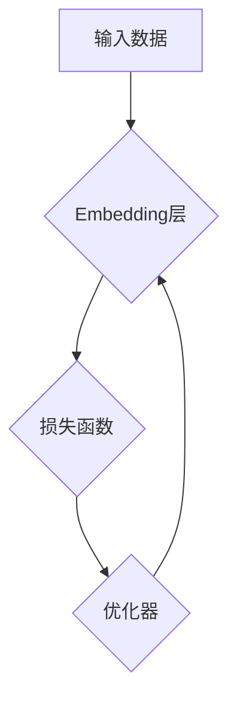

> Embedding映射, AI, 自然语言处理, 机器学习, 深度学习, 向量化, 语义相似度, 推荐系统

## 1. 背景介绍

在人工智能领域，数据是至关重要的资源。然而，传统的机器学习算法难以直接处理文本、图像等复杂数据类型。为了解决这个问题，Embedding映射技术应运而生。Embedding映射是一种将高维数据映射到低维向量空间的技术，它能够将复杂的数据结构转换为机器可理解的数值表示，从而为机器学习算法提供有效的输入。

Embedding映射技术在人工智能领域有着广泛的应用，例如：

* **自然语言处理 (NLP)：** 将单词、句子或文档映射到向量空间，用于文本分类、情感分析、机器翻译等任务。
* **计算机视觉 (CV)：** 将图像或视频片段映射到向量空间，用于图像识别、物体检测、视频分析等任务。
* **推荐系统：** 将用户和物品映射到向量空间，用于个性化推荐、协同过滤等任务。

## 2. 核心概念与联系

Embedding映射的核心概念是将高维数据映射到低维向量空间，从而降低数据维度，同时保留数据之间的语义关系。

**Embedding映射的原理：**

* 将每个数据点映射到一个低维向量空间中，每个向量代表一个数据点。
* 向量之间的距离反映了数据点之间的相似度。
* 通过训练模型，学习到每个数据点的最佳向量表示，使得向量空间中数据点之间的距离与它们的真实关系相匹配。

**Embedding映射的架构：**



**Embedding映射的联系：**

Embedding映射与机器学习、深度学习等技术密切相关。

* **机器学习：** Embedding映射可以作为机器学习算法的特征工程步骤，将复杂数据转换为机器可理解的数值表示。
* **深度学习：** Embedding映射可以作为深度学习模型的一部分，例如Word2Vec、GloVe等词嵌入模型。

## 3. 核心算法原理 & 具体操作步骤

### 3.1  算法原理概述

Word2Vec是基于神经网络的词嵌入模型，它通过训练一个神经网络来学习单词的向量表示。Word2Vec模型主要有两种训练方式：

* **Continuous Bag-of-Words (CBOW)：** 预测中心词，根据上下文词预测中心词。
* **Skip-gram：** 预测上下文词，根据中心词预测上下文词。

### 3.2  算法步骤详解

**Word2Vec模型的训练步骤：**

1. **数据预处理：** 将文本数据预处理，例如分词、去停用词等。
2. **构建词典：** 将所有出现的单词构建成一个词典，每个单词对应一个唯一的ID。
3. **初始化词向量：** 将每个单词的词向量随机初始化。
4. **训练模型：** 使用CBOW或Skip-gram训练方式，通过反向传播算法更新词向量。
5. **评估模型：** 使用测试集评估模型的性能，例如词语相似度、语义相关性等。

### 3.3  算法优缺点

**Word2Vec模型的优点：**

* **学习到的词向量具有语义相似性：** 相似意思的词语，其词向量之间的距离较近。
* **训练速度快：** Word2Vec模型训练速度相对较快。
* **易于实现：** Word2Vec模型的实现相对简单。

**Word2Vec模型的缺点：**

* **无法捕捉长距离依赖关系：** Word2Vec模型只能捕捉局部上下文信息，无法捕捉长距离依赖关系。
* **静态词向量：** Word2Vec模型生成的词向量是静态的，无法反映词语在不同语境下的变化。

### 3.4  算法应用领域

Word2Vec模型广泛应用于自然语言处理领域，例如：

* **文本分类：** 将文本映射到向量空间，用于分类任务。
* **情感分析：** 分析文本的情感倾向，例如正面、负面、中性等。
* **机器翻译：** 将一种语言翻译成另一种语言。
* **问答系统：** 回答用户提出的问题。

## 4. 数学模型和公式 & 详细讲解 & 举例说明

### 4.1  数学模型构建

Word2Vec模型的核心是神经网络，其数学模型可以表示为：

* **CBOW模型：**

$$
\hat{w} = \sigma(W_1 \cdot \text{avg}(h_1, h_2, ..., h_c))
$$

* **Skip-gram模型：**

$$
\hat{w_i} = \sigma(W_2 \cdot h_i)
$$

其中：

* $\hat{w}$：预测的中心词的概率分布。
* $W_1$ 和 $W_2$：词向量矩阵。
* $h_i$：上下文词的词向量。
* $c$：上下文词的数量。
* $\sigma$：激活函数，例如sigmoid函数。

### 4.2  公式推导过程

Word2Vec模型的训练目标是最大化预测正确的上下文词的概率。

* **CBOW模型：**

$$
\text{Loss} = -\sum_{i=1}^{c} \log(p(w_i | w_c))
$$

* **Skip-gram模型：**

$$
\text{Loss} = -\sum_{i=1}^{c} \log(p(w_i | w_c))
$$

其中：

* $\text{Loss}$：损失函数。
* $p(w_i | w_c)$：中心词 $w_c$ 给出上下文词 $w_i$ 的概率。

通过反向传播算法，更新词向量矩阵 $W_1$ 和 $W_2$，使得损失函数最小化。

### 4.3  案例分析与讲解

**Word2Vec模型的案例分析：**

假设我们训练了一个Word2Vec模型，并得到了以下词向量：

* "king"：[0.2, 0.3, 0.4]
* "queen"：[0.1, 0.2, 0.5]
* "man"：[0.4, 0.3, 0.2]

我们可以观察到，"king" 和 "queen" 的词向量非常接近，这表明它们在语义上是相似的。

## 5. 项目实践：代码实例和详细解释说明

### 5.1  开发环境搭建

* **操作系统：** Linux/macOS/Windows
* **编程语言：** Python
* **库依赖：** Gensim、Numpy、Scikit-learn

### 5.2  源代码详细实现

```python
from gensim.models import Word2Vec

# 数据预处理
sentences = [
    ["this", "is", "a", "sentence"],
    ["this", "is", "another", "sentence"],
]

# 训练Word2Vec模型
model = Word2Vec(sentences, vector_size=100, window=5, min_count=5)

# 保存模型
model.save("word2vec_model.bin")

# 加载模型
model = Word2Vec.load("word2vec_model.bin")

# 获取词向量
word_vector = model.wv["sentence"]
print(word_vector)
```

### 5.3  代码解读与分析

* **数据预处理：** 将文本数据转换为句子列表，每个句子是一个单词列表。
* **训练Word2Vec模型：** 使用Gensim库的Word2Vec类训练模型，设置词向量维度、窗口大小、最小词频等参数。
* **保存模型：** 使用model.save()方法保存训练好的模型。
* **加载模型：** 使用Word2Vec.load()方法加载保存的模型。
* **获取词向量：** 使用model.wv["word"]方法获取指定单词的词向量。

### 5.4  运行结果展示

运行代码后，会输出指定单词的词向量。

## 6. 实际应用场景

### 6.1  推荐系统

Embedding映射技术可以用于构建个性化推荐系统。将用户和物品映射到向量空间，计算用户和物品之间的相似度，推荐与用户兴趣相符的物品。

### 6.2  搜索引擎

Embedding映射技术可以用于改进搜索引擎的检索效果。将查询词和文档内容映射到向量空间，计算查询词和文档内容之间的相似度，返回与查询词最相似的文档。

### 6.3  图像识别

Embedding映射技术可以用于图像识别任务。将图像特征映射到向量空间，计算图像特征之间的相似度，识别图像中的物体或场景。

### 6.4  未来应用展望

Embedding映射技术在人工智能领域有着广阔的应用前景，未来可能会应用于：

* **更精准的个性化推荐：** 基于用户行为、兴趣等多方面信息，提供更精准的个性化推荐。
* **更智能的搜索引擎：** 理解用户搜索意图，提供更相关、更精准的搜索结果。
* **更强大的自然语言理解：** 更好地理解自然语言的语义和上下文，实现更智能的对话系统、机器翻译等应用。

## 7. 工具和资源推荐

### 7.1  学习资源推荐

* **书籍：**
    * Deep Learning by Ian Goodfellow, Yoshua Bengio, and Aaron Courville
    * Natural Language Processing with Python by Steven Bird, Ewan Klein, and Edward Loper
* **在线课程：**
    * Stanford CS224n: Natural Language Processing with Deep Learning
    * Coursera: Deep Learning Specialization

### 7.2  开发工具推荐

* **Gensim：** Python库，用于训练和使用词嵌入模型。
* **TensorFlow：** 开源深度学习框架，可以用于训练自定义的Embedding映射模型。
* **PyTorch：** 开源深度学习框架，可以用于训练自定义的Embedding映射模型。

### 7.3  相关论文推荐

* **Word2Vec：** Mikolov, T., Sutskever, I., Chen, K., Corrado, G. S., & Dean, J. (2013). Distributed representations of words and phrases and their compositionality. Advances in neural information processing systems, 26.
* **GloVe：** Pennington, J., Socher, R., & Manning, C. D. (2014). Glove: Global vectors for word representation. Proceedings of the 2014 conference on empirical methods in natural language processing (EMNLP), 1532-1543.

## 8. 总结：未来发展趋势与挑战

### 8.1  研究成果总结

Embedding映射技术在人工智能领域取得了显著的成果，例如：

* **词嵌入模型：** Word2Vec、GloVe等词嵌入模型能够学习到语义相似的词语具有相似的词向量表示。
* **图像嵌入模型：** ResNet、Inception等深度学习模型能够学习到图像特征的嵌入表示。
* **多模态嵌入模型：** 将文本、图像、音频等多模态数据映射到同一个向量空间，实现跨模态的理解和交互。

### 8.2  未来发展趋势

* **更强大的嵌入模型：** 研究更强大的嵌入模型，能够更好地捕捉语义关系、长距离依赖关系等复杂信息。
* **动态嵌入模型：** 研究动态嵌入模型，能够根据语境变化更新词向量表示，更好地反映词语的动态性。
* **跨模态嵌入模型：** 研究更有效的跨模态嵌入模型，实现文本、图像、音频等多模态数据的融合和理解。

### 8.3  面临的挑战

* **数据稀疏性：** 许多领域的数据稀疏，难以训练有效的嵌入模型。
* **计算资源限制：** 训练大型嵌入模型需要大量的计算资源。
* **解释性问题：** 嵌入模型的内部机制难以解释，难以理解模型是如何学习到的。

### 8.4  研究展望

未来，Embedding映射技术将继续发展，在人工智能领域