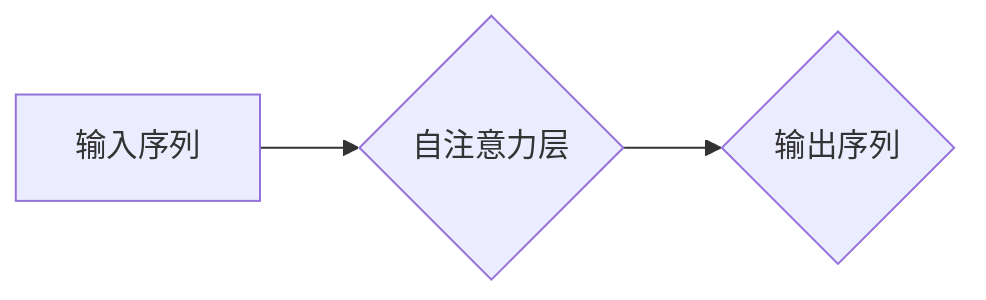

> GPT-3, Transformer, 自然语言处理, 深度学习, 语言模型, 代码生成, 文本生成

## 1. 背景介绍

近年来，人工智能领域取得了令人瞩目的进展，其中自然语言处理（NLP）领域尤为突出。作为NLP领域的重要里程碑，GPT-3（Generative Pre-trained Transformer 3）凭借其强大的文本生成能力和广泛的应用场景，引发了学术界和工业界的广泛关注。

GPT-3由美国人工智能研究公司OpenAI开发，是一个基于Transformer架构的巨型语言模型，拥有1750亿个参数。它通过预训练的方式学习了大量的文本数据，能够理解和生成人类语言，并完成各种自然语言处理任务，例如文本摘要、机器翻译、对话系统、代码生成等。

GPT-3的出现标志着人工智能技术迈向了一个新的阶段，它为我们提供了更强大的工具，可以更有效地处理和理解人类语言，并推动人工智能技术在各个领域的应用。

## 2. 核心概念与联系

### 2.1 Transformer 架构

Transformer是一种新型的神经网络架构，专门设计用于处理序列数据，例如文本。它与传统的循环神经网络（RNN）相比，具有以下优势：

* **并行计算能力强:** Transformer可以并行处理整个序列数据，而RNN只能顺序处理，效率更高。
* **长距离依赖关系处理能力强:** Transformer通过自注意力机制可以捕捉到序列中长距离的依赖关系，而RNN在处理长序列时容易出现梯度消失问题。

### 2.2 自注意力机制

自注意力机制是Transformer架构的核心，它允许模型关注输入序列中不同位置的词语之间的关系，从而更好地理解上下文信息。

**Mermaid 流程图:**



### 2.3 预训练与微调

GPT-3采用预训练与微调的训练策略。预训练阶段，模型在大量的文本数据上进行训练，学习语言的语法和语义知识。微调阶段，模型在特定任务的数据上进行训练，使其能够完成特定的任务，例如文本分类、机器翻译等。

## 3. 核心算法原理 & 具体操作步骤

### 3.1 算法原理概述

GPT-3的核心算法是基于Transformer架构的语言模型，它使用自回归的方式生成文本。

自回归是指模型根据之前生成的词语预测下一个词语。GPT-3通过学习大量的文本数据，建立了词语之间的概率关系，从而能够生成流畅、连贯的文本。

### 3.2 算法步骤详解

1. **输入序列:** 将输入文本分割成一个个词语，形成一个词语序列。
2. **嵌入层:** 将每个词语转换为一个向量表示，称为词嵌入。
3. **Transformer encoder-decoder:** 将词嵌入输入到Transformer编码器和解码器中。编码器负责提取文本的语义信息，解码器负责根据编码器的输出生成文本。
4. **自注意力机制:** 在Transformer编码器和解码器中，自注意力机制用于捕捉词语之间的关系。
5. **输出层:** 解码器输出层将每个词语的概率分布转换为一个词语预测。
6. **生成文本:** 根据词语概率分布，选择概率最高的词语作为下一个词语，并重复步骤5，直到生成完整的文本。

### 3.3 算法优缺点

**优点:**

* **强大的文本生成能力:** GPT-3能够生成高质量、流畅的文本。
* **广泛的应用场景:** GPT-3可以应用于各种自然语言处理任务，例如文本摘要、机器翻译、对话系统、代码生成等。
* **预训练模型:** 预训练模型可以节省训练时间和资源。

**缺点:**

* **参数量大:** GPT-3拥有1750亿个参数，需要大量的计算资源进行训练和推理。
* **训练数据依赖:** GPT-3的性能依赖于训练数据的质量和数量。
* **潜在的偏见:** GPT-3可能存在训练数据中的偏见。

### 3.4 算法应用领域

GPT-3在以下领域具有广泛的应用前景：

* **文本生成:** 自动写作、创意写作、故事生成、诗歌创作等。
* **机器翻译:** 高质量、流畅的机器翻译。
* **对话系统:** 更自然、更智能的对话机器人。
* **代码生成:** 自动生成代码，提高开发效率。
* **教育:** 个性化学习、自动批改作业等。

## 4. 数学模型和公式 & 详细讲解 & 举例说明

### 4.1 数学模型构建

GPT-3的数学模型基于Transformer架构，其核心是自注意力机制和多头注意力机制。

**自注意力机制:**

自注意力机制计算每个词语与其他词语之间的相关性，并赋予每个词语不同的权重。

公式:

$$
Attention(Q, K, V) = softmax(\frac{QK^T}{\sqrt{d_k}})V
$$

其中:

* $Q$：查询矩阵
* $K$：键矩阵
* $V$：值矩阵
* $d_k$：键向量的维度
* $softmax$：softmax函数

**多头注意力机制:**

多头注意力机制将自注意力机制应用于多个不同的子空间，并将其结果进行融合，从而提高模型的表达能力。

公式:

$$
MultiHeadAttention(Q, K, V) = Concat(head_1, head_2, ..., head_h)W^O
$$

其中:

* $head_i$：第i个子空间的注意力输出
* $h$：多头数量
* $W^O$：最终输出层的权重矩阵

### 4.2 公式推导过程

自注意力机制的公式推导过程如下:

1. 将输入序列的每个词语转换为查询向量 $Q$、键向量 $K$ 和值向量 $V$。
2. 计算每个词语与其他词语之间的相关性，即 $QK^T$。
3. 对相关性矩阵进行归一化，使用softmax函数得到每个词语的权重。
4. 将权重与值向量相乘，得到每个词语的加权平均值，即注意力输出。

### 4.3 案例分析与讲解

假设我们有一个句子 "The cat sat on the mat"，我们使用自注意力机制计算每个词语与其他词语之间的相关性。

例如，"cat" 与 "sat" 之间的相关性较高，因为它们在语义上相关。而 "cat" 与 "mat" 之间的相关性也较高，因为它们在句子的结构上相关。

通过自注意力机制，模型可以捕捉到这些词语之间的关系，从而更好地理解句子的语义。

## 5. 项目实践：代码实例和详细解释说明

### 5.1 开发环境搭建

为了使用GPT-3，需要搭建相应的开发环境。

* **Python:** GPT-3的API使用Python进行调用。
* **OpenAI库:** 需要安装OpenAI库，用于与GPT-3 API进行交互。

```bash
pip install openai
```

### 5.2 源代码详细实现

```python
import openai

# 设置OpenAI API密钥
openai.api_key = "YOUR_API_KEY"

# 定义输入文本
prompt = "写一首关于春天的诗"

# 调用GPT-3 API生成文本
response = openai.Completion.create(
    engine="text-davinci-003",
    prompt=prompt,
    max_tokens=100,
    temperature=0.7
)

# 打印生成的文本
print(response.choices[0].text)
```

### 5.3 代码解读与分析

* **`openai.api_key = "YOUR_API_KEY"`:** 设置OpenAI API密钥，用于身份验证。
* **`prompt = "写一首关于春天的诗"`:** 定义输入文本，即要生成的诗歌主题。
* **`openai.Completion.create(...)`:** 调用GPT-3 API的 `Completion` 方法，生成文本。
* **`engine="text-davinci-003"`:** 指定使用的GPT-3模型，这里使用的是 `text-davinci-003` 模型。
* **`max_tokens=100`:** 设置生成的文本最大长度为100个词语。
* **`temperature=0.7`:** 控制生成的文本的随机性，温度值越高，生成的文本越随机。
* **`response.choices[0].text`:** 获取生成的文本内容。

### 5.4 运行结果展示

运行代码后，将输出一首关于春天的诗歌。

## 6. 实际应用场景

GPT-3在各个领域都有着广泛的应用场景：

### 6.1 文本生成

* **自动写作:** GPT-3可以自动生成新闻报道、博客文章、小说等各种类型的文本。
* **创意写作:** GPT-3可以帮助作家克服写作瓶颈，生成新的故事创意和人物设定。
* **广告文案:** GPT-3可以根据目标受众和产品特点，自动生成吸引人的广告文案。

### 6.2 机器翻译

* **高质量翻译:** GPT-3可以实现高质量的机器翻译，克服传统机器翻译方法的局限性。
* **多语言支持:** GPT-3支持多种语言的翻译，可以满足全球化的需求。

### 6.3 对话系统

* **更自然对话:** GPT-3可以使对话系统更加自然流畅，更像人类的对话。
* **个性化服务:** GPT-3可以根据用户的喜好和需求，提供个性化的对话服务。

### 6.4 代码生成

* **自动代码生成:** GPT-3可以根据自然语言描述，自动生成代码，提高开发效率。
* **代码修复:** GPT-3可以帮助程序员修复代码中的错误。

### 6.5 教育

* **个性化学习:** GPT-3可以根据学生的学习进度和能力，提供个性化的学习内容和辅导。
* **自动批改作业:** GPT-3可以自动批改学生的作业，节省教师的时间和精力。

## 7. 工具和资源推荐

### 7.1 学习资源推荐

* **OpenAI官方文档:** https://platform.openai.com/docs/
* **HuggingFace Transformers库:** https://huggingface.co/docs/transformers/index
* **DeepLearning.AI课程:** https://www.deeplearning.ai/

### 7.2 开发工具推荐

* **Jupyter Notebook:** https://jupyter.org/
* **Google Colab:** https://colab.research.google.com/

### 7.3 相关论文推荐

* **Attention Is All You Need:** https://arxiv.org/abs/1706.03762
* **Language Models are Few-Shot Learners:** https://arxiv.org/abs/2005.14165

## 8. 总结：未来发展趋势与挑战

### 8.1 研究成果总结

GPT-3的出现标志着人工智能技术取得了重大突破，它展现了深度学习模型在自然语言处理领域的巨大潜力。

### 8.2 未来发展趋势

* **模型规模更大:** 未来将会有更大规模的语言模型出现，拥有更强的文本生成能力和理解能力。
* **多模态学习:** 将文本与其他模态数据（例如图像、音频）进行融合，实现更全面的理解和生成。
* **可解释性增强:** 研究如何提高语言模型的可解释性，使模型的决策过程更加透明。

### 8.3 面临的挑战

* **计算资源需求:** 大型语言模型的训练和推理需要大量的计算资源，这对于资源有限的机构和个人来说是一个挑战。
* **数据偏见:** 语言模型的训练数据可能存在偏见，导致模型生成带有偏见的文本。
* **伦理问题:** 语言模型的应用可能引发一些伦理问题，例如信息操纵、隐私泄露等。

### 8.4 研究展望

未来，研究人员将继续探索语言模型的潜力，开发更强大、更安全、更可解释的语言模型，推动人工智能技术在各个领域的应用。

## 9. 附录：常见问题与解答

### 9.1 如何使用GPT-