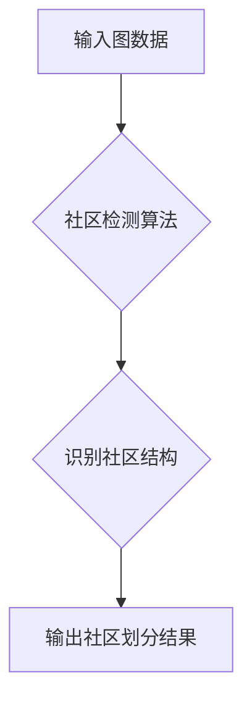

> 图社区检测，算法原理，代码实例，网络分析，社交网络，推荐系统

## 1. 背景介绍

在当今数据爆炸的时代，网络和图结构数据无处不在。从社交网络到生物网络，从互联网到交通网络，各种各样的网络都呈现出复杂的结构特征。图社区检测作为网络分析领域的重要研究方向，旨在识别网络中具有紧密连接和内部结构的子图，即社区。社区的发现可以帮助我们理解网络的组织结构、发现隐藏的模式和关系，并为许多应用场景提供支持。

例如，在社交网络中，社区检测可以帮助我们识别用户群组，推荐潜在的朋友，分析网络传播趋势；在生物网络中，社区检测可以帮助我们发现基因功能模块，理解生物网络的结构和功能；在推荐系统中，社区检测可以帮助我们根据用户的兴趣和行为，推荐更精准的商品或服务。

## 2. 核心概念与联系

**2.1  图论基础**

图社区检测的核心是图论的概念。图可以表示为一个节点集和边集的集合，其中节点代表网络中的实体，边代表实体之间的关系。

**2.2  社区定义**

社区是指图中的一组节点，这些节点之间相互连接的程度高于与其他节点的连接程度。社区的定义可以根据不同的应用场景和算法而有所不同，但通常包含以下几个关键特征：

* **内部连接性强:** 社区内的节点之间连接密度高。
* **外部连接性弱:** 社区与其他社区之间的连接密度低。
* **结构完整性:** 社区内部结构相对完整，没有明显的断裂或分离。

**2.3  社区检测算法**

社区检测算法旨在识别图中的社区结构。常见的社区检测算法包括：

* **基于模块性的算法:** Louvain算法、Girvan-Newman算法
* **基于谱聚类的算法:**  Spectral Clustering
* **基于贪婪搜索的算法:** Label Propagation Algorithm
* **基于深度学习的算法:** Graph Convolutional Networks

**2.4  Mermaid 流程图**



## 3. 核心算法原理 & 具体操作步骤

### 3.1  算法原理概述

本文将重点介绍基于模块性的 Louvain算法，它是一种高效且广泛应用的社区检测算法。Louvain算法基于模块度函数，模块度函数衡量了社区结构的质量。算法的目标是最大化模块度函数的值，从而找到最优的社区划分。

### 3.2  算法步骤详解

1. **初始化:** 将图中的每个节点作为一个独立的社区。
2. **迭代优化:** 
    * 对于每个节点，计算它移动到其他社区后的模块度变化量。
    * 选择使模块度增加最多的社区，并将节点移动到该社区。
    * 重复上述步骤，直到模块度不再增加或达到最大迭代次数。

3. **输出结果:** 返回最终的社区划分结果。

### 3.3  算法优缺点

**优点:**

* **高效:** Louvain算法的计算复杂度相对较低，可以处理规模较大的图数据。
* **效果好:** 在许多实际应用场景中，Louvain算法可以发现高质量的社区结构。

**缺点:**

* **局部最优:** Louvain算法可能陷入局部最优解，无法找到全局最优的社区划分。
* **参数敏感:** Louvain算法的性能受参数设置的影响，需要根据实际数据进行调整。

### 3.4  算法应用领域

Louvain算法广泛应用于以下领域:

* **社交网络分析:** 识别用户群组、分析网络传播趋势。
* **生物网络分析:** 发现基因功能模块、理解生物网络的结构和功能。
* **推荐系统:** 根据用户的兴趣和行为，推荐更精准的商品或服务。
* **信息检索:** 发现主题相关的文档聚类。

## 4. 数学模型和公式 & 详细讲解 & 举例说明

### 4.1  数学模型构建

**4.1.1 模块度函数**

模块度函数 (Modularity) 是衡量社区结构质量的指标。模块度函数的值越大，表示社区结构越良好。

**公式:**

$$Q = \frac{1}{2m} \sum_{i,j} A_{ij} \left( \frac{k_i}{2m} - \delta(c_i, c_j) \right)$$

其中:

* $m$ 是图的边数。
* $A_{ij}$ 是图中节点 $i$ 和节点 $j$ 之间的边权重。
* $k_i$ 是节点 $i$ 的度数。
* $c_i$ 和 $c_j$ 分别是节点 $i$ 和节点 $j$ 所属的社区标识。
* $\delta(c_i, c_j)$ 是指示函数，当 $c_i = c_j$ 时取值为 1，否则取值为 0。

**4.1.2 解释:**

模块度函数的计算过程可以理解为：

1. 计算每个节点的连接强度，即节点的度数。
2. 计算每个社区内部的连接强度，即社区内节点之间的边数。
3. 计算每个社区与其他社区的连接强度，即社区间节点之间的边数。
4. 通过比较社区内部和外部的连接强度，计算模块度函数的值。

**4.2  公式推导过程**

模块度函数的推导过程比较复杂，涉及到概率论和统计学等知识。

**4.3  案例分析与讲解**

假设我们有一个简单的图，包含 5 个节点，每个节点之间都有连接。我们可以使用模块度函数来评估不同的社区划分方案。

例如，如果我们将所有节点划分为一个社区，则模块度函数的值为 0。如果我们将节点划分为两个社区，则模块度函数的值可能大于 0。

通过不断调整社区划分方案，我们可以找到使模块度函数值最大的方案，即最优的社区划分。

## 5. 项目实践：代码实例和详细解释说明

### 5.1  开发环境搭建

本项目使用 Python 语言进行开发，需要安装以下库:

* NetworkX: 图数据结构和算法库
* Scikit-learn: 机器学习库

可以使用 pip 命令安装这些库:

```bash
pip install networkx scikit-learn
```

### 5.2  源代码详细实现

```python
import networkx as nx
from networkx.algorithms.community import greedy_modularity_communities

# 创建一个示例图
graph = nx.karate_club_graph()

# 使用 Louvain 算法进行社区检测
communities = greedy_modularity_communities(graph)

# 打印社区划分结果
for community in communities:
    print(community)
```

### 5.3  代码解读与分析

1. **创建示例图:** 使用 `networkx.karate_club_graph()` 函数创建 karate club 图，这是一个经典的社交网络图。
2. **使用 Louvain 算法进行社区检测:** 使用 `greedy_modularity_communities()` 函数对图进行社区检测，该函数基于 Louvain 算法，并返回一个包含社区划分结果的列表。
3. **打印社区划分结果:** 遍历社区列表，打印每个社区中的节点。

### 5.4  运行结果展示

运行上述代码后，将输出 karate club 图的社区划分结果。每个社区是一个节点列表，表示该社区中的节点。

## 6. 实际应用场景

### 6.1  社交网络分析

在社交网络中，社区检测可以帮助我们识别用户群组，分析网络传播趋势，推荐潜在的朋友。例如，我们可以使用社区检测算法分析微博用户的关注关系，识别不同兴趣群组的用户，并根据用户的兴趣推荐相关内容。

### 6.2  生物网络分析

在生物网络中，社区检测可以帮助我们发现基因功能模块，理解生物网络的结构和功能。例如，我们可以使用社区检测算法分析蛋白质相互作用网络，识别功能相关的蛋白质组，并进一步研究这些蛋白质组的功能。

### 6.3  推荐系统

在推荐系统中，社区检测可以帮助我们根据用户的兴趣和行为，推荐更精准的商品或服务。例如，我们可以使用社区检测算法分析用户的购买历史和浏览记录，识别用户的兴趣群组，并根据用户的兴趣推荐相关商品。

### 6.4  未来应用展望

随着数据量的不断增长和算法的不断发展，社区检测技术将在更多领域得到应用，例如：

* **城市规划:** 分析城市交通网络，识别交通拥堵区域，优化交通规划。
* **金融风险管理:** 分析金融网络，识别潜在的风险节点，降低金融风险。
* **疾病传播预测:** 分析疾病传播网络，预测疾病传播趋势，制定防控措施。

## 7. 工具和资源推荐

### 7.1  学习资源推荐

* **书籍:**
    * "Network Science" by Albert-László Barabási
    * "Complex Networks" by Reka Albert and Albert-László Barabási
* **在线课程:**
    * Coursera: "Network Science" by University of California, San Diego
    * edX: "Introduction to Network Science" by University of California, Berkeley

### 7.2  开发工具推荐

* **NetworkX:** Python 图数据结构和算法库
* **Gephi:** 图数据可视化工具
* **igraph:** R 图数据结构和算法库

### 7.3  相关论文推荐

* "Louvain Algorithm for Community Detection" by Vincent D Blondel, et al.
* "Finding and Evaluating Community Structure in Networks" by M E J Newman

## 8. 总结：未来发展趋势与挑战

### 8.1  研究成果总结

社区检测技术在过去几十年取得了显著进展，从传统的基于模块性的算法到基于深度学习的算法，不断涌现出新的算法和方法。这些算法在社交网络分析、生物网络分析、推荐系统等领域取得了广泛应用，为我们理解复杂网络结构和功能提供了新的视角。

### 8.2  未来发展趋势

未来社区检测技术的发展趋势包括:

* **更鲁棒的算法:** 开发能够处理噪声数据、动态网络和异构网络的更鲁棒的算法。
* **更深入的理论分析:** 深入研究社区检测算法的理论基础，理解算法的优缺点，并提出更有效的算法设计方法。
* **更广泛的应用场景:** 将社区检测技术应用于更多领域，例如城市规划、金融风险管理、疾病传播预测等。

### 8.3  面临的挑战

社区检测技术仍然面临一些挑战:

* **定义社区的模糊性:** 社区概念的定义比较模糊，不同应用场景下对社区的定义可能有所不同。
* **算法的复杂性:** 一些社区检测算法的计算复杂度较高，难以处理规模较大的图数据。
* **数据隐私问题:** 社区检测技术可能会泄露用户隐私信息，需要采取相应的隐私保护措施。

### 8.4  研究展望

未来，社区检测技术将继续朝着更鲁棒、更深入、更广泛的方向发展，为我们理解复杂网络结构和功能提供更强大的工具。


## 9. 附录：常见问题与解答

**1. 什么是社区检测？**

社区检测是指识别图中具有紧密连接和内部结构的子图，即社区。

**2. 什么是模块度函数？**

模块度函数是衡量社区结构质量的指标。模块度函数的值越大，表示社区结构越良好。

**3. 什么是 Louvain 算法？**

Louvain 算法是一种基于模块性的社区检测算法，它通过迭代优化模块度函数的值来找到最优的社区划分。

**4. 如何选择合适的社区检测算法？**

选择合适的社区检测算法需要根据实际数据和应用场景进行考虑。例如，对于规模较大的图数据，可以使用 Louvain 算法；对于动态网络，可以使用基于谱聚类的算法。

**5. 如何评估社区检测算法的性能？**

常用的社区检测算法性能评估指标包括模块度函数、轮廓