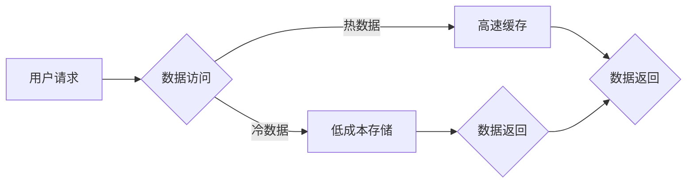

> Hot-Warm冗余，数据存储，缓存，性能优化，成本控制，云计算

## 1. 背景介绍

随着云计算的蓬勃发展，数据存储和处理的需求日益增长。为了满足用户对高可用性和低延迟的需求，冗余设计成为数据存储系统的重要组成部分。传统的冗余设计主要采用热备 (Hot Standby) 或冷备 (Cold Standby) 模式，但这些模式存在各自的局限性。热备模式虽然可以快速切换，但会占用大量的资源，导致成本较高；冷备模式虽然成本低，但切换时间长，影响用户体验。

为了解决上述问题，Hot-Warm冗余设计应运而生。Hot-Warm冗余设计将数据存储分为热数据和冷数据两类，并采用不同的存储策略和资源分配策略。热数据是指经常访问的数据，存储在高速缓存中，以保证低延迟访问；冷数据是指访问频率较低的，可以容忍延迟访问的数据，存储在低成本的存储设备中。这种设计模式可以有效地平衡性能和成本，提高数据存储系统的整体效率。

## 2. 核心概念与联系

Hot-Warm冗余设计的核心概念是将数据按照访问频率进行分类，并采用不同的存储策略和资源分配策略。

**2.1. 热数据 (Hot Data)**

* 访问频率高，需要保证低延迟访问。
* 存储在高速缓存中，例如内存或SSD。
* 资源分配较高，以保证快速访问。

**2.2. 冷数据 (Cold Data)**

* 访问频率低，可以容忍一定的延迟访问。
* 存储在低成本的存储设备中，例如HDD或云存储。
* 资源分配较低，以降低成本。

**2.3. 冗余策略**

* 热数据采用热备冗余策略，保证数据的高可用性。
* 冷数据采用冷备冗余策略，降低成本。

**2.4. 资源分配策略**

* 热数据分配更多的资源，例如CPU、内存和带宽。
* 冷数据分配较少的资源，以降低成本。

**2.5. 数据迁移策略**

* 定期将冷数据从热存储迁移到冷存储，以降低热存储成本。
* 当冷数据需要访问时，可以将其从冷存储迁移到热存储。

**Mermaid 流程图**



## 3. 核心算法原理 & 具体操作步骤

### 3.1  算法原理概述

Hot-Warm冗余设计的核心算法是数据访问频率的评估和数据迁移策略。

* **数据访问频率评估:** 通过监控数据访问频率，将数据划分为热数据和冷数据两类。常用的评估方法包括：
    * **最近访问时间 (LRU):** 记录每个数据的最近访问时间，访问频率高的数据被认为是热数据。
    * **最近使用时间 (MRU):** 记录每个数据的最近使用时间，使用频率高的数据被认为是热数据。
    * **访问次数:** 记录每个数据的访问次数，访问次数多的数据被认为是热数据。

* **数据迁移策略:** 根据数据访问频率评估结果，将数据从热存储迁移到冷存储，以降低热存储成本。常用的迁移策略包括：
    * **定时迁移:** 定期将冷数据从热存储迁移到冷存储。
    * **基于阈值的迁移:** 当数据访问频率低于某个阈值时，将数据从热存储迁移到冷存储。
    * **动态迁移:** 根据实时数据访问频率动态调整数据迁移策略。

### 3.2  算法步骤详解

1. **数据访问频率评估:** 监控数据访问频率，并根据评估结果将数据划分为热数据和冷数据两类。
2. **资源分配:** 根据数据类型分配不同的资源，例如热数据分配更多的CPU、内存和带宽，冷数据分配较少的资源。
3. **数据存储:** 将热数据存储在高速缓存中，冷数据存储在低成本的存储设备中。
4. **数据迁移:** 根据数据迁移策略，定期或动态地将冷数据从热存储迁移到冷存储。
5. **数据访问:** 当用户请求数据时，首先从高速缓存中查找，如果命中则直接返回数据；否则，从低成本存储中查找数据，并将其迁移到高速缓存中。

### 3.3  算法优缺点

**优点:**

* **平衡性能和成本:** 通过将数据按照访问频率进行分类，可以有效地平衡性能和成本。
* **提高数据可用性:** 热数据采用热备冗余策略，保证数据的高可用性。
* **降低存储成本:** 冷数据采用冷备冗余策略，降低存储成本。

**缺点:**

* **数据迁移复杂:** 数据迁移策略的制定和实施需要一定的复杂度。
* **数据一致性问题:** 数据迁移过程中需要保证数据的一致性。

### 3.4  算法应用领域

Hot-Warm冗余设计广泛应用于以下领域:

* **云计算:** 云计算平台可以利用Hot-Warm冗余设计来提高数据存储系统的性能和效率。
* **大数据:** 大数据平台可以利用Hot-Warm冗余设计来存储和处理海量数据。
* **数据库:** 数据库系统可以利用Hot-Warm冗余设计来提高数据访问性能和降低存储成本。

## 4. 数学模型和公式 & 详细讲解 & 举例说明

### 4.1  数学模型构建

Hot-Warm冗余设计的数学模型可以描述数据访问频率、资源分配和数据迁移策略之间的关系。

* **数据访问频率:** $f(t)$ 表示数据 $d$ 在时间 $t$ 的访问频率。
* **资源分配:** $r(d)$ 表示数据 $d$ 的资源分配量。
* **数据迁移策略:** $m(d, t)$ 表示数据 $d$ 在时间 $t$ 的迁移策略。

### 4.2  公式推导过程

* **资源分配策略:**

$$r(d) = \alpha \cdot f(d) + \beta$$

其中，$\alpha$ 和 $\beta$ 是常数，分别表示访问频率和基础资源分配的权重。

* **数据迁移策略:**

$$m(d, t) = \begin{cases}
    \text{迁移到冷存储}, & \text{if } f(d) < \theta \\
    \text{保留在热存储}, & \text{otherwise}
\end{cases}$$

其中，$\theta$ 是数据访问频率的阈值。

### 4.3  案例分析与讲解

假设一个数据库系统中，数据 $A$ 的访问频率为 10 次/秒，数据 $B$ 的访问频率为 1 次/秒。

* 根据资源分配策略，如果 $\alpha = 0.5$ 和 $\beta = 0.1$，则数据 $A$ 的资源分配量为 $r(A) = 0.5 \cdot 10 + 0.1 = 5.1$，数据 $B$ 的资源分配量为 $r(B) = 0.5 \cdot 1 + 0.1 = 0.6$。
* 如果阈值 $\theta = 5$ 次/秒，则数据 $A$ 会保留在热存储，数据 $B$ 会迁移到冷存储。

## 5. 项目实践：代码实例和详细解释说明

### 5.1  开发环境搭建

* 操作系统: Ubuntu 20.04
* 编程语言: Python 3.8
* 框架: Flask
* 数据库: MySQL

### 5.2  源代码详细实现

```python
from flask import Flask, request, jsonify
import mysql.connector

app = Flask(__name__)

# 数据库连接配置
db_config = {
    'user': 'root',
    'password': 'password',
    'host': 'localhost',
    'database': 'mydatabase'
}

# 连接数据库
cnx = mysql.connector.connect(**db_config)
cursor = cnx.cursor()

# 数据访问频率评估
def assess_access_frequency(data_id):
    # 查询数据访问频率
    query = "SELECT access_count FROM data WHERE id = %s"
    cursor.execute(query, (data_id,))
    result = cursor.fetchone()
    if result:
        access_count = result[0]
        # 根据访问频率评估数据类型
        if access_count > 10:
            return 'hot'
        else:
            return 'cold'
    else:
        return 'unknown'

# 数据迁移策略
def migrate_data(data_id, data_type):
    # 根据数据类型执行迁移操作
    if data_type == 'cold':
        # 将数据迁移到冷存储
        print(f"迁移数据 {data_id} 到冷存储")
    else:
        # 保留数据在热存储
        print(f"保留数据 {data_id} 在热存储")

# API 路由
@app.route('/data/<int:data_id>', methods=['GET'])
def get_data(data_id):
    # 获取数据访问频率
    data_type = assess_access_frequency(data_id)
    # 执行数据迁移策略
    migrate_data(data_id, data_type)
    # 返回数据
    query = "SELECT * FROM data WHERE id = %s"
    cursor.execute(query, (data_id,))
    result = cursor.fetchone()
    return jsonify(result)

if __name__ == '__main__':
    app.run(debug=True)
```

### 5.3  代码解读与分析

* **数据库连接:** 代码首先连接到 MySQL 数据库。
* **数据访问频率评估:** `assess_access_frequency()` 函数根据数据访问次数判断数据类型。
* **数据迁移策略:** `migrate_data()` 函数根据数据类型执行迁移操作。
* **API 路由:** `/data/<int:data_id>` 路由用于获取数据，并触发数据访问频率评估和数据迁移策略。

### 5.4  运行结果展示

当用户访问 `/data/1` 时，代码会执行以下操作:

1. 查询数据 `1` 的访问次数。
2. 根据访问次数判断数据类型为 `hot` 或 `cold`。
3. 执行相应的迁移操作。
4. 返回数据 `1` 的内容。

## 6. 实际应用场景

Hot-Warm冗余设计在云计算、大数据、数据库等领域有着广泛的应用场景。

### 6.1. 云计算平台

云计算平台可以利用Hot-Warm冗余设计来存储用户数据，并根据用户访问频率动态调整数据存储策略，以降低成本并提高性能。

### 6.2. 大数据平台

大数据平台可以利用Hot-Warm冗余设计来存储海量数据，并根据数据访问频率将数据划分为热数据和冷数据两类，以提高数据处理效率。

### 6.3. 数据库系统

数据库系统可以利用Hot-Warm冗余设计来存储数据，并根据数据访问频率动态调整数据存储策略，以提高数据库性能和降低存储成本。

### 6.4  未来应用展望

随着云计算、大数据和人工智能等技术的不断发展，Hot-Warm冗余设计将有更广泛的应用场景。未来，Hot-Warm冗余设计可能会与其他技术相结合，例如：

* **边缘计算:** 将数据存储在边缘节点，并利用Hot-Warm冗余设计来优化数据访问性能。
* **物联网:** 将物联网设备的数据存储在云端，并利用Hot-Warm冗余设计来降低存储成本。
* **区块链:** 将区块链数据存储在分布式网络中，并利用Hot-Warm冗余设计来提高数据安全性。

## 7. 工具和资源推荐

### 7.1  学习资源推荐

* **书籍:**
    * "Designing Data-Intensive Applications" by Martin Kleppmann
    * "Database System Concepts" by Abraham Silberschatz
*