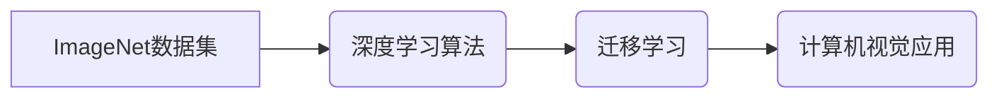

> ImageNet, 深度学习, 计算机视觉, 迁移学习, 算法, 模型, 应用

## 1. 背景介绍

人工智能（AI）的蓬勃发展，离不开大量高质量的数据和算法的推动。其中，ImageNet数据集和深度学习算法的出现，被认为是人工智能领域发展的重要里程碑。ImageNet是一个包含超过1400万张图像的庞大图像数据集，涵盖了超过2万个类别。它为计算机视觉领域的研究和应用提供了丰富的训练数据，极大地推动了深度学习算法的进步。

早期，计算机视觉领域主要依赖于手工设计的特征提取方法，这些方法需要大量的专业知识和经验，并且难以适应新的场景和任务。深度学习的出现，改变了这一局面。深度学习算法能够自动从数据中学习特征，并具有强大的泛化能力，能够应用于各种计算机视觉任务，例如图像分类、目标检测、图像分割等。

## 2. 核心概念与联系

**2.1 ImageNet 数据集**

ImageNet数据集由斯坦福大学和加州大学伯克利分校的研究人员创建，其结构清晰，类别丰富，涵盖了日常生活中的各种物体和场景。ImageNet数据集的构建，为深度学习算法的训练提供了充足的数据支持。

**2.2 深度学习算法**

深度学习算法是一种基于多层神经网络的机器学习算法。它能够自动从数据中学习特征，并具有强大的泛化能力。深度学习算法在图像分类、目标检测、图像分割等计算机视觉任务中取得了显著的成果。

**2.3 迁移学习**

迁移学习是一种利用预训练模型在新的任务上进行训练的方法。由于预训练模型已经学习了大量的通用特征，因此迁移学习能够显著提高新任务的训练效率和性能。

**2.4 核心概念关系图**



## 3. 核心算法原理 & 具体操作步骤

**3.1 算法原理概述**

深度学习算法的核心是多层神经网络。神经网络由多个层组成，每一层都包含多个神经元。神经元之间通过连接进行信息传递，每个连接都有一个权重。通过训练，神经网络能够调整权重，使得输出结果与真实值尽可能接近。

**3.2 算法步骤详解**

1. **数据预处理:** 将图像数据预处理，例如调整大小、归一化等。
2. **网络结构设计:** 设计深度神经网络的结构，包括层数、神经元数量、激活函数等。
3. **模型训练:** 使用训练数据训练模型，通过反向传播算法更新网络权重。
4. **模型评估:** 使用测试数据评估模型的性能，例如准确率、召回率等。
5. **模型调优:** 根据评估结果，调整模型参数，例如学习率、正则化参数等，以提高模型性能。

**3.3 算法优缺点**

**优点:**

* 自动特征提取，无需人工设计特征。
* 强大的泛化能力，能够应用于各种计算机视觉任务。
* 随着数据量的增加，模型性能不断提升。

**缺点:**

* 训练数据量大，训练时间长。
* 容易过拟合，需要使用正则化技术进行防止。
* 模型解释性差，难以理解模型的决策过程。

**3.4 算法应用领域**

深度学习算法在计算机视觉领域有着广泛的应用，例如：

* **图像分类:** 将图像分类到预定义的类别中。
* **目标检测:** 在图像中检测到特定目标，并对其进行定位和识别。
* **图像分割:** 将图像分割成不同的区域，每个区域代表不同的物体或场景。
* **图像生成:** 生成新的图像，例如人脸生成、场景生成等。

## 4. 数学模型和公式 & 详细讲解 & 举例说明

**4.1 数学模型构建**

深度学习算法的核心是多层神经网络，其数学模型可以表示为：

$$
y = f(W^L x^L + b^L)
$$

其中：

* $y$ 是网络的输出。
* $x^L$ 是第 $L$ 层的输入。
* $W^L$ 是第 $L$ 层的权重矩阵。
* $b^L$ 是第 $L$ 层的偏置向量。
* $f$ 是激活函数。

**4.2 公式推导过程**

深度学习算法的训练过程是通过反向传播算法来进行的。反向传播算法的核心是计算损失函数对网络权重的梯度，并根据梯度更新权重。

损失函数通常定义为预测值与真实值的差值。例如，对于图像分类任务，损失函数可以定义为交叉熵损失函数：

$$
L = -\sum_{i=1}^{C} y_i \log(\hat{y}_i)
$$

其中：

* $y_i$ 是真实标签的 one-hot 编码。
* $\hat{y}_i$ 是预测标签的概率。

**4.3 案例分析与讲解**

假设我们有一个图像分类任务，目标是将图像分类到猫和狗的类别中。我们可以使用一个简单的深度神经网络，包含两层全连接层和一个输出层。

训练过程中，我们使用 ImageNet 数据集中的猫和狗图像进行训练。通过反向传播算法，网络权重不断更新，使得模型能够将猫和狗图像分类到正确的类别中。

## 5. 项目实践：代码实例和详细解释说明

**5.1 开发环境搭建**

* Python 3.x
* TensorFlow 或 PyTorch 深度学习框架
* CUDA 和 cuDNN (可选，用于 GPU 加速)

**5.2 源代码详细实现**

```python
import tensorflow as tf

# 定义模型结构
model = tf.keras.models.Sequential([
    tf.keras.layers.Conv2D(32, (3, 3), activation='relu', input_shape=(224, 224, 3)),
    tf.keras.layers.MaxPooling2D((2, 2)),
    tf.keras.layers.Conv2D(64, (3, 3), activation='relu'),
    tf.keras.layers.MaxPooling2D((2, 2)),
    tf.keras.layers.Flatten(),
    tf.keras.layers.Dense(10, activation='softmax')
])

# 编译模型
model.compile(optimizer='adam',
              loss='sparse_categorical_crossentropy',
              metrics=['accuracy'])

# 训练模型
model.fit(x_train, y_train, epochs=10)

# 评估模型
loss, accuracy = model.evaluate(x_test, y_test)
print('Test loss:', loss)
print('Test accuracy:', accuracy)
```

**5.3 代码解读与分析**

* 代码定义了一个简单的深度神经网络模型，包含卷积层、池化层、全连接层和输出层。
* 模型使用 Adam 优化器、交叉熵损失函数和准确率作为评估指标。
* 模型使用训练数据进行训练，并使用测试数据进行评估。

**5.4 运行结果展示**

训练完成后，模型的准确率会随着训练轮数的增加而提高。

## 6. 实际应用场景

**6.1 图像分类**

* 自动识别物体，例如在自动驾驶汽车中识别交通信号灯、行人等。
* 在医疗领域，自动识别病灶，辅助医生诊断。
* 在电商领域，自动识别商品，进行商品分类和推荐。

**6.2 目标检测**

* 自动检测图像中的目标，例如在视频监控中检测到入侵者。
* 在无人机领域，自动检测目标，例如检测到障碍物。
* 在机器人领域，自动检测目标，例如检测到需要抓取的物体。

**6.3 图像分割**

* 将图像分割成不同的区域，例如分割出图像中的前景和背景。
* 在医学领域，分割出图像中的器官，辅助医生进行手术。
* 在遥感领域，分割出图像中的不同地物类型。

**6.4 未来应用展望**

随着深度学习算法的不断发展，其在计算机视觉领域的应用将更加广泛和深入。例如：

* 更准确、更鲁棒的图像识别和理解。
* 更智能的机器人和自动驾驶汽车。
* 更个性化的用户体验。

## 7. 工具和资源推荐

**7.1 学习资源推荐**

* **书籍:**
    * 深度学习 (Deep Learning) - Ian Goodfellow, Yoshua Bengio, Aaron Courville
    * 计算机视觉:算法与应用 (Computer Vision: Algorithms and Applications) - Richard Szeliski
* **在线课程:**
    * Coursera: 深度学习 Specialization
    * Udacity: 计算机视觉 Nanodegree
* **博客和网站:**
    * TensorFlow Blog: https://blog.tensorflow.org/
    * PyTorch Blog: https://pytorch.org/blog/

**7.2 开发工具推荐**

* **深度学习框架:** TensorFlow, PyTorch, Keras
* **图像处理库:** OpenCV, Pillow
* **数据可视化工具:** Matplotlib, Seaborn

**7.3 相关论文推荐**

* AlexNet: ImageNet Classification with Deep Convolutional Neural Networks (Krizhevsky et al., 2012)
* VGGNet: Very Deep Convolutional Networks for Large-Scale Image Recognition (Simonyan & Zisserman, 2014)
* ResNet: Deep Residual Learning for Image Recognition (He et al., 2015)

## 8. 总结：未来发展趋势与挑战

**8.1 研究成果总结**

ImageNet数据集和深度学习算法的结合，极大地推动了计算机视觉领域的进步。深度学习算法在图像分类、目标检测、图像分割等任务中取得了显著的成果，并广泛应用于各个领域。

**8.2 未来发展趋势**

* **更深更广的网络结构:** 研究更深、更广的网络结构，以提高模型的表达能力和泛化能力。
* **自监督学习:** 利用无标签数据进行训练，以降低对标注数据的依赖。
* **跨模态学习:** 将不同模态的数据融合在一起，例如图像和文本，以提高模型的理解能力。
* **可解释性:** 研究如何提高深度学习模型的可解释性，以便更好地理解模型的决策过程。

**8.3 面临的挑战**

* **数据获取和标注:** 深度学习算法需要大量的训练数据，而获取和标注高质量数据仍然是一个挑战。
* **计算资源:** 训练深度学习模型需要大量的计算资源，这对于个人开发者和小型公司来说是一个负担。
* **模型安全性:** 深度学习模型容易受到攻击，例如对抗样本攻击，需要研究如何提高模型的安全性。

**8.4 研究展望**

未来，深度学习算法将在计算机视觉领域继续发挥重要作用，并推动人工智能技术的进一步发展。


## 9. 附录：常见问题与解答

**9.1 如何选择合适的深度学习框架？**

TensorFlow 和 PyTorch 是两个最流行的深度学习框架，它们各有优缺点。TensorFlow 更适合于生产环境，而 PyTorch 更适合于研究和开发。

**9.2 如何处理图像数据？**

图像数据需要进行预处理，例如调整大小、归一化等。

**9.3 如何评估深度学习模型的性能？**

常用的评估指标包括准确率、召回率、F1-score 等。

**9.4 如何防止模型过拟合？**

可以使用正则化技术、数据增强、早停等方法防止模型过拟合。


作者：禅与计算机程序设计艺术 / Zen and the Art of Computer Programming 
<end_of_turn>