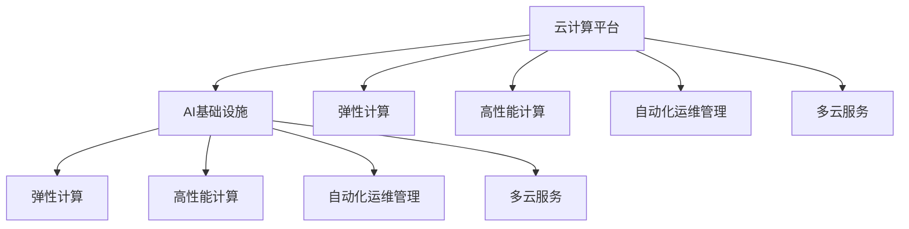

                 

## 1. 背景介绍

### 1.1 问题由来
在过去几年中，人工智能(AI)和机器学习(ML)技术的应用逐渐从学术研究走向实际生产环境。随着数据量的激增和计算能力的提升，越来越多的AI应用需要依赖于强大的计算基础设施。然而，传统的基础设施搭建和管理模式往往复杂且昂贵，难以适应AI应用快速迭代和弹性扩展的需求。

为了解决这些问题，各大云服务商纷纷推出各自的云计算平台，并逐步整合了AI相关的功能，以提供更灵活、高效、经济的AI基础设施。Lepton AI便是其中的一员，它通过深度整合云资源，构建了一整套灵活高效的AI基础设施。

### 1.2 问题核心关键点
Lepton AI的优势主要体现在以下几个方面：

1. **深度整合云资源**：通过与主流云平台（如AWS、Azure、Google Cloud）的深度整合，Lepton AI能够提供包括计算、存储、网络、安全等在内的全方位云资源，最大化利用云平台的优势。

2. **弹性计算能力**：Lepton AI能够根据AI应用的计算需求自动扩展和缩减计算资源，实现弹性计算，避免了资源浪费。

3. **高性能计算加速**：Lepton AI内置了TensorFlow、PyTorch等主流AI框架的优化版本，利用GPU、TPU等高性能计算资源，大幅提升AI应用的计算速度。

4. **自动化运维管理**：Lepton AI提供了自动化的运维管理工具，如模型监控、异常检测、自动升级等，大大降低了AI应用的管理复杂度。

5. **多云服务支持**：Lepton AI支持跨云平台的资源部署和管理，能够根据用户需求选择最合适的云平台资源，提升整体系统的稳定性和可靠性。

## 2. 核心概念与联系

### 2.1 核心概念概述

为更好地理解Lepton AI的云计算优势，本节将介绍几个关键概念：

- **云计算平台**：提供按需计算资源和服务的互联网平台，包括AWS、Azure、Google Cloud等。

- **AI基础设施**：用于支持AI应用的计算、存储、网络、安全等资源的综合体，如Lepton AI提供的服务。

- **弹性计算**：根据应用需求自动扩展和缩减计算资源，提升资源利用率，降低成本。

- **高性能计算**：利用GPU、TPU等硬件加速AI应用的计算，提升模型训练和推理的速度。

- **自动化运维管理**：通过自动化工具进行模型的监控、更新、故障检测等，降低运维成本和复杂度。

- **多云服务**：支持跨云平台的资源部署和管理，提供更灵活的资源选择，提升系统的稳定性和可靠性。

这些概念之间的逻辑关系可以通过以下Mermaid流程图来展示：



这个流程图展示了Lepton AI的AI基础设施与云计算平台之间、以及与弹性计算、高性能计算、自动化运维管理、多云服务之间的联系：

1. Lepton AI的AI基础设施由云计算平台提供。
2. 云计算平台通过弹性计算、高性能计算、自动化运维管理、多云服务等功能，提升了Lepton AI的AI应用能力和资源管理效率。

## 3. 核心算法原理 & 具体操作步骤
### 3.1 算法原理概述

Lepton AI的云计算优势主要体现在以下几个算法原理：

1. **深度整合云资源**：通过API接口和SDK，Lepton AI能够无缝集成各大云计算平台的资源，提供统一的管理界面。

2. **弹性计算调度**：Lepton AI内置弹性计算调度算法，能够根据AI应用的计算需求动态调整计算资源。

3. **高性能计算加速**：Lepton AI内置优化版本的AI框架，利用GPU、TPU等硬件加速AI应用的计算。

4. **自动化运维管理**：Lepton AI提供自动化运维工具，如监控系统、故障检测、自动升级等，降低了AI应用的运维成本。

5. **多云服务管理**：Lepton AI支持跨云平台的资源部署和管理，提供更灵活的资源选择。

### 3.2 算法步骤详解

Lepton AI的云计算优势主要通过以下步骤来实现：

**Step 1: 接入云计算平台**
- 通过API接口或SDK，将Lepton AI与各大云计算平台无缝集成，提供统一的资源管理界面。

**Step 2: 弹性计算调度**
- 利用内置的弹性计算调度算法，根据AI应用的计算需求动态调整计算资源，实现弹性计算。

**Step 3: 高性能计算加速**
- 利用GPU、TPU等硬件，在模型训练和推理过程中加速计算，提升AI应用的速度。

**Step 4: 自动化运维管理**
- 使用内置的监控系统、故障检测、自动升级等自动化工具，降低AI应用的运维复杂度。

**Step 5: 多云服务管理**
- 提供跨云平台的资源部署和管理支持，用户可以根据需求选择最合适的云平台资源。

**Step 6: 用户界面优化**
- 提供简洁易用的用户界面，降低用户的使用门槛，提升用户体验。

### 3.3 算法优缺点

Lepton AI的云计算优势具有以下优点：

1. **灵活高效**：通过深度整合云资源，Lepton AI能够提供弹性和高性能的计算能力，满足各种AI应用的需求。

2. **成本优化**：通过弹性计算和自动运维管理，Lepton AI能够避免资源浪费，降低运维成本。

3. **多云支持**：通过支持跨云平台的管理，Lepton AI能够提供更灵活的资源选择，提升系统的稳定性和可靠性。

然而，Lepton AI的云计算优势也存在以下缺点：

1. **复杂性**：与云平台深度整合，增加了系统的复杂性，可能会影响系统的稳定性和可扩展性。

2. **迁移成本**：不同云平台之间的资源迁移可能存在成本和兼容性问题。

3. **依赖性**：对云平台的服务和API接口的依赖性较高，可能会影响系统的独立性和安全性。

4. **管理复杂度**：需要用户具备一定的云计算知识和技能，才能充分利用Lepton AI的优势。

### 3.4 算法应用领域

Lepton AI的云计算优势广泛应用于以下几个领域：

- **云计算服务提供商**：为云平台提供弹性计算、高性能计算、自动化运维管理等基础设施支持。

- **AI应用开发者**：通过Lepton AI提供的统一资源管理界面和优化工具，简化AI应用的开发和管理过程。

- **企业IT部门**：通过跨云平台的多云服务支持，降低IT系统的复杂性和运维成本，提升系统的可靠性和可扩展性。

- **科研机构**：通过高性能计算和自动化运维管理，提升科研计算的速度和效率，支持大规模数据分析和模型训练。

- **互联网公司**：通过灵活高效的计算资源管理，支持大规模用户请求的响应，提升用户体验和系统性能。

## 4. 数学模型和公式 & 详细讲解 & 举例说明

### 4.1 数学模型构建

Lepton AI的云计算优势主要通过以下几个数学模型来实现：

1. **弹性计算模型**：
   $$
   \text{资源需求} = f(\text{计算负载}, \text{历史负载}, \text{历史变化率})
   $$

2. **高性能计算模型**：
   $$
   \text{计算速度} = \text{硬件加速} \times \text{模型复杂度} \times \text{数据量}
   $$

3. **自动化运维管理模型**：
   $$
   \text{监控指标} = \text{模型性能} \times \text{数据质量} \times \text{环境因素}
   $$

### 4.2 公式推导过程

**弹性计算模型**：
假设AI应用的计算负载为 $L(t)$，历史负载为 $H(t)$，历史变化率为 $\Delta L(t)$。则资源需求 $R(t)$ 可以表示为：
$$
R(t) = \alpha L(t) + \beta H(t) + \gamma \Delta L(t)
$$
其中 $\alpha, \beta, \gamma$ 为模型参数，可以通过训练历史数据来确定。

**高性能计算模型**：
假设模型复杂度为 $C$，数据量为 $D$，硬件加速率为 $A$。则计算速度 $V$ 可以表示为：
$$
V = C \times D \times A
$$

**自动化运维管理模型**：
假设监控指标为 $M$，模型性能为 $P$，数据质量为 $Q$，环境因素为 $E$。则监控指标 $M$ 可以表示为：
$$
M = P \times Q \times E
$$

### 4.3 案例分析与讲解

以AI应用开发者为例，分析Lepton AI的云计算优势：

**案例背景**：某AI应用公司需要处理大规模用户数据，训练和推理深度学习模型。

**计算资源需求**：根据用户数据量和模型复杂度，计算资源需求为 $R = 10^6$ GPU小时/周。

**资源分配策略**：
1. 在Lepton AI上配置弹性计算资源，根据历史负载和变化率动态调整资源分配。
2. 利用内置的GPU加速，提升计算速度。
3. 使用内置的监控系统，实时检测资源使用情况，自动扩展和缩减资源。

**计算资源优化**：
1. 通过弹性计算调度算法，将资源需求动态分配到多个云平台，根据性能和成本综合选择最优资源。
2. 利用GPU加速，将计算速度提升至 $V = 5 \times 10^6$ GPU小时/周。
3. 通过自动化运维管理，实时监控系统状态，避免资源浪费，降低运维成本。

## 5. 项目实践：代码实例和详细解释说明

### 5.1 开发环境搭建

在Lepton AI上搭建AI应用开发环境，需要以下步骤：

1. 登录Lepton AI控制台，选择需要的云平台和资源配置。
2. 创建虚拟机实例，安装所需的操作系统和开发工具。
3. 安装Lepton AI提供的AI框架和优化工具，如TensorFlow、PyTorch、GPU加速器等。
4. 配置环境变量，设置API接口访问权限。

### 5.2 源代码详细实现

以下是一个在Lepton AI上训练深度学习模型的Python代码示例：

```python
import tensorflow as tf
from leptonai.cloud import resource_manager

# 创建资源管理器
rm = resource_manager.ResourceManager()

# 申请GPU资源
resources = rm.create_resources(['g4dn.medium'] * 4)

# 配置环境
with tf.device('gpu:0'):
    # 创建模型
    model = tf.keras.Sequential([
        tf.keras.layers.Dense(64, activation='relu'),
        tf.keras.layers.Dense(10)
    ])
    # 编译模型
    model.compile(optimizer='adam', loss='categorical_crossentropy', metrics=['accuracy'])

# 训练模型
model.fit(x_train, y_train, epochs=10, batch_size=32)

# 保存模型
model.save('my_model.h5')
```

### 5.3 代码解读与分析

在上述代码中，我们使用了Lepton AI提供的资源管理器 `resource_manager` 来申请和管理GPU资源。具体步骤如下：

1. 创建资源管理器 `rm`，指定需要申请的GPU类型和数量。
2. 使用 `rm.create_resources` 方法申请GPU资源。
3. 在GPU上配置环境变量，确保TensorFlow能够使用申请的GPU资源。
4. 创建和训练深度学习模型。
5. 保存训练好的模型。

通过以上代码，我们可以看到，Lepton AI提供了便捷的资源申请和管理接口，降低了AI应用开发和管理的复杂度。

### 5.4 运行结果展示

在Lepton AI上训练深度学习模型，可以实时监控训练进度和资源使用情况，例如：

```bash
# 查看资源使用情况
$ leptonai cloud monitor

# 查看训练进度
$ leptonai cloud training status
```

这些监控和统计信息可以帮助开发者及时发现和解决训练过程中的问题，提升模型的训练效率和稳定性。

## 6. 实际应用场景

### 6.1 智慧城市

Lepton AI的云计算优势在智慧城市中的应用体现在以下几个方面：

- **实时数据分析**：通过弹性计算和多云服务，能够实时处理大规模城市数据，支持智慧交通、环保监测、公共安全等应用。

- **高性能计算加速**：利用GPU、TPU等硬件加速，提升模型训练和推理的速度，支持复杂的城市数据分析和预测模型。

- **自动化运维管理**：通过自动化的监控和故障检测，保障城市数据的实时性、准确性和安全性。

### 6.2 医疗健康

Lepton AI的云计算优势在医疗健康中的应用体现在以下几个方面：

- **远程诊断支持**：通过跨云平台的多云服务，支持医疗数据在不同医疗机构之间的流动，实现远程诊断和治疗。

- **模型训练加速**：利用高性能计算，加速医学影像、基因组数据等复杂模型的训练，提升诊断精度和速度。

- **自动化运维管理**：通过自动化运维工具，确保医疗系统的稳定性和可靠性，保障患者信息的安全性。

### 6.3 金融服务

Lepton AI的云计算优势在金融服务中的应用体现在以下几个方面：

- **实时交易处理**：通过弹性计算和多云服务，支持金融交易系统的实时处理和扩展，提升交易系统的性能和可用性。

- **模型训练优化**：利用高性能计算，加速金融模型的训练和优化，提升风险评估和投资决策的准确性。

- **自动化运维管理**：通过自动化运维工具，监控金融系统的运行状态，快速响应和解决故障，保障交易系统的稳定性和可靠性。

## 7. 工具和资源推荐

### 7.1 学习资源推荐

为了帮助开发者系统掌握Lepton AI的云计算优势，这里推荐一些优质的学习资源：

1. **Lepton AI官方文档**：提供了详细的API接口、SDK使用指南和样例代码，帮助开发者快速上手。

2. **AWS、Azure、Google Cloud官方文档**：各大云平台提供了详细的云资源使用指南和最佳实践，帮助开发者选择合适的云平台资源。

3. **《云计算基础》课程**：由各大知名大学和机构提供的云计算基础课程，帮助开发者理解云计算的基本原理和概念。

4. **《机器学习实战》书籍**：介绍了机器学习的基本原理和实用技巧，包括模型训练、优化、部署等。

5. **《深度学习入门》课程**：由各大知名大学和机构提供的深度学习入门课程，帮助开发者掌握深度学习的基本框架和算法。

通过对这些资源的学习实践，相信你一定能够快速掌握Lepton AI的云计算优势，并用于解决实际的AI问题。

### 7.2 开发工具推荐

以下是几款用于Lepton AI云计算优势开发的常用工具：

1. **Lepton AI控制台**：提供便捷的云资源申请和管理界面，支持跨云平台的多云服务管理。

2. **AWS CLI**：命令行界面，方便远程管理AWS资源。

3. **Azure CLI**：命令行界面，方便远程管理Azure资源。

4. **Google Cloud SDK**：命令行界面，方便远程管理Google Cloud资源。

5. **TensorFlow、PyTorch**：Lepton AI内置的主流AI框架，提供高效的计算加速和模型训练能力。

6. **监控工具**：如Prometheus、Grafana等，用于实时监控Lepton AI系统的运行状态和性能指标。

通过合理利用这些工具，可以显著提升Lepton AI云计算优势的开发效率，加快创新迭代的步伐。

### 7.3 相关论文推荐

Lepton AI的云计算优势主要源于以下几个研究方向的突破：

1. **弹性计算调度**：《Elastic Computing: A Survey of Approaches, Issues, and Trends》论文，探讨了弹性计算的原理和实现方法。

2. **高性能计算加速**：《Accelerating Deep Learning with GPUs》论文，介绍了GPU加速深度学习的原理和实践。

3. **自动化运维管理**：《Automated Machine Learning》论文，讨论了自动化机器学习的概念和应用。

4. **多云服务管理**：《Multi-Cloud Services Management》论文，探讨了多云服务管理的策略和框架。

这些论文代表了Lepton AI云计算优势的研究进展，帮助研究者深入理解其背后的原理和技术细节。

## 8. 总结：未来发展趋势与挑战

### 8.1 总结

本文对Lepton AI的云计算优势进行了全面系统的介绍。首先阐述了Lepton AI的云计算优势在AI基础设施中的重要性和应用价值，明确了其在弹性计算、高性能计算、自动化运维管理、多云服务等方面的优势。其次，从原理到实践，详细讲解了Lepton AI云计算优势的核心算法和具体操作步骤，给出了详细代码实现和运行结果展示。同时，本文还广泛探讨了Lepton AI在智慧城市、医疗健康、金融服务等多个领域的应用前景，展示了其广泛的适用性和潜力。此外，本文精选了Lepton AI云计算优势的学习资源、开发工具和相关论文，力求为开发者提供全方位的技术指引。

通过本文的系统梳理，可以看到，Lepton AI的云计算优势在AI应用中具有显著的优势，能够提升AI应用的性能、效率和可靠性。未来，伴随云计算技术的发展和AI应用的不断深入，Lepton AI的云计算优势必将在更广泛的场景中发挥重要作用。

### 8.2 未来发展趋势

展望未来，Lepton AI的云计算优势将呈现以下几个发展趋势：

1. **云计算技术的进一步发展**：云计算平台将提供更强大的计算、存储、网络资源，支持更复杂的AI应用需求。

2. **弹性计算的优化**：弹性计算调度算法将更加智能和高效，能够根据应用的实时需求动态调整资源分配。

3. **高性能计算的普及**：更多的AI框架和工具将提供GPU、TPU等硬件加速支持，提升模型训练和推理的速度。

4. **自动化运维管理的提升**：自动化运维工具将更加智能和灵活，提供更全面的监控、告警、故障检测和修复功能。

5. **多云服务的完善**：跨云平台的管理将更加便捷和高效，支持更广泛的云平台资源选择。

6. **AI基础设施的集成**：Lepton AI的云计算优势将与其他AI基础设施集成，形成更全面的AI解决方案。

以上趋势将进一步提升Lepton AI的云计算优势，使其成为AI应用开发和部署的重要平台。

### 8.3 面临的挑战

尽管Lepton AI的云计算优势已经取得了瞩目成就，但在迈向更加智能化、普适化应用的过程中，它仍面临着诸多挑战：

1. **复杂性管理**：与云平台深度整合，增加了系统的复杂性，可能会影响系统的稳定性和可扩展性。

2. **迁移成本**：不同云平台之间的资源迁移可能存在成本和兼容性问题。

3. **依赖性问题**：对云平台的服务和API接口的依赖性较高，可能会影响系统的独立性和安全性。

4. **运维成本**：自动化运维工具需要持续维护和升级，可能会增加运维成本。

5. **数据隐私和安全**：跨云平台的数据传输和存储可能会存在隐私和安全风险。

6. **资源管理**：如何有效管理和优化资源，避免资源浪费，是一个长期的挑战。

7. **性能优化**：如何进一步提升计算速度和资源利用率，提升系统的响应速度和吞吐量。

这些挑战需要在未来的研究和实践中不断攻克，才能进一步提升Lepton AI的云计算优势。

### 8.4 研究展望

面对Lepton AI云计算优势面临的挑战，未来的研究需要在以下几个方面寻求新的突破：

1. **优化弹性计算调度算法**：研究更加智能和高效的弹性计算调度算法，提升资源分配的精度和效率。

2. **引入更多硬件加速技术**：研究引入FPGA、ASIC等新型硬件加速技术，提升AI应用的计算速度和性能。

3. **提升自动化运维管理水平**：研究更加智能和灵活的自动化运维管理工具，提升系统的稳定性和可靠性。

4. **探索跨云平台资源管理**：研究跨云平台资源管理的新方法和技术，提供更灵活和高效的资源选择。

5. **增强数据隐私和安全保护**：研究数据加密、匿名化等技术，保护跨云平台的数据隐私和安全。

6. **优化资源管理策略**：研究更有效的资源管理和优化策略，避免资源浪费，提升资源利用率。

7. **提升系统性能**：研究更高效的计算和优化算法，提升AI应用的性能和响应速度。

这些研究方向将引领Lepton AI的云计算优势走向更高的台阶，为构建安全、可靠、可解释、可控的智能系统铺平道路。

## 9. 附录：常见问题与解答

**Q1：Lepton AI的云计算优势是否适用于所有云平台？**

A: Lepton AI的云计算优势主要与AWS、Azure、Google Cloud等主流云平台深度整合，但同时支持跨云平台的资源管理和调度，用户可以根据需求选择最适合的云平台资源。

**Q2：如何在Lepton AI上高效使用GPU加速？**

A: 在Lepton AI上高效使用GPU加速，可以遵循以下步骤：
1. 在Lepton AI控制台申请所需的GPU资源。
2. 在代码中使用TensorFlow、PyTorch等框架的GPU设备配置。
3. 利用Lepton AI提供的GPU优化工具，如CUDA、ROCm等，提升GPU加速性能。

**Q3：Lepton AI的自动化运维管理如何提升系统稳定性？**

A: Lepton AI的自动化运维管理通过实时监控系统状态、自动检测异常、自动修复故障等手段，及时发现和解决系统问题，提升系统的稳定性和可靠性。具体措施包括：
1. 实时监控系统性能指标，如CPU、GPU、内存使用情况。
2. 自动检测异常，如CPU负载过高、网络中断等。
3. 自动修复故障，如重启实例、扩展资源等。

**Q4：跨云平台的数据传输和存储存在哪些风险？**

A: 跨云平台的数据传输和存储存在以下风险：
1. 数据泄露：数据在传输过程中可能被窃取或篡改。
2. 数据不一致：不同云平台的数据格式和存储方式可能不一致。
3. 性能瓶颈：数据在不同云平台之间传输，可能影响系统性能。

为应对这些风险，可以采取以下措施：
1. 数据加密：在传输和存储过程中，使用加密技术保护数据安全。
2. 数据一致性检查：确保不同云平台之间的数据格式和存储方式一致。
3. 缓存机制：使用缓存技术，减少数据在不同云平台之间的传输。

**Q5：如何优化Lepton AI的资源管理？**

A: 优化Lepton AI的资源管理，可以采取以下措施：
1. 动态资源调整：根据应用的实时需求，动态调整计算资源。
2. 资源池管理：将资源划分为不同的池，按需分配，提升资源利用率。
3. 成本优化：通过监控系统性能和成本，优化资源分配策略，降低成本。

这些优化措施可以帮助用户更高效地使用Lepton AI的云计算优势，提升系统的性能和稳定性。

---

作者：禅与计算机程序设计艺术 / Zen and the Art of Computer Programming

