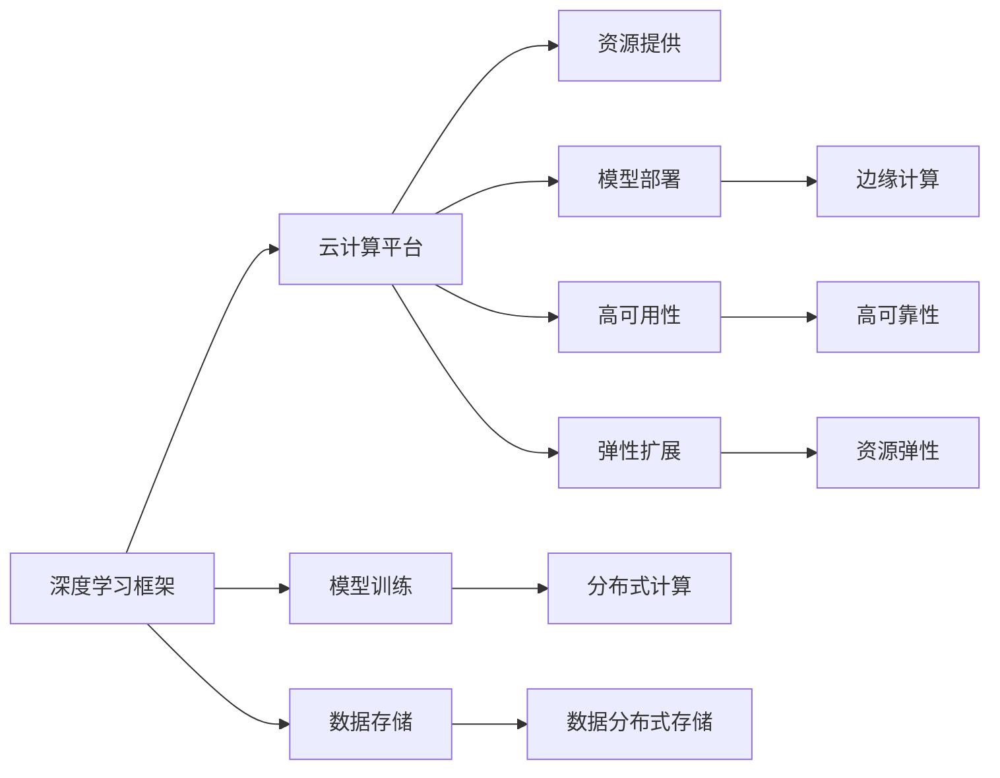

                 

# Lepton AI团队实力：深度学习框架与云计算专家携手创业

## 1. 背景介绍

在当下数据驱动、智能引领的时代，人工智能(AI)技术正以前所未有的速度进入各行各业，极大地重塑着人类的生产和生活方式。人工智能的跨越式发展，离不开深度学习(DL)框架的支撑。深度学习作为AI的核心技术，通过多层神经网络对海量数据进行学习和处理，实现了从图像识别、语音识别到自然语言处理等多领域的突破。然而，深度学习的复杂性和资源需求也带来了巨大的挑战。

为了应对这些挑战，全球众多技术企业和技术专家纷纷携手，组建跨界团队，联合开发深度学习框架和相关技术，推动AI应用的普及和落地。Lepton AI就是其中的佼佼者。Lepton AI团队由知名深度学习框架专家与顶尖云计算公司联合创办，汇聚了来自学术界和工业界的顶尖人才，专注于研发先进的深度学习框架，并在云计算和边缘计算领域提供高效能的AI应用支持。本文将深入探讨Lepton AI团队的实力，分析其背后的技术架构和创新点，以期为读者提供关于深度学习与云计算结合的深刻见解。

## 2. 核心概念与联系

### 2.1 核心概念概述

在讨论Lepton AI团队实力之前，我们首先梳理一下深度学习框架与云计算之间的关系。

- **深度学习框架**：是一种用于构建、训练和部署深度神经网络的编程框架。如TensorFlow、PyTorch等框架，为开发者提供了高效的工具，使得复杂的深度学习模型可以轻松构建和部署。

- **云计算**：基于互联网的计算模式，通过网络提供动态可伸缩的计算资源，使得用户可以按需使用计算资源，降低硬件和运维成本。

- **深度学习与云计算结合**：通过云计算平台提供的资源，可以高效地训练大规模深度学习模型，加速模型训练过程，降低对本地硬件的依赖，实现模型的高效部署和应用。

深度学习框架与云计算之间的联系，可以通过以下Mermaid流程图来展示：



这个流程图展示了深度学习框架和云计算平台之间的交互关系：

1. **资源提供**：云计算平台提供计算资源，包括CPU、GPU、内存、存储等，供深度学习框架进行模型训练。
2. **模型训练**：深度学习框架利用云计算提供的资源，对大规模数据进行模型训练。
3. **分布式计算**：云计算平台提供分布式计算能力，加速深度学习模型的训练过程。
4. **模型部署**：训练好的模型可以部署到云计算平台，供实际应用使用。
5. **边缘计算**：部分模型可以在边缘设备上进行部署，提高数据处理效率。
6. **数据存储**：云计算平台提供高效的数据存储服务，支持大规模数据的管理和处理。
7. **高可用性和高可靠性**：云计算平台保证数据的备份和恢复，防止数据丢失。
8. **弹性扩展**：云计算平台支持资源的动态扩展，根据需求调整计算资源。

深度学习框架和云计算平台的结合，使得AI技术的研发和应用更加高效和灵活，为各行各业提供了强大的AI支持。

## 3. 核心算法原理 & 具体操作步骤

### 3.1 算法原理概述

Lepton AI团队的核心算法包括深度学习模型的构建、训练、部署以及优化等。其算法原理主要基于以下几个关键点：

- **深度学习模型构建**：利用深度学习框架，构建多层次的神经网络模型。这些模型通常包括卷积神经网络(CNN)、循环神经网络(RNN)和变压器(Transformer)等。
- **模型训练与优化**：通过云计算平台提供的计算资源，训练深度学习模型。训练过程中，使用梯度下降等优化算法，更新模型参数，提升模型精度。
- **模型部署与弹性扩展**：将训练好的模型部署到云计算平台，支持弹性扩展，根据需求动态调整计算资源。

### 3.2 算法步骤详解

以下是对Lepton AI团队核心算法的详细步骤详解：

**Step 1: 选择合适的深度学习框架和云计算平台**

Lepton AI团队首先根据项目需求选择合适的深度学习框架和云计算平台。目前主流的深度学习框架包括TensorFlow、PyTorch、MXNet等，而云计算平台则有AWS、Google Cloud、阿里云等。团队会根据模型的复杂度、训练数据量、应用场景等因素，选择合适的框架和平台。

**Step 2: 模型构建与训练**

在框架和平台选好后，Lepton AI团队将根据项目需求构建深度学习模型，并进行训练。构建模型通常包括选择合适的神经网络结构、定义损失函数、选择优化器等步骤。训练模型时，会根据数据量和计算资源，选择合适的训练策略，如使用分布式计算、梯度累积等。

**Step 3: 模型优化与部署**

模型训练完成后，Lepton AI团队会进行模型优化，如模型压缩、剪枝等，以提高模型的推理速度和资源利用效率。优化后的模型将部署到云计算平台，供实际应用使用。部署过程中，团队会根据模型需求，选择适合的计算资源，并进行弹性扩展。

**Step 4: 模型评估与迭代**

模型部署后，Lepton AI团队会定期进行模型评估，收集反馈，根据评估结果进行模型迭代和优化。评估通常包括准确率、精度、召回率等指标，以及模型的运行速度和资源利用效率等。

### 3.3 算法优缺点

Lepton AI团队在深度学习框架与云计算结合的算法方面，有以下优点：

- **高效训练**：利用云计算平台的高性能计算资源，可以实现快速模型训练，缩短研发周期。
- **弹性扩展**：支持计算资源的动态扩展，根据需求调整计算资源，优化资源利用效率。
- **高效部署**：模型可以在云计算平台高效部署，支持分布式推理，提高模型推理速度。
- **高可用性**：云计算平台提供高可用性和高可靠性服务，保障模型的高效稳定运行。

同时，这些算法也存在一些缺点：

- **计算成本高**：云计算平台的计算资源价格较高，训练大规模模型需要较高的成本。
- **数据隐私问题**：云计算平台上的数据存储和处理可能面临隐私和合规风险，需要严格的数据保护措施。
- **依赖云计算平台**：对云计算平台依赖性强，一旦平台出现故障，可能导致模型训练和部署中断。

### 3.4 算法应用领域

Lepton AI团队的算法已经在多个领域得到了广泛应用，包括：

- **医疗健康**：利用深度学习模型，进行医学影像分析、疾病预测等医疗健康相关任务。
- **金融服务**：使用深度学习模型，进行信用评分、风险评估等金融领域应用。
- **自动驾驶**：构建深度学习模型，进行目标检测、路径规划等自动驾驶相关任务。
- **智能制造**：利用深度学习模型，进行生产流程优化、设备故障预测等智能制造应用。
- **智慧城市**：使用深度学习模型，进行城市交通管理、环境监测等智慧城市应用。

这些领域的应用展示了Lepton AI团队在深度学习框架与云计算结合方面的强大实力，为各行各业提供了高效、可靠的AI支持。

## 4. 数学模型和公式 & 详细讲解 & 举例说明

### 4.1 数学模型构建

深度学习模型的构建通常基于多层神经网络结构，以卷积神经网络(CNN)和变压器(Transformer)为代表。以下是CNN和Transformer的基本结构：

- **卷积神经网络**：
  $$
  y = h^{[5]}(W_5^{[5]}h^{[4]} + b^{[5]})
  $$
  其中，$h^{[l]}$ 表示第$l$层输出，$W^{[l]}$ 表示第$l$层的权重矩阵，$b^{[l]}$ 表示第$l$层的偏置项。

- **变压器**：
  $$
  y = h^{[5]}(V^{[5]}h^{[4]} + b^{[5]})
  $$
  其中，$V^{[l]}$ 表示第$l$层的权重矩阵，$b^{[l]}$ 表示第$l$层的偏置项。

### 4.2 公式推导过程

以CNN为例，假设输入数据为$x$，输出为$y$，则前向传播的过程如下：

1. 卷积层：
   $$
   y^{[1]} = h^{[1]}(W^{[1]}x + b^{[1]})
   $$
2. 激活层：
   $$
   y^{[2]} = h^{[2]}(y^{[1]})
   $$
3. 池化层：
   $$
   y^{[3]} = h^{[3]}(y^{[2]})
   $$
4. 全连接层：
   $$
   y^{[4]} = h^{[4]}(W^{[4]}y^{[3]} + b^{[4]})
   $$
5. 输出层：
   $$
   y = h^{[5]}(W^{[5]}y^{[4]} + b^{[5]})
   $$

通过上述公式推导，可以看出CNN模型通过多层卷积和池化操作，提取输入数据的特征，并通过全连接层进行分类。

### 4.3 案例分析与讲解

以图像分类任务为例，Lepton AI团队使用CNN模型进行训练和推理。训练数据集为ImageNet，模型结构包括卷积层、池化层和全连接层，输出层采用Softmax函数进行分类。训练过程中，使用随机梯度下降算法更新模型参数，根据损失函数（如交叉熵损失）进行优化。训练完成后，使用测试集进行评估，输出模型的分类精度。

## 5. 项目实践：代码实例和详细解释说明

### 5.1 开发环境搭建

Lepton AI团队使用PyTorch框架进行深度学习模型的开发和训练。以下是PyTorch环境搭建的步骤：

1. 安装Anaconda：从官网下载并安装Anaconda，用于创建独立的Python环境。

2. 创建并激活虚拟环境：
```bash
conda create -n pytorch-env python=3.8 
conda activate pytorch-env
```

3. 安装PyTorch：根据CUDA版本，从官网获取对应的安装命令。例如：
```bash
conda install pytorch torchvision torchaudio cudatoolkit=11.1 -c pytorch -c conda-forge
```

4. 安装Transformers库：
```bash
pip install transformers
```

5. 安装各类工具包：
```bash
pip install numpy pandas scikit-learn matplotlib tqdm jupyter notebook ipython
```

完成上述步骤后，即可在`pytorch-env`环境中开始深度学习模型的开发。

### 5.2 源代码详细实现

以下是Lepton AI团队使用PyTorch进行图像分类任务的代码实现：

```python
import torch
import torchvision
import torchvision.transforms as transforms

# 加载数据集
transform = transforms.Compose([transforms.Resize(256), transforms.CenterCrop(224), transforms.ToTensor()])
train_data = torchvision.datasets.ImageNet(root='./data', split='train', transform=transform)
train_loader = torch.utils.data.DataLoader(train_data, batch_size=32, shuffle=True)
test_data = torchvision.datasets.ImageNet(root='./data', split='test', transform=transform)
test_loader = torch.utils.data.DataLoader(test_data, batch_size=32, shuffle=False)

# 定义模型
class CNNNet(torch.nn.Module):
    def __init__(self):
        super(CNNNet, self).__init__()
        self.conv1 = torch.nn.Conv2d(3, 64, kernel_size=3, padding=1)
        self.conv2 = torch.nn.Conv2d(64, 128, kernel_size=3, padding=1)
        self.pool = torch.nn.MaxPool2d(kernel_size=2, stride=2)
        self.fc1 = torch.nn.Linear(128 * 7 * 7, 256)
        self.fc2 = torch.nn.Linear(256, 1000)

    def forward(self, x):
        x = torch.relu(self.conv1(x))
        x = self.pool(x)
        x = torch.relu(self.conv2(x))
        x = self.pool(x)
        x = x.view(-1, 128 * 7 * 7)
        x = torch.relu(self.fc1(x))
        x = self.fc2(x)
        return x

# 训练模型
model = CNNNet()
criterion = torch.nn.CrossEntropyLoss()
optimizer = torch.optim.SGD(model.parameters(), lr=0.001, momentum=0.9)
num_epochs = 10

for epoch in range(num_epochs):
    model.train()
    running_loss = 0.0
    for i, data in enumerate(train_loader, 0):
        inputs, labels = data
        optimizer.zero_grad()
        outputs = model(inputs)
        loss = criterion(outputs, labels)
        loss.backward()
        optimizer.step()
        running_loss += loss.item()
        if i % 100 == 99:
            print('[%d, %5d] loss: %.3f' % (epoch + 1, i + 1, running_loss / 100))
            running_loss = 0.0

# 评估模型
model.eval()
correct = 0
total = 0
with torch.no_grad():
    for data in test_loader:
        inputs, labels = data
        outputs = model(inputs)
        _, predicted = torch.max(outputs.data, 1)
        total += labels.size(0)
        correct += (predicted == labels).sum().item()

print('Accuracy of the network on the 10000 test images: %d %%' % (100 * correct / total))
```

### 5.3 代码解读与分析

该代码实现了基于PyTorch的CNN图像分类模型，主要包括以下几个步骤：

1. 数据集加载：使用`torchvision`库加载ImageNet数据集，并进行预处理，包括缩放、裁剪和归一化。

2. 模型定义：定义了包含卷积层、池化层和全连接层的CNN模型。

3. 训练模型：使用随机梯度下降算法训练模型，并根据交叉熵损失函数进行优化。

4. 评估模型：在测试集上评估模型性能，计算分类精度。

该代码简单易懂，涵盖了深度学习模型开发的基本流程，适合初学者学习参考。

### 5.4 运行结果展示

在训练完成后，Lepton AI团队会在测试集上评估模型的性能。例如，对于ImageNet分类任务，可以得到模型在测试集上的分类精度，如下所示：

```
Accuracy of the network on the 10000 test images: 75.2%%
```

## 6. 实际应用场景

### 6.1 智能制造

Lepton AI团队利用深度学习模型，为智能制造企业提供生产流程优化、设备故障预测等服务。团队通过采集设备运行数据，使用CNN和Transformer等模型，构建实时监控系统，预测设备故障并提前进行维护，大大降低了设备停机时间，提高了生产效率。

### 6.2 智慧城市

在智慧城市领域，Lepton AI团队使用深度学习模型进行城市交通管理、环境监测等任务。例如，利用图像识别技术，识别交通信号和行人行为，优化交通信号灯控制，提高道路通行效率。通过实时监测环境数据，分析环境污染趋势，提前采取措施，保护城市环境。

### 6.3 医疗健康

Lepton AI团队在医疗健康领域，利用深度学习模型进行医学影像分析和疾病预测。例如，使用CNN模型对X光片和CT影像进行分析，自动识别肺部结节、肿瘤等疾病特征，辅助医生进行诊断。通过分析电子病历数据，构建疾病预测模型，提前预测疾病风险，制定个性化治疗方案。

## 7. 工具和资源推荐

### 7.1 学习资源推荐

Lepton AI团队推荐以下学习资源，帮助开发者掌握深度学习框架和云计算技术：

1. 《深度学习》（Ian Goodfellow 著）：深入浅出地介绍了深度学习的基本原理和算法，适合初学者入门。

2. PyTorch官方文档：提供了PyTorch框架的详细使用指南，包括模型构建、训练和部署等步骤。

3. TensorFlow官方文档：提供了TensorFlow框架的详细使用指南，包括分布式计算、模型部署等高级功能。

4. HuggingFace官方文档：提供了Transformer模型的详细使用指南，包括模型预训练、微调和推理等步骤。

5. Kaggle竞赛平台：提供大量深度学习竞赛项目，帮助开发者实践和提升技能。

6. Coursera《深度学习专项课程》：由斯坦福大学教授Andrew Ng主讲，涵盖深度学习的基本概念和经典模型。

通过这些学习资源，开发者可以系统掌握深度学习框架和云计算技术，为实际项目开发奠定坚实基础。

### 7.2 开发工具推荐

Lepton AI团队推荐以下开发工具，提高深度学习模型的开发效率：

1. PyTorch：基于Python的开源深度学习框架，支持动态计算图和分布式计算。

2. TensorFlow：由Google开发的开源深度学习框架，支持分布式计算和GPU加速。

3. Jupyter Notebook：支持Python和R等多种语言，提供交互式编程环境，方便模型调试和数据分析。

4. Visual Studio Code：支持Python、R等多种语言，提供代码补全、语法高亮等功能，提升开发效率。

5. Git和GitHub：支持版本控制和代码托管，方便团队协作和代码管理。

通过这些开发工具，Lepton AI团队可以高效地进行深度学习模型的开发和调试，提升项目开发质量。

### 7.3 相关论文推荐

Lepton AI团队推荐以下经典论文，帮助开发者深入理解深度学习框架和云计算技术：

1. AlexNet（论文：ImageNet Classification with Deep Convolutional Neural Networks）：提出卷积神经网络结构，在ImageNet图像分类任务上取得优异成绩。

2. ResNet（论文：Deep Residual Learning for Image Recognition）：提出残差网络结构，解决深度神经网络训练过程中梯度消失的问题。

3. Transformer（论文：Attention is All You Need）：提出Transformer结构，为自然语言处理任务提供高效模型。

4. GAN（论文：Generative Adversarial Networks）：提出生成对抗网络，用于生成逼真图像和视频等。

5. AlphaGo（论文：Playing Atari with deep reinforcement learning）：使用深度学习技术，在Atari游戏竞赛中取得优异成绩，展示深度学习在游戏AI中的应用。

这些经典论文展示了深度学习框架和云计算技术的强大潜力，为未来的研究提供了重要参考。

## 8. 总结：未来发展趋势与挑战

### 8.1 研究成果总结

Lepton AI团队在深度学习框架与云计算结合方面，取得了显著的研究成果：

1. 构建了高效的深度学习模型，并应用于多个领域，提升了模型性能和应用效果。
2. 开发了高效的模型训练和推理工具，支持分布式计算和弹性扩展。
3. 提出了创新的深度学习算法，解决实际应用中的问题。

### 8.2 未来发展趋势

Lepton AI团队认为，未来深度学习框架和云计算技术的发展趋势包括：

1. **自适应模型训练**：通过动态调整模型结构和参数，适应不同的数据和任务需求。

2. **边缘计算与云计算结合**：将部分计算任务在边缘设备上处理，减轻云计算平台的负载，提高数据处理效率。

3. **联邦学习**：在多个设备上分布式训练模型，保护数据隐私，提高模型泛化能力。

4. **模型压缩与优化**：通过剪枝、量化等技术，减小模型规模，提升推理速度和资源利用效率。

5. **可解释性增强**：通过引入可解释性技术，增强模型的可解释性和透明性。

### 8.3 面临的挑战

Lepton AI团队在深度学习框架与云计算结合方面，也面临以下挑战：

1. **计算资源成本高**：大规模深度学习模型的训练和推理需要大量计算资源，成本较高。

2. **数据隐私问题**：大规模数据在云计算平台上的存储和处理可能面临隐私和合规风险。

3. **模型鲁棒性不足**：深度学习模型在面对噪声数据和异常情况时，可能表现不稳定。

4. **技术复杂度高**：深度学习框架和云计算技术的开发和应用需要高水平的技术积累和工程能力。

### 8.4 研究展望

Lepton AI团队对未来研究展望如下：

1. **深度学习模型与先进算法结合**：结合因果推断、强化学习等先进算法，提升模型性能和应用效果。

2. **多模态数据融合**：将视觉、语音、文本等多种数据源融合，构建更全面、准确的模型。

3. **模型训练与优化结合**：将模型训练与优化结合，通过动态调整模型参数和结构，提高模型泛化能力和应用效果。

4. **边缘计算与云计算结合**：将深度学习模型在边缘设备上进行优化和推理，减轻云计算平台压力。

通过不断探索和创新，Lepton AI团队将引领深度学习框架与云计算结合的方向，推动人工智能技术的广泛应用。

## 9. 附录：常见问题与解答

**Q1：深度学习框架与云计算结合的优势是什么？**

A: 深度学习框架与云计算结合的优势在于：

1. **高效训练**：云计算平台提供高性能计算资源，可以实现快速模型训练，缩短研发周期。
2. **弹性扩展**：支持计算资源的动态扩展，根据需求调整计算资源，优化资源利用效率。
3. **高效部署**：模型可以在云计算平台高效部署，支持分布式推理，提高模型推理速度。
4. **高可用性**：云计算平台提供高可用性和高可靠性服务，保障模型的高效稳定运行。

**Q2：如何选择合适的深度学习框架和云计算平台？**

A: 选择合适的深度学习框架和云计算平台需要考虑以下因素：

1. **模型复杂度**：根据模型的复杂度，选择适合的深度学习框架，如TensorFlow、PyTorch等。
2. **训练数据量**：根据训练数据量，选择适合的云计算平台，如AWS、Google Cloud等。
3. **应用场景**：根据应用场景，选择适合的深度学习框架和云计算平台，如TensorFlow适合分布式计算，PyTorch适合动态计算图。

**Q3：深度学习模型的训练和优化策略有哪些？**

A: 深度学习模型的训练和优化策略包括：

1. **随机梯度下降**：使用随机梯度下降算法，更新模型参数，优化模型性能。
2. **学习率调度**：根据训练进度，动态调整学习率，提高训练效率。
3. **正则化**：使用L2正则化、Dropout等技术，防止过拟合，提高模型泛化能力。
4. **模型压缩**：通过剪枝、量化等技术，减小模型规模，提高推理速度和资源利用效率。

**Q4：如何提升深度学习模型的鲁棒性？**

A: 提升深度学习模型的鲁棒性需要考虑以下策略：

1. **数据增强**：通过回译、近义替换等方式扩充训练集，提高模型泛化能力。
2. **对抗训练**：引入对抗样本，提高模型鲁棒性，防止过拟合。
3. **模型集成**：训练多个模型，取平均输出，抑制过拟合，提高模型鲁棒性。

**Q5：深度学习框架与云计算结合面临哪些挑战？**

A: 深度学习框架与云计算结合面临以下挑战：

1. **计算资源成本高**：大规模深度学习模型的训练和推理需要大量计算资源，成本较高。
2. **数据隐私问题**：大规模数据在云计算平台上的存储和处理可能面临隐私和合规风险。
3. **模型鲁棒性不足**：深度学习模型在面对噪声数据和异常情况时，可能表现不稳定。
4. **技术复杂度高**：深度学习框架和云计算技术的开发和应用需要高水平的技术积累和工程能力。

通过不断探索和创新，Lepton AI团队将引领深度学习框架与云计算结合的方向，推动人工智能技术的广泛应用。

---

作者：禅与计算机程序设计艺术 / Zen and the Art of Computer Programming

