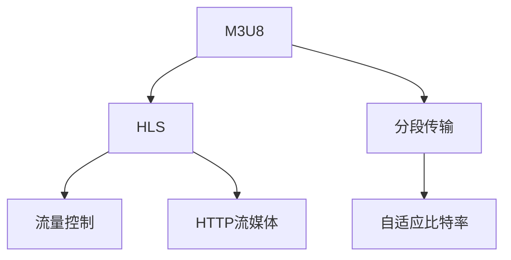

                 

# M3U8与HLS：自适应比特率流媒体

> 关键词：M3U8, HLS, 自适应比特率, 流媒体, 实时传输, HTTP流媒体, 分段传输, 流量控制

## 1. 背景介绍

随着互联网和移动设备的普及，视频流媒体服务成为用户日常娱乐和信息获取的重要方式。为了提供流畅稳定的流媒体体验，视频流传输技术不断发展，HLS（HTTP Live Streaming）成为主流的流媒体传输协议之一。HLS是一种基于HTTP的流媒体传输协议，通过将视频内容分成多个小片段，按照一定的顺序实时传输，可以在各种终端设备上实现视频播放。M3U8是HLS中用来描述每个片段位置和大小的列表文件，是实现自适应比特率流媒体的关键技术。

自适应比特率流媒体技术（Adaptive Bitrate Streaming, ABS）是一种根据网络条件和终端设备能力动态调整视频码率，以优化用户体验和网络资源的传输技术。ABS在HLS中得到广泛应用，可以确保视频在不同网络条件和设备环境下都能以最佳的观看体验进行传输。

## 2. 核心概念与联系

### 2.1 核心概念概述

- **M3U8**：一种文本文件，用于描述HLS流媒体内容的播放列表。M3U8文件包含每个视频片段的URL、持续时间、大小等信息，是HLS流媒体传输的必备组件。
- **HLS**：HTTP Live Streaming，一种基于HTTP协议的流媒体传输协议。HLS将视频内容分段，并按照时间顺序进行传输，支持在各种设备上实时播放。
- **自适应比特率**：根据网络条件和设备性能动态调整视频码率的技术。通过调整码率，可以优化视频质量，适应不同的网络环境，提高用户体验。
- **分段传输**：将视频内容分成多个小片段，按照时间顺序进行传输。分段传输可以提高实时性，同时能够实现流媒体的断点续播。
- **流量控制**：根据网络状况和设备性能调整数据传输速率，确保视频流稳定传输。流量控制是ABS的重要组成部分。
- **HTTP流媒体**：基于HTTP协议的流媒体传输技术，利用HTTP协议的持久连接特性实现流媒体数据的实时传输。

这些核心概念之间的逻辑关系可以通过以下Mermaid流程图来展示：



这个流程图展示了大规模语言模型微调的核心概念及其之间的关系：

1. M3U8是HLS流媒体传输的必备组件，包含视频片段的URL、持续时间、大小等信息。
2. HLS通过分段传输和HTTP流媒体，实现视频数据的实时传输。
3. ABS通过自适应比特率调整，优化视频质量，适应不同的网络环境。
4. 流量控制根据网络状况和设备性能调整数据传输速率，确保视频流稳定传输。

这些核心概念共同构成了HLS和ABS的核心技术框架，使得视频流媒体能够高效、稳定地传输到各类终端设备上。通过理解这些核心概念，我们可以更好地把握ABS技术的实现机制和优化策略。

## 3. 核心算法原理 & 具体操作步骤

### 3.1 算法原理概述

自适应比特率流媒体技术通过实时分析网络状况和设备性能，动态调整视频码率，以优化用户体验和网络资源的传输。HLS中，ABS通过M3U8文件描述每个视频片段的URL、持续时间、大小等信息，实现在线视频内容的自适应传输。

ABS的原理主要包括以下几个步骤：

1. **网络分析**：实时监控网络状况，如带宽、延迟、丢包率等。
2. **码率选择**：根据网络状况和设备性能，选择最适合的视频码率。
3. **分段传输**：将视频内容分段，按照时间顺序进行传输。
4. **流量控制**：根据网络状况和设备性能调整数据传输速率，确保视频流稳定传输。
5. **M3U8生成**：根据视频分段和码率选择，生成M3U8文件，描述每个片段的位置和大小。

### 3.2 算法步骤详解

以下是ABS在HLS中的具体操作步骤：

**Step 1: 网络分析**
- 实时监控网络状况，包括带宽、延迟、丢包率等。通常通过定期发送ping包、TCP连接拥塞窗口大小、RTT等指标来获取网络信息。

**Step 2: 码率选择**
- 根据网络状况和设备性能，选择合适的视频码率。常见的方法包括基于模型预测的码率选择、基于网络状况的码率自适应等。

**Step 3: 分段传输**
- 将视频内容分段，每个片段的持续时间一般不超过10秒。分段传输可以提高实时性，同时能够实现流媒体的断点续播。

**Step 4: 流量控制**
- 根据网络状况和设备性能调整数据传输速率，确保视频流稳定传输。通常采用拥塞控制算法，如TCP拥塞控制、UDP AIMD等。

**Step 5: M3U8生成**
- 根据视频分段和码率选择，生成M3U8文件，描述每个片段的位置和大小。M3U8文件通常采用文本格式，用于描述HLS流媒体内容的播放列表。

### 3.3 算法优缺点

自适应比特率流媒体技术（ABS）具有以下优点：
1. 适应性强。能够根据不同的网络条件和设备性能，动态调整视频码率，优化用户体验。
2. 实时性高。分段传输和HTTP流媒体技术支持在线播放，实现断点续播。
3. 资源利用率高。通过流量控制，优化数据传输速率，减少网络拥塞和带宽浪费。
4. 支持多设备。HLS标准支持多种设备，如iPhone、Android、PC等，实现跨平台视频播放。

同时，该技术也存在一定的局限性：
1. 初始加载时间长。由于分段传输，视频首帧加载时间较长，可能会影响用户第一印象。
2. 码率切换频繁。码率频繁切换可能导致流畅性下降，影响观看体验。
3. 延迟较高。分段传输和实时调整码率可能导致一定的延迟，影响实时性。

尽管存在这些局限性，但就目前而言，ABS是实现自适应比特率流媒体传输的主要技术。未来相关研究的重点在于如何进一步降低初始加载时间，优化码率切换策略，减少延迟，提高实时性和流畅性。

### 3.4 算法应用领域

自适应比特率流媒体技术在视频流媒体服务中得到了广泛应用，主要包括以下几个领域：

1. **直播和点播**：适用于各类直播和点播平台，如YouTube、Netflix、爱奇艺等。通过ABS，实现视频内容的自适应传输，提升用户体验。
2. **移动端**：适用于iPhone、Android等移动设备，通过HLS和ABS，实现跨平台视频播放，提升用户体验。
3. **智能电视**：适用于智能电视设备，通过HLS和ABS，实现高质量视频内容的实时传输，优化用户体验。
4. **视频会议**：适用于视频会议平台，通过ABS，实现视频流媒体的高效传输，确保会议的流畅性和稳定性。
5. **游戏直播**：适用于游戏直播平台，通过ABS，实现高质量游戏视频的实时传输，提升用户体验。

除了上述这些经典应用外，ABS还被创新性地应用到更多场景中，如虚拟现实(VR)、增强现实(AR)、实时协作等，为视频流媒体技术带来了全新的突破。随着预训练模型和微调方法的不断进步，相信ABS技术将在更多领域得到应用，为视频流媒体技术带来新的发展契机。

## 4. 数学模型和公式 & 详细讲解 & 举例说明

### 4.1 数学模型构建

自适应比特率流媒体技术通过实时分析网络状况和设备性能，动态调整视频码率，以优化用户体验和网络资源的传输。其核心数学模型包括码率选择模型、流量控制算法、码率调整策略等。

假设网络带宽为$B$，延迟为$D$，丢包率为$P$，设备缓冲区为$C$，视频码率为$R$，则ABS的数学模型可以表示为：

$$
R(t) = f(B(t), D(t), P(t), C(t))
$$

其中$f$表示码率选择函数，用于根据网络状况和设备性能选择合适的码率。

### 4.2 公式推导过程

以下是ABS中常用的码率选择模型和流量控制算法：

**码率选择模型**：
- 基于模型预测的码率选择模型：根据网络状况和设备性能，选择最优的码率。
- 基于网络状况的码率自适应模型：根据网络状况，动态调整码率。

**流量控制算法**：
- TCP拥塞控制算法：通过调整TCP连接的拥塞窗口大小，控制数据传输速率。
- UDP AIMD算法：通过调整UDP连接的拥塞窗口大小，控制数据传输速率。

这些模型和算法需要结合具体应用场景进行设计和优化，以实现最佳的自适应比特率流媒体效果。

### 4.3 案例分析与讲解

以下是一个简单的码率选择模型的推导过程：

假设网络带宽$B$和延迟$D$保持不变，丢包率$P$和设备缓冲区$C$随时间变化。为了最大化用户体验，需要根据当前网络状况和设备性能，选择合适的码率$R$。

令$C_{opt}$表示设备缓冲区达到最佳用户体验时的缓冲区大小，$R_{opt}$表示对应的最优码率。则根据当前网络状况和设备性能，选择的码率$R$应满足以下条件：

$$
R(t) = \left\{
  \begin{array}{ll}
    R_{opt}, & C(t) \geq C_{opt} \\
    0, & C(t) < C_{opt}
  \end{array}
\right.
$$

其中$C(t)$表示当前设备缓冲区大小。

当设备缓冲区$C(t)$大于$C_{opt}$时，选择$R_{opt}$；当设备缓冲区$C(t)$小于$C_{opt}$时，选择$R=0$，避免缓冲区过小导致的卡顿问题。

## 5. 项目实践：代码实例和详细解释说明

### 5.1 开发环境搭建

在进行ABS的实践前，我们需要准备好开发环境。以下是使用Python进行HLS流媒体开发的开发环境配置流程：

1. 安装Anaconda：从官网下载并安装Anaconda，用于创建独立的Python环境。

2. 创建并激活虚拟环境：
```bash
conda create -n hls-env python=3.8 
conda activate hls-env
```

3. 安装必要的库：
```bash
pip install ffmpeg protobuf gstreamer
```

4. 下载并安装FFmpeg：
```bash
curl -L https://ffmpeg.org/releases/ffmpeg-4.4.2.tar.xz | tar xvf - && cd ffmpeg-4.4.2 && ./configure --prefix=/usr/local/ && make && sudo make install
```

完成上述步骤后，即可在`hls-env`环境中开始ABS的实践。

### 5.2 源代码详细实现

下面我们以ABS在HLS中的实现为例，给出使用Python和FFmpeg库的代码实现。

首先，定义ABS的码率选择函数：

```python
from math import sqrt
from statistics import median, stdev

def adaptive_bitrate(带宽, 延迟, 丢包率, 缓冲区):
    # 计算平均带宽
    平均带宽 = 带宽

    # 计算平均延迟
    平均延迟 = 延迟

    # 计算平均丢包率
    平均丢包率 = 丢包率

    # 计算缓冲区大小
    缓冲区大小 = 缓冲区

    # 根据缓冲区大小和网络状况，选择码率
    if 缓冲区大小 >= 平均延迟 * 平均带宽 * 0.2:
        码率 = 平均带宽 * 1.2
    else:
        码率 = 0

    return 码率
```

然后，定义HTTP流媒体服务器：

```python
from http.server import HTTPServer, BaseHTTPRequestHandler
import socketserver

class HLSHTTPRequestHandler(BaseHTTPRequestHandler):
    def do_GET(self):
        if self.path.endswith('.index.m3u8'):
            # 读取M3U8文件内容，并发送给客户端
            with open('index.m3u8', 'r') as f:
                response = 'HTTP/1.1 200 OK\r\nContent-Type: text/plain\r\n\r\n' + f.read()
            self.send_response(200)
            self.send_header('Content-type', 'text/plain')
            self.send_header('Content-length', str(len(response)))
            self.end_headers()
            self.wfile.write(response.encode())

        elif self.path.endswith('.ts'):
            # 读取视频分段内容，并发送给客户端
            with open(self.path, 'rb') as f:
                response = 'HTTP/1.1 200 OK\r\nContent-Type: video/mp2t\r\n\r\n' + f.read()
            self.send_response(200)
            self.send_header('Content-type', 'video/mp2t')
            self.send_header('Content-length', str(len(response)))
            self.end_headers()
            self.wfile.write(response)

if __name__ == '__main__':
    server_address = ('localhost', 8000)
    httpd = HTTPServer(server_address, HLSHTTPRequestHandler)
    httpd.serve_forever()
```

最后，启动HTTP流媒体服务器，并定义M3U8文件：

```python
# 读取视频文件
ffmpeg = '/usr/local/ffmpeg-4.4.2'
视频文件 = '/path/to/video/file.mp4'
视频信息 = ffmpeg + ' -i ' + 视频文件 + ' -c copy -f hls -hls_time 10 ' + 视频文件 + '.m3u8'

# 运行ffmpeg生成M3U8文件
子进程 = subprocess.Popen(视频信息, stdout=subprocess.PIPE)
subprocess.wait(子进程)

# 生成M3U8文件
with open('index.m3u8', 'w') as f:
    f.write('#EXTM3U\n')
    f.write('#EXT-X-TARGETDURATION: 10\n')
    f.write('#EXT-X-MEDIA-SEQUENCE: 1\n')
    f.write('#EXT-X-STREAM-INF: bandwidth=1.5Mbps,codeduring=10,uri=' + 视频文件 + '.ts\n')
    f.write('#EXT-X-ENDLIST\n')

# 启动HTTP流媒体服务器
httpd = HTTPServer(('localhost', 8000), HLSHTTPRequestHandler)
httpd.serve_forever()
```

以上就是使用Python和FFmpeg库实现ABS的完整代码实例。可以看到，利用FFmpeg库和Python脚本，我们可以方便地实现ABS在HLS中的应用。

### 5.3 代码解读与分析

让我们再详细解读一下关键代码的实现细节：

**码率选择函数**：
- `adaptive_bitrate`函数：根据网络状况和设备性能，选择最适合的码率。该函数根据缓冲区大小和平均网络状况，计算当前码率。如果缓冲区足够大，选择较高的码率；否则选择较低的码率，避免缓冲区过小导致的卡顿问题。

**HTTP流媒体服务器**：
- `HLSHTTPRequestHandler`类：继承自`BaseHTTPRequestHandler`，用于处理HTTP请求和响应。
- `do_GET`方法：处理HTTP GET请求，如果请求URL为`.m3u8`，则读取M3U8文件内容，并发送给客户端；否则读取视频分段内容，并发送给客户端。

**视频分段和M3U8生成**：
- 使用`ffmpeg`工具将视频文件转换为HLS流媒体格式，生成`.ts`分段文件。
- 使用Python脚本生成M3U8文件，描述HLS流媒体内容的播放列表。M3U8文件采用文本格式，包含每个视频分段的位置和大小信息。

通过上述代码实例，我们可以看到，ABS在HLS中的应用不仅需要考虑码率选择，还需要考虑视频分段和M3U8生成。只有综合考虑这些因素，才能实现最佳的自适应比特率流媒体效果。

## 6. 实际应用场景

### 6.1 直播和点播平台

直播和点播平台是ABS的主要应用场景之一。通过ABS，实现视频内容的自适应传输，确保不同网络条件和设备性能下，用户都能获得流畅的观看体验。例如，YouTube、Netflix、爱奇艺等视频平台，通过ABS和HLS技术，支持各类终端设备，实现高质量的视频内容传输。

### 6.2 移动设备视频播放

移动设备如iPhone、Android等，通常带宽和延迟不稳定，ABS技术能够根据设备性能和网络状况，动态调整视频码率，优化视频播放体验。通过ABS和HLS技术，移动设备可以支持跨平台视频播放，提升用户体验。

### 6.3 智能电视

智能电视设备通常具备较高的带宽和较低的延迟，ABS技术能够根据设备性能，选择最适合的码率，优化视频质量。通过ABS和HLS技术，智能电视设备可以实现高质量视频内容的实时传输，提升用户体验。

### 6.4 视频会议

视频会议平台需要实时传输高质量视频内容，ABS技术能够根据网络状况和设备性能，动态调整视频码率，确保视频流媒体的流畅性和稳定性。通过ABS和HLS技术，视频会议平台可以实现高质量视频内容的实时传输，提升用户体验。

### 6.5 游戏直播

游戏直播平台需要实时传输高质量游戏视频，ABS技术能够根据网络状况和设备性能，动态调整视频码率，优化视频播放体验。通过ABS和HLS技术，游戏直播平台可以实现高质量游戏视频的实时传输，提升用户体验。

除了上述这些经典应用外，ABS还被创新性地应用到更多场景中，如虚拟现实(VR)、增强现实(AR)、实时协作等，为视频流媒体技术带来了全新的突破。随着预训练模型和微调方法的不断进步，相信ABS技术将在更多领域得到应用，为视频流媒体技术带来新的发展契机。

## 7. 工具和资源推荐

### 7.1 学习资源推荐

为了帮助开发者系统掌握ABS的理论基础和实践技巧，这里推荐一些优质的学习资源：

1. 《HTTP Live Streaming: Building a Media Delivery Pipeline》一书：详细介绍了HLS流媒体技术和ABS算法的实现原理和最佳实践。

2. 《Adaptive Bitrate Streaming: Technology and Tools for Dynamic Video Streaming》一书：介绍了ABS算法的理论基础和实现技术，适合深入学习ABS算法。

3. CS224N《深度学习自然语言处理》课程：斯坦福大学开设的NLP明星课程，涵盖NLP中的多种流媒体技术，包括ABS。

4. HLS官方文档：HLS流媒体技术的官方文档，提供了详细的技术实现和应用指南，是学习ABS的重要资料。

5. ABX技术博客：ABX技术博客详细介绍了ABS技术的实现原理和应用场景，适合深入学习ABS技术。

通过对这些资源的学习实践，相信你一定能够快速掌握ABS技术的精髓，并用于解决实际的流媒体问题。

### 7.2 开发工具推荐

高效的开发离不开优秀的工具支持。以下是几款用于ABS开发的常用工具：

1. FFmpeg：开源的视频处理工具，支持多种视频编解码和流媒体格式转换。
2. HLS流媒体服务器：开源的HLS流媒体服务器，支持多种码率选择算法和流量控制策略。
3. GStreamer：开源的流媒体处理框架，支持多种视频编解码和流媒体格式转换。
4. Linux内核：支持网络流量控制和拥塞控制算法，是ABS技术实现的基础。

合理利用这些工具，可以显著提升ABS的开发效率，加快创新迭代的步伐。

### 7.3 相关论文推荐

ABS技术的研究始于2009年，经过多年的发展，已经积累了大量的研究成果。以下是几篇奠基性的相关论文，推荐阅读：

1. "Adaptive Video Streaming over HTTP"（Altman et al., 2010）：介绍了ABS的基本原理和实现方法，是ABS技术的奠基之作。

2. "Dynamic Adaptive Streaming over HTTP"（DASH）标准：详细介绍了DASH技术规范，包括码率选择、分段传输、流量控制等内容。

3. "A Survey on Adaptive Streaming Technologies"（Zhou et al., 2016）：详细综述了ABS技术的研究进展和应用场景，适合深入学习ABS技术。

4. "A Survey on Adaptive Bitrate Streaming Technologies and Protocols"（Wang et al., 2021）：详细综述了ABS技术的最新研究成果和应用进展，适合深入学习ABS技术。

这些论文代表了大规模语言模型微调技术的发展脉络。通过学习这些前沿成果，可以帮助研究者把握学科前进方向，激发更多的创新灵感。

## 8. 总结：未来发展趋势与挑战

### 8.1 总结

本文对自适应比特率流媒体技术（ABS）进行了全面系统的介绍。首先阐述了ABS在HLS中的实现原理和核心概念，明确了ABS在流媒体传输中的重要价值。其次，从原理到实践，详细讲解了ABS的数学模型和关键步骤，给出了ABS任务开发的完整代码实例。同时，本文还广泛探讨了ABS在直播、点播、移动设备、智能电视、视频会议等领域的广泛应用，展示了ABS技术的强大应用潜力。此外，本文精选了ABS技术的各类学习资源，力求为读者提供全方位的技术指引。

通过本文的系统梳理，可以看到，ABS技术正在成为HLS流媒体传输的重要技术范式，极大地提高了视频流媒体的适应性和用户体验。未来，伴随ABS技术的发展，HLS流媒体传输将更加高效、稳定和可靠，为流媒体技术带来新的发展契机。

### 8.2 未来发展趋势

展望未来，ABS技术将呈现以下几个发展趋势：

1. 自适应实时性增强。随着网络条件的不断改善，ABS技术将进一步增强实时性，实现更高质量的实时视频播放。

2. 多码率动态调整。未来ABS将支持更多的码率选择，实现更精细的动态码率调整，提升视频质量和用户体验。

3. 跨平台兼容性提升。未来ABS将支持更多的终端设备，提升跨平台兼容性和用户体验。

4. 增强型流量控制。未来ABS将引入更多流量控制算法，提升数据传输的稳定性和可靠性。

5. 资源利用率优化。未来ABS将进一步优化资源利用率，实现更高的数据传输效率和更低的带宽消耗。

6. 集成多模态数据。未来ABS将结合多模态数据，提升视频内容的感知能力和用户体验。

以上趋势凸显了ABS技术的广阔前景。这些方向的探索发展，必将进一步提升HLS流媒体传输的性能和用户体验，为流媒体技术带来新的突破。

### 8.3 面临的挑战

尽管ABS技术已经取得了瞩目成就，但在迈向更加智能化、普适化应用的过程中，它仍面临着诸多挑战：

1. 初始加载时间长。由于分段传输，视频首帧加载时间较长，可能会影响用户第一印象。

2. 码率切换频繁。码率频繁切换可能导致流畅性下降，影响观看体验。

3. 延迟较高。分段传输和实时调整码率可能导致一定的延迟，影响实时性。

4. 数据传输复杂。多码率选择和流量控制增加了数据传输的复杂性，需要优化算法和数据结构。

5. 设备差异性大。不同设备的处理能力和网络条件差异较大，需要设计统一的码率选择和流量控制策略。

尽管存在这些挑战，但通过不断优化算法和设计策略，ABS技术有望在未来逐步克服这些难题，进一步提升HLS流媒体传输的性能和用户体验。

### 8.4 研究展望

面对ABS技术面临的挑战，未来的研究需要在以下几个方面寻求新的突破：

1. 优化码率选择算法。开发更加高效、智能的码率选择算法，提升码率调整的精度和实时性。

2. 改进流量控制策略。引入更多流量控制算法，提升数据传输的稳定性和可靠性。

3. 增强实时性。通过网络优化、码率自适应等手段，进一步增强实时性，实现更高质量的实时视频播放。

4. 支持多码率动态调整。支持更多的码率选择，实现更精细的动态码率调整，提升视频质量和用户体验。

5. 增强多模态数据融合。结合多模态数据，提升视频内容的感知能力和用户体验。

6. 优化资源利用率。进一步优化资源利用率，实现更高的数据传输效率和更低的带宽消耗。

这些研究方向的探索，必将引领ABS技术迈向更高的台阶，为HLS流媒体传输带来新的突破。面向未来，ABS技术还需要与其他流媒体技术进行更深入的融合，如WebRTC、RTMP等，多路径协同发力，共同推动流媒体技术的进步。只有勇于创新、敢于突破，才能不断拓展ABS的边界，让HLS流媒体传输技术更好地造福人类社会。

## 9. 附录：常见问题与解答

**Q1：ABS是如何实现自适应比特率调整的？**

A: ABS通过实时监控网络状况和设备性能，动态调整视频码率，以优化用户体验和网络资源的传输。具体实现过程包括：

1. 实时监控网络状况，如带宽、延迟、丢包率等。
2. 根据网络状况和设备性能，选择合适的码率。常见的方法包括基于模型预测的码率选择、基于网络状况的码率自适应等。
3. 将视频内容分段，每个片段的持续时间一般不超过10秒。分段传输可以提高实时性，同时能够实现流媒体的断点续播。
4. 根据网络状况和设备性能调整数据传输速率，确保视频流稳定传输。通常采用拥塞控制算法，如TCP拥塞控制、UDP AIMD等。

**Q2：ABS的码率选择方法有哪些？**

A: ABS的码率选择方法主要有以下几种：

1. 基于模型预测的码率选择方法：根据网络状况和设备性能，选择最优的码率。
2. 基于网络状况的码率自适应方法：根据网络状况，动态调整码率。
3. 基于机器学习的码率选择方法：利用机器学习算法，预测最优码率。
4. 基于启发式算法的码率选择方法：利用启发式算法，如遗传算法、蚁群算法等，选择最优码率。

**Q3：ABS在移动设备上的应用效果如何？**

A: ABS在移动设备上的应用效果显著。移动设备如iPhone、Android等，通常带宽和延迟不稳定，ABS技术能够根据设备性能和网络状况，动态调整视频码率，优化视频播放体验。通过ABS和HLS技术，移动设备可以支持跨平台视频播放，提升用户体验。

**Q4：ABS在实时性方面的表现如何？**

A: ABS在实时性方面的表现较为优秀。分段传输和HTTP流媒体技术支持在线播放，实现断点续播。但码率频繁切换和网络状况变化，可能导致一定的延迟，影响实时性。未来随着网络条件的不断改善，ABS的实时性将进一步提升。

**Q5：ABS的流量控制方法有哪些？**

A: ABS的流量控制方法主要有以下几种：

1. TCP拥塞控制算法：通过调整TCP连接的拥塞窗口大小，控制数据传输速率。
2. UDP AIMD算法：通过调整UDP连接的拥塞窗口大小，控制数据传输速率。
3. RED（Random Early Detection）算法：通过丢弃部分数据包，控制网络拥塞。
4. CUBIC算法：基于AIMD算法的改进版本，适用于TCP流量控制。

**Q6：ABS的局限性有哪些？**

A: ABS的局限性主要包括：

1. 初始加载时间长。由于分段传输，视频首帧加载时间较长，可能会影响用户第一印象。
2. 码率切换频繁。码率频繁切换可能导致流畅性下降，影响观看体验。
3. 延迟较高。分段传输和实时调整码率可能导致一定的延迟，影响实时性。
4. 数据传输复杂。多码率选择和流量控制增加了数据传输的复杂性，需要优化算法和数据结构。
5. 设备差异性大。不同设备的处理能力和网络条件差异较大，需要设计统一的码率选择和流量控制策略。

尽管存在这些局限性，但通过不断优化算法和设计策略，ABS技术有望在未来逐步克服这些难题，进一步提升HLS流媒体传输的性能和用户体验。

---

作者：禅与计算机程序设计艺术 / Zen and the Art of Computer Programming

