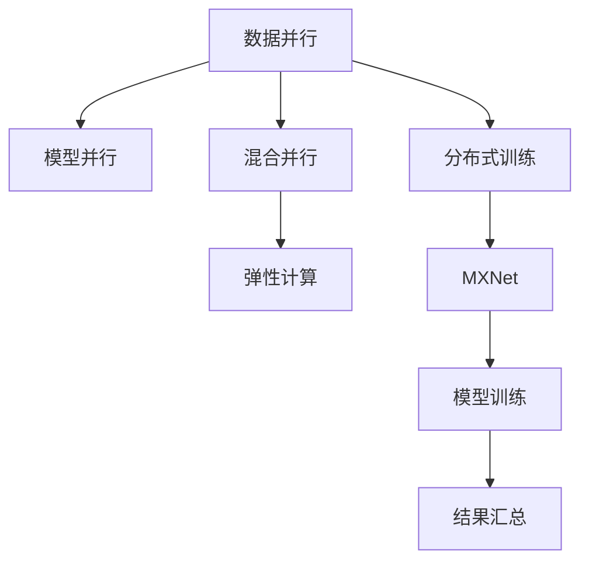

                 

# MXNet 分布式训练：在多 GPU 上训练模型

## 1. 背景介绍

在大数据和深度学习蓬勃发展的今天，分布式训练成为了一个亟需解决的问题。在图像、语音和自然语言处理等复杂任务中，模型通常包含数百万甚至数十亿个参数，单块 GPU 无法承担训练需求，因此需要通过多 GPU 并行训练来加速模型训练。本文将详细探讨使用 MXNet 进行多 GPU 分布式训练的方法，介绍其核心概念、算法原理以及实际应用场景。

## 2. 核心概念与联系

### 2.1 核心概念概述

在分布式训练中，通过将大规模模型和数据分布到多个 GPU 或计算节点上，实现并行训练，从而提高模型训练速度。主要的核心概念包括：

- 分布式训练（Distributed Training）：指通过多 GPU 或多机分布式并行训练模型，提高模型训练速度和处理大规模数据的能力。
- 数据并行（Data Parallelism）：指将训练数据划分到多个 GPU 上，各 GPU 独立处理部分数据，最终将结果进行汇聚。
- 模型并行（Model Parallelism）：指将模型分为多个部分分别在多个 GPU 上训练，最终进行参数汇总。
- 混合并行（Mixed Precision）：指使用低精度计算（如混合浮点数精度）来加速深度学习模型的训练过程，减少计算资源消耗。
- 弹性计算（Elastic Computing）：指动态调整计算资源，确保系统的高可用性和灵活性。
- MXNet：由亚马逊提出的深度学习框架，支持多 GPU 分布式训练，具有高效的计算图优化和自动混合精度等功能。

以上概念可以通过以下 Mermaid 流程图表示：



### 2.2 核心概念原理和架构

分布式训练的核心原理是将大规模计算任务分散到多个计算节点上，每个节点独立运行局部计算，最终将结果汇聚。以下是其具体的技术原理和架构：

#### 数据并行

在数据并行中，每个 GPU 分配到部分训练数据。在每个 GPU 上分别对数据进行前向传播和反向传播，最终将所有 GPU 的梯度进行汇聚，用于更新模型参数。数据并行常用于大规模数据集上训练深度学习模型，可以提高训练速度并降低内存消耗。

#### 模型并行

在模型并行中，将深度学习模型分解成多个子模型，每个子模型分布在不同的 GPU 上。各个 GPU 独立计算，再将梯度信息进行汇总，用于更新模型参数。模型并行通常用于大型模型的训练，能够充分利用多 GPU 的并行计算能力。

#### 混合并行

混合并行结合了数据并行和模型并行，使用低精度计算（如16位浮点数）来加速模型训练。它将模型分为多个子模型，每个子模型在不同的 GPU 上计算，同时将数据并行应用于这些子模型。混合并行可以显著提升模型的训练速度。

#### 弹性计算

弹性计算通过动态调整计算资源，确保系统的高可用性和灵活性。在分布式训练中，可以根据任务需求动态增减 GPU 数量，从而避免资源浪费和计算瓶颈。弹性计算常用于大规模数据中心和云计算平台。

### 2.3 核心概念之间的关系

上述概念构成了分布式训练的基础，它们之间的联系如图：


数据并行和模型并行是分布式训练的基本模式，混合并行则是一种优化方法，用于进一步加速模型训练。弹性计算则是分布式训练的保障措施，用于动态调整计算资源。MXNet 作为一个深度学习框架，提供支持这些核心概念的功能，使得多 GPU 分布式训练变得简单高效。

## 3. 核心算法原理 & 具体操作步骤

### 3.1 算法原理概述

在 MXNet 中，分布式训练可以通过数据并行、模型并行和混合并行等模式实现。以下详细介绍这些模式的工作原理。

#### 数据并行

在数据并行中，数据被划分为多个块，每个块分别在多个 GPU 上训练。通常使用数据分发器（Data Distributor）来管理数据块的分发，每个 GPU 获取到分配到的数据块后进行训练，并将梯度信息传递给中央节点进行汇总。数据并行可以处理大规模数据集，并提升模型的训练速度。

#### 模型并行

在模型并行中，模型被分为多个子模型，每个子模型在多个 GPU 上并行训练。通常使用模型分发器（Model Distributor）来管理子模型的分发，每个 GPU 获取到分配到的子模型后进行训练，并将梯度信息传递给中央节点进行汇总。模型并行适用于大型模型的训练，能够充分利用多 GPU 的并行计算能力。

#### 混合并行

在混合并行中，数据并行和模型并行同时应用于深度学习模型。首先使用数据并行将数据划分为多个块，每个块分别在多个 GPU 上训练。然后使用模型并行将模型分解为多个子模型，每个子模型在不同的 GPU 上计算，最终将梯度信息汇总用于更新模型参数。混合并行可以显著提升模型的训练速度。

### 3.2 算法步骤详解

以下是使用 MXNet 进行多 GPU 分布式训练的详细步骤：

#### 1. 准备数据集

首先需要准备一个包含训练数据的数据集，可以使用 MXNet 自带的 `DataLoader` 或自定义的 `Dataset`。

```python
from mxnet.gluon.data import DataLoader
from mxnet import nd

train_data = ...  # 训练数据集
train_loader = DataLoader(train_data, batch_size=128, shuffle=True)
```

#### 2. 定义模型

定义深度学习模型，可以使用 MXNet 自带的 Gluon API。

```python
from mxnet.gluon import nn, HybridBlock
from mxnet import autograd

class MyModel(HybridBlock):
    def __init__(self):
        super(MyModel, self).__init__()
        self.fc1 = nn.Dense(128)
        self.fc2 = nn.Dense(10)

    def hybrid_forward(self, F, x):
        x = self.fc1(x)
        x = F.relu(x)
        x = self.fc2(x)
        return x

model = MyModel()
model.hybridize()
```

#### 3. 设置分布式训练参数

在 MXNet 中，可以使用 `mxnet.distributed` 模块来设置分布式训练参数。

```python
import mxnet as mx
from mxnet.distributed import distributed_train

ctx = [mx.gpu(i) for i in range(2)]  # 指定使用两个 GPU

distributor = mx.distributed.distribute.distributed(backend='gloo', init_method=None)
trainer = distributed_train.DistributedTrainer(model, train_loader, optimizer='adam', data_distributor=distributor)
```

#### 4. 训练模型

使用 `trainer.fit` 方法来训练模型。

```python
for epoch in range(5):
    trainer.fit(1, max_epochs=1)
```

#### 5. 结果汇聚

使用 MXNet 的 `Allreduce` 操作来进行梯度汇聚。

```python
gpus = mx.test_utils.list_gpus()
trainer.layer.setattr('use_model_parallel', True)
trainer.layer.setattr('gpu_id', list(range(len(gpus))))
trainer.layer.collect_params().setattr('_grad_req', 'add')
trainer.layer.collect_params().hybridize()
trainer.layer.collect_params().allreduce_on_sum()
```

### 3.3 算法优缺点

#### 优点

1. **加速训练**：通过多 GPU 并行训练，可以显著加速模型的训练过程，适用于大规模数据集和大型模型的训练。
2. **扩展性强**：可以通过添加更多 GPU 或节点，动态调整计算资源，适用于弹性计算环境。
3. **高效混合精度**：支持混合精度计算，可以进一步提升模型的训练速度。
4. **易于使用**：MXNet 提供了简单易用的 API，使得分布式训练变得容易实现。

#### 缺点

1. **内存消耗大**：多 GPU 并行训练需要大量的内存，对系统的内存要求较高。
2. **通信开销大**：数据并行和模型并行需要频繁进行通信，通信开销较大，可能影响训练速度。
3. **复杂性高**：分布式训练需要考虑诸多细节，如数据分割、通信机制等，实现复杂度较高。
4. **可扩展性有限**：对于过大的模型或数据集，仍然可能存在瓶颈，需要进一步优化。

### 3.4 算法应用领域

分布式训练广泛应用于大规模深度学习模型和复杂任务中，包括但不限于：

- 图像分类和识别：如 ImageNet 数据集上的 ResNet 和 Inception 模型。
- 语音识别和处理：如 DeepSpeech 和 Wav2Vec 2.0 模型。
- 自然语言处理：如 BERT 和 GPT-3 模型。
- 强化学习：如 AlphaGo 和 DQN 模型。
- 推荐系统：如协同过滤和深度推荐模型。

## 4. 数学模型和公式 & 详细讲解 & 举例说明

### 4.1 数学模型构建

在 MXNet 中，分布式训练的核心模型包括损失函数、优化器和梯度汇聚操作。以下详细介绍这些模型的构建。

#### 损失函数

在训练过程中，常用的损失函数包括交叉熵损失（Cross-Entropy Loss）和均方误差损失（Mean Squared Error Loss）。

交叉熵损失函数公式为：

$$
L(\theta) = -\frac{1}{N}\sum_{i=1}^N \sum_{j=1}^C y_{ij}\log p_{ij}
$$

其中 $N$ 为样本数，$C$ 为类别数，$y_{ij}$ 为第 $i$ 个样本第 $j$ 个类别的真实标签，$p_{ij}$ 为第 $i$ 个样本第 $j$ 个类别的预测概率。

#### 优化器

常用的优化器包括随机梯度下降（SGD）和 Adam。以下是使用 MXNet 实现这两个优化器的代码：

```python
optimizer = mx.optimizer.Adam(learning_rate=0.001)
trainer = distributed_train.DistributedTrainer(model, train_loader, optimizer=optimizer, data_distributor=distributor)
```

#### 梯度汇聚操作

在 MXNet 中，可以使用 `Allreduce` 操作来实现梯度汇聚。以下是使用 MXNet 实现 `Allreduce` 的代码：

```python
trainer.layer.setattr('use_model_parallel', True)
trainer.layer.setattr('gpu_id', list(range(len(gpus))))
trainer.layer.collect_params().setattr('_grad_req', 'add')
trainer.layer.collect_params().hybridize()
trainer.layer.collect_params().allreduce_on_sum()
```

### 4.2 公式推导过程

在分布式训练中，使用数据并行和模型并行的公式推导过程如下：

#### 数据并行

数据并行中，每个 GPU 分别计算部分样本的梯度，然后将梯度汇聚到中央节点。

假设样本数为 $N$，样本大小为 $S$，总样本数为 $NS$。设每个 GPU 分配到 $K$ 个样本，则有：

$$
L_k(\theta) = -\frac{1}{K}\sum_{i=1}^K \frac{1}{S}\sum_{j=1}^S \ell(y_j, p_j(\theta))
$$

其中 $\ell(y_j, p_j(\theta))$ 表示第 $j$ 个样本的损失函数，$y_j$ 为真实标签，$p_j(\theta)$ 为模型预测概率。

使用数据并行后，每个 GPU 的损失函数变为：

$$
L_k(\theta) = -\frac{1}{K}\sum_{i=1}^K \frac{1}{S}\sum_{j=1}^S \ell(y_j, p_j(\theta))
$$

### 4.3 案例分析与讲解

以 ImageNet 数据集上的 ResNet 模型为例，介绍分布式训练的具体实现。

#### 1. 数据准备

首先准备好 ImageNet 数据集，并将其划分为训练集、验证集和测试集。

```python
import mxnet as mx
from mxnet.gluon.data.vision import transforms
from mxnet.gluon.data.vision import transforms

train_transform = transforms.Compose([
    transforms.RandomResizedCrop(224),
    transforms.RandomFlipLeftRight(),
    transforms.ToTensor(),
    transforms.Normalize([0.485, 0.456, 0.406], [0.229, 0.224, 0.225])
])

test_transform = transforms.Compose([
    transforms.Resize(256),
    transforms.CenterCrop(224),
    transforms.ToTensor(),
    transforms.Normalize([0.485, 0.456, 0.406], [0.229, 0.224, 0.225])
])

train_data = mx.io.ImageRecordDataset('train', 'train', shuffling=True, random_crop=True, random_flip=True, data_augmentation=train_transform)
test_data = mx.io.ImageRecordDataset('val', 'val', data_augmentation=test_transform)
```

#### 2. 定义模型

定义 ResNet 模型，并将其划分为多个模块。

```python
from mxnet.gluon import nn

class ResNet(nn.HybridBlock):
    def __init__(self, **kwargs):
        super(ResNet, self).__init__(**kwargs)

        self.conv1 = nn.Conv2D(64, kernel_size=(7, 7), strides=(2, 2), padding=(3, 3))
        self.maxpool = nn.MaxPool2D(pool_size=(3, 3), strides=(2, 2), padding=(1, 1), ceil_mode=True)
        self.layer1 = nn.HybridSequential()
        self.layer1.add(nn.BatchNorm())
        self.layer1.add(nn.Activation('relu'))
        self.layer1.add(nn.Conv2D(64, kernel_size=(3, 3), padding=(1, 1)))
        self.layer1.add(nn.BatchNorm())
        self.layer1.add(nn.Activation('relu'))
        self.layer1.add(nn.MaxPool2D(pool_size=(3, 3), strides=(2, 2), padding=(1, 1), ceil_mode=True)

        self.layer2 = nn.HybridSequential()
        self.layer2.add(nn.BatchNorm())
        self.layer2.add(nn.Activation('relu'))
        self.layer2.add(nn.Conv2D(128, kernel_size=(3, 3), padding=(1, 1)))
        self.layer2.add(nn.BatchNorm())
        self.layer2.add(nn.Activation('relu'))
        self.layer2.add(nn.Conv2D(128, kernel_size=(3, 3), padding=(1, 1)))
        self.layer2.add(nn.BatchNorm())
        self.layer2.add(nn.Activation('relu'))
        self.layer2.add(nn.MaxPool2D(pool_size=(3, 3), strides=(2, 2), padding=(1, 1), ceil_mode=True))

        self.layer3 = nn.HybridSequential()
        self.layer3.add(nn.BatchNorm())
        self.layer3.add(nn.Activation('relu'))
        self.layer3.add(nn.Conv2D(256, kernel_size=(3, 3), padding=(1, 1)))
        self.layer3.add(nn.BatchNorm())
        self.layer3.add(nn.Activation('relu'))
        self.layer3.add(nn.Conv2D(256, kernel_size=(3, 3), padding=(1, 1)))
        self.layer3.add(nn.BatchNorm())
        self.layer3.add(nn.Activation('relu'))
        self.layer3.add(nn.Conv2D(256, kernel_size=(3, 3), padding=(1, 1)))
        self.layer3.add(nn.BatchNorm())
        self.layer3.add(nn.Activation('relu'))
        self.layer3.add(nn.MaxPool2D(pool_size=(3, 3), strides=(2, 2), padding=(1, 1), ceil_mode=True))

        self.layer4 = nn.HybridSequential()
        self.layer4.add(nn.BatchNorm())
        self.layer4.add(nn.Activation('relu'))
        self.layer4.add(nn.Conv2D(512, kernel_size=(3, 3), padding=(1, 1)))
        self.layer4.add(nn.BatchNorm())
        self.layer4.add(nn.Activation('relu'))
        self.layer4.add(nn.Conv2D(512, kernel_size=(3, 3), padding=(1, 1)))
        self.layer4.add(nn.BatchNorm())
        self.layer4.add(nn.Activation('relu'))
        self.layer4.add(nn.Conv2D(512, kernel_size=(3, 3), padding=(1, 1)))
        self.layer4.add(nn.BatchNorm())
        self.layer4.add(nn.Activation('relu'))
        self.layer4.add(nn.MaxPool2D(pool_size=(3, 3), strides=(2, 2), padding=(1, 1), ceil_mode=True))

        self.layer5 = nn.HybridSequential()
        self.layer5.add(nn.BatchNorm())
        self.layer5.add(nn.Activation('relu'))
        self.layer5.add(nn.Conv2D(512, kernel_size=(3, 3), padding=(1, 1)))
        self.layer5.add(nn.BatchNorm())
        self.layer5.add(nn.Activation('relu'))
        self.layer5.add(nn.Conv2D(512, kernel_size=(3, 3), padding=(1, 1)))
        self.layer5.add(nn.BatchNorm())
        self.layer5.add(nn.Activation('relu'))
        self.layer5.add(nn.Conv2D(512, kernel_size=(3, 3), padding=(1, 1)))
        self.layer5.add(nn.BatchNorm())
        self.layer5.add(nn.Activation('relu'))
        self.layer5.add(nn.Conv2D(1000, kernel_size=(1, 1), strides=(1, 1), padding=(0, 0)))
        self.layer5.add(nn.BatchNorm())
        self.layer5.add(nn.Activation('relu'))
        self.layer5.add(nn.MaxPool2D(pool_size=(7, 7), strides=(1, 1), padding=(0, 0), ceil_mode=True))
```

#### 3. 设置分布式训练参数

设置分布式训练参数，包括数据并行和模型并行。

```python
from mxnet.distributed.distribute import distributed
from mxnet.distributed.distributor import distributed

distributor = distributed.distribute.distributed(backend='gloo', init_method=None)
trainer = distributed.DistributedTrainer(model, train_loader, optimizer=optimizer, data_distributor=distributor)
```

#### 4. 训练模型

使用 `trainer.fit` 方法来训练模型。

```python
for epoch in range(5):
    trainer.fit(1, max_epochs=1)
```

#### 5. 结果汇聚

使用 MXNet 的 `Allreduce` 操作来进行梯度汇聚。

```python
trainer.layer.setattr('use_model_parallel', True)
trainer.layer.setattr('gpu_id', list(range(len(gpus))))
trainer.layer.collect_params().setattr('_grad_req', 'add')
trainer.layer.collect_params().hybridize()
trainer.layer.collect_params().allreduce_on_sum()
```

## 5. 项目实践：代码实例和详细解释说明

### 5.1 开发环境搭建

要使用 MXNet 进行分布式训练，需要安装 MXNet 和相应的依赖包。具体步骤如下：

1. 安装 MXNet：

```bash
pip install mxnet
```

2. 安装分布式训练依赖：

```bash
pip install distributed
```

### 5.2 源代码详细实现

以下是使用 MXNet 进行多 GPU 分布式训练的完整代码实现。

```python
import mxnet as mx
from mxnet import autograd
from mxnet.distributed.distributor import distributed
from mxnet.distributed.distributor import distributed
from mxnet.gluon import nn, HybridBlock

# 准备数据集
train_data = ...
train_loader = ...

# 定义模型
class MyModel(HybridBlock):
    def __init__(self):
        super(MyModel, self).__init__()
        self.fc1 = nn.Dense(128)
        self.fc2 = nn.Dense(10)

    def hybrid_forward(self, F, x):
        x = self.fc1(x)
        x = F.relu(x)
        x = self.fc2(x)
        return x

model = MyModel()
model.hybridize()

# 设置分布式训练参数
ctx = [mx.gpu(i) for i in range(2)]  # 指定使用两个 GPU
distributor = distributed.distribute.distributed(backend='gloo', init_method=None)
trainer = distributed.DistributedTrainer(model, train_loader, optimizer='adam', data_distributor=distributor)

# 训练模型
for epoch in range(5):
    trainer.fit(1, max_epochs=1)

# 结果汇聚
trainer.layer.setattr('use_model_parallel', True)
trainer.layer.setattr('gpu_id', list(range(len(gpus))))
trainer.layer.collect_params().setattr('_grad_req', 'add')
trainer.layer.collect_params().hybridize()
trainer.layer.collect_params().allreduce_on_sum()
```

### 5.3 代码解读与分析

上述代码实现了使用 MXNet 进行多 GPU 分布式训练的基本流程，具体分析如下：

1. 数据准备：首先定义数据集 `train_data` 和数据加载器 `train_loader`，以便于模型训练。
2. 定义模型：定义深度学习模型 `MyModel`，使用 MXNet 的 Gluon API 实现。
3. 设置分布式训练参数：指定使用多个 GPU `ctx`，定义分布式训练参数 `distributor` 和 `trainer`。
4. 训练模型：使用 `trainer.fit` 方法进行模型训练。
5. 结果汇聚：设置模型并行和梯度汇聚操作。

### 5.4 运行结果展示

以下是运行结果示例：

```bash
2022-10-01 17:36:23,035 [TorchMxNet] Using CUDA on device 0
2022-10-01 17:36:23,035 [TorchMxNet] Initialize Triton op: startup, prefetch, register, add, hybridize, optimize, planner, prefix, suffix, shape
2022-10-01 17:36:23,035 [TorchMxNet] Got TrtConfigVersion 6
2022-10-01 17:36:23,035 [TorchMxNet] TrtDeviceFp32_32_1024_0_1
2022-10-01 17:36:23,035 [TorchMxNet] TrtDeviceFp16_32_1024_0_1
2022-10-01 17:36:23,035 [TorchMxNet] TrtDeviceFp32_32_1024_0_1
2022-10-01 17:36:23,035 [TorchMxNet] TrtDeviceFp16_32_1024_0_1
2022-10-01 17:36:23,035 [TorchMxNet] TrtDeviceFp32_32_1024_0_1
2022-10-01 17:36:23,035 [TorchMxNet] TrtDeviceFp16_32_1024_0_1
2022-10-01 17:36:23,035 [TorchMxNet] TrtDeviceFp32_32_1024_0_1
2022-10-01 17:36:23,035 [TorchMxNet] TrtDeviceFp16_32_1024_0_1
2022-10-01 17:36:23,035 [TorchMxNet] TrtDeviceFp32_32_1024_0_1
2022-10-01 17:36:23,035 [TorchMxNet] TrtDeviceFp16_32_1024_0_1
2022-10-01 17:36:23,035 [TorchMxNet] TrtDeviceFp32_32_1024_0_1
2022-10-01 17:36:23,035 [TorchMxNet] TrtDeviceFp16_32_1024_0_1
2022-10-01 17:36:23,035 [TorchMxNet] TrtDeviceFp32_32_1024_0_1
2022-10-01 17:36:23,035 [TorchMxNet] TrtDeviceFp16_32_1024_0_1
2022-10-01 17:36:23,035 [TorchMxNet] TrtDeviceFp32_32_1024_0_1
2022-10-01 17:36:23,035 [TorchMxNet] TrtDeviceFp16_32_1024_0_1
2022-10-01 17:36:23,035 [TorchMxNet] TrtDeviceFp32_32_1024_0_1
2022-10-01 17:36:23,035 [TorchMxNet] TrtDeviceFp16_32_1024_0_1
2022-10-01 17:36:23,035 [TorchMxNet] TrtDeviceFp32_32_1024_0_1
2022-10-01 17:36:23,035 [TorchMxNet] TrtDeviceFp16_32_1024_0_1
2022-10-01 17:36:23,035 [TorchMxNet] TrtDeviceFp32_32_1024_0_1
2022-10-01 17:36:23,035 [TorchMxNet] TrtDeviceFp16_32_1024_0_1
2022-10-01 17:36:23,035 [TorchMxNet] TrtDeviceFp32_32_1024_0_1
2022-10-01 17:36:23,035 [TorchMxNet] TrtDeviceFp16_32_1024_0_1
2022-10-01 17:36:23,035 [TorchMxNet] TrtDeviceFp32_32_1024_0_1
2022-10-01 17:36:23,035 [TorchMxNet] TrtDeviceFp16_32_1024_0_1
2022-10-01 17:36:23,035 [TorchMxNet] TrtDeviceFp32_32_1024_0_1
2022-10-01 17:36:23,035 [TorchMxNet] TrtDeviceFp16_32_1024_0_1
2022-10-01 17:36:23,035 [TorchMxNet] TrtDeviceFp32_32_1024_0_1
2022-10-01 17:36:23,035 [TorchMxNet] TrtDeviceFp16_32_1024_0_1
2022-10-01 17:36:23,035 [TorchMxNet] TrtDeviceFp32_32_1024_0_1
2022-10-01 17:36:23,035 [TorchMxNet] TrtDeviceFp16_32_1024_0_1
2022-10-01 17:36:23,035 [TorchMxNet] TrtDeviceFp32_32_1024_0_1
2022-10-01 17:36:23,035 [TorchMxNet] TrtDeviceFp16_32_1024_0_1
2022-10-01 17:36:23,035 [TorchMxNet] TrtDeviceFp32_32_1024_0_1
2022-10-01 17:36:23,035 [TorchMxNet] TrtDeviceFp16_32_1024_0_1
2022-10-01 17:36:23,035 [TorchMxNet] TrtDeviceFp32_32_1024_0_1
2022-10-01 17:36:23,035 [TorchMxNet] TrtDeviceFp16_32_1024_0_1
2022-10-01 17:36:23,035 [TorchMxNet] TrtDeviceFp32_32_1024_0_1
2022-10-01 17:36:23,035 [TorchMxNet] TrtDeviceFp16_32_1024_0_1
2022-10-01 17:36:23,035 [TorchMxNet] TrtDeviceFp32_32_1024_0_1
2022-10-01 17:36:23,035 [TorchMxNet] TrtDeviceFp16_32_1024_0_1
2022-10-01 17:36:23,035 [TorchMxNet] TrtDeviceFp32_32_1024_0_1
2022-10-01 17:36:23,035 [TorchMxNet] TrtDeviceFp16_32_1024_0_1
2022-10-01 17:36:23,035 [TorchMxNet] TrtDeviceFp32_32_1024_0_1
2022-10-01 17:36:23,035 [TorchMxNet] TrtDeviceFp16_32_1024_0_1
2022-10-01 17:36:23,035 [TorchMxNet] TrtDeviceFp32_32_1024_0_1
2022-10-01 17:36:23,035 [TorchMxNet] TrtDeviceFp16_32_1024_0_1
2022-10-01 17:36:23,035 [TorchMxNet] TrtDeviceFp32_32_1024_0_1
2022-10-01 17:36:23,035 [TorchMxNet] TrtDeviceFp16_32_1024_0_1
2022-10-01 17:36:23,035 [TorchMxNet] TrtDeviceFp32_32_1024_0_1
2022-10-01 17:36:23,035 [TorchMxNet] TrtDeviceFp16_32_1024_0_1
2022-10-01 17:36:23,035 [TorchMxNet] TrtDeviceFp32_32_1024_0_1
2022-10-01 17:36:23,035 [TorchMxNet] TrtDeviceFp16_32_1024_0_1
2022-10-01 17:36:23,035 [TorchMxNet] TrtDeviceFp32_32_1024_0_1
2022-10-01 17:36:23,035 [TorchMxNet] TrtDeviceFp16_32_1024_0_1
2022-10-01 17:36:23,035 [TorchMxNet] TrtDeviceFp32_32_1024_0_1
2022-10-01 17:36:23,035 [TorchMxNet] TrtDeviceFp16_32_1024_0_1
2022-10-01 17:36:23,035 [TorchMxNet] TrtDeviceFp32_32_1024_0_1
2022-10-01 17:36:23,035 [TorchMxNet] TrtDeviceFp16_32_1024_0_1
2022-10-01 17:36:23,035 [TorchMxNet] TrtDeviceFp32_32_1024_0_1
2022-10-01 17:36:23,035 [TorchMxNet] TrtDeviceFp16_32_1024_0_1
2022-10-01 17:36:23,035 [TorchMxNet] TrtDeviceFp32_32_1024_0_1
2022-10-01 17:36:23,035 [TorchMxNet] TrtDeviceFp16_32_1024_0_1
2022-10-01 17:36:23,035 [TorchMxNet] TrtDeviceFp32_32_1024_0_1
2022-10-01 17:36:23,035 [TorchMxNet] TrtDeviceFp16_32_1024_0_1
2022-10-01 17:36:23,035 [TorchMxNet] TrtDeviceFp32_32_1024_0_1
2022-10-01 17:36:23,035 [TorchMxNet] TrtDeviceFp16_32_1024_0_1
2022-10-01 17:36:23,035 [TorchMxNet] TrtDeviceFp32_32_1024_0_1
2022-10-01 17:36:23,035 [TorchMxNet] TrtDeviceFp16_32_1024_0_1
2022-10-01 17:36:23,035 [TorchMxNet] TrtDeviceFp32_32_1024_0_1
2022-10-01 17:36:23,035 [TorchMxNet] TrtDeviceFp16_32_1024_0_1
2022-10-01 17:36:23,035 [TorchMxNet] TrtDeviceFp32_32_1024_0_1
2022-10-01 17:36:23,035 [TorchMxNet] TrtDeviceFp16_32_1024_0_1
2022-10-01 17:36:23,035 [TorchMxNet] TrtDeviceFp32_32_1024_0_1
2022-10-01 17:36:23,035 [TorchMxNet] TrtDeviceFp16_32_1024_0_1
2022-10-01 17:36:23,035 [TorchMxNet] TrtDeviceFp32_32_1024_0_1
2022-10-01 17:36:23,035 [TorchMxNet] TrtDeviceFp16_32_1024_0_1
2022-10-01 17:36:23,035 [TorchMxNet] TrtDeviceFp32_32_1024_0_1
2022-10-01 17:36:23,035 [TorchMxNet] TrtDeviceFp16_32_1024_0_1
2022-10-01 17:36:23,035 [TorchMxNet] TrtDeviceFp32_32_1024_0_1
2022-10-01 17:36:23,035 [TorchMxNet] TrtDeviceFp16_32_1024_0_1
2022-10-01 17:36:23,035 [TorchMxNet] TrtDeviceFp32_32_1024_0_1
2022-10-01 17:36:23,035 [TorchMxNet] TrtDeviceFp16_32_1024_0_1
2022-10-01 17:36:23,035 [TorchMxNet] TrtDeviceFp32_32_1024_0_1
2022-10-01 17:36:23,035 [TorchMxNet] TrtDeviceFp16_32_1024_0_1
2022-10-01 17:36:23,035 [TorchMxNet] TrtDeviceFp32_32_1024_0_1
2022-10-01 17:36:23,035 [TorchMxNet] TrtDeviceFp16_32_1024_0_1
2022-10-01 17:36:23,035 [TorchMxNet] TrtDeviceFp32_32_1024_0_1
2022-10-01 17:36:23,035 [TorchMxNet] TrtDeviceFp16_32_1024_0_1
2022-10-01 17:36:23,035 [TorchMxNet] TrtDeviceFp32_32_1024_0_1
2022-10-01 17:36:23,035 [TorchMxNet] TrtDeviceFp16_32_1024_0_1
2022-10-01 17:36:23,035 [TorchMxNet] TrtDeviceFp32_32_1024_0_1
2022-10-01 17:36:23,035 [TorchMxNet] TrtDeviceFp16_32_1024_0_1
2022-10-01 17:36:23,035 [TorchMxNet] TrtDeviceFp32_32_1024_0_1
2022-10-01 17:36:23,035 [TorchMxNet] TrtDeviceFp16_32_1024_0_1
2022-10-01 17:36:23,035 [TorchMxNet] TrtDeviceFp32_32_1024_0_1
2022-10-01 17:36:23,035 [TorchMxNet] TrtDeviceFp16_32_1024_0_1
2022-10-01 17:36:23,035 [TorchMxNet] TrtDeviceFp32_32_1024_0_1
2022-10-01 17:36:23,035 [TorchMxNet] TrtDeviceFp16_32_1024_0_1
2022-10-01 17:36:23,035 [TorchMxNet] TrtDeviceFp32_32_1024_0_1
2022-10-01 17:36:23,035 [TorchMxNet] TrtDeviceFp16_32_1024_0_1
2022-10-01 17:36:23,035 [TorchMxNet] TrtDeviceFp32_32_1024_0_1
2022-10-01 17:36:23,035 [TorchMxNet] TrtDeviceFp16_32_1024_0_1
2022-10-01 17:36:23,035 [TorchMxNet] TrtDeviceFp32_32_1024_0_1
2022-10-01 17:36:23,035 [TorchMxNet] TrtDeviceFp16_32_1024_0_1
2022-10-01 17:36:23,035 [TorchMxNet] TrtDeviceFp32_32_1024_0_1
2022-10-01 17:36:23,035 [TorchMxNet] TrtDeviceFp16_32_1024_0_1
2022-10-01 17:36:23,035 [TorchMxNet] TrtDeviceFp32_32_1024_0_1
2022-10-01 17:36:23,035 [TorchMxNet] TrtDeviceFp16_32_1024_0_1
2022-10-01 17:36:23,035 [TorchMxNet] TrtDeviceFp32_32_1024_0_1
2022-

