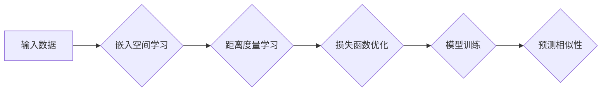

> Metric Learning, 距离度量,  嵌入空间,  相似性度量,  机器学习,  深度学习,  代码实例

## 1. 背景介绍

在机器学习领域，如何有效地衡量数据之间的相似性或差异是许多任务的关键。传统的机器学习方法通常依赖于手工设计的特征，而 Metric Learning 则通过学习一个嵌入空间，将数据点映射到该空间中，并在此空间中定义距离度量，从而自动学习数据之间的相似性关系。

Metric Learning 在许多应用场景中发挥着重要作用，例如：

* **图像检索:** 根据图像内容检索相似图像。
* **人脸识别:** 识别和验证个体身份。
* **推荐系统:** 根据用户历史行为推荐相关商品或内容。
* **异常检测:** 识别与正常数据相似的异常数据点。

## 2. 核心概念与联系

Metric Learning 的核心概念包括：

* **嵌入空间:**  一个用于表示数据点的向量空间。
* **距离度量:**  用于衡量数据点在嵌入空间中的距离。
* **损失函数:**  用于衡量模型预测的距离与真实距离之间的差异。

Metric Learning 的目标是学习一个嵌入空间和一个距离度量，使得数据点在嵌入空间中的距离与它们之间的真实相似性或差异相匹配。

**Mermaid 流程图:**



## 3. 核心算法原理 & 具体操作步骤

### 3.1  算法原理概述

Metric Learning 算法的核心是学习一个映射函数，将数据点映射到一个嵌入空间中，使得数据点之间的距离与它们的真实相似性或差异相匹配。

常见的 Metric Learning 算法包括：

* **Siamese Network:** 使用两个相同的网络结构，分别对输入数据进行编码，然后计算两个编码的距离。
* **Triplet Loss:** 使用三元组数据（anchor、positive、negative），训练模型使得 anchor 与 positive 的距离小于 anchor 与 negative 的距离。
* **Contrastive Loss:** 使用成对数据，训练模型使得相似数据点的距离小于不相似数据点的距离。

### 3.2  算法步骤详解

以 Triplet Loss 为例，其训练步骤如下：

1. **数据准备:** 准备三元组数据，每个三元组包含一个 anchor 数据点、一个 positive 数据点和一个 negative 数据点。
2. **嵌入空间学习:** 使用一个神经网络模型将数据点映射到嵌入空间中。
3. **距离计算:** 计算 anchor 与 positive、anchor 与 negative 的距离。
4. **损失函数计算:** 使用 Triplet Loss 计算模型预测的距离与真实距离之间的差异。
5. **模型优化:** 使用梯度下降等优化算法更新模型参数，使得损失函数最小化。

### 3.3  算法优缺点

**优点:**

* 自动学习数据之间的相似性关系。
* 可以处理高维数据。
* 在许多应用场景中表现出色。

**缺点:**

* 需要大量的训练数据。
* 训练过程可能比较复杂。
* 距离度量的选择对模型性能有重要影响。

### 3.4  算法应用领域

Metric Learning 算法广泛应用于以下领域：

* **图像检索:** 根据图像内容检索相似图像。
* **人脸识别:** 识别和验证个体身份。
* **推荐系统:** 根据用户历史行为推荐相关商品或内容。
* **异常检测:** 识别与正常数据相似的异常数据点。

## 4. 数学模型和公式 & 详细讲解 & 举例说明

### 4.1  数学模型构建

假设我们有 N 个数据点，每个数据点都对应一个 d 维的特征向量 x_i。我们的目标是学习一个嵌入函数 f，将每个数据点映射到一个 k 维的嵌入空间中，使得数据点之间的距离与它们的真实相似性或差异相匹配。

### 4.2  公式推导过程

Triplet Loss 函数的公式如下：

$$
L_{triplet} = \max(d(x_a, x_p) - d(x_a, x_n) + \alpha, 0)
$$

其中：

* $x_a$ 是 anchor 数据点。
* $x_p$ 是 positive 数据点。
* $x_n$ 是 negative 数据点。
* $d(x_i, x_j)$ 是数据点 $x_i$ 和 $x_j$ 在嵌入空间中的距离。
* $\alpha$ 是一个 margin 参数，用于控制 anchor 与 positive 的距离与 anchor 与 negative 的距离之间的差距。

### 4.3  案例分析与讲解

假设我们有一个人脸识别任务，我们需要学习一个模型，能够将人脸图像映射到一个嵌入空间中，使得同一个人的脸图像在嵌入空间中的距离较近，而不同人的脸图像在嵌入空间中的距离较远。

我们可以使用 Triplet Loss 训练一个 Siamese Network 模型。

* Anchor 数据点为一张人脸图像。
* Positive 数据点为同一人的另一张人脸图像。
* Negative 数据点为不同人的一张人脸图像。

通过训练，模型会学习到一个嵌入空间，使得同一个人的脸图像在嵌入空间中的距离较近，而不同人的脸图像在嵌入空间中的距离较远。

## 5. 项目实践：代码实例和详细解释说明

### 5.1  开发环境搭建

* Python 3.6+
* TensorFlow 2.0+
* PyTorch 1.0+

### 5.2  源代码详细实现

```python
import tensorflow as tf

# 定义 Siamese Network 模型
def siamese_network(input_tensor):
    # ... 模型结构定义 ...
    return output_tensor

# 定义 Triplet Loss 函数
def triplet_loss(anchor, positive, negative, margin=0.2):
    # ... 损失函数计算 ...

# 加载数据集
# ... 数据集加载 ...

# 训练模型
optimizer = tf.keras.optimizers.Adam(learning_rate=0.001)
for epoch in range(num_epochs):
    for batch in dataset:
        anchor, positive, negative = batch
        with tf.GradientTape() as tape:
            anchor_embedding = siamese_network(anchor)
            positive_embedding = siamese_network(positive)
            negative_embedding = siamese_network(negative)
            loss = triplet_loss(anchor_embedding, positive_embedding, negative_embedding)
        gradients = tape.gradient(loss, model.trainable_variables)
        optimizer.apply_gradients(zip(gradients, model.trainable_variables))

# 保存模型
model.save("siamese_model.h5")
```

### 5.3  代码解读与分析

* Siamese Network 模型：使用两个相同的网络结构，分别对输入数据进行编码，然后计算两个编码的距离。
* Triplet Loss 函数：计算模型预测的距离与真实距离之间的差异。
* 数据集加载：加载训练数据，并将其分成 anchor、positive 和 negative 三个部分。
* 训练模型：使用梯度下降等优化算法更新模型参数，使得损失函数最小化。
* 保存模型：将训练好的模型保存为文件。

### 5.4  运行结果展示

训练完成后，可以使用保存的模型对新的数据进行预测，并根据模型预测的距离来判断数据之间的相似性或差异。

## 6. 实际应用场景

### 6.1  图像检索

Metric Learning 可以用于构建图像检索系统，根据用户输入的查询图像，检索出与查询图像相似度高的图像。

### 6.2  人脸识别

Metric Learning 可以用于人脸识别系统，识别和验证个体身份。

### 6.3  推荐系统

Metric Learning 可以用于推荐系统，根据用户的历史行为，推荐与用户兴趣相符的商品或内容。

### 6.4  未来应用展望

Metric Learning 在未来将有更广泛的应用，例如：

* **自然语言处理:** 用于文本相似度计算、文本分类等任务。
* **药物发现:** 用于药物相似性分析、药物靶点预测等任务。
* **生物信息学:** 用于基因相似性分析、蛋白质结构预测等任务。

## 7. 工具和资源推荐

### 7.1  学习资源推荐

* **书籍:**
    * "Deep Metric Learning" by  H. Larochelle
    * "Metric Learning with Deep Networks" by  S. Chopra
* **论文:**
    * "FaceNet: A Unified Embedding for Face Recognition and Clustering" by  Schroff et al.
    * "Triplet Loss for Learning Person Re-identification Descriptors" by  Schroff et al.

### 7.2  开发工具推荐

* **TensorFlow:**  https://www.tensorflow.org/
* **PyTorch:** https://pytorch.org/

### 7.3  相关论文推荐

* **FaceNet: A Unified Embedding for Face Recognition and Clustering**
* **Triplet Loss for Learning Person Re-identification Descriptors**
* **Deep Metric Learning with Adaptive Margin Softmax**

## 8. 总结：未来发展趋势与挑战

### 8.1  研究成果总结

Metric Learning 已经取得了显著的成果，在许多应用场景中表现出色。

### 8.2  未来发展趋势

* **更有效的损失函数:**  开发更有效的损失函数，能够更好地学习数据之间的相似性关系。
* **自监督学习:**  利用自监督学习方法，从未标记的数据中学习嵌入空间。
* **跨模态学习:**  学习跨模态的嵌入空间，例如图像和文本的联合嵌入。

### 8.3  面临的挑战

* **数据效率:**  Metric Learning 算法通常需要大量的训练数据。
* **距离度量选择:**  距离度量的选择对模型性能有重要影响。
* **可解释性:**  Metric Learning 模型的决策过程往往难以解释。

### 8.4  研究展望

未来，Metric Learning 将继续是一个活跃的研究领域，我们将看到更多新的算法、方法和应用。


## 9. 附录：常见问题与解答

**Q1: Metric Learning 和传统机器学习方法有什么区别？**

**A1:**  传统机器学习方法通常依赖于手工设计的特征，而 Metric Learning 则通过学习一个嵌入空间，自动学习数据之间的相似性关系。

**Q2: 如何选择合适的距离度量？**

**A2:**  距离度量的选择取决于具体的应用场景和数据特点。常见的距离度量包括欧氏距离、曼哈顿距离、余弦相似度等。

**Q3: Metric Learning 算法需要多少训练数据？**

**A3:**  Metric Learning 算法通常需要大量的训练数据，具体数量取决于算法的复杂度和数据的复杂度。

**Q4: Metric Learning 模型的决策过程难以解释，如何解决这个问题？**

**A4:**  这是一个重要的挑战，目前还没有完美的解决方案。一些研究者正在探索使用可解释性方法来解释 Metric Learning 模型的决策过程。


作者：禅与计算机程序设计艺术 / Zen and the Art of Computer Programming 
<end_of_turn>