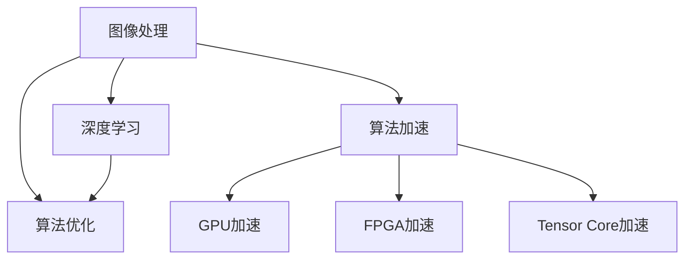

                 

# OpenCV图像处理算法加速

> 关键词：图像处理,算法优化,加速,OpenCV,深度学习,计算机视觉

## 1. 背景介绍

### 1.1 问题由来
图像处理是计算机视觉领域的基础技术，广泛应用于视频监控、医学影像分析、自动驾驶、工业检测等领域。随着高性能计算和深度学习技术的不断发展，图像处理的应用场景越来越广泛，对于处理速度和性能的要求也越来越高。然而，传统的图像处理算法往往需要大量的计算资源，难以在实时性和资源占用方面满足实际应用的需求。

为此，本文将重点讨论如何通过算法优化和加速技术，提升OpenCV图像处理的效率和性能。OpenCV是一个广泛使用的开源计算机视觉库，其提供的图像处理算法和工具为开发者提供了极大的便利，但也需要对其算法进行优化和加速，以适应更多应用场景的需求。

## 2. 核心概念与联系

### 2.1 核心概念概述

为更好地理解图像处理算法的优化和加速方法，本节将介绍几个密切相关的核心概念：

- 图像处理(Computer Vision)：指通过计算机技术对图像进行采集、处理、分析和理解的过程。包括图像增强、边缘检测、目标检测、特征提取、分类等技术。

- 算法优化(Algorithm Optimization)：指通过各种技术手段，对现有算法进行改进，以提高其效率和性能。包括优化算法结构、减少计算复杂度、并行化处理等。

- 算法加速(Algorithm Acceleration)：指通过硬件优化、软件优化等方法，提升算法在计算资源上的运行效率。包括GPU加速、FPGA加速、Tensor Core加速等。

- OpenCV：一个广泛使用的开源计算机视觉库，提供了丰富的图像处理算法和工具，支持C++、Python等多种编程语言。

- 深度学习(Deep Learning)：一种机器学习范式，通过多层次神经网络对数据进行学习，以提高图像处理的精度和效率。

- 计算机视觉(Computer Vision)：指通过计算机技术对图像进行理解和分析，从而实现各种视觉应用，如目标检测、图像分类、人脸识别等。

这些核心概念之间的逻辑关系可以通过以下Mermaid流程图来展示：



这个流程图展示了这个核心概念之间的逻辑关系：

1. 图像处理通过算法优化和算法加速，提高处理速度和效率。
2. 深度学习为图像处理提供更为强大的模型支持，提高处理精度。
3. GPU加速、FPGA加速和Tensor Core加速等硬件优化手段，进一步提升图像处理的效率。

## 3. 核心算法原理 & 具体操作步骤
### 3.1 算法原理概述

图像处理算法优化和加速的原理是多元化的，涉及算法结构、数据结构和并行计算等多个方面。其主要目标是通过算法改进和优化，减少不必要的计算，提高算法的并行性，从而提升图像处理的效率和性能。

优化算法的关键在于减少计算复杂度，提高算法并行性，并利用硬件加速技术，如GPU、FPGA和Tensor Core等，进一步提升图像处理的速度和性能。

### 3.2 算法步骤详解

图像处理算法的优化和加速一般包括以下几个关键步骤：

**Step 1: 确定优化目标**
- 分析现有算法的时间复杂度和空间复杂度，找到优化的切入点。
- 明确优化的目标，是提高算法效率、降低资源消耗，还是提高算法的并行性。

**Step 2: 算法重构**
- 对现有算法进行结构重构，优化算法逻辑，减少冗余计算。
- 引入中间变量，简化计算步骤，减少重复计算。

**Step 3: 并行化处理**
- 分析算法中的并行计算部分，设计并行计算模型，如多线程、多进程、并行计算框架。
- 利用OpenMP、MPI等并行计算工具，提高算法的并行度。

**Step 4: 硬件加速**
- 选择合适的硬件平台，如GPU、FPGA等，进行算法加速。
- 利用硬件的并行计算能力，优化算法性能。

**Step 5: 性能评估和调优**
- 对优化后的算法进行性能测试，评估优化效果。
- 根据测试结果，进一步优化算法。

**Step 6: 部署和应用**
- 将优化后的算法应用到实际图像处理场景中。
- 根据实际应用需求，不断优化算法性能。

### 3.3 算法优缺点

图像处理算法的优化和加速方法具有以下优点：
1. 提高处理速度和效率。通过算法优化和加速，可以减少不必要的计算，提高算法并行性，进一步提升图像处理的效率。
2. 降低资源消耗。优化算法可以降低计算复杂度，减少内存占用和计算资源消耗。
3. 提高算法的可扩展性。通过并行化和硬件加速技术，可以适应大规模数据和复杂应用场景的需求。
4. 支持多种硬件平台。GPU、FPGA、Tensor Core等硬件加速技术，可以灵活适应不同应用场景的需求。

同时，该方法也存在一定的局限性：
1. 优化过程复杂。算法优化和加速通常需要深入分析和调试，难度较大。
2. 硬件成本高。GPU、FPGA等硬件加速设备的成本较高，可能导致总体开发成本上升。
3. 硬件兼容性问题。不同硬件平台之间的兼容性可能存在问题，需要更多的开发和测试工作。

尽管存在这些局限性，但就目前而言，算法优化和加速仍是图像处理领域的重要技术手段，尤其在处理大规模数据和复杂应用场景时具有重要意义。

### 3.4 算法应用领域

图像处理算法优化和加速技术，已经在计算机视觉、图像处理、医学影像分析、视频监控等多个领域得到了广泛应用：

- 计算机视觉：图像分类、目标检测、人脸识别等。通过优化算法和加速技术，提高处理速度和精度。
- 图像处理：图像增强、边缘检测、形态学处理等。通过并行化和硬件加速，提高处理速度。
- 医学影像分析：图像分割、病灶检测等。通过算法优化和加速，降低计算复杂度，提高处理效率。
- 视频监控：实时目标检测、运动跟踪等。通过算法优化和硬件加速，实现实时处理。
- 工业检测：缺陷检测、尺寸测量等。通过优化算法和加速技术，提高检测精度和效率。

这些应用领域展示了图像处理算法优化和加速技术的广泛应用前景，为各种视觉应用场景提供了强大的技术支持。

## 4. 数学模型和公式 & 详细讲解 & 举例说明

### 4.1 数学模型构建

在图像处理中，常用的算法包括图像增强、边缘检测、目标检测、特征提取等。这里以图像增强和边缘检测为例，介绍其数学模型的构建。

**图像增强**：常用的图像增强算法包括直方图均衡化、自适应直方图均衡化等。其核心思想是通过改变图像的亮度分布，增强图像的对比度。

**边缘检测**：常用的边缘检测算法包括Sobel算子、Canny算子等。其核心思想是通过卷积操作，检测图像中的边缘信息。

这些算法的数学模型通常可以表示为：

$$
f(x) = \sum_{i=1}^n g(x_i)h(x_i)
$$

其中 $f(x)$ 为输出结果，$g(x)$ 为输入图像，$h(x)$ 为算法模板，$n$ 为模板大小。

### 4.2 公式推导过程

以Sobel算子为例，推导其核心公式。Sobel算子利用卷积操作检测图像中的边缘信息，其核心公式如下：

$$
G(x,y) = \left[ \begin{array}{ccc}
-1 & 0 & 1 \\
-2 & 0 & 2 \\
-1 & 0 & 1 \\
\end{array} \right]
$$

将Sobel算子应用于图像 $g(x)$ 中，得到边缘信息 $h(x)$。

### 4.3 案例分析与讲解

以直方图均衡化为例，介绍其优化和加速方法。直方图均衡化算法通过调整图像的亮度分布，提高图像的对比度，但其时间复杂度较高，不适合大规模图像处理。

以下是优化直方图均衡化算法的步骤：

**Step 1: 确定优化目标**。直方图均衡化的目标是通过改变图像的亮度分布，提高图像的对比度，减少计算时间。

**Step 2: 算法重构**。引入中间变量，简化计算步骤，减少重复计算。

**Step 3: 并行化处理**。利用OpenMP等并行计算工具，提高算法并行度。

**Step 4: 硬件加速**。利用GPU加速技术，进一步提高算法效率。

通过这些步骤，可以大大提高直方图均衡化算法的处理速度和效率，适应更多大规模图像处理的应用场景。

## 5. 项目实践：代码实例和详细解释说明
### 5.1 开发环境搭建

在进行图像处理算法优化和加速实践前，我们需要准备好开发环境。以下是使用Python进行OpenCV开发的环境配置流程：

1. 安装Anaconda：从官网下载并安装Anaconda，用于创建独立的Python环境。

2. 创建并激活虚拟环境：
```bash
conda create -n opencv-env python=3.8 
conda activate opencv-env
```

3. 安装OpenCV：从官网获取OpenCV的Python版本，使用pip安装：
```bash
pip install opencv-python-headless opencv-python opencv-contrib-python
```

4. 安装必要的工具包：
```bash
pip install numpy scipy matplotlib scikit-image cython
```

完成上述步骤后，即可在`opencv-env`环境中开始图像处理算法优化和加速的实践。

### 5.2 源代码详细实现

以下是使用Python和OpenCV实现直方图均衡化和Sobel算子的代码示例。

**直方图均衡化**

```python
import cv2
import numpy as np
from scipy.stats import moment

def histogram_equalization(img):
    gray = cv2.cvtColor(img, cv2.COLOR_BGR2GRAY)
    cdf = np.zeros(256, dtype=np.float32)
    cdf[gray.ravel()] = np.cumsum(np.bincount(gray.ravel(), minlength=256)) / len(gray.ravel())

    inv_cdf = np.interp(gray.ravel(), cdf.cumsum()[:-1], cdf[1:] - cdf[:-1]).reshape(gray.shape)

    return cv2.convertScaleAbs(inv_cdf)
```

**Sobel算子**

```python
import cv2
import numpy as np

def sobel_edge_detection(img):
    gray = cv2.cvtColor(img, cv2.COLOR_BGR2GRAY)
    kernel_x = np.array([-1, 0, 1], dtype=np.float32)
    kernel_y = np.array([-1, 0, 1], dtype=np.float32)

    sobel_x = cv2.filter2D(gray, -1, kernel_x)
    sobel_y = cv2.filter2D(gray, -1, kernel_y)

    return np.sqrt(sobel_x**2 + sobel_y**2)
```

这两个代码示例展示了如何使用Python和OpenCV实现基本的图像处理算法。在实际应用中，需要根据具体场景进行优化和加速，以满足实际需求。

### 5.3 代码解读与分析

让我们再详细解读一下关键代码的实现细节：

**直方图均衡化函数**

- 将彩色图像转换为灰度图像。
- 计算灰度图像的累积分布函数(cumulative distribution function, CDF)。
- 计算逆累积分布函数(inverse cumulative distribution function, invCDF)，并使用OpenCV的`convertScaleAbs`函数进行转换。

**Sobel算子函数**

- 将彩色图像转换为灰度图像。
- 定义卷积核。
- 使用OpenCV的`filter2D`函数进行卷积操作，得到Sobel算子检测的边缘信息。

这些代码示例展示了OpenCV中图像处理算法的简单实现，但实际的优化和加速需要根据具体需求进行调整和改进。

## 6. 实际应用场景
### 6.1 智慧医疗

在智慧医疗领域，图像处理技术广泛应用于医学影像分析和医疗诊断。通过优化和加速图像处理算法，可以实现快速、准确的医学影像分析，提高医疗诊断的效率和准确性。

在实践中，可以优化和加速医学影像的预处理、分割、特征提取等步骤，提高算法的处理速度和效率。同时，通过硬件加速技术，可以在GPU、FPGA等平台上实现高效率的医学影像处理。

### 6.2 智能制造

在智能制造领域，图像处理技术用于产品质量检测、自动化视觉引导等。通过优化和加速图像处理算法，可以实现实时、高精度的视觉引导，提高生产效率和产品质量。

在实践中，可以优化和加速产品检测算法、自动化视觉引导算法等，提高算法的并行性和处理速度。同时，通过硬件加速技术，可以在GPU、FPGA等平台上实现高效率的图像处理。

### 6.3 安防监控

在安防监控领域，图像处理技术用于实时目标检测、人脸识别等。通过优化和加速图像处理算法，可以实现实时、高精度的目标检测和人脸识别，提高安全防护能力。

在实践中，可以优化和加速目标检测算法、人脸识别算法等，提高算法的处理速度和精度。同时，通过硬件加速技术，可以在GPU、FPGA等平台上实现高效率的图像处理。

### 6.4 未来应用展望

随着图像处理算法优化和加速技术的不断发展，基于OpenCV的图像处理应用将呈现以下几个发展趋势：

1. 深度学习融合。未来图像处理算法将更多地融合深度学习技术，提高算法的精度和效率。
2. 多模态融合。图像处理算法将与语音、文本等多模态数据进行融合，实现更全面的视觉应用。
3. 实时化处理。图像处理算法将更多地应用于实时场景，如自动驾驶、机器人视觉等，需要更高的处理速度和效率。
4. 大规模并行处理。图像处理算法将更多地应用于大规模数据处理场景，需要更高的并行处理能力。
5. 硬件融合。图像处理算法将更多地与GPU、FPGA、Tensor Core等硬件进行融合，实现更高效的图像处理。

这些趋势凸显了图像处理算法优化和加速技术的广阔前景，为计算机视觉领域的应用提供了更强大的技术支持。

## 7. 工具和资源推荐
### 7.1 学习资源推荐

为了帮助开发者系统掌握图像处理算法的优化和加速技术，这里推荐一些优质的学习资源：

1. 《OpenCV计算机视觉编程教程》系列书籍：由OpenCV官方出版，详细介绍了OpenCV库的使用方法和图像处理算法。
2. 《Python计算机视觉编程》在线课程：由Coursera提供，涵盖了OpenCV库和图像处理算法的全面知识。
3. 《计算机视觉：算法与应用》课程：由斯坦福大学提供，涵盖计算机视觉的各个方面，包括图像处理算法。
4. 《Image Processing in Python》书籍：由Magnus Lie Hetland撰写，介绍了Python语言在图像处理中的应用。
5. 《Digital Image Processing》教材：由Gonzalez和Woods撰写，涵盖了图像处理的各个方面，包括算法优化和加速技术。

通过对这些资源的学习实践，相信你一定能够快速掌握图像处理算法的优化和加速技巧，并用于解决实际的图像处理问题。
### 7.2 开发工具推荐

高效的图像处理算法开发离不开优秀的工具支持。以下是几款用于图像处理算法开发常用的工具：

1. OpenCV：广泛使用的开源计算机视觉库，提供了丰富的图像处理算法和工具。
2. Python：广泛使用的编程语言，支持动态计算和并行计算，适合快速迭代开发。
3. Intel DNN Library：支持深度学习和图像处理算法的优化和加速。
4. NVIDIA CUDA：支持GPU加速技术，提升图像处理算法的处理速度。
5. Tensor Core：支持深度学习和图像处理算法的硬件加速。
6. PyTorch：支持深度学习和图像处理算法的开发和优化。

合理利用这些工具，可以显著提升图像处理算法的开发效率，加快创新迭代的步伐。

### 7.3 相关论文推荐

图像处理算法优化和加速技术的发展源于学界的持续研究。以下是几篇奠基性的相关论文，推荐阅读：

1. OpenCV: A Simplified Unity Framework for Real-Time Computer Vision on CPU and GPU：介绍了OpenCV库的优化和加速技术，涵盖了图像处理算法的各个方面。
2. Fast Feature Pyramid Detectors: Accelerating Feature Detectors with Pyramid Images：提出了Fast Feature Pyramid Detectors算法，提高了目标检测的速度和精度。
3. Real-time Edge Detection and Tracking in an Event-driven Camera：提出了实时边缘检测和跟踪算法，利用事件驱动相机提高处理速度和精度。
4. Deep Learning for Real-time Semantic Segmentation of RGB-D Images from a Microsoft Kinect：利用深度学习技术，实现了实时语义分割，提高了图像处理算法的精度。
5. Super-resolution and faster neural networks with learnable spatial pyramid pooling：利用可学习的空间金字塔池化技术，提高了超分辨率处理的速度和精度。

这些论文代表了大规模图像处理和加速技术的最新进展，展示了如何通过算法优化和硬件加速技术，提升图像处理算法的效率和性能。

## 8. 总结：未来发展趋势与挑战
### 8.1 总结

本文对图像处理算法的优化和加速方法进行了全面系统的介绍。首先阐述了图像处理算法的优化和加速在计算机视觉领域的重要性，明确了其在实际应用中的显著优势。其次，从原理到实践，详细讲解了图像处理算法的优化和加速方法，给出了图像处理算法开发的完整代码示例。同时，本文还广泛探讨了图像处理算法在智慧医疗、智能制造、安防监控等各个领域的应用前景，展示了其广阔的应用空间。此外，本文精选了图像处理算法的各类学习资源，力求为读者提供全方位的技术指引。

通过本文的系统梳理，可以看到，图像处理算法的优化和加速技术在计算机视觉领域具有重要意义。通过算法优化和加速，不仅可以提升图像处理的效率和精度，还可以适应更多大规模数据和复杂应用场景的需求。未来，伴随着深度学习、多模态融合、实时化处理等技术的发展，图像处理算法将呈现出更加多样化和高效化的发展趋势。

### 8.2 未来发展趋势

展望未来，图像处理算法的优化和加速技术将呈现以下几个发展趋势：

1. 深度学习融合。未来的图像处理算法将更多地融合深度学习技术，提高算法的精度和效率。
2. 多模态融合。图像处理算法将与语音、文本等多模态数据进行融合，实现更全面的视觉应用。
3. 实时化处理。图像处理算法将更多地应用于实时场景，如自动驾驶、机器人视觉等，需要更高的处理速度和效率。
4. 大规模并行处理。图像处理算法将更多地应用于大规模数据处理场景，需要更高的并行处理能力。
5. 硬件融合。图像处理算法将更多地与GPU、FPGA、Tensor Core等硬件进行融合，实现更高效的图像处理。

这些趋势凸显了图像处理算法优化和加速技术的广阔前景，为计算机视觉领域的应用提供了更强大的技术支持。

### 8.3 面临的挑战

尽管图像处理算法优化和加速技术已经取得了瞩目成就，但在迈向更加智能化、普适化应用的过程中，仍面临诸多挑战：

1. 算法优化难度高。图像处理算法的优化需要深入分析和调试，难度较大。
2. 硬件成本高。GPU、FPGA等硬件加速设备的成本较高，可能导致总体开发成本上升。
3. 硬件兼容性问题。不同硬件平台之间的兼容性可能存在问题，需要更多的开发和测试工作。
4. 计算资源需求大。图像处理算法往往需要大量的计算资源，难以在资源受限的平台上运行。
5. 数据处理复杂。图像处理算法的数据预处理和后处理过程较为复杂，需要更多的开发和测试工作。

尽管存在这些挑战，但图像处理算法优化和加速技术的广泛应用前景仍然令人期待。未来，随着深度学习、多模态融合、实时化处理等技术的发展，图像处理算法将呈现出更加多样化和高效化的发展趋势。

### 8.4 研究展望

面对图像处理算法优化和加速技术所面临的挑战，未来的研究需要在以下几个方面寻求新的突破：

1. 探索更高效的算法结构。引入更高效的算法结构，如Fast Feature Pyramid Detectors等，提高算法效率和精度。
2. 引入更高级的硬件加速技术。利用更高级的硬件加速技术，如Tensor Core、Intel DNN Library等，提升图像处理算法的处理速度和效率。
3. 融合多模态数据。将图像处理算法与语音、文本等多模态数据进行融合，实现更全面的视觉应用。
4. 优化并行计算模型。优化并行计算模型，提高算法的并行性和处理速度。
5. 引入深度学习技术。引入深度学习技术，提高图像处理算法的精度和效率。

这些研究方向将引领图像处理算法优化和加速技术迈向更高的台阶，为计算机视觉领域的应用提供更强大的技术支持。

## 9. 附录：常见问题与解答

**Q1：OpenCV图像处理算法优化和加速是否适用于所有应用场景？**

A: 尽管OpenCV是一个广泛使用的开源计算机视觉库，但其图像处理算法的优化和加速通常需要根据具体应用场景进行调整和改进。在处理大规模数据和复杂应用场景时，可能需要引入深度学习技术，优化并行计算模型，引入硬件加速技术等。

**Q2：如何选择合适的硬件平台进行加速？**

A: 选择合适的硬件平台进行加速需要考虑多个因素，包括数据规模、计算复杂度、算法特性等。常见的硬件平台包括CPU、GPU、FPGA、Tensor Core等。

- CPU：适用于一般图像处理任务，速度快且成本低。
- GPU：适用于大规模图像处理任务，具有强大的并行计算能力，但成本较高。
- FPGA：适用于特定算法的高效实现，具有高度定制化能力，但开发难度较大。
- Tensor Core：适用于深度学习任务，具有强大的并行计算能力，但需要专用的深度学习框架。

根据具体应用需求选择合适的硬件平台，可以显著提高图像处理算法的处理速度和效率。

**Q3：如何进行图像处理的并行化处理？**

A: 图像处理的并行化处理可以通过多线程、多进程、并行计算框架等方式实现。常见的并行化工具包括OpenMP、MPI等。

1. 多线程：将图像处理任务分解为多个子任务，由多个线程并行处理。
2. 多进程：将图像处理任务分配给多个进程，由多个进程并行处理。
3. 并行计算框架：利用并行计算框架，如OpenMP、MPI等，提高图像处理算法的并行度。

合理利用并行化处理技术，可以显著提高图像处理算法的处理速度和效率。

**Q4：如何进行图像处理的优化？**

A: 图像处理的优化可以从算法结构、数据结构和并行计算等多个方面进行。

1. 算法结构优化：对现有算法进行结构重构，优化算法逻辑，减少冗余计算。
2. 数据结构优化：利用中间变量，简化计算步骤，减少重复计算。
3. 并行计算优化：利用OpenMP、MPI等并行计算工具，提高算法的并行度。
4. 硬件加速优化：利用GPU、FPGA、Tensor Core等硬件加速技术，提升图像处理算法的处理速度和效率。

合理利用优化技术，可以显著提高图像处理算法的效率和性能，满足更多应用场景的需求。

**Q5：如何提高图像处理算法的精度？**

A: 提高图像处理算法的精度可以从算法结构和数据预处理等多个方面进行。

1. 算法结构优化：引入深度学习技术，提高算法的精度和效率。
2. 数据预处理：优化数据预处理流程，提高数据质量，减少噪声和干扰。
3. 特征提取优化：引入高级特征提取技术，提高算法的精度。
4. 模型融合：利用模型融合技术，结合多个算法，提高算法的精度和鲁棒性。

合理利用优化技术，可以显著提高图像处理算法的精度和鲁棒性，满足更多应用场景的需求。

---

作者：禅与计算机程序设计艺术 / Zen and the Art of Computer Programming

