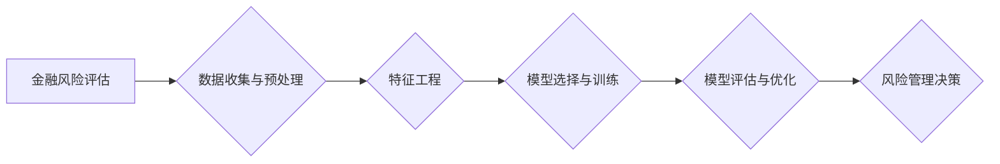

> 机器学习，金融风险评估，Python，模型构建，风险预测，数据分析，算法原理

## 1. 背景介绍

金融风险评估是金融机构的核心业务之一，旨在识别、量化和管理各种金融风险，保障金融机构的稳定运营和客户利益。传统风险评估方法主要依赖于经验和专家判断，存在主观性强、难以捕捉复杂风险关系等问题。近年来，机器学习技术在金融领域得到广泛应用，为金融风险评估提供了新的思路和方法。

机器学习算法能够从海量数据中自动学习风险模式，提高风险识别和预测的准确性。Python作为一种流行的编程语言，拥有丰富的机器学习库和工具，例如Scikit-learn、TensorFlow、PyTorch等，为金融风险评估提供了强大的技术支撑。

## 2. 核心概念与联系

**2.1  金融风险评估**

金融风险评估是指金融机构对自身面临的各种风险进行识别、分析、量化和管理的过程。常见的金融风险包括信用风险、市场风险、操作风险、流动性风险等。

**2.2  机器学习**

机器学习是一种人工智能技术，通过算法训练模型，使模型能够从数据中学习规律，并对新数据进行预测或分类。常见的机器学习算法包括线性回归、逻辑回归、决策树、支持向量机、神经网络等。

**2.3  数据驱动**

机器学习模型的性能取决于训练数据的质量和数量。金融风险评估需要收集和分析海量金融数据，包括客户信用信息、市场数据、交易记录、财务报表等。

**2.4  模型评估与优化**

机器学习模型需要进行评估和优化，以确保其准确性和可靠性。常用的评估指标包括准确率、召回率、F1-score、AUC等。模型优化可以通过调整算法参数、选择合适的特征、增加训练数据等方式实现。

**2.5  风险管理**

机器学习模型可以帮助金融机构识别和预测风险，并制定相应的风险管理策略。例如，可以利用机器学习模型识别高风险客户，采取相应的风险控制措施；可以利用机器学习模型预测市场风险，进行风险规避。

**Mermaid 流程图**



## 3. 核心算法原理 & 具体操作步骤

### 3.1  算法原理概述

本节将介绍几种常用的机器学习算法，以及它们在金融风险评估中的应用。

* **线性回归:** 线性回归是一种用于预测连续变量的算法，假设目标变量与输入特征之间存在线性关系。

* **逻辑回归:** 逻辑回归是一种用于分类问题的算法，将输入特征映射到0到1之间的概率，用于预测样本属于不同类别。

* **决策树:** 决策树是一种树形结构的算法，通过一系列规则将样本分类或预测。

* **支持向量机:** 支持向量机是一种用于分类和回归问题的算法，通过寻找最佳的分隔超平面将样本分类。

* **神经网络:** 神经网络是一种模仿人脑神经网络结构的算法，能够学习复杂非线性关系。

### 3.2  算法步骤详解

**3.2.1 线性回归**

1. **数据准备:** 收集和预处理金融数据，包括特征选择和数据清洗。
2. **模型训练:** 使用训练数据训练线性回归模型，求解模型参数。
3. **模型评估:** 使用测试数据评估模型性能，例如计算均方误差 (MSE) 或 R-squared。
4. **模型优化:** 通过调整模型参数或特征选择，优化模型性能。

**3.2.2 逻辑回归**

1. **数据准备:** 收集和预处理金融数据，包括特征选择和数据清洗。
2. **模型训练:** 使用训练数据训练逻辑回归模型，求解模型参数。
3. **模型评估:** 使用测试数据评估模型性能，例如计算准确率、召回率或 F1-score。
4. **模型优化:** 通过调整模型参数或特征选择，优化模型性能。

**3.2.3 决策树**

1. **数据准备:** 收集和预处理金融数据，包括特征选择和数据清洗。
2. **模型训练:** 使用训练数据构建决策树模型，通过递归地划分数据，形成决策规则。
3. **模型评估:** 使用测试数据评估模型性能，例如计算准确率、召回率或 F1-score。
4. **模型优化:** 通过调整决策树参数，例如最大深度或最小样本数，优化模型性能。

**3.2.4 支持向量机**

1. **数据准备:** 收集和预处理金融数据，包括特征选择和数据清洗。
2. **模型训练:** 使用训练数据训练支持向量机模型，寻找最佳的分隔超平面。
3. **模型评估:** 使用测试数据评估模型性能，例如计算准确率、召回率或 F1-score。
4. **模型优化:** 通过调整支持向量机参数，例如核函数或惩罚参数，优化模型性能。

**3.2.5 神经网络**

1. **数据准备:** 收集和预处理金融数据，包括特征选择和数据清洗。
2. **模型训练:** 使用训练数据训练神经网络模型，通过反向传播算法调整模型参数。
3. **模型评估:** 使用测试数据评估模型性能，例如计算准确率、召回率或 F1-score。
4. **模型优化:** 通过调整神经网络参数，例如层数、节点数或学习率，优化模型性能。

### 3.3  算法优缺点

| 算法 | 优点 | 缺点 |
|---|---|---|
| 线性回归 | 简单易懂，计算效率高 | 只能处理线性关系，对异常值敏感 |
| 逻辑回归 | 容易解释，适用于二分类问题 | 只能处理线性关系，对多分类问题效果较差 |
| 决策树 | 容易解释，可以处理非线性关系 | 容易过拟合，对数据变化敏感 |
| 支持向量机 | 能够处理高维数据，对异常值鲁棒性强 | 训练时间长，参数选择复杂 |
| 神经网络 | 能够处理复杂非线性关系，性能优异 | 训练时间长，参数选择复杂，容易过拟合 |

### 3.4  算法应用领域

* **信用风险评估:** 预测客户违约概率，评估贷款风险。
* **市场风险评估:** 预测市场波动，管理投资组合风险。
* **操作风险评估:** 识别和评估内部操作风险，例如欺诈、错误交易等。
* **流动性风险评估:** 预测金融机构的资金流动性风险。

## 4. 数学模型和公式 & 详细讲解 & 举例说明

### 4.1  数学模型构建

**4.1.1 线性回归模型**

线性回归模型假设目标变量与输入特征之间存在线性关系，可以用以下公式表示：

$$y = \beta_0 + \beta_1x_1 + \beta_2x_2 + ... + \beta_nx_n + \epsilon$$

其中：

* $y$ 是目标变量
* $x_1, x_2, ..., x_n$ 是输入特征
* $\beta_0, \beta_1, ..., \beta_n$ 是模型参数
* $\epsilon$ 是误差项

**4.1.2 逻辑回归模型**

逻辑回归模型将输入特征映射到0到1之间的概率，用于预测样本属于不同类别。模型的输出可以用以下公式表示：

$$p(y=1|x) = \frac{1}{1 + e^{-( \beta_0 + \beta_1x_1 + \beta_2x_2 + ... + \beta_nx_n )}}$$

其中：

* $p(y=1|x)$ 是样本属于类别1的概率
* $x_1, x_2, ..., x_n$ 是输入特征
* $\beta_0, \beta_1, ..., \beta_n$ 是模型参数

### 4.2  公式推导过程

**4.2.1 线性回归模型参数估计**

线性回归模型的参数估计可以使用最小二乘法，目标是找到使模型预测值与实际值误差最小的一组参数。

**4.2.2 逻辑回归模型参数估计**

逻辑回归模型的参数估计可以使用最大似然估计，目标是找到使模型似然函数最大的参数值。

### 4.3  案例分析与讲解

**4.3.1 线性回归模型案例**

假设我们想要预测房价，输入特征包括房屋面积、房间数、地理位置等。我们可以使用线性回归模型建立预测模型，并根据训练数据估计模型参数。

**4.3.2 逻辑回归模型案例**

假设我们想要预测客户是否会违约，输入特征包括客户信用评分、收入、负债等。我们可以使用逻辑回归模型建立预测模型，并根据训练数据估计模型参数。

## 5. 项目实践：代码实例和详细解释说明

### 5.1  开发环境搭建

本项目使用Python语言进行开发，需要安装以下软件：

* Python 3.x
* Jupyter Notebook
* Scikit-learn
* Pandas
* NumPy

### 5.2  源代码详细实现

```python
# 导入必要的库
import pandas as pd
from sklearn.model_selection import train_test_split
from sklearn.linear_model import LogisticRegression
from sklearn.metrics import accuracy_score

# 加载数据
data = pd.read_csv('credit_risk_data.csv')

# 选择特征和目标变量
features = ['credit_score', 'income', 'debt']
target = 'default'

# 将数据划分为训练集和测试集
X_train, X_test, y_train, y_test = train_test_split(data[features], data[target], test_size=0.2, random_state=42)

# 创建逻辑回归模型
model = LogisticRegression()

# 训练模型
model.fit(X_train, y_train)

# 预测测试集结果
y_pred = model.predict(X_test)

# 计算模型准确率
accuracy = accuracy_score(y_test, y_pred)
print(f'模型准确率: {accuracy}')
```

### 5.3  代码解读与分析

* 首先，我们导入必要的库，包括pandas用于数据处理，sklearn用于机器学习算法，以及metrics用于评估模型性能。
* 然后，我们加载数据，选择特征和目标变量，并将数据划分为训练集和测试集。
* 接下来，我们创建逻辑回归模型，并使用训练集训练模型。
* 然后，我们使用训练好的模型预测测试集结果，并计算模型准确率。

### 5.4  运行结果展示

运行上述代码后，会输出模型的准确率。

## 6. 实际应用场景

### 6.1  信用风险评估

金融机构可以使用机器学习模型评估客户的信用风险，例如预测客户是否会违约。

### 6.2  市场风险评估

金融机构可以使用机器学习模型预测市场波动，管理投资组合风险。

### 6.3  操作风险评估

金融机构可以使用机器学习模型识别和评估内部操作风险，例如欺诈、错误交易等。

### 6.4  未来应用展望

随着机器学习技术的不断发展，在金融风险评估领域将有更多新的应用场景出现，例如：

* **个性化风险管理:** 根据客户的个体特征，提供个性化的风险管理方案。
* **实时风险监测:** 利用实时数据流，实时监测和评估风险。
* **自动化风险控制:** 利用机器学习模型自动执行风险控制措施。

## 7. 工具和资源推荐

### 7.1  学习资源推荐

* **书籍:**
    * 《Python机器学习实战》
    * 《机器学习》
* **在线课程:**
    * Coursera: Machine Learning
    * edX: Introduction to Machine Learning

### 7.2  开发工具推荐