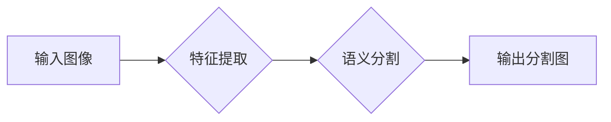

> 深度学习，语义分割，图像处理，卷积神经网络，Python，TensorFlow，PyTorch

## 1. 背景介绍

在计算机视觉领域，语义分割技术扮演着至关重要的角色。它能够将图像中的每个像素都精确地标记为特定的类别，从而实现对图像的细粒度理解。与传统的图像分类不同，语义分割不仅能够识别图像中的物体，还能准确地描述物体的边界和形状。

近年来，深度学习技术的快速发展为语义分割带来了革命性的变革。基于深度学习的语义分割模型能够学习到图像中复杂的特征表示，并实现更高的精度和效率。

## 2. 核心概念与联系

语义分割的核心概念包括：

* **像素级分类:** 语义分割的目标是将图像中的每个像素都分类到特定的类别中。
* **语义信息:** 语义分割的目标是提取图像中的语义信息，例如物体类别、形状、位置等。
* **卷积神经网络 (CNN):** CNN 是深度学习中常用的网络结构，能够有效地学习图像特征。

**Mermaid 流程图:**



## 3. 核心算法原理 & 具体操作步骤

### 3.1  算法原理概述

常见的语义分割算法包括：

* **Fully Convolutional Networks (FCN):** FCN 将全连接层替换为卷积层，能够实现端到端的语义分割。
* **U-Net:** U-Net 是一种具有 U 形结构的网络，能够有效地学习图像的上下文信息。
* **DeepLab:** DeepLab 是一种基于 atrous convolution 的网络，能够学习到更丰富的空间信息。

### 3.2  算法步骤详解

以 FCN 为例，其主要步骤包括：

1. **特征提取:** 使用卷积层和池化层提取图像的特征。
2. **反卷积:** 使用反卷积层将特征图 upsample 到与输入图像相同的大小。
3. **分类:** 使用全连接层或卷积层对每个像素进行分类。

### 3.3  算法优缺点

**FCN:**

* **优点:** 端到端训练，速度快。
* **缺点:** 分辨率较低，边界不清晰。

**U-Net:**

* **优点:** 能够学习到丰富的上下文信息，边界清晰。
* **缺点:** 训练时间较长。

**DeepLab:**

* **优点:** 能够学习到更丰富的空间信息，精度高。
* **缺点:** 计算量大，速度慢。

### 3.4  算法应用领域

语义分割技术在多个领域都有广泛的应用，例如：

* **自动驾驶:** 语义分割可以帮助自动驾驶汽车识别道路、行人、车辆等物体。
* **医疗影像分析:** 语义分割可以帮助医生分割图像中的器官、肿瘤等区域。
* **遥感图像分析:** 语义分割可以帮助分析卫星图像，识别土地利用类型、植被覆盖率等信息。

## 4. 数学模型和公式 & 详细讲解 & 举例说明

### 4.1  数学模型构建

语义分割模型通常采用像素级分类的思路，将每个像素映射到特定的类别。假设图像包含 C 个类别，则每个像素的输出是一个 C 维的向量，其中每个元素代表该像素属于各个类别的概率。

### 4.2  公式推导过程

常用的损失函数包括交叉熵损失函数和 Dice loss。

**交叉熵损失函数:**

$$
L_{CE} = -\sum_{i=1}^{C} y_i \log(p_i)
$$

其中，$y_i$ 是真实标签，$p_i$ 是模型预测的概率。

**Dice loss:**

$$
L_{Dice} = 1 - \frac{2 \sum_{i=1}^{C} y_i p_i}{\sum_{i=1}^{C} y_i^2 + \sum_{i=1}^{C} p_i^2}
$$

其中，$y_i$ 是真实标签，$p_i$ 是模型预测的概率。

### 4.3  案例分析与讲解

假设我们有一个包含 3 个类别的图像，真实标签为 [1, 0, 0]，模型预测的概率为 [0.8, 0.1, 0.1]。

使用交叉熵损失函数计算损失：

$$
L_{CE} = - (1 \log(0.8) + 0 \log(0.1) + 0 \log(0.1)) \approx 0.22
$$

使用 Dice loss 计算损失：

$$
L_{Dice} = 1 - \frac{2 (1 \times 0.8 + 0 \times 0.1 + 0 \times 0.1)}{(1^2 + 0.8^2)} \approx 0.18
$$

## 5. 项目实践：代码实例和详细解释说明

### 5.1  开发环境搭建

* Python 3.6+
* TensorFlow 或 PyTorch
* CUDA 和 cuDNN (可选)

### 5.2  源代码详细实现

```python
import tensorflow as tf

# 定义模型
model = tf.keras.models.Sequential([
    tf.keras.layers.Conv2D(32, (3, 3), activation='relu', input_shape=(256, 256, 3)),
    tf.keras.layers.MaxPooling2D((2, 2)),
    tf.keras.layers.Conv2D(64, (3, 3), activation='relu'),
    tf.keras.layers.MaxPooling2D((2, 2)),
    tf.keras.layers.Conv2D(128, (3, 3), activation='relu'),
    tf.keras.layers.UpSampling2D((2, 2)),
    tf.keras.layers.Conv2D(64, (3, 3), activation='relu'),
    tf.keras.layers.UpSampling2D((2, 2)),
    tf.keras.layers.Conv2D(3, (3, 3), activation='softmax')
])

# 编译模型
model.compile(optimizer='adam', loss='categorical_crossentropy', metrics=['accuracy'])

# 训练模型
model.fit(train_images, train_labels, epochs=10)

# 评估模型
loss, accuracy = model.evaluate(test_images, test_labels)
print('Loss:', loss)
print('Accuracy:', accuracy)
```

### 5.3  代码解读与分析

* **模型定义:** 使用 TensorFlow 的 Keras API 定义了一个 U-Net 模型。
* **模型编译:** 使用 Adam 优化器、交叉熵损失函数和精度作为评估指标编译模型。
* **模型训练:** 使用训练数据训练模型，设置训练轮数为 10。
* **模型评估:** 使用测试数据评估模型的性能，输出损失值和精度。

### 5.4  运行结果展示

运行代码后，会输出模型的训练过程和评估结果。

## 6. 实际应用场景

### 6.1  自动驾驶

语义分割可以帮助自动驾驶汽车识别道路、行人、车辆等物体，从而实现更安全的驾驶。

### 6.2  医疗影像分析

语义分割可以帮助医生分割图像中的器官、肿瘤等区域，从而更准确地诊断疾病。

### 6.3  遥感图像分析

语义分割可以帮助分析卫星图像，识别土地利用类型、植被覆盖率等信息，从而更好地进行土地管理和环境监测。

### 6.4  未来应用展望

随着深度学习技术的不断发展，语义分割技术将在更多领域得到应用，例如：

* **机器人视觉:** 语义分割可以帮助机器人理解周围环境，从而更好地完成任务。
* **虚拟现实和增强现实:** 语义分割可以帮助创建更逼真的虚拟世界和增强现实体验。
* **艺术创作:** 语义分割可以帮助艺术家创作更具创意的艺术作品。

## 7. 工具和资源推荐

### 7.1  学习资源推荐

* **书籍:**
    * Deep Learning with Python by Francois Chollet
    * Computer Vision: Algorithms and Applications by Richard Szeliski
* **在线课程:**
    * Coursera: Deep Learning Specialization by Andrew Ng
    * Udacity: Self-Driving Car Engineer Nanodegree

### 7.2  开发工具推荐

* **TensorFlow:** https://www.tensorflow.org/
* **PyTorch:** https://pytorch.org/
* **OpenCV:** https://opencv.org/

### 7.3  相关论文推荐

* **Fully Convolutional Networks for Semantic Segmentation** by Long, Shelhamer, and Darrell (2015)
* **U-Net: Convolutional Networks for Biomedical Image Segmentation** by Ronneberger, Fischer, and Brox (2015)
* **DeepLab: Semantic Image Segmentation with Deep Convolutional Nets, Atrous Convolution, and Fully Connected CRFs** by Chen, Papandreou, Schroff, and Adam (2016)

## 8. 总结：未来发展趋势与挑战

### 8.1  研究成果总结

近年来，深度学习技术在语义分割领域取得了显著的进展，模型精度大幅提升，应用场景不断扩展。

### 8.2  未来发展趋势

* **更高效的模型:** 研究更轻量级、更快速、更易于部署的语义分割模型。
* **更强大的泛化能力:** 研究能够适应不同场景和数据集的语义分割模型。
* **多模态语义分割:** 将图像、文本、音频等多模态信息融合到语义分割模型中，实现更全面的理解。

### 8.3  面临的挑战

* **数据标注:** 语义分割模型需要大量的标注数据，数据标注成本高昂。
* **计算资源:** 训练大型语义分割模型需要大量的计算资源。
* **模型解释性:** 深度学习模型的决策过程难以解释，这限制了语义分割模型在一些安全关键应用中的应用。

### 8.4  研究展望

未来，语义分割技术将继续朝着更高效、更强大、更可解释的方向发展，并在更多领域发挥重要作用。

## 9. 附录：常见问题与解答

* **Q: 如何选择合适的语义分割算法？**

* **A:** 选择合适的语义分割算法需要根据具体应用场景和数据特点进行选择。例如，对于高分辨率图像，可以使用 DeepLab; 对于医疗影像分析，可以使用 U-Net。

* **Q: 如何解决语义分割模型的过拟合问题？**

* **A:** 可以使用数据增强、正则化、Dropout 等技术来解决语义分割模型的过拟合问题。

* **Q: 如何评估语义分割模型的性能？**

* **A:** 常用的评估指标包括交并比 (IoU)、平均精度 (mAP) 和 Dice loss。

作者：禅与计算机程序设计艺术 / Zen and the Art of Computer Programming


<end_of_turn>