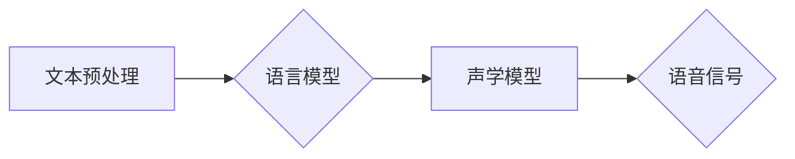

> 语音合成, Text-to-Speech, TTS, 
> 声学模型, 语言模型, 
> 序列到序列模型, 
> 循环神经网络, 
> 变分自编码器, 
> 代码实例

## 1. 背景介绍

语音合成（Speech Synthesis，简称TTS）技术是指将文本信息转换为语音信号的技术。它在现代社会扮演着越来越重要的角色，广泛应用于智能语音助手、虚拟助手、辅助阅读、游戏、教育等领域。随着人工智能技术的快速发展，语音合成技术也取得了长足的进步，能够生成更加自然、流畅、逼真的语音。

早期语音合成技术主要依赖于规则式方法，需要人工设计复杂的语音生成规则，难以实现自然流畅的语音合成。随着深度学习技术的兴起，基于深度学习的语音合成技术逐渐成为主流，能够学习大量的语音数据，并生成更加逼真的语音。

## 2. 核心概念与联系

语音合成系统通常由以下几个核心模块组成：

* **文本预处理模块:** 将输入的文本进行预处理，例如分词、词性标注、语法分析等，以便后续的语音合成过程。
* **语言模型模块:** 用于预测文本序列的下一个词，可以提高语音合成系统的流畅度和自然度。
* **声学模型模块:** 用于将文本序列映射到语音信号，是语音合成系统的核心模块。

**Mermaid 流程图:**



## 3. 核心算法原理 & 具体操作步骤

### 3.1  算法原理概述

基于深度学习的语音合成技术主要采用序列到序列（Sequence-to-Sequence，Seq2Seq）模型，将文本序列映射到语音信号序列。Seq2Seq模型通常由编码器和解码器两部分组成。

* **编码器:** 将输入的文本序列编码成一个固定长度的向量表示。
* **解码器:** 根据编码器的输出，生成语音信号序列。

### 3.2  算法步骤详解

1. **文本预处理:** 将输入的文本进行预处理，例如分词、词性标注、语法分析等。
2. **文本编码:** 将预处理后的文本序列输入到编码器中，编码器将文本序列编码成一个固定长度的向量表示。
3. **语音解码:** 将编码器的输出作为解码器的输入，解码器根据编码器的输出，生成语音信号序列。
4. **语音合成:** 将生成的语音信号序列合成成语音文件。

### 3.3  算法优缺点

**优点:**

* 可以生成更加自然、流畅、逼真的语音。
* 可以学习大量的语音数据，并不断提高语音合成质量。

**缺点:**

* 训练数据量大，训练时间长。
* 模型复杂度高，计算资源需求大。

### 3.4  算法应用领域

* 智能语音助手
* 虚拟助手
* 辅助阅读
* 游戏
* 教育

## 4. 数学模型和公式 & 详细讲解 & 举例说明

### 4.1  数学模型构建

语音合成系统通常采用循环神经网络（Recurrent Neural Network，RNN）或变分自编码器（Variational Autoencoder，VAE）作为声学模型。

**RNN模型:**

RNN模型是一种能够处理序列数据的网络结构，其内部包含循环连接，能够记忆之前的信息，从而更好地处理语音序列。

**VAE模型:**

VAE模型是一种生成模型，能够学习数据的潜在表示，并根据潜在表示生成新的数据。在语音合成中，VAE模型可以学习语音数据的潜在表示，并根据潜在表示生成新的语音信号。

### 4.2  公式推导过程

RNN模型的输出可以表示为：

$$
h_t = f(W_h h_{t-1} + W_x x_t + b_h)
$$

其中：

* $h_t$ 是时间步 $t$ 的隐藏状态。
* $h_{t-1}$ 是时间步 $t-1$ 的隐藏状态。
* $x_t$ 是时间步 $t$ 的输入。
* $W_h$ 和 $W_x$ 是权重矩阵。
* $b_h$ 是偏置项。
* $f$ 是激活函数。

VAE模型的编码器和解码器分别可以表示为：

* **编码器:** $z = E(x)$
* **解码器:** $x' = D(z)$

其中：

* $x$ 是输入数据。
* $z$ 是潜在表示。
* $x'$ 是解码后的数据。
* $E$ 和 $D$ 分别是编码器和解码器网络。

### 4.3  案例分析与讲解

可以参考一些开源的语音合成项目，例如Tacotron 2、FastSpeech 2等，深入了解其模型结构、训练方法和效果。

## 5. 项目实践：代码实例和详细解释说明

### 5.1  开发环境搭建

* Python 3.x
* TensorFlow 或 PyTorch
* CUDA 和 cuDNN

### 5.2  源代码详细实现

以下是一个简单的基于 TensorFlow 的语音合成代码示例：

```python
import tensorflow as tf

# 定义编码器模型
encoder = tf.keras.Sequential([
    tf.keras.layers.Embedding(input_dim=vocab_size, output_dim=embedding_dim),
    tf.keras.layers.LSTM(units=hidden_units)
])

# 定义解码器模型
decoder = tf.keras.Sequential([
    tf.keras.layers.LSTM(units=hidden_units),
    tf.keras.layers.Dense(units=vocab_size, activation='softmax')
])

# 定义模型
model = tf.keras.Model(inputs=encoder.input, outputs=decoder(encoder.output))

# 编译模型
model.compile(optimizer='adam', loss='sparse_categorical_crossentropy', metrics=['accuracy'])

# 训练模型
model.fit(x_train, y_train, epochs=epochs)

# 生成语音
text = "Hello, world!"
encoded_text = encoder.predict(text)
generated_text = decoder.predict(encoded_text)
```

### 5.3  代码解读与分析

* 编码器模型使用 Embedding 层将文本序列映射到词向量空间，然后使用 LSTM 层学习文本序列的上下文信息。
* 解码器模型使用 LSTM 层解码编码器的输出，并生成语音信号序列。
* 模型使用 Adam 优化器、稀疏类别交叉熵损失函数和准确率作为评估指标。

### 5.4  运行结果展示

训练完成后，可以将文本输入到模型中，生成相应的语音信号。

## 6. 实际应用场景

### 6.1  智能语音助手

语音合成技术是智能语音助手不可或缺的一部分，例如 Siri、Alexa、Google Assistant 等。

### 6.2  虚拟助手

语音合成技术可以用于创建虚拟助手，例如客服机器人、教学机器人等。

### 6.3  辅助阅读

语音合成技术可以帮助视障人士或阅读困难的人士进行辅助阅读。

### 6.4  未来应用展望

* 更逼真的语音合成
* 多语言语音合成
* 个性化语音合成
* 语音情感识别和表达

## 7. 工具和资源推荐

### 7.1  学习资源推荐

* **书籍:**
    * Speech and Language Processing by Jurafsky and Martin
    * Deep Learning by Goodfellow, Bengio, and Courville
* **在线课程:**
    * Coursera: Natural Language Processing Specialization
    * Udacity: Deep Learning Nanodegree

### 7.2  开发工具推荐

* **TensorFlow:** https://www.tensorflow.org/
* **PyTorch:** https://pytorch.org/
* **Kaldi:** https://kaldi-asr.org/

### 7.3  相关论文推荐

* **Tacotron 2:** https://arxiv.org/abs/1712.05884
* **FastSpeech 2:** https://arxiv.org/abs/1905.06190

## 8. 总结：未来发展趋势与挑战

### 8.1  研究成果总结

近年来，基于深度学习的语音合成技术取得了长足的进步，能够生成更加自然、流畅、逼真的语音。

### 8.2  未来发展趋势

* 更逼真的语音合成
* 多语言语音合成
* 个性化语音合成
* 语音情感识别和表达

### 8.3  面临的挑战

* 训练数据量大，训练时间长。
* 模型复杂度高，计算资源需求大。
* 语音合成系统仍然难以完全模拟人类的语音表达能力。

### 8.4  研究展望

未来，语音合成技术将继续朝着更加自然、逼真、个性化的方向发展，并应用于更多领域。

## 9. 附录：常见问题与解答

* **Q: 如何选择合适的声学模型？**
* **A:** 选择声学模型需要根据具体的应用场景和数据特点进行选择。

* **Q: 如何提高语音合成系统的质量？**
* **A:** 可以通过增加训练数据量、优化模型结构、改进训练方法等方式提高语音合成系统的质量。


作者：禅与计算机程序设计艺术 / Zen and the Art of Computer Programming 
<end_of_turn>