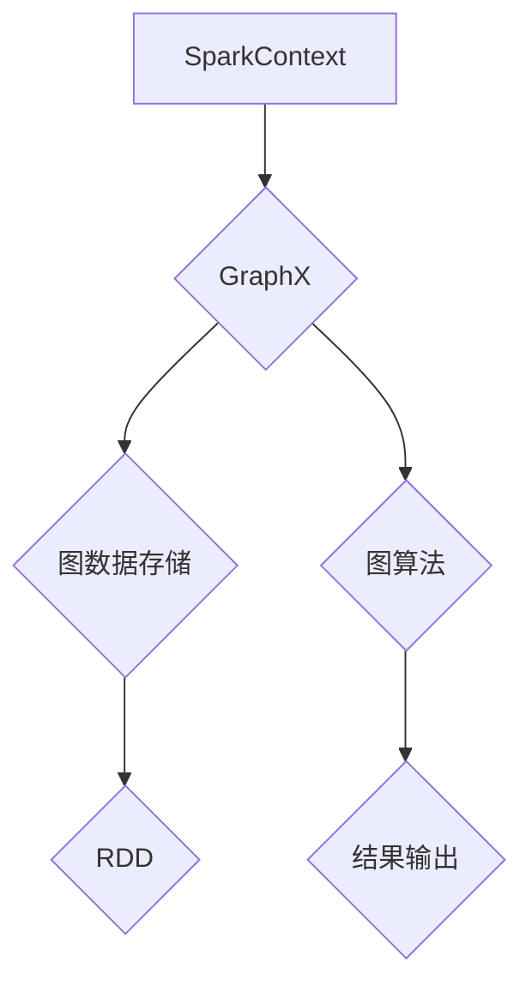

> GraphX, 图计算, Spark, 数据挖掘, 社交网络分析, 推荐系统

## 1. 背景介绍

在海量数据时代，传统的数据库和数据处理方法已难以满足对复杂数据分析的需求。图数据，以节点和边表示关系，能够有效地捕捉现实世界中的复杂关联和结构。GraphX 是 Apache Spark 上构建的图计算框架，它提供了一套强大的工具和算法，用于对图数据进行高效的存储、处理和分析。

GraphX 的出现，为大规模图数据分析提供了新的解决方案，它结合了 Spark 的高性能和易用性，使得图计算更加便捷高效。

## 2. 核心概念与联系

GraphX 的核心概念包括：

* **图 (Graph):** 由节点 (Vertex) 和边 (Edge) 组成的数据结构。节点代表实体，边代表实体之间的关系。
* **顶点 (Vertex):** 图中的基本单元，代表一个实体。每个顶点可以拥有属性，例如用户 ID、姓名、年龄等。
* **边 (Edge):** 连接两个顶点的线，代表两个实体之间的关系。边也可以拥有属性，例如关系类型、时间戳等。
* **图类型:** GraphX 支持多种图类型，包括有向图、无向图、带权图等。

**GraphX 架构**



## 3. 核心算法原理 & 具体操作步骤

### 3.1  算法原理概述

GraphX 提供了一系列图算法，例如：

* **PageRank 算法:** 用于计算节点的重要性，广泛应用于搜索引擎排名和社交网络分析。
* **Shortest Path 算法:** 用于寻找两个节点之间的最短路径，应用于导航、物流等领域。
* **Connected Components 算法:** 用于找到图中所有相互连接的节点组，应用于社交网络分析和网络拓扑分析。

### 3.2  算法步骤详解

以 PageRank 算法为例，其基本步骤如下：

1. **初始化:** 为每个节点赋予初始 PageRank 值，通常为 1。
2. **迭代计算:** 
    * 对于每个节点，计算其 PageRank 值，该值等于所有指向该节点的边的权重之和，除以指向该节点的所有边的总权重。
    * 重复上述步骤，直到 PageRank 值收敛。

### 3.3  算法优缺点

**优点:**

* 高效性: GraphX 基于 Spark 的分布式计算框架，能够高效处理海量图数据。
* 灵活性: GraphX 提供了丰富的图算法和 API，用户可以根据需求定制算法。
* 易用性: GraphX 的 API 设计简洁易懂，方便用户使用。

**缺点:**

* 复杂性: 图算法的实现相对复杂，需要一定的编程经验。
* 性能瓶颈: 对于某些特定的图算法，GraphX 的性能可能存在瓶颈。

### 3.4  算法应用领域

GraphX 的应用领域非常广泛，包括：

* **社交网络分析:** 分析用户关系、传播路径、社区结构等。
* **推荐系统:** 基于用户行为和商品关系进行推荐。
* **知识图谱:** 建立和分析知识图谱，用于知识发现和推理。
* **网络安全:** 检测网络攻击、识别恶意节点等。

## 4. 数学模型和公式 & 详细讲解 & 举例说明

### 4.1  数学模型构建

PageRank 算法的数学模型可以表示为：

$$PR(v) = (1-d) + d \sum_{u \in \text{in}(v)} \frac{PR(u)}{out(u)}$$

其中：

* $PR(v)$: 节点 $v$ 的 PageRank 值。
* $d$: 阻尼因子，通常取值为 0.85。
* $in(v)$: 指向节点 $v$ 的所有边。
* $out(u)$: 节点 $u$ 的所有出边。

### 4.2  公式推导过程

PageRank 算法的公式推导过程基于以下假设：

* 每个用户随机浏览网页。
* 用户以概率 $d$ 继续浏览链接，以概率 $1-d$ 随机跳转到其他网页。

根据这些假设，我们可以推导出 PageRank 算法的公式。

### 4.3  案例分析与讲解

假设有一个简单的图，包含三个节点 A、B、C，以及以下边：

* A -> B
* B -> C
* C -> A

如果初始 PageRank 值为 1，则可以根据 PageRank 算法的公式计算每个节点的 PageRank 值。

## 5. 项目实践：代码实例和详细解释说明

### 5.1  开发环境搭建

* 安装 Java JDK
* 安装 Apache Spark
* 安装 GraphX 库

### 5.2  源代码详细实现

```scala
import org.apache.spark.graphx._
import org.apache.spark.SparkContext

object PageRankExample {
  def main(args: Array[String]): Unit = {
    val sc = new SparkContext("local", "PageRankExample")
    val graph = GraphLoader.edgeListFile(sc, "data/graph.txt").cache()

    val initialPageRank = 1.0
    val numIterations = 10

    val pagerank = graph.pageRank(initialPageRank, numIterations).vertices

    pagerank.collect().foreach(println)

    sc.stop()
  }
}
```

### 5.3  代码解读与分析

* `GraphLoader.edgeListFile(sc, "data/graph.txt")`: 从文件加载图数据。
* `graph.pageRank(initialPageRank, numIterations)`: 计算 PageRank 值。
* `pagerank.vertices`: 获取每个节点的 PageRank 值。
* `collect()`: 将结果收集到主节点。

### 5.4  运行结果展示

运行代码后，会输出每个节点的 PageRank 值。

## 6. 实际应用场景

### 6.1  社交网络分析

GraphX 可以用于分析社交网络中的用户关系、传播路径、社区结构等。例如，可以利用 PageRank 算法计算用户的重要性，识别关键意见领袖。

### 6.2  推荐系统

GraphX 可以用于构建基于用户行为和商品关系的推荐系统。例如，可以利用 Shortest Path 算法推荐用户可能感兴趣的商品。

### 6.3  知识图谱

GraphX 可以用于构建和分析知识图谱，用于知识发现和推理。例如，可以利用 GraphX 的图算法分析知识图谱中的关系，发现新的知识。

### 6.4  未来应用展望

随着大数据和人工智能技术的不断发展，GraphX 的应用场景将更加广泛。例如，可以利用 GraphX 进行生物信息学研究、金融风险分析、城市交通规划等。

## 7. 工具和资源推荐

### 7.1  学习资源推荐

* Apache Spark 官方文档: https://spark.apache.org/docs/latest/
* GraphX 官方文档: https://spark.apache.org/docs/latest/graphx-programming-guide.html
* GraphX 入门教程: https://www.tutorialspoint.com/spark/spark_graphx.htm

### 7.2  开发工具推荐

* Apache Spark IDE: https://spark.apache.org/docs/latest/spark-shell.html
* IntelliJ IDEA: https://www.jetbrains.com/idea/

### 7.3  相关论文推荐

* PageRank: The Anatomy of a Web Page Rank Algorithm
* GraphX: A Graph Processing Framework on Apache Spark

## 8. 总结：未来发展趋势与挑战

### 8.1  研究成果总结

GraphX 作为 Apache Spark 上的图计算框架，为大规模图数据分析提供了高效、灵活、易用的解决方案。

### 8.2  未来发展趋势

* **性能优化:** 针对特定图算法，进一步优化 GraphX 的性能。
* **算法扩展:** 开发更多新的图算法，满足更广泛的应用需求。
* **异构图支持:** 支持处理不同类型数据的异构图。
* **云原生化:** 将 GraphX 部署到云平台，提供更便捷的访问和使用方式。

### 8.3  面临的挑战

* **复杂性:** 图算法的实现相对复杂，需要一定的编程经验。
* **性能瓶颈:** 对于某些特定的图算法，GraphX 的性能可能存在瓶颈。
* **数据隐私:** 处理图数据时，需要考虑数据隐私和安全问题。

### 8.4  研究展望

未来，GraphX 将继续朝着更高效、更灵活、更易用、更安全的方向发展，为大规模图数据分析提供更强大的工具和解决方案。

## 9. 附录：常见问题与解答

* **Q: GraphX 和 Neo4j 的区别是什么？**
* **A:** GraphX 是基于 Spark 的图计算框架，而 Neo4j 是一个独立的图数据库。GraphX 更侧重于图算法的计算，而 Neo4j 更侧重于图数据的存储和查询。

* **Q: 如何安装 GraphX？**
* **A:** 可以通过以下方式安装 GraphX:
    * 使用 Maven 或 Gradle 等构建工具。
    * 下载 GraphX 的二进制包并手动安装。

* **Q: GraphX 支持哪些图算法？**
* **A:** GraphX 支持多种图算法，包括 PageRank、Shortest Path、Connected Components 等。

* **Q: GraphX 的性能如何？**
* **A:** GraphX 基于 Spark 的分布式计算框架，能够高效处理海量图数据。

* **Q: GraphX 的学习资源有哪些？**
* **A:** 可以参考 Apache Spark 官方文档、GraphX 官方文档以及一些在线教程。


作者：禅与计算机程序设计艺术 / Zen and the Art of Computer Programming 
<end_of_turn>