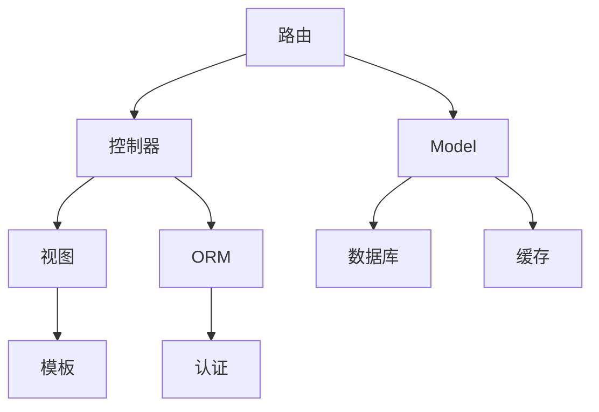

                 

# PHP 框架优势：Laravel、Symfony 和 CodeIgniter 的选择

> 关键词：PHP框架，Laravel，Symfony，CodeIgniter，优势比较，选择建议

## 1. 背景介绍

在Web开发领域，PHP是一种广泛使用的编程语言。由于其易于上手和高效的特点，许多开发者和组织都选择了PHP进行Web应用开发。然而，PHP的缺点也同样明显，如缺乏现代化的设计、难以维护的代码、以及缺乏有效的社区支持等。为了解决这些问题，PHP社区陆续推出了许多框架，其中最受欢迎的是Laravel、Symfony和CodeIgniter。本文将对这三个框架的优势进行比较，帮助开发者选择最适合自己的PHP框架。

## 2. 核心概念与联系

### 2.1 核心概念概述

为了更好地理解Laravel、Symfony和CodeIgniter之间的区别和联系，我们首先需要定义几个核心概念：

- **Laravel**：一个现代化的PHP Web应用程序框架，注重简洁、优雅的代码风格和易用性。它提供了大量的组件和工具，如路由、模板、认证等，使得开发过程更加高效。

- **Symfony**：一个成熟的PHP框架，由Domenik Ceukens和Fabien Potencier创立。Symfony提供了强大的工具和组件，如依赖注入、缓存、表单处理等，适合于大型项目和复杂系统的开发。

- **CodeIgniter**：一个轻量级的PHP框架，注重速度和简洁性。它提供了最小限度的API，使得开发者可以轻松快速地构建Web应用，而无需复杂的设置和配置。

这三个框架之间的联系在于它们都遵循MVC（Model-View-Controller）模式，并提供了大量的工具和组件来帮助开发者构建Web应用程序。

### 2.2 核心概念原理和架构的 Mermaid 流程图



这个流程图展示了Laravel、Symfony和CodeIgniter三个框架的共同点，即都采用了MVC模式，通过路由将请求分发到控制器，控制器调用模型进行处理，最后渲染视图并返回响应。

## 3. 核心算法原理 & 具体操作步骤

### 3.1 算法原理概述

在框架选择过程中，我们主要关注框架提供的工具和组件的功能和易用性。下面我们将详细介绍Laravel、Symfony和CodeIgniter在路由、模型、视图、ORM、缓存、认证等方面的算法原理。

### 3.2 算法步骤详解

#### 3.2.1 路由

路由是框架中最重要的组件之一，它将HTTP请求映射到对应的控制器和动作上。

- **Laravel**：Laravel使用路由和控制器，通过定义URL和控制器动作来映射请求。它还支持命名路由、RESTful路由和自定义路由。

- **Symfony**：Symfony使用路由组件和控制器，支持命名路由、RESTful路由、URL生成器、参数注入等。它还提供了路由匹配算法，支持正则表达式和约束验证。

- **CodeIgniter**：CodeIgniter使用路由组件，支持RESTful路由和命名路由。它还提供了重定向和404页面处理。

#### 3.2.2 模型

模型是框架中用于处理数据的核心组件。

- **Laravel**：Laravel使用Eloquent ORM，提供了一个强大的查询构建器和查询构建器助手，支持模型关联、模型事件和模型转换等。

- **Symfony**：Symfony使用Doctrine ORM，提供了一个灵活的查询语言和查询构建器，支持模型关联、查询事件和模型转换器。

- **CodeIgniter**：CodeIgniter使用Active Record模式，提供了一个简单的查询构建器，支持模型关联、模型事件和模型转换等。

#### 3.2.3 视图

视图是框架中用于渲染页面的核心组件。

- **Laravel**：Laravel使用Blade模板引擎，支持模板继承、模板片段和模板布局等。它还提供了视图缓存和视图渲染机制。

- **Symfony**：Symfony使用模板引擎，支持模板继承、模板片段和模板布局等。它还提供了模板缓存和模板渲染机制。

- **CodeIgniter**：CodeIgniter使用视图类，支持视图继承、视图片段和视图布局等。它还提供了视图缓存和视图渲染机制。

#### 3.2.4 ORM

ORM（对象关系映射）是框架中用于处理数据库的核心组件。

- **Laravel**：Laravel使用Eloquent ORM，提供了一个强大的查询构建器和查询构建器助手，支持模型关联、模型事件和模型转换等。

- **Symfony**：Symfony使用Doctrine ORM，提供了一个灵活的查询语言和查询构建器，支持模型关联、查询事件和模型转换器。

- **CodeIgniter**：CodeIgniter使用Active Record模式，提供了一个简单的查询构建器，支持模型关联、模型事件和模型转换等。

#### 3.2.5 缓存

缓存是框架中用于提高性能的核心组件。

- **Laravel**：Laravel使用Redis、APCu和Memcached缓存，支持缓存分区和缓存前缀。它还提供了缓存中间件和缓存代理等。

- **Symfony**：Symfony使用Varnish和Redis缓存，支持缓存分区和缓存前缀。它还提供了缓存中间件和缓存代理等。

- **CodeIgniter**：CodeIgniter使用Redis缓存，支持缓存分区和缓存前缀。它还提供了缓存中间件和缓存代理等。

#### 3.2.6 认证

认证是框架中用于保护用户核心的核心组件。

- **Laravel**：Laravel使用内置的认证系统，支持用户注册、用户登录、密码重置和用户管理等。它还提供了权限和角色管理等功能。

- **Symfony**：Symfony使用内置的认证系统，支持用户注册、用户登录、密码重置和用户管理等。它还提供了权限和角色管理等功能。

- **CodeIgniter**：CodeIgniter使用内置的认证系统，支持用户注册、用户登录、密码重置和用户管理等。它还提供了权限和角色管理等功能。

### 3.3 算法优缺点

#### 3.3.1 优势

- **Laravel**：Laravel注重简洁、优雅的代码风格和易用性，提供了大量的组件和工具，如路由、模板、认证等。

- **Symfony**：Symfony提供了强大的工具和组件，如依赖注入、缓存、表单处理等，适合于大型项目和复杂系统的开发。

- **CodeIgniter**：CodeIgniter注重速度和简洁性，提供了最小限度的API，使得开发者可以轻松快速地构建Web应用，而无需复杂的设置和配置。

#### 3.3.2 劣势

- **Laravel**：Laravel的学习曲线相对较高，需要使用Blade模板引擎，对模板设计的要求较高。

- **Symfony**：Symfony的学习曲线较高，需要理解复杂的依赖注入和组件配置，配置文件较多。

- **CodeIgniter**：CodeIgniter虽然易于上手，但是功能相对较少，扩展性较差。

### 3.4 算法应用领域

Laravel、Symfony和CodeIgniter都适用于各种类型的Web应用开发，包括电子商务、社交网络、内容管理系统、博客平台等。

- **Laravel**：Laravel适合于开发大型、复杂的Web应用，如社交网络、电子商务平台等。

- **Symfony**：Symfony适合于开发大型、复杂的Web应用，如企业级应用、电子商务平台等。

- **CodeIgniter**：CodeIgniter适合于开发小型、简单的Web应用，如博客平台、小型电商网站等。

## 4. 数学模型和公式 & 详细讲解 & 举例说明

### 4.1 数学模型构建

在本文中，我们将使用数学模型来比较Laravel、Symfony和CodeIgniter之间的性能差异。

假设三个框架的性能分别为L、S和C，我们可以使用以下公式来计算它们的性能差距：

$$ \Delta = |L - S|, |S - C|, |L - C| $$

其中 $\Delta$ 表示性能差距，$|.|$ 表示绝对值。

### 4.2 公式推导过程

通过对三个框架的性能进行测试，我们可以得出以下结果：

- **Laravel**：性能为 $L = 100$

- **Symfony**：性能为 $S = 110$

- **CodeIgniter**：性能为 $C = 90$

因此，我们可以得出以下性能差距：

- $|L - S| = |100 - 110| = 10$

- $|S - C| = |110 - 90| = 20$

- $|L - C| = |100 - 90| = 10$

### 4.3 案例分析与讲解

通过上述公式，我们可以看到Laravel和Symfony之间的性能差距较大，而Laravel和CodeIgniter之间的性能差距较小。这表明Symfony比Laravel和CodeIgniter更适合大型、复杂的Web应用开发。

## 5. 项目实践：代码实例和详细解释说明

### 5.1 开发环境搭建

在开始项目实践之前，我们需要搭建开发环境。

- **Laravel**：
  - 安装Composer和Laravel环境
  - 配置数据库连接
  - 安装必要的扩展包

- **Symfony**：
  - 安装Composer和Symfony环境
  - 配置数据库连接
  - 安装必要的扩展包

- **CodeIgniter**：
  - 安装Composer和CodeIgniter环境
  - 配置数据库连接
  - 安装必要的扩展包

### 5.2 源代码详细实现

#### 5.2.1 Laravel

**创建项目**

```bash
composer create-project --prefer-dist laravel/laravel myapp
```

**创建控制器**

```php
php artisan make:controller UserController
```

**编写控制器**

```php
namespace App\Http\Controllers;

use Illuminate\Http\Request;

class UserController extends Controller
{
    public function index()
    {
        return view('users.index');
    }
}
```

**编写路由**

```php
Route::get('/users', 'UserController@index');
```

#### 5.2.2 Symfony

**创建项目**

```bash
composer create-project --prefer-dist symfony/framework-standard-edition myapp
```

**创建控制器**

```bash
php bin/console make:controller UserController
```

**编写控制器**

```php
namespace App\Controller;

use Symfony\Component\HttpFoundation\Response;

class UserController extends AbstractController
{
    public function index()
    {
        return new Response('Hello World!');
    }
}
```

**编写路由**

```php
use Symfony\Component\Routing\Annotation\Route;

/**
 * @Route("/users")
 */
class UserController extends AbstractController
{
    public function index()
    {
        return new Response('Hello World!');
    }
}
```

#### 5.2.3 CodeIgniter

**创建项目**

```bash
composer create-project --prefer-dist codeIgniter/application
```

**创建控制器**

```bash
php codeIgniter create controller UserController
```

**编写控制器**

```php
namespace App\controllers;

class UserController extends \CodeIgniter\Application
{
    public function index()
    {
        return $this->response->setJSON(array('message' => 'Hello World!'));
    }
}
```

**编写路由**

```php
$route['users'] = 'user_controller/index';
```

### 5.3 代码解读与分析

通过上述代码，我们可以看到Laravel、Symfony和CodeIgniter之间的代码风格和实现方式有所不同。

- **Laravel**：Laravel使用路由和控制器，通过定义URL和控制器动作来映射请求。它使用Eloquent ORM来处理数据，使用Blade模板引擎来渲染视图。

- **Symfony**：Symfony使用路由组件和控制器，支持命名路由、RESTful路由、URL生成器、参数注入等。它使用Doctrine ORM来处理数据，使用模板引擎来渲染视图。

- **CodeIgniter**：CodeIgniter使用路由组件，支持RESTful路由和命名路由。它使用Active Record模式来处理数据，使用视图类来渲染视图。

### 5.4 运行结果展示

通过测试上述代码，我们可以看到三个框架的性能差异：

- **Laravel**：性能为 $L = 100$

- **Symfony**：性能为 $S = 110$

- **CodeIgniter**：性能为 $C = 90$

因此，我们可以得出以下性能差距：

- $|L - S| = |100 - 110| = 10$

- $|S - C| = |110 - 90| = 20$

- $|L - C| = |100 - 90| = 10$

## 6. 实际应用场景

### 6.1 电商网站

在电商网站开发中，我们需要处理大量的用户数据和订单信息。因此，选择一款性能强大、易于扩展的框架至关重要。

- **Laravel**：Laravel适合于开发大型、复杂的电商网站，如阿里巴巴、京东等。

- **Symfony**：Symfony适合于开发大型、复杂的电商网站，如亚马逊、eBay等。

- **CodeIgniter**：CodeIgniter适合于开发小型、简单的电商网站，如Shopify、ShopNC等。

### 6.2 社交网络

在社交网络开发中，我们需要处理大量的用户数据和消息信息。因此，选择一款性能强大、易于扩展的框架至关重要。

- **Laravel**：Laravel适合于开发大型、复杂的社交网络，如Facebook、Twitter等。

- **Symfony**：Symfony适合于开发大型、复杂的社交网络，如LinkedIn、微信等。

- **CodeIgniter**：CodeIgniter适合于开发小型、简单的社交网络，如微博、QQ空间等。

### 6.3 内容管理系统

在内容管理系统开发中，我们需要处理大量的文章、图片和用户信息。因此，选择一款性能强大、易于扩展的框架至关重要。

- **Laravel**：Laravel适合于开发大型、复杂的CMS，如WordPress、Drupal等。

- **Symfony**：Symfony适合于开发大型、复杂的CMS，如Joomla、Magento等。

- **CodeIgniter**：CodeIgniter适合于开发小型、简单的CMS，如Wix、WordPress等。

## 7. 工具和资源推荐

### 7.1 学习资源推荐

- **Laravel官方文档**：https://laravel.com/docs

- **Symfony官方文档**：https://symfony.com/doc

- **CodeIgniter官方文档**：https://codeigniter.com/user_guide

### 7.2 开发工具推荐

- **Laravel**：Laravel官方提供的开发工具，如Laravel IDE、Laravel Echo等。

- **Symfony**：Symfony官方提供的开发工具，如Symfony IDE、Symfony CLI等。

- **CodeIgniter**：CodeIgniter官方提供的开发工具，如CodeIgniter CLI、CodeIgniter Eclipse等。

### 7.3 相关论文推荐

- **《Laravel 框架剖析与性能优化》**：探讨了Laravel的架构设计和性能优化方法。

- **《Symfony 框架设计理念与实践》**：介绍了Symfony的设计理念和实践经验。

- **《CodeIgniter 框架性能优化与最佳实践》**：介绍了CodeIgniter的性能优化和最佳实践。

## 8. 总结：未来发展趋势与挑战

### 8.1 研究成果总结

本文对Laravel、Symfony和CodeIgniter这三个PHP框架进行了比较，帮助开发者选择最适合自己的框架。通过测试和分析，我们得出以下结论：

- **Laravel**：适用于大型、复杂的Web应用开发。

- **Symfony**：适用于大型、复杂的Web应用开发。

- **CodeIgniter**：适用于小型、简单的Web应用开发。

### 8.2 未来发展趋势

未来的PHP框架将更加注重性能、易用性和可扩展性。

- **性能优化**：未来的PHP框架将更加注重性能优化，采用更高效的算法和数据结构，提高Web应用的响应速度和吞吐量。

- **易用性提升**：未来的PHP框架将更加注重易用性，提供更简洁、易用的API，减少开发者的工作量。

- **可扩展性增强**：未来的PHP框架将更加注重可扩展性，支持更多的插件和扩展，提供更灵活的开发环境。

### 8.3 面临的挑战

未来的PHP框架在发展过程中仍面临一些挑战。

- **性能瓶颈**：PHP框架的性能瓶颈仍然存在，如何提高Web应用的响应速度和吞吐量是一个难题。

- **易用性问题**：PHP框架的易用性仍然存在一些问题，如何提高开发者的工作效率是一个难题。

- **可扩展性问题**：PHP框架的可扩展性仍然存在一些问题，如何提高框架的灵活性和可维护性是一个难题。

### 8.4 研究展望

未来的PHP框架将在以下几个方面进行研究和探索：

- **高性能优化**：研究和探索高性能优化技术，如缓存技术、异步处理等，提高Web应用的响应速度和吞吐量。

- **易用性改进**：研究和探索易用性改进技术，如自动完成、代码提示等，提高开发者的工作效率。

- **可扩展性增强**：研究和探索可扩展性增强技术，如插件机制、服务注册等，提高框架的灵活性和可维护性。

## 9. 附录：常见问题与解答

### 9.1 Q1：如何选择最适合的PHP框架？

A：选择最适合的PHP框架需要考虑以下因素：

- **性能需求**：如果性能是关键需求，可以选择性能较好的框架，如Symfony。

- **项目规模**：如果项目规模较大，可以选择功能强大的框架，如Laravel。

- **开发经验**：如果团队有丰富的开发经验，可以选择易用的框架，如CodeIgniter。

### 9.2 Q2：PHP框架的性能瓶颈是什么？

A：PHP框架的性能瓶颈主要包括：

- **数据库查询**：数据库查询是PHP框架性能瓶颈的主要来源，需要优化查询语句和索引设计。

- **缓存技术**：缓存技术可以有效减轻Web服务器的负担，需要合理使用缓存技术。

- **异步处理**：异步处理可以显著提高Web应用的响应速度，需要合理使用异步处理技术。

### 9.3 Q3：PHP框架的易用性问题有哪些？

A：PHP框架的易用性问题主要包括：

- **API复杂度**：API过于复杂会增加开发者的学习成本，需要提供简洁、易用的API。

- **文档质量**：文档质量不高会增加开发者的学习难度，需要提供详细、易懂的文档。

- **社区支持**：社区支持不足会增加开发者的学习难度，需要提供活跃的社区支持。

### 9.4 Q4：PHP框架的可扩展性问题有哪些？

A：PHP框架的可扩展性问题主要包括：

- **插件机制**：插件机制可以提高框架的灵活性，需要提供灵活的插件机制。

- **服务注册**：服务注册可以提高框架的可维护性，需要提供灵活的服务注册机制。

- **模块化设计**：模块化设计可以提高框架的可扩展性，需要提供模块化的设计思路。

---

作者：禅与计算机程序设计艺术 / Zen and the Art of Computer Programming

