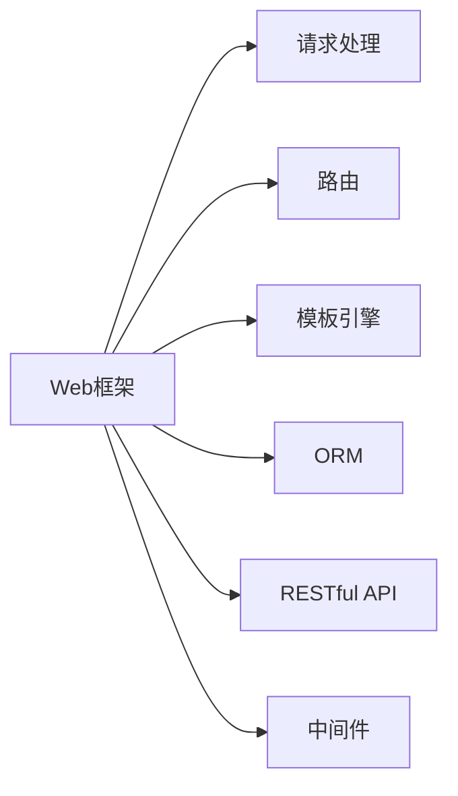

                 

# Python Web 框架比较：探索适合项目的最佳选择

> 关键词：Python Web框架, Flask, Django, FastAPI, Pyramid, Tornado

## 1. 背景介绍

随着Web技术的发展，Python在Web开发领域中的地位愈发重要。Python Web框架提供了一系列工具和库，使得开发者可以更加高效地构建Web应用。面对众多Python Web框架，选择适合自己的框架成为开发者的首要任务。

Python Web框架主要分为两大类：微型框架和全栈框架。微型框架如Flask、Bottle、Tornado等，提供了最小限度的功能，灵活性高，适用于小型项目；全栈框架如Django、Pyramid、FastAPI等，功能强大，适用于中大型项目。

本文将通过分析Python Web框架的核心概念、原理与特点，比较它们在不同项目中的应用场景和优劣，帮助开发者选择最适合自己项目的Web框架。

## 2. 核心概念与联系

### 2.1 核心概念概述

在比较Python Web框架之前，需要先了解一些核心概念：

- **Web框架**：一种用于快速开发Web应用的框架，提供路由、模板引擎、表单处理等功能，使得开发者可以专注于业务逻辑的实现。

- **微型框架**：仅提供基本功能，如路由、请求处理、模板渲染等，适合小规模、快速迭代的项目。

- **全栈框架**：提供全面的功能，包括ORM、认证、管理后台等，适合中大规模、功能复杂的项目。

- **请求处理**：框架负责处理HTTP请求，并根据路由规则将请求转发给相应的处理器。

- **路由**：将URL与处理函数进行映射，使得框架可以根据URL访问具体资源。

- **模板引擎**：将动态生成的内容与HTML模板进行结合，生成静态页面。

- **ORM（对象关系映射）**：将数据库中的表映射到Python对象上，使得开发者可以使用面向对象的方式来操作数据库。

- **RESTful API**：基于HTTP协议，遵循REST架构风格，提供资源的CRUD操作。

- **中间件**：在请求处理过程中，对请求进行处理或添加功能的组件。

### 2.2 核心概念原理和架构的 Mermaid 流程图



上述图展示了Web框架的核心组件和它们之间的联系。其中：

- `A` 表示Web框架。
- `B` 表示请求处理，用于处理HTTP请求。
- `C` 表示路由，将请求映射到相应的处理函数。
- `D` 表示模板引擎，用于动态生成HTML页面。
- `E` 表示ORM，将数据库表映射到Python对象。
- `F` 表示RESTful API，提供资源的CRUD操作。
- `G` 表示中间件，在请求处理过程中对请求进行处理或添加功能。

## 3. 核心算法原理 & 具体操作步骤

### 3.1 算法原理概述

Python Web框架的核心算法原理通常包括以下几个方面：

- **路由算法**：根据URL和请求方法，匹配相应的处理函数。
- **请求处理算法**：解析请求体，调用相应的处理函数，处理请求并返回响应。
- **ORM算法**：将数据库表映射到Python对象，并提供操作数据库的接口。
- **模板渲染算法**：将动态数据与HTML模板进行结合，生成静态页面。
- **缓存算法**：将请求的处理结果缓存起来，以提高系统性能。

### 3.2 算法步骤详解

以Django框架为例，其核心算法步骤如下：

1. **请求处理**：框架接收HTTP请求，根据URL和请求方法进行路由匹配，调用相应的视图函数。
2. **视图函数**：视图函数根据请求参数和请求体进行处理，生成动态数据。
3. **模板渲染**：框架调用模板引擎，将动态数据与HTML模板结合，生成静态页面。
4. **响应处理**：框架将生成的页面返回给浏览器，完成请求处理。

### 3.3 算法优缺点

Django框架的优点包括：

- 功能强大，支持ORM、认证、管理后台等。
- 代码可读性高，文档详细。
- 社区活跃，有大量第三方包支持。

Django框架的缺点包括：

- 初始化配置复杂，学习曲线陡峭。
- 性能较低，不适合对性能要求极高的应用。

Flask框架的优点包括：

- 灵活性高，仅提供基本功能，没有过多约束。
- 扩展性高，支持各种第三方库。
- 轻量级，内存占用小。

Flask框架的缺点包括：

- 功能不全，需要依赖第三方库实现复杂功能。
- 缺少默认中间件，需要手动添加。

### 3.4 算法应用领域

- Django框架适用于中大型项目，功能复杂且需要稳定性能的场景。
- Flask框架适用于小型项目或原型开发，需要灵活性和扩展性的场景。
- FastAPI框架适用于构建高性能、高可扩展的RESTful API。
- Pyramid框架适用于构建大型、高度可配置的Web应用。
- Tornado框架适用于需要高性能、高并发的Web应用。

## 4. 数学模型和公式 & 详细讲解 & 举例说明

### 4.1 数学模型构建

以Django框架为例，其核心算法模型可以描述如下：

- **路由模型**：将URL与处理函数进行映射。
- **请求处理模型**：解析请求体，调用相应的处理函数。
- **ORM模型**：将数据库表映射到Python对象，提供CRUD操作。
- **模板渲染模型**：将动态数据与HTML模板结合，生成静态页面。
- **缓存模型**：将请求的处理结果缓存起来，以提高系统性能。

### 4.2 公式推导过程

以路由模型为例，其算法可以推导如下：

假设路由字典为`routes`，路由匹配算法可以表示为：

$$
match_url(url, routes) = \begin{cases}
    \text{找到匹配路由} & \text{如果存在} \\
    \text{未找到匹配路由} & \text{如果不存在}
\end{cases}
$$

其中，`url`表示URL，`routes`表示路由字典。

### 4.3 案例分析与讲解

以Django框架为例，其路由匹配算法如下：

1. 将URL进行解析，得到URL各部分。
2. 从路由字典中查找匹配路由。
3. 如果找到匹配路由，调用相应的处理函数。
4. 如果没有找到匹配路由，返回404错误。

## 5. 项目实践：代码实例和详细解释说明

### 5.1 开发环境搭建

以下是使用Python3.8搭建Flask开发环境的示例：

1. 安装Python3.8。
2. 安装Flask。
3. 安装Flask-RESTful、Flask-SQLAlchemy等第三方库。

### 5.2 源代码详细实现

以下是一个简单的Flask应用示例，用于处理HTTP请求并返回JSON格式的数据：

```python
from flask import Flask, jsonify

app = Flask(__name__)

@app.route('/hello', methods=['GET'])
def hello():
    return jsonify({'message': 'Hello, World!'})

if __name__ == '__main__':
    app.run(debug=True)
```

### 5.3 代码解读与分析

- `Flask`：创建Flask应用实例。
- `@app.route`：装饰器，将`/hello`路径映射到`hello`函数。
- `methods`：指定请求方法为GET。
- `jsonify`：将Python对象转换为JSON格式响应。
- `if __name__ == '__main__'`：确保应用在`run`函数中运行。
- `app.run(debug=True)`：启动Flask应用，并开启调试模式。

### 5.4 运行结果展示

运行上述代码后，在浏览器访问`http://127.0.0.1:5000/hello`，将返回JSON格式的响应：

```json
{"message": "Hello, World!"}
```

## 6. 实际应用场景

### 6.1 微型框架

微型框架适用于小型项目或原型开发，如个人博客、小工具等。其特点包括：

- 功能简单，代码量小。
- 灵活性高，支持各种扩展。
- 学习曲线低，上手快。

以Flask框架为例，其适用于以下场景：

- 个人博客网站。
- 小型Web应用。
- 数据可视化应用。

### 6.2 全栈框架

全栈框架适用于中大型项目，功能复杂且需要稳定性能的场景。其特点包括：

- 功能强大，支持ORM、认证、管理后台等。
- 代码可读性高，文档详细。
- 社区活跃，有大量第三方包支持。

以Django框架为例，其适用于以下场景：

- 电子商务网站。
- 企业后台管理系统。
- 社交网络应用。

### 6.3 高性能框架

高性能框架适用于需要高性能、高并发的Web应用，如在线游戏、实时数据处理等。其特点包括：

- 支持异步I/O操作。
- 支持高性能的Web服务器。
- 支持长连接和WebSocket。

以Tornado框架为例，其适用于以下场景：

- 实时聊天应用。
- 在线游戏服务器。
- 数据流处理应用。

### 6.4 未来应用展望

未来，随着Web技术的不断进步，Python Web框架将更加灵活、高效、易用。新的框架和库将不断涌现，推动Web应用的快速发展。

- 微服务架构将成为主流，Python Web框架将提供更好的支持。
- 前端与后端的结合将更加紧密，前端框架如React、Vue等将与后端框架深度集成。
- 异步编程和异步框架将更加普及，提高Web应用的性能。
- 人工智能和机器学习技术将进一步融入Web开发，提升用户体验。

## 7. 工具和资源推荐

### 7.1 学习资源推荐

以下是一些推荐的Python Web框架学习资源：

1. Flask官方文档：提供了Flask框架的详细教程和示例。
2. Django官方文档：提供了Django框架的详细教程和示例。
3. FastAPI官方文档：提供了FastAPI框架的详细教程和示例。
4. Pyramid官方文档：提供了Pyramid框架的详细教程和示例。
5. Tornado官方文档：提供了Tornado框架的详细教程和示例。
6. Python Web开发教程：如《Flask实战》、《Django核心教程》等书籍。

### 7.2 开发工具推荐

以下是一些推荐的Python Web开发工具：

1. PyCharm：功能强大的Python IDE，支持Python Web框架开发。
2. VSCode：轻量级、高度可配置的代码编辑器，支持Python Web框架开发。
3. Sublime Text：简洁、高效的代码编辑器，支持Python Web框架开发。
4. PyDev：基于Eclipse的Python IDE，支持Python Web框架开发。
5. Jupyter Notebook：交互式编程工具，支持Python Web框架开发。

### 7.3 相关论文推荐

以下是一些推荐的Python Web框架相关论文：

1. "Flask: A Small And Simple Web Framework" by Alex Martelli and Thomas Pinckney.
2. "Django: The Web Framework for perfectionists with deadlines" by Adriaan Verberg.
3. "FastAPI: Fast APIs with Python and OpenAPI" by Tarek Ziadé.
4. "Pyramid: The Truly Pythonic Web Framework" by Eric Snow.
5. "Tornado: A high-performance Python web framework" by Kevin Zakka.

## 8. 总结：未来发展趋势与挑战

### 8.1 研究成果总结

本文介绍了Python Web框架的核心概念、原理与特点，比较了不同框架在不同项目中的应用场景和优劣。通过分析，我们得出以下结论：

- 微型框架适用于小型项目或原型开发，全栈框架适用于中大型项目。
- 高性能框架适用于需要高性能、高并发的Web应用。
- Python Web框架具有多种选择，开发者应根据项目需求选择最合适的框架。

### 8.2 未来发展趋势

未来，Python Web框架将朝着更加灵活、高效、易用的方向发展。新的框架和库将不断涌现，推动Web应用的快速发展。

1. 微服务架构将成为主流，Python Web框架将提供更好的支持。
2. 前端与后端的结合将更加紧密，前端框架如React、Vue等将与后端框架深度集成。
3. 异步编程和异步框架将更加普及，提高Web应用的性能。
4. 人工智能和机器学习技术将进一步融入Web开发，提升用户体验。

### 8.3 面临的挑战

尽管Python Web框架不断发展，但在应用过程中仍面临一些挑战：

1. 性能瓶颈：Web应用需要处理大量并发请求，性能成为一大挑战。
2. 安全性问题：Web应用面临各种安全威胁，如SQL注入、跨站脚本等。
3. 可扩展性问题：Web应用需要处理大量数据，可扩展性成为一大挑战。
4. 学习曲线陡峭：复杂的Web应用需要掌握多种技术和框架，学习曲线陡峭。

### 8.4 研究展望

未来，我们需要在以下方面进行更多的研究：

1. 性能优化：研究高效的路由算法、异步编程和缓存技术，提高Web应用性能。
2. 安全性保障：研究Web应用的安全性问题，提供更好的安全防护措施。
3. 可扩展性设计：研究可扩展的Web应用架构，提供更好的扩展性支持。
4. 易用性提升：研究易用的Web框架设计，提供更好的开发者体验。

## 9. 附录：常见问题与解答

**Q1：如何选择适合自己的Python Web框架？**

A: 选择适合自己的Python Web框架，需要考虑以下因素：

- 项目规模：小型项目选择微型框架，大型项目选择全栈框架。
- 功能需求：根据项目需求选择功能适合的框架。
- 性能要求：需要高性能的Web应用选择高性能框架。
- 学习曲线：选择学习曲线低、易于上手的框架。

**Q2：如何优化Python Web应用的性能？**

A: 优化Python Web应用性能，需要从以下几个方面入手：

- 使用异步框架：使用Tornado、FastAPI等异步框架，提高Web应用的响应速度。
- 使用缓存技术：使用Redis、Memcached等缓存技术，减少数据库访问次数。
- 优化代码结构：优化代码结构，减少不必要的I/O操作和数据库访问。
- 使用负载均衡：使用Nginx、HAProxy等负载均衡工具，提高Web应用的并发处理能力。

**Q3：如何保障Python Web应用的安全性？**

A: 保障Python Web应用的安全性，需要从以下几个方面入手：

- 使用ORM框架：使用Django、Flask-SQLAlchemy等ORM框架，防止SQL注入攻击。
- 使用Web框架自带的中间件：使用Django、Flask等框架自带的中间件，防止跨站脚本攻击等。
- 使用HTTPS协议：使用HTTPS协议，防止数据在传输过程中被窃听和篡改。
- 定期更新依赖库：定期更新依赖库，避免已知漏洞被利用。

**Q4：如何设计可扩展的Python Web应用架构？**

A: 设计可扩展的Python Web应用架构，需要从以下几个方面入手：

- 分层设计：采用分层设计架构，各层独立，便于扩展。
- 使用微服务架构：采用微服务架构，各个微服务独立部署，便于扩展。
- 使用容器化技术：使用Docker、Kubernetes等容器化技术，方便部署和管理。
- 使用API网关：使用API网关，统一管理各个微服务的接口，方便扩展和维护。

---

作者：禅与计算机程序设计艺术 / Zen and the Art of Computer Programming

