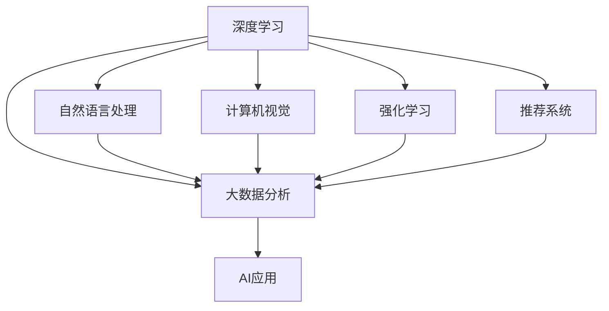
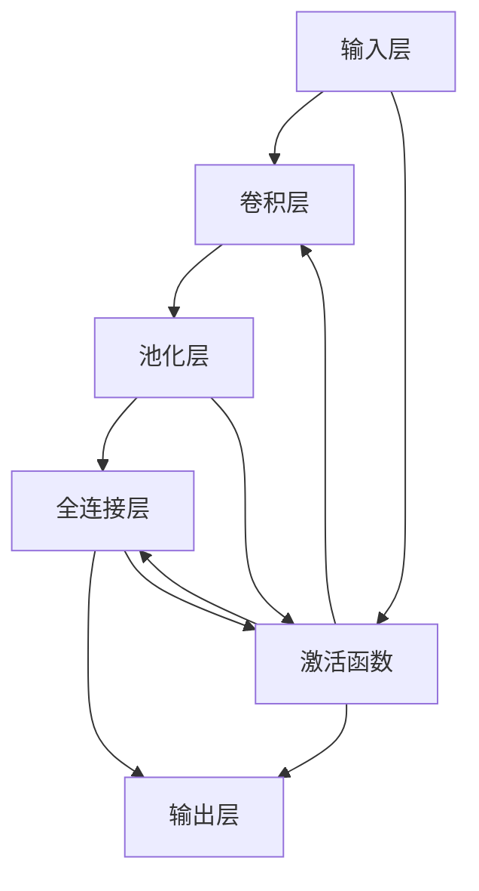

                 

# Python：人工智能开发的瑞士军刀

在人工智能(AI)飞速发展的今天，Python凭借其简单易用、功能强大、社区活跃的特性，成为了AI开发者的首选工具。无论是深度学习、自然语言处理、计算机视觉，还是强化学习、推荐系统、大数据分析，Python都能提供一站式的解决方案，使其成为AI开发中的"瑞士军刀"。

本文将深入探讨Python在人工智能开发中的核心地位，分析其核心概念、原理与架构，并结合具体项目实践，阐明其应用价值与未来趋势。通过这篇文章，希望能让读者更加深入地了解Python在AI开发中的优势和潜力，掌握其核心技术和实践方法。

## 1. 背景介绍

### 1.1 问题由来
随着人工智能技术的迅猛发展，AI领域涌现出了大量的创新应用。深度学习、自然语言处理、计算机视觉、强化学习等技术在各行各业得到了广泛应用。然而，由于AI领域涉及的知识和技术非常庞杂，单个人类专家难以掌握全部技能，这就需要一种具备强大功能和易于使用的工具，来助力开发者快速实现AI应用的开发。

Python凭借其简洁明了的语法、丰富的第三方库、强大的社区支持，满足了这一需求。通过Python，开发者可以高效地实现各种AI算法和模型，快速开发出稳定、高效、可扩展的AI应用。

### 1.2 问题核心关键点
Python在AI开发中的核心优势在于其简洁的语法、丰富的科学计算库、强大的社区生态和易用的框架。

- **简洁的语法**：Python拥有简洁、易读的语法，使得代码易于编写和维护。相比C++、Java等语言，Python可以减少大量的代码量，提高开发效率。

- **丰富的科学计算库**：Python有TensorFlow、PyTorch、Keras、Scikit-Learn等众多的深度学习与科学计算库，支持各种AI算法和模型的实现。

- **强大的社区生态**：Python拥有庞大的开发者社区，不断有新功能和新工具加入，支持开发者快速获取帮助和资源。

- **易用的框架**：TensorFlow、PyTorch等深度学习框架，提供了高效的GPU和分布式训练能力，支持大规模AI模型的训练和推理。

## 2. 核心概念与联系

### 2.1 核心概念概述

在深入分析Python在AI开发中的地位和优势之前，我们需要先了解几个关键概念：

- **深度学习**：一种基于神经网络的机器学习方法，通过多层非线性变换，学习输入和输出之间的关系。深度学习在图像识别、语音识别、自然语言处理等领域取得了显著的成果。

- **自然语言处理(NLP)**：一种利用计算机处理人类语言的技术，涉及文本分类、情感分析、机器翻译、问答系统等任务。NLP是AI开发中的重要领域，Python通过TensorFlow、PyTorch等库提供了丰富的工具支持。

- **计算机视觉(CV)**：一种利用计算机处理图像和视频的技术，涉及图像识别、目标检测、图像分割、人脸识别等任务。CV领域的软件库包括OpenCV、TensorFlow等，Python提供了便捷的接口支持。

- **强化学习(RL)**：一种基于奖励信号的学习方法，通过试错来优化决策策略。强化学习在游戏AI、机器人控制等领域有广泛应用。

- **推荐系统**：一种利用用户行为和物品属性推荐相关物品的技术，涉及协同过滤、基于内容的推荐等方法。Python通过Scikit-Learn、TensorFlow等库支持推荐系统的开发。

- **大数据分析**：一种利用算法处理大规模数据的技术，涉及数据预处理、特征工程、模型训练等步骤。Python提供了Pandas、NumPy等高效的数据处理工具。

这些核心概念构成了Python在AI开发中的丰富应用场景。通过了解这些概念，我们可以更好地理解Python在AI开发中的地位和作用。

### 2.2 核心概念原理和架构的 Mermaid 流程图

以下是一个简单的Mermaid流程图，展示了Python在AI开发中的核心概念及其相互关系：



这个流程图展示了Python通过不同的库和工具，支持多种AI领域的开发，并将这些技术整合到实际的AI应用中。

## 3. 核心算法原理 & 具体操作步骤

### 3.1 算法原理概述

Python在AI开发中的核心优势在于其丰富的科学计算库和易用的框架。这些库和框架提供了各种算法和模型的实现，使得开发者可以快速实现AI应用。

深度学习算法是Python在AI开发中的重要应用。常见的深度学习算法包括卷积神经网络(CNN)、循环神经网络(RNN)、长短时记忆网络(LSTM)、生成对抗网络(GAN)等。这些算法在图像识别、语音识别、自然语言处理等领域有广泛应用。

以下是一个简单的卷积神经网络(CNN)的示意图，展示了深度学习的核心原理：



这个示意图展示了卷积神经网络的基本结构，通过卷积层、池化层和全连接层，实现了从输入数据到输出结果的转换。

### 3.2 算法步骤详解

基于Python的深度学习开发，一般包括以下几个关键步骤：

**Step 1: 准备数据集**

- 收集和预处理数据集。数据集应包含训练集、验证集和测试集，以便模型训练、调优和评估。
- 对数据进行标准化、归一化、分词等处理，以适应模型训练的需求。

**Step 2: 构建模型**

- 选择合适的深度学习库，如TensorFlow、PyTorch等。
- 设计模型的架构，包括输入层、卷积层、池化层、全连接层、激活函数等。
- 定义损失函数和优化器，如交叉熵损失、Adam优化器等。

**Step 3: 训练模型**

- 使用训练集对模型进行迭代训练，通过前向传播和反向传播更新模型参数。
- 在验证集上评估模型性能，调整模型参数，防止过拟合。
- 使用测试集进行最终评估，判断模型效果。

**Step 4: 部署模型**

- 将训练好的模型导出为可执行文件或保存为模型权重。
- 在实际应用中加载模型，进行推理预测。

### 3.3 算法优缺点

Python在AI开发中的优点包括：

- **易用性**：Python语法简洁，第三方库丰富，易于学习和使用。
- **高效性**：通过科学计算库和易用框架，能够高效实现各种AI算法和模型。
- **社区支持**：庞大的开发者社区，便于获取帮助和资源。
- **生态系统**：丰富的库和框架，支持多种AI应用场景。

Python在AI开发中的缺点包括：

- **性能瓶颈**：Python是解释型语言，运行效率较低，可能不适合对实时性要求很高的应用。
- **可扩展性**：Python的并发和分布式处理能力较弱，不适合大规模分布式计算。

### 3.4 算法应用领域

Python在AI开发中广泛应用于以下领域：

- **计算机视觉**：图像分类、目标检测、人脸识别等。
- **自然语言处理**：文本分类、情感分析、机器翻译、问答系统等。
- **语音识别**：语音识别、语音合成等。
- **推荐系统**：协同过滤、基于内容的推荐等。
- **强化学习**：游戏AI、机器人控制等。
- **大数据分析**：数据预处理、特征工程、模型训练等。

## 4. 数学模型和公式 & 详细讲解 & 举例说明

### 4.1 数学模型构建

在深度学习中，常用的数学模型包括卷积神经网络、循环神经网络、生成对抗网络等。

**卷积神经网络**

卷积神经网络是一种用于图像处理的深度学习模型。其核心思想是通过卷积层和池化层，提取图像的局部特征，通过全连接层进行分类或回归。

卷积神经网络的核心公式如下：

$$
\text{Convolution}(x, w) = \sum_{i,j}x_{i,j} \ast w_{i,j}
$$

其中，$x$ 为输入图像，$w$ 为卷积核，$\ast$ 表示卷积运算。

**循环神经网络**

循环神经网络是一种用于序列数据处理的深度学习模型。其核心思想是通过循环层，对序列数据进行建模，捕捉时间上的依赖关系。

循环神经网络的核心公式如下：

$$
h_t = f(W_{hh}h_{t-1} + W_{xh}x_t + b_h)
$$

其中，$h_t$ 为当前时刻的隐藏状态，$f$ 为激活函数，$W_{hh}$ 和 $W_{xh}$ 为权重矩阵，$b_h$ 为偏置项。

**生成对抗网络**

生成对抗网络是一种用于生成数据的深度学习模型。其核心思想是通过两个网络，生成网络和判别网络，进行对抗训练，生成逼真的数据。

生成对抗网络的核心公式如下：

$$
\begin{aligned}
G(x) & = W_Gx + b_G \\
L_G &= E_D[D(G(x))] - E_{p_{data}}[D(x)] \\
D(x) &= W_Dx + b_D
\end{aligned}
$$

其中，$G$ 为生成网络，$D$ 为判别网络，$x$ 为输入数据，$L_G$ 为生成网络的损失函数。

### 4.2 公式推导过程

卷积神经网络的卷积运算公式如下：

$$
Y(i,j) = \sum_{k=-r}^{r}\sum_{l=-s}^{s}X(i+k,j+l) \ast W(k,l)
$$

其中，$X(i,j)$ 为输入图像，$W(k,l)$ 为卷积核，$r$ 和 $s$ 为卷积核的大小。

循环神经网络的隐藏状态公式如下：

$$
h_t = f(W_{hh}h_{t-1} + W_{xh}x_t + b_h)
$$

其中，$h_t$ 为当前时刻的隐藏状态，$f$ 为激活函数，$W_{hh}$ 和 $W_{xh}$ 为权重矩阵，$b_h$ 为偏置项。

生成对抗网络的损失函数公式如下：

$$
L_G &= E_D[D(G(x))] - E_{p_{data}}[D(x)]
$$

其中，$G$ 为生成网络，$D$ 为判别网络，$x$ 为输入数据，$L_G$ 为生成网络的损失函数。

### 4.3 案例分析与讲解

以图像分类任务为例，使用卷积神经网络进行模型训练。

假设输入图像为 $x$，卷积核为 $w$，卷积层输出为 $y$，其计算过程如下：

$$
y = Conv2D(x, w)
$$

其中，$Conv2D$ 表示二维卷积运算。

通过卷积层和池化层，提取图像的特征。通过全连接层进行分类，得到输出结果。最后通过交叉熵损失函数和 Adam 优化器，对模型进行训练和优化。

```python
import tensorflow as tf
from tensorflow.keras import layers

# 定义模型架构
model = tf.keras.Sequential([
    layers.Conv2D(32, (3, 3), activation='relu', input_shape=(28, 28, 1)),
    layers.MaxPooling2D((2, 2)),
    layers.Flatten(),
    layers.Dense(10, activation='softmax')
])

# 定义损失函数和优化器
loss_fn = tf.keras.losses.SparseCategoricalCrossentropy(from_logits=True)
optimizer = tf.keras.optimizers.Adam(learning_rate=0.001)

# 训练模型
model.compile(optimizer=optimizer, loss=loss_fn, metrics=['accuracy'])
model.fit(train_images, train_labels, epochs=10, validation_data=(val_images, val_labels))
```

通过上述代码，我们可以实现一个简单的卷积神经网络，用于图像分类任务。

## 5. 项目实践：代码实例和详细解释说明

### 5.1 开发环境搭建

进行Python深度学习开发，需要安装以下软件和工具：

1. Python：安装最新版本，建议使用Anaconda环境。
2. TensorFlow：安装最新版本，支持GPU加速。
3. PyTorch：安装最新版本，支持GPU加速。
4. Scikit-Learn：安装最新版本，支持机器学习和数据预处理。
5. Keras：安装最新版本，支持快速搭建深度学习模型。
6. Jupyter Notebook：安装最新版本，支持交互式编程和模型验证。

完成以上安装后，即可开始深度学习开发。

### 5.2 源代码详细实现

以下是一个简单的图像分类任务，使用卷积神经网络进行模型训练。

```python
import tensorflow as tf
from tensorflow.keras import layers

# 定义模型架构
model = tf.keras.Sequential([
    layers.Conv2D(32, (3, 3), activation='relu', input_shape=(28, 28, 1)),
    layers.MaxPooling2D((2, 2)),
    layers.Flatten(),
    layers.Dense(10, activation='softmax')
])

# 定义损失函数和优化器
loss_fn = tf.keras.losses.SparseCategoricalCrossentropy(from_logits=True)
optimizer = tf.keras.optimizers.Adam(learning_rate=0.001)

# 训练模型
model.compile(optimizer=optimizer, loss=loss_fn, metrics=['accuracy'])
model.fit(train_images, train_labels, epochs=10, validation_data=(val_images, val_labels))
```

### 5.3 代码解读与分析

**模型架构**

上述代码定义了一个包含卷积层、池化层和全连接层的卷积神经网络。其中，卷积层使用32个大小为3x3的卷积核，最大池化层使用2x2的池化窗口，全连接层包含10个输出节点。

**损失函数**

损失函数使用交叉熵损失函数，用于衡量模型预测和真实标签之间的差异。

**优化器**

优化器使用Adam优化器，学习率为0.001，用于更新模型参数。

**训练过程**

通过fit方法，对模型进行训练。training_images和training_labels为训练集，val_images和val_labels为验证集，epochs为训练轮数，validation_data为验证数据集。

**运行结果**

运行结果包括模型精度和损失函数的变化，可以通过TensorBoard可视化展示。

```python
import tensorflow as tf
from tensorflow.keras import layers

# 定义模型架构
model = tf.keras.Sequential([
    layers.Conv2D(32, (3, 3), activation='relu', input_shape=(28, 28, 1)),
    layers.MaxPooling2D((2, 2)),
    layers.Flatten(),
    layers.Dense(10, activation='softmax')
])

# 定义损失函数和优化器
loss_fn = tf.keras.losses.SparseCategoricalCrossentropy(from_logits=True)
optimizer = tf.keras.optimizers.Adam(learning_rate=0.001)

# 训练模型
model.compile(optimizer=optimizer, loss=loss_fn, metrics=['accuracy'])
model.fit(train_images, train_labels, epochs=10, validation_data=(val_images, val_labels))

# 在测试集上评估模型
test_loss, test_acc = model.evaluate(test_images, test_labels)
print('Test accuracy:', test_acc)
```

## 6. 实际应用场景

### 6.1 计算机视觉

计算机视觉领域的应用包括图像分类、目标检测、人脸识别、物体追踪等。Python通过TensorFlow、PyTorch等库，支持多种计算机视觉任务的开发。

以目标检测任务为例，可以使用YOLOv3、SSD等模型，对输入图像进行物体检测和分类。

```python
import tensorflow as tf
import cv2

# 加载YOLOv3模型
model = tf.keras.models.load_model('yolov3.h5')

# 加载输入图像
image = cv2.imread('image.jpg')

# 进行目标检测
boxes, scores, classes = model.predict(image)

# 在图像上绘制检测框
for i, box in enumerate(boxes):
    x1, y1, x2, y2 = box
    cv2.rectangle(image, (x1, y1), (x2, y2), (0, 255, 0), 2)

# 显示检测结果
cv2.imshow('image', image)
cv2.waitKey(0)
cv2.destroyAllWindows()
```

### 6.2 自然语言处理

自然语言处理领域的应用包括文本分类、情感分析、机器翻译、问答系统等。Python通过TensorFlow、PyTorch、NLTK等库，支持多种自然语言处理任务的开发。

以文本分类任务为例，可以使用RNN、LSTM、BERT等模型，对输入文本进行分类。

```python
import tensorflow as tf
from tensorflow.keras import layers

# 定义模型架构
model = tf.keras.Sequential([
    layers.Embedding(vocab_size, embedding_dim, input_length=max_length),
    layers.LSTM(128),
    layers.Dense(num_classes, activation='softmax')
])

# 训练模型
model.compile(optimizer='adam', loss='categorical_crossentropy', metrics=['accuracy'])
model.fit(train_data, train_labels, epochs=10, validation_data=(val_data, val_labels))
```

### 6.3 推荐系统

推荐系统是利用用户行为和物品属性，推荐相关物品的技术。Python通过Scikit-Learn、TensorFlow等库，支持多种推荐系统的开发。

以协同过滤推荐系统为例，可以使用ALS模型，对用户行为数据进行建模。

```python
import numpy as np
from scipy.sparse import csc_matrix
from scipy.sparse.linalg import svds

# 定义用户和物品的评分矩阵
ratings = np.random.randn(num_users, num_items)

# 构建用户-物品评分矩阵
row_index, col_index = np.nonzero(ratings)
data = ratings[row_index, col_index]
row = np.array(row_index)
col = np.array(col_index)
item_dtype = np.int32

# 将评分矩阵转换为稀疏矩阵
user_item = csc_matrix((data, (row, col)), shape=(num_users, num_items), dtype=item_dtype)

# 对用户-物品评分矩阵进行奇异值分解
U, s, V = svds(user_item, k=10)
```

## 7. 工具和资源推荐

### 7.1 学习资源推荐

为了帮助开发者系统掌握Python在AI开发中的技术和方法，这里推荐一些优质的学习资源：

1. **《Python深度学习》**：Francois Chollet所著，全面介绍了TensorFlow和Keras的使用方法，适合初学者入门。
2. **《Deep Learning with PyTorch》**：Ian Goodfellow所著，深入讲解了PyTorch的实现原理和使用技巧，适合有一定深度学习基础的用户。
3. **TensorFlow官网文档**：提供了丰富的学习资源和样例代码，适合深入了解TensorFlow的使用方法。
4. **PyTorch官网文档**：提供了详细的API文档和样例代码，适合深入了解PyTorch的使用方法。
5. **Kaggle竞赛**：提供了丰富的AI竞赛项目和数据集，适合实践和应用所学知识。

### 7.2 开发工具推荐

Python在AI开发中的常用工具包括：

1. **TensorFlow**：谷歌开发的深度学习框架，支持GPU和分布式训练，支持多种深度学习模型的实现。
2. **PyTorch**：Facebook开发的深度学习框架，易于使用，支持动态计算图，适合快速迭代和调试。
3. **Jupyter Notebook**：交互式编程工具，支持Python代码的编写和执行，适合快速原型开发和验证。
4. **TensorBoard**：谷歌提供的可视化工具，支持模型训练和性能评估的可视化。
5. **Weights & Biases**：模型训练的实验跟踪工具，支持模型参数和训练指标的可视化。

### 7.3 相关论文推荐

以下是几篇奠基性的Python深度学习论文，推荐阅读：

1. **《Deep Learning》**：Ian Goodfellow等所著，介绍了深度学习的基本概念和算法，是深度学习领域的经典教材。
2. **《TensorFlow: A System for Large-Scale Machine Learning》**：Martín Abadi等所著，介绍了TensorFlow的实现原理和使用方法。
3. **《Learning Deep Architectures for AI》**：Yoshua Bengio等所著，介绍了深度学习的基本原理和应用。
4. **《GPy: A Python Library for Gaussian Processes》**：David Duvenaud等所著，介绍了Gaussian Processes的实现方法和应用。

## 8. 总结：未来发展趋势与挑战

### 8.1 研究成果总结

Python在AI开发中的地位和作用，已经得到了广泛认可。通过简洁的语法、丰富的库和框架，Python能够高效实现各种AI算法和模型，支持多种AI应用场景。

### 8.2 未来发展趋势

Python在AI开发中的未来发展趋势包括：

1. **模型集成化**：未来的深度学习模型将更加集成化，通过多种深度学习模型的组合，实现更加强大的AI功能。
2. **应用普适化**：Python将进一步应用于更多行业领域，如医疗、金融、制造等，实现普适化的AI开发。
3. **人工智能产业化**：Python将支持更多AI应用的产业化，推动人工智能技术的广泛应用。

### 8.3 面临的挑战

尽管Python在AI开发中具有诸多优势，但仍面临一些挑战：

1. **性能瓶颈**：Python是解释型语言，运行效率较低，可能不适合对实时性要求很高的应用。
2. **并发能力不足**：Python的并发处理能力较弱，难以应对大规模分布式计算的需求。
3. **数据隐私和安全**：AI应用需要处理大量敏感数据，如何保护数据隐私和安全，是未来的重要研究方向。
4. **可解释性**：AI模型的决策过程往往缺乏可解释性，如何增强模型的可解释性，是未来的重要研究方向。

### 8.4 研究展望

未来的研究应在以下几个方向进行突破：

1. **模型集成化**：通过多种深度学习模型的组合，实现更加强大的AI功能。
2. **应用普适化**：Python将进一步应用于更多行业领域，实现普适化的AI开发。
3. **人工智能产业化**：Python将支持更多AI应用的产业化，推动人工智能技术的广泛应用。
4. **性能优化**：通过改进Python语言特性和优化运行环境，提高Python的运行效率和并发处理能力。
5. **数据隐私和安全**：研究如何在AI应用中保护数据隐私和安全，保障数据和模型的安全。
6. **可解释性**：增强AI模型的可解释性，使其输出过程透明化，便于理解和调试。

## 9. 附录：常见问题与解答

### Q1: Python在AI开发中有什么优势？

A: Python在AI开发中的优势包括：

1. 语法简洁：Python语法简洁明了，易于学习和使用。
2. 库和框架丰富：Python有丰富的第三方库和框架，如TensorFlow、PyTorch等，支持各种AI算法和模型的实现。
3. 社区活跃：Python拥有庞大的开发者社区，便于获取帮助和资源。
4. 生态系统完善：Python提供了完整的科学计算库和易用框架，支持多种AI应用场景。

### Q2: Python在AI开发中存在哪些不足？

A: Python在AI开发中的不足包括：

1. 运行效率较低：Python是解释型语言，运行效率较低，可能不适合对实时性要求很高的应用。
2. 并发处理能力较弱：Python的并发处理能力较弱，难以应对大规模分布式计算的需求。
3. 数据隐私和安全问题：AI应用需要处理大量敏感数据，如何保护数据隐私和安全，是未来的重要研究方向。
4. 可解释性不足：AI模型的决策过程往往缺乏可解释性，如何增强模型的可解释性，是未来的重要研究方向。

### Q3: Python在未来AI开发中有什么发展趋势？

A: Python在未来AI开发中的发展趋势包括：

1. 模型集成化：未来的深度学习模型将更加集成化，通过多种深度学习模型的组合，实现更加强大的AI功能。
2. 应用普适化：Python将进一步应用于更多行业领域，实现普适化的AI开发。
3. 人工智能产业化：Python将支持更多AI应用的产业化，推动人工智能技术的广泛应用。
4. 性能优化：通过改进Python语言特性和优化运行环境，提高Python的运行效率和并发处理能力。
5. 数据隐私和安全：研究如何在AI应用中保护数据隐私和安全，保障数据和模型的安全。
6. 可解释性：增强AI模型的可解释性，使其输出过程透明化，便于理解和调试。

### Q4: Python在AI开发中有什么应用场景？

A: Python在AI开发中的应用场景包括：

1. 计算机视觉：图像分类、目标检测、人脸识别、物体追踪等。
2. 自然语言处理：文本分类、情感分析、机器翻译、问答系统等。
3. 推荐系统：协同过滤、基于内容的推荐等。
4. 强化学习：游戏AI、机器人控制等。
5. 大数据分析：数据预处理、特征工程、模型训练等。

**作者：禅与计算机程序设计艺术 / Zen and the Art of Computer Programming**

通过这篇文章，相信读者已经对Python在AI开发中的地位和作用有了全面的了解。Python凭借其简洁的语法、丰富的库和框架、强大的社区支持，已成为AI开发中的"瑞士军刀"。未来，Python将继续引领AI技术的发展，为更多行业领域带来变革性的影响。

