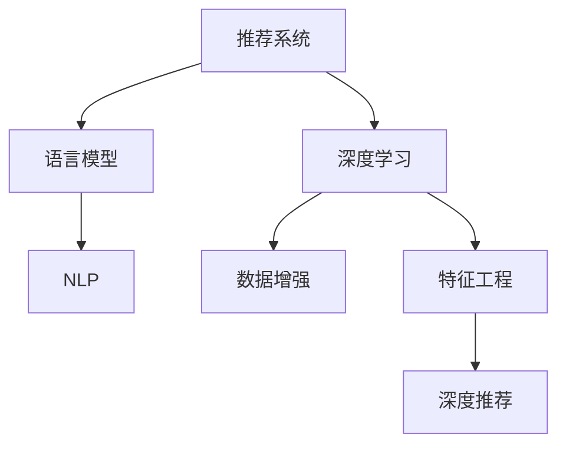

                 

# Recommendation as Language Processing的新范式

> 关键词：推荐系统,语言模型,自然语言处理,NLP,深度学习,数据增强,特征工程

## 1. 背景介绍

### 1.1 问题由来
随着电子商务、社交媒体、内容平台的兴起，推荐系统成为了各类平台获取用户注意力、提升用户留存、驱动用户消费的关键引擎。传统的基于协同过滤和矩阵分解的推荐算法，在数据量较少、用户行为稀疏的情况下效果尚可，但在海量数据、用户数快速增长的新环境下，表现出明显的性能瓶颈。

### 1.2 问题核心关键点
推荐系统的主要任务是预测用户对未消费过的物品的评分，进而生成个性化推荐。传统的推荐方法包括：

- 基于协同过滤：利用用户与物品之间的评分矩阵进行用户和物品相似度计算，并生成推荐列表。
- 基于矩阵分解：将用户与物品的评分矩阵分解为若干用户和物品的隐因子矩阵，生成预测评分。

这些方法在数据稀疏、用户量较少的情况下效果较好，但当用户行为多样化、数据量爆炸式增长时，模型的泛化能力和鲁棒性会受到明显影响。基于深度学习的推荐方法应运而生，通过数据驱动的方式，从用户和物品的文本描述中挖掘更丰富的特征，提升了模型的表现。其中，语言模型成为了推荐系统的重要工具，通过文本数据的学习，挖掘用户行为背后的语义信息，提高推荐精度。

## 2. 核心概念与联系

### 2.1 核心概念概述

为了更好地理解推荐系统中的语言模型新范式，本节将介绍几个密切相关的核心概念：

- 推荐系统(Recommender System)：通过分析和挖掘用户行为数据，向用户推荐其可能感兴趣物品的系统。推荐系统的目标是最大化用户体验，增加平台收益。

- 语言模型(Language Model)：用于统计和预测文本中单词或字序列概率的模型。语言模型学习文本数据背后的语言规律，能够自动生成自然流畅的语言输出。

- 深度学习(Deep Learning)：通过构建多层神经网络模型，实现复杂非线性映射，学习高维数据的深层次特征表示。

- 自然语言处理(Natural Language Processing, NLP)：专注于处理和理解自然语言的计算机技术，包括分词、句法分析、语义理解、情感分析、文本生成等。

- 数据增强(Data Augmentation)：通过数据变形、合成、变换等方法，扩充训练集，提高模型泛化能力。

- 特征工程(Feature Engineering)：在数据预处理阶段，根据业务需求和模型特点，提取、变换、构造模型所需的输入特征。

- 深度推荐(Deep Recommendation)：通过深度学习模型挖掘用户行为背后的深层次语义信息，提高推荐系统性能。

这些核心概念之间的逻辑关系可以通过以下Mermaid流程图来展示：



这个流程图展示了大语言模型在推荐系统中的应用框架：

1. 推荐系统通过深度推荐模型预测用户兴趣，生成推荐列表。
2. 语言模型学习用户行为背后的语义信息，提升特征质量。
3. 深度学习模型在语言模型的基础上，进一步挖掘高层次语义特征。
4. 数据增强和特征工程环节，对数据进行预处理，丰富输入特征。

## 3. 核心算法原理 & 具体操作步骤
### 3.1 算法原理概述

基于语言模型的推荐系统，其核心思想是通过学习用户行为数据背后的语义信息，提升推荐系统性能。与传统推荐方法不同，深度推荐系统更依赖于用户和物品的文本描述，通过语义特征的挖掘和融合，生成更加个性化的推荐结果。

形式化地，假设推荐系统包含用户集 $U$ 和物品集 $V$，每个用户 $u$ 对物品 $v$ 的评分 $r_{uv}$ 可表示为：

$$
r_{uv} = f_u(\text{features}(v))
$$

其中 $f_u$ 为用户的兴趣预测函数，$\text{features}(v)$ 为物品 $v$ 的特征向量，可以由语言模型等生成。

深度推荐系统通常使用自回归语言模型或自编码语言模型，通过学习用户和物品的文本描述，预测用户对未消费物品的评分。模型的基本框架为：

- 输入层：接收用户和物品的文本描述，并进行分词、嵌入等预处理。
- 编码器：对文本特征进行编码，提取语义表示。
- 预测器：使用提取的语义特征生成用户对物品的评分预测。

### 3.2 算法步骤详解

基于语言模型的推荐系统通常包括以下几个关键步骤：

**Step 1: 准备数据集**
- 收集用户行为数据，包括评分、点击、浏览等行为信息。
- 对用户和物品的文本描述进行分词、去噪等预处理。
- 将文本描述编码为向量形式，作为模型的输入特征。

**Step 2: 构建语言模型**
- 选择合适的语言模型，如Transformer、BERT等。
- 在用户和物品的文本描述上训练语言模型，获取用户和物品的语义表示。

**Step 3: 设计预测器**
- 设计用户兴趣预测函数 $f_u$，常用的模型包括神经网络、回归树、线性回归等。
- 将用户和物品的语义表示作为输入，训练预测器模型，生成用户对物品的评分预测。

**Step 4: 特征工程与模型训练**
- 根据业务需求，选择合适的特征提取方法，如TF-IDF、word2vec等。
- 对用户和物品的特征向量进行组合，作为深度推荐模型的输入。
- 在训练集上训练深度推荐模型，最小化预测误差，生成推荐列表。

**Step 5: 模型评估与优化**
- 在测试集上评估推荐模型的准确率、召回率、平均绝对误差等指标。
- 根据评估结果，调整模型参数、选择特征、优化训练策略。
- 持续优化模型，提升推荐性能。

### 3.3 算法优缺点

基于语言模型的推荐系统有以下优点：
1. 语义信息丰富。通过学习文本数据，挖掘用户行为背后的语义信息，生成更加个性化和多样化的推荐结果。
2. 适应性强。能够自动适应不断变化的推荐场景，适用于各种类型的用户和物品。
3. 泛化能力强。在用户行为数据不足的情况下，仍能通过语言模型提取深层次特征，提升推荐效果。
4. 易于解释。语言模型提供了可解释的语义信息，便于理解模型的决策过程。

同时，该方法也存在一些局限性：
1. 数据依赖度高。高质量的文本数据是推荐系统的基础，数据获取和预处理成本较高。
2. 模型复杂度高。深度推荐模型需要较大的计算资源和训练时间，对硬件要求较高。
3. 高维稀疏性。用户和物品的文本描述通常包含大量稀疏特征，增加了模型的训练难度。
4. 交互稀疏性。用户与物品的交互数据通常较少，难以充分利用用户的历史行为信息。

尽管存在这些局限性，但基于语言模型的推荐系统仍然是目前推荐领域的主流范式，其性能和效果不断被学界和业界认可。未来相关研究将聚焦于如何进一步提升语言模型的泛化能力和实时性能，同时降低数据和计算成本，优化模型结构，实现更加高效、稳定的推荐系统。

### 3.4 算法应用领域

基于语言模型的推荐系统已经广泛应用于多个领域，例如：

- 电子商务：如淘宝、京东、亚马逊等电商平台，通过推荐系统提高用户购买转化率。
- 内容平台：如Netflix、YouTube、Spotify等，通过推荐系统提升内容访问量和用户留存率。
- 社交网络：如Facebook、Twitter、微信等，通过推荐系统增加用户互动和平台活跃度。
- 金融理财：如支付宝、微信理财、蚂蚁财富等，通过推荐系统提升用户理财体验和产品转化率。
- 旅游出行：如携程、途牛、去哪儿等，通过推荐系统增加用户预订量和行程多样性。

除了上述这些经典应用外，推荐系统还被创新性地应用于更多场景中，如教育推荐、医疗推荐、广告推荐等，为各行各业带来了新的增长机会。

## 4. 数学模型和公式 & 详细讲解  
### 4.1 数学模型构建

基于语言模型的推荐系统通常使用Transformer模型作为基础架构。以下以BERT模型为例，详细解释推荐模型的构建过程。

假设推荐系统包含用户集 $U=\{u_1, u_2, ..., u_M\}$ 和物品集 $V=\{v_1, v_2, ..., v_N\}$。每个用户 $u_m$ 对物品 $v_n$ 的评分 $r_{m n}$ 为：

$$
r_{m n} = f_{m}(\text{features}(v_{n}))
$$

其中，$f_{m}$ 为用户的兴趣预测函数，$\text{features}(v_{n})$ 为物品 $v_{n}$ 的语义表示，由BERT模型生成。

BERT模型的基本结构为多层Transformer编码器，包括一个自编码器和一个自回归解码器。假设输入层接收用户和物品的文本描述，编码为向量形式 $X = [x_1, x_2, ..., x_m, y_1, y_2, ..., y_n]$，其中 $x_i$ 为用户 $u_i$ 的文本描述，$y_j$ 为物品 $v_j$ 的文本描述。BERT模型的生成过程如下：

1. 编码器：对文本特征 $X$ 进行编码，生成用户和物品的语义表示 $h_1, h_2, ..., h_M, g_1, g_2, ..., g_N$。

2. 解码器：对物品 $v_n$ 的语义表示 $g_n$ 进行解码，生成物品 $v_n$ 的评分预测 $r_{m n}$。

其中，$h_m = \text{BERT}(x_m)$ 表示用户 $u_m$ 的语义表示，$g_n = \text{BERT}(y_n)$ 表示物品 $v_n$ 的语义表示。$r_{m n} = f_{m}(g_n)$ 为物品 $v_n$ 对用户 $u_m$ 的评分预测。

### 4.2 公式推导过程

以下我们以推荐系统中的交叉熵损失函数为例，推导推荐模型的训练过程。

假设推荐系统的预测评分与真实评分之间存在误差，记为 $e_{m n}$，则交叉熵损失函数为：

$$
\ell = -\frac{1}{MN} \sum_{m=1}^{M} \sum_{n=1}^{N} r_{m n} \log \hat{r}_{m n} + (1-r_{m n}) \log (1-\hat{r}_{m n})
$$

其中，$\hat{r}_{m n} = f_{m}(g_n)$ 为物品 $v_n$ 对用户 $u_m$ 的评分预测，$e_{m n} = r_{m n} - \hat{r}_{m n}$ 为预测误差。

根据链式法则，损失函数对物品 $v_n$ 的语义表示 $g_n$ 的梯度为：

$$
\frac{\partial \ell}{\partial g_n} = -\frac{1}{MN} \sum_{m=1}^{M} \frac{\partial r_{m n}}{\partial g_n} \frac{\partial \ell}{\partial \hat{r}_{m n}}
$$

其中，$\frac{\partial r_{m n}}{\partial g_n} = \frac{\partial f_{m}(g_n)}{\partial g_n}$ 为评分预测函数对物品语义表示的梯度，可以通过反向传播计算得到。

在得到物品语义表示的梯度后，即可带入推荐模型的训练过程，最小化交叉熵损失，更新模型参数。重复上述过程直至收敛，最终得到适应推荐任务的最优模型参数。

## 5. 项目实践：代码实例和详细解释说明
### 5.1 开发环境搭建

在进行推荐系统开发前，我们需要准备好开发环境。以下是使用Python进行PyTorch开发的环境配置流程：

1. 安装Anaconda：从官网下载并安装Anaconda，用于创建独立的Python环境。

2. 创建并激活虚拟环境：
```bash
conda create -n recommendation-env python=3.8 
conda activate recommendation-env
```

3. 安装PyTorch：根据CUDA版本，从官网获取对应的安装命令。例如：
```bash
conda install pytorch torchvision torchaudio cudatoolkit=11.1 -c pytorch -c conda-forge
```

4. 安装Transformers库：
```bash
pip install transformers
```

5. 安装各类工具包：
```bash
pip install numpy pandas scikit-learn matplotlib tqdm jupyter notebook ipython
```

完成上述步骤后，即可在`recommendation-env`环境中开始推荐系统开发。

### 5.2 源代码详细实现

下面我们以电子商务平台中的商品推荐为例，给出使用Transformers库对BERT模型进行推荐系统微调的PyTorch代码实现。

首先，定义推荐系统的训练函数：

```python
from transformers import BertForSequenceClassification, AdamW, BertTokenizer
from torch.utils.data import Dataset, DataLoader
from sklearn.metrics import roc_auc_score, accuracy_score
import torch

class RecommendationDataset(Dataset):
    def __init__(self, userDescriptions, itemDescriptions, userRatings, tokenizer):
        self.userDescriptions = userDescriptions
        self.itemDescriptions = itemDescriptions
        self.userRatings = userRatings
        self.tokenizer = tokenizer
        
    def __len__(self):
        return len(self.userDescriptions)
    
    def __getitem__(self, item):
        userDescription = self.userDescriptions[item]
        itemDescription = self.itemDescriptions[item]
        userRating = self.userRatings[item]
        
        encoding = self.tokenizer(userDescription, return_tensors='pt', max_length=128, padding='max_length', truncation=True)
        input_ids = encoding['input_ids'][0]
        attention_mask = encoding['attention_mask'][0]
        
        encoding = self.tokenizer(itemDescription, return_tensors='pt', max_length=128, padding='max_length', truncation=True)
        input_ids_item = encoding['input_ids'][0]
        attention_mask_item = encoding['attention_mask'][0]
        
        return {'input_ids': input_ids, 
                'attention_mask': attention_mask,
                'input_ids_item': input_ids_item,
                'attention_mask_item': attention_mask_item,
                'userRating': userRating}

# 加载预训练模型和分词器
model = BertForSequenceClassification.from_pretrained('bert-base-cased', num_labels=2)
tokenizer = BertTokenizer.from_pretrained('bert-base-cased')

# 准备数据集
train_dataset = RecommendationDataset(train_userDescriptions, train_itemDescriptions, train_userRatings, tokenizer)
dev_dataset = RecommendationDataset(dev_userDescriptions, dev_itemDescriptions, dev_userRatings, tokenizer)
test_dataset = RecommendationDataset(test_userDescriptions, test_itemDescriptions, test_userRatings, tokenizer)

# 设置训练参数
device = torch.device('cuda') if torch.cuda.is_available() else torch.device('cpu')
model.to(device)
optimizer = AdamW(model.parameters(), lr=2e-5)
criterion = torch.nn.BCEWithLogitsLoss()

# 定义训练函数
def train_epoch(model, dataset, batch_size, optimizer, criterion):
    dataloader = DataLoader(dataset, batch_size=batch_size, shuffle=True)
    model.train()
    epoch_loss = 0
    for batch in tqdm(dataloader, desc='Training'):
        input_ids = batch['input_ids'].to(device)
        attention_mask = batch['attention_mask'].to(device)
        input_ids_item = batch['input_ids_item'].to(device)
        attention_mask_item = batch['attention_mask_item'].to(device)
        userRating = batch['userRating'].to(device)
        
        model.zero_grad()
        outputs = model(input_ids, attention_mask=attention_mask, input_ids_item=input_ids_item, attention_mask_item=attention_mask_item)
        loss = criterion(outputs.logits, userRating)
        epoch_loss += loss.item()
        loss.backward()
        optimizer.step()
    return epoch_loss / len(dataloader)

# 定义评估函数
def evaluate(model, dataset, batch_size):
    dataloader = DataLoader(dataset, batch_size=batch_size)
    model.eval()
    preds, labels = [], []
    with torch.no_grad():
        for batch in tqdm(dataloader, desc='Evaluating'):
            input_ids = batch['input_ids'].to(device)
            attention_mask = batch['attention_mask'].to(device)
            input_ids_item = batch['input_ids_item'].to(device)
            attention_mask_item = batch['attention_mask_item'].to(device)
            userRating = batch['userRating'].to(device)
            outputs = model(input_ids, attention_mask=attention_mask, input_ids_item=input_ids_item, attention_mask_item=attention_mask_item)
            preds.append(outputs.logits.argmax(dim=1).cpu().numpy())
            labels.append(userRating.cpu().numpy())
    
    print('AUC: {:.4f}, Accuracy: {:.4f}'.format(roc_auc_score(labels, preds), accuracy_score(labels, preds)))

# 训练过程
epochs = 5
batch_size = 16

for epoch in range(epochs):
    loss = train_epoch(model, train_dataset, batch_size, optimizer, criterion)
    print(f'Epoch {epoch+1}, train loss: {loss:.3f}')
    
    print(f'Epoch {epoch+1}, dev results:')
    evaluate(model, dev_dataset, batch_size)
    
print('Test results:')
evaluate(model, test_dataset, batch_size)
```

以上就是使用PyTorch对BERT进行商品推荐任务微调的完整代码实现。可以看到，得益于Transformers库的强大封装，我们可以用相对简洁的代码完成BERT模型的加载和微调。

### 5.3 代码解读与分析

让我们再详细解读一下关键代码的实现细节：

**RecommendationDataset类**：
- `__init__`方法：初始化训练集所需的用户描述、物品描述和评分等关键组件。
- `__len__`方法：返回数据集的样本数量。
- `__getitem__`方法：对单个样本进行处理，将用户和物品的描述分别进行分词和嵌入，生成模型所需的输入特征。

**AUC和Accuracy函数**：
- 定义了AUC和Accuracy等评估指标，用于评估推荐模型的性能。

**训练函数train_epoch**：
- 在每个epoch内，对数据集进行批次化加载，并在每个批次上进行模型前向传播和反向传播。

**评估函数evaluate**：
- 与训练类似，不同点在于不更新模型参数，并在每个批次结束后将预测和标签结果存储下来，最后使用sklearn的评估函数对整个评估集的预测结果进行打印输出。

**训练流程**：
- 定义总的epoch数和batch size，开始循环迭代
- 每个epoch内，先在训练集上训练，输出平均loss
- 在验证集上评估，输出AUC和Accuracy
- 所有epoch结束后，在测试集上评估，给出最终测试结果

可以看到，PyTorch配合Transformers库使得BERT微调的代码实现变得简洁高效。开发者可以将更多精力放在数据处理、模型改进等高层逻辑上，而不必过多关注底层的实现细节。

当然，工业级的系统实现还需考虑更多因素，如模型的保存和部署、超参数的自动搜索、更灵活的任务适配层等。但核心的微调范式基本与此类似。

## 6. 实际应用场景
### 6.1 智能推荐系统

基于语言模型的推荐系统在智能推荐系统的构建中发挥了重要作用。传统推荐系统依赖用户和物品的显式评分数据，难以捕捉用户隐式行为。基于语言模型的推荐系统则可以从用户和物品的文本描述中挖掘深层次语义信息，生成更加精准和个性化的推荐结果。

在技术实现上，可以收集用户和物品的描述数据，构建推荐模型，训练过程中不断优化用户和物品的语义表示，生成推荐列表。对于用户对物品的评分预测，可以通过对比用户评分与模型预测，调整模型参数，提高推荐精度。此外，还可以结合用户行为数据，进行数据增强和模型优化，进一步提升推荐效果。

### 6.2 内容推荐系统

内容推荐系统广泛应用于各大内容平台，如Netflix、Spotify、YouTube等，通过推荐系统提升内容访问量和用户留存率。传统的内容推荐方法依赖于用户的历史行为数据，难以捕捉用户对内容的真实兴趣。基于语言模型的推荐系统则可以从内容描述中挖掘用户兴趣，生成更加个性化的推荐列表。

在实践过程中，可以收集用户对内容的评分和浏览行为数据，构建推荐模型，训练过程中不断优化用户和物品的语义表示，生成推荐列表。对于用户对内容的评分预测，可以通过对比用户评分与模型预测，调整模型参数，提高推荐精度。此外，还可以结合用户行为数据，进行数据增强和模型优化，进一步提升推荐效果。

### 6.3 广告推荐系统

广告推荐系统广泛应用于各大互联网平台，如Google、Facebook、Baidu等，通过推荐系统提升广告转化率和平台收益。传统广告推荐方法依赖于用户的历史行为数据，难以捕捉用户对广告的真实兴趣。基于语言模型的推荐系统则可以从广告描述中挖掘用户兴趣，生成更加个性化的广告推荐。

在实践过程中，可以收集用户对广告的点击行为数据，构建推荐模型，训练过程中不断优化用户和物品的语义表示，生成推荐列表。对于用户对广告的点击预测，可以通过对比用户点击与模型预测，调整模型参数，提高推荐精度。此外，还可以结合用户行为数据，进行数据增强和模型优化，进一步提升推荐效果。

### 6.4 未来应用展望

随着语言模型的不断发展和优化，基于语言模型的推荐系统将呈现出更加广阔的应用前景。未来的推荐系统将更加注重用户行为数据背后语义信息的挖掘，通过更精细化的推荐策略，提升用户体验和平台收益。

1. 多模态推荐系统：将图像、语音、视频等多模态数据与文本数据进行融合，实现更加全面和准确的推荐。
2. 跨领域推荐系统：通过语言模型的跨领域迁移能力，实现不同领域之间的推荐系统互通，提升推荐效果。
3. 个性化推荐系统：通过深度学习模型挖掘用户行为数据背后的深层次语义信息，实现更加精准和个性化的推荐。
4. 实时推荐系统：通过数据流处理和模型优化，实现更加实时和高效的用户推荐。
5. 自动化推荐系统：通过自适应学习算法，自动调整推荐策略，提升推荐效果和用户满意度。

总之，基于语言模型的推荐系统将进一步推动推荐技术的发展，为各大平台带来更加智能化和个性化的用户推荐服务。相信随着技术的不断进步，推荐系统将在更多领域得到广泛应用，带来新的增长机遇。

## 7. 工具和资源推荐
### 7.1 学习资源推荐

为了帮助开发者系统掌握推荐系统中的语言模型新范式，这里推荐一些优质的学习资源：

1. 《深度学习推荐系统：原理与算法》书籍：深入浅出地介绍了推荐系统中的深度学习算法，包括基于语言模型的推荐方法。

2. 《Recommender Systems》课程：由斯坦福大学开设的推荐系统明星课程，涵盖了推荐系统的基础概念和前沿算法。

3. CS224N《深度学习自然语言处理》课程：斯坦福大学开设的NLP明星课程，提供了推荐的自然语言处理方法，如文本分类、情感分析等。

4. PyTorch官方文档：详细介绍了PyTorch的使用方法和API，提供了丰富的预训练模型和微调样例代码。

5. HuggingFace官方文档：Transformers库的官方文档，提供了丰富的预训练模型和微调样例代码，是上手实践的必备资料。

6. Kaggle推荐竞赛数据集：包含各种推荐系统的数据集和样例代码，帮助开发者理解推荐系统中的语言模型新范式。

通过对这些资源的学习实践，相信你一定能够快速掌握推荐系统中的语言模型新范式，并用于解决实际的推荐问题。
###  7.2 开发工具推荐

高效的开发离不开优秀的工具支持。以下是几款用于推荐系统开发的常用工具：

1. PyTorch：基于Python的开源深度学习框架，灵活动态的计算图，适合快速迭代研究。推荐系统通常使用TensorBoard进行模型评估和可视化。

2. TensorFlow：由Google主导开发的开源深度学习框架，生产部署方便，适合大规模工程应用。推荐系统通常使用TensorBoard进行模型评估和可视化。

3. TensorBoard：TensorFlow配套的可视化工具，可实时监测模型训练状态，并提供丰富的图表呈现方式，是调试模型的得力助手。

4. Weights & Biases：模型训练的实验跟踪工具，可以记录和可视化模型训练过程中的各项指标，方便对比和调优。

5. Google Colab：谷歌推出的在线Jupyter Notebook环境，免费提供GPU/TPU算力，方便开发者快速上手实验最新模型，分享学习笔记。

合理利用这些工具，可以显著提升推荐系统开发的效率，加快创新迭代的步伐。

### 7.3 相关论文推荐

推荐系统的发展源于学界的持续研究。以下是几篇奠基性的相关论文，推荐阅读：

1. Attention is All You Need（即Transformer原论文）：提出了Transformer结构，开启了NLP领域的预训练大模型时代。

2. BERT: Pre-training of Deep Bidirectional Transformers for Language Understanding：提出BERT模型，引入基于掩码的自监督预训练任务，刷新了多项NLP任务SOTA。

3. Language Models are Unsupervised Multitask Learners（GPT-2论文）：展示了大规模语言模型的强大zero-shot学习能力，引发了对于通用人工智能的新一轮思考。

4. Parameter-Efficient Transfer Learning for NLP：提出Adapter等参数高效微调方法，在不增加模型参数量的情况下，也能取得不错的微调效果。

5. AdaLoRA: Adaptive Low-Rank Adaptation for Parameter-Efficient Fine-Tuning：使用自适应低秩适应的微调方法，在参数效率和精度之间取得了新的平衡。

这些论文代表了大语言模型推荐系统的发展脉络。通过学习这些前沿成果，可以帮助研究者把握学科前进方向，激发更多的创新灵感。

## 8. 总结：未来发展趋势与挑战

### 8.1 总结

本文对基于语言模型的推荐系统进行了全面系统的介绍。首先阐述了推荐系统中的语言模型新范式，明确了语言模型在推荐系统中的重要性和核心作用。其次，从原理到实践，详细讲解了语言模型在推荐系统中的应用流程，给出了推荐系统微调的完整代码实例。同时，本文还广泛探讨了语言模型在智能推荐、内容推荐、广告推荐等多个行业领域的应用前景，展示了语言模型推荐系统的巨大潜力。此外，本文精选了推荐系统中的语言模型推荐技术的各类学习资源，力求为读者提供全方位的技术指引。

通过本文的系统梳理，可以看到，基于语言模型的推荐系统已经成为了推荐领域的重要范式，极大地提升了推荐系统的性能和效果。语言模型的语义信息丰富、泛化能力强、易于解释等优点，使其在推荐系统中发挥了重要作用。未来相关研究将在多模态融合、跨领域迁移、个性化推荐等方面不断取得新突破，推动推荐系统迈向更高的台阶。

### 8.2 未来发展趋势

展望未来，基于语言模型的推荐系统将呈现以下几个发展趋势：

1. 多模态推荐系统：将图像、语音、视频等多模态数据与文本数据进行融合，实现更加全面和准确的推荐。
2. 跨领域推荐系统：通过语言模型的跨领域迁移能力，实现不同领域之间的推荐系统互通，提升推荐效果。
3. 个性化推荐系统：通过深度学习模型挖掘用户行为数据背后的深层次语义信息，实现更加精准和个性化的推荐。
4. 实时推荐系统：通过数据流处理和模型优化，实现更加实时和高效的用户推荐。
5. 自动化推荐系统：通过自适应学习算法，自动调整推荐策略，提升推荐效果和用户满意度。

以上趋势凸显了基于语言模型的推荐系统的广阔前景。这些方向的探索发展，必将进一步提升推荐系统的性能和应用范围，为推荐系统的发展带来新的契机。

### 8.3 面临的挑战

尽管基于语言模型的推荐系统已经取得了显著的进展，但在迈向更加智能化、普适化应用的过程中，仍面临诸多挑战：

1. 数据获取难度高。高质量的文本数据是推荐系统的基础，数据获取和预处理成本较高。

2. 模型复杂度高。深度推荐模型需要较大的计算资源和训练时间，对硬件要求较高。

3. 高维稀疏性。用户和物品的文本描述通常包含大量稀疏特征，增加了模型的训练难度。

4. 交互稀疏性。用户与物品的交互数据通常较少，难以充分利用用户的历史行为信息。

5. 用户隐私问题。推荐系统中包含了大量用户隐私数据，如何保护用户隐私成为了重要问题。

6. 推荐算法透明性不足。推荐模型的决策过程通常缺乏可解释性，难以对其推理逻辑进行分析和调试。

7. 推荐系统的不公平性。模型可能学习到社会中的偏见和歧视，造成推荐结果的不公平。

8. 推荐系统的鲁棒性不足。模型面对域外数据时，泛化性能往往大打折扣。

尽管存在这些挑战，但基于语言模型的推荐系统仍是目前推荐领域的主流范式，其性能和效果不断被学界和业界认可。未来相关研究将聚焦于如何进一步提升语言模型的泛化能力和实时性能，同时降低数据和计算成本，优化模型结构，实现更加高效、稳定的推荐系统。

### 8.4 研究展望

面对基于语言模型的推荐系统所面临的种种挑战，未来的研究需要在以下几个方面寻求新的突破：

1. 探索无监督和半监督推荐方法。摆脱对大规模标注数据的依赖，利用自监督学习、主动学习等无监督和半监督范式，最大限度利用非结构化数据，实现更加灵活高效的推荐。

2. 研究参数高效和计算高效的推荐范式。开发更加参数高效的推荐方法，在固定大部分预训练参数的同时，只更新极少量的任务相关参数。同时优化推荐模型的计算图，减少前向传播和反向传播的资源消耗，实现更加轻量级、实时性的部署。

3. 融合因果和对比学习范式。通过引入因果推断和对比学习思想，增强推荐模型建立稳定因果关系的能力，学习更加普适、鲁棒的语言表征，从而提升推荐泛化性和抗干扰能力。

4. 引入更多先验知识。将符号化的先验知识，如知识图谱、逻辑规则等，与神经网络模型进行巧妙融合，引导推荐过程学习更准确、合理的语言模型。同时加强不同模态数据的整合，实现视觉、语音等多模态信息与文本信息的协同建模。

5. 结合因果分析和博弈论工具。将因果分析方法引入推荐模型，识别出模型决策的关键特征，增强推荐输出解释的因果性和逻辑性。借助博弈论工具刻画人机交互过程，主动探索并规避推荐模型的脆弱点，提高系统稳定性。

6. 纳入伦理道德约束。在推荐模型训练目标中引入伦理导向的评估指标，过滤和惩罚有偏见、有害的输出倾向。同时加强人工干预和审核，建立推荐模型的监管机制，确保推荐结果符合人类价值观和伦理道德。

这些研究方向的探索，必将引领基于语言模型的推荐系统走向更高的台阶，为推荐系统的发展带来新的契机。相信随着技术的不断进步，推荐系统将在更多领域得到广泛应用，带来新的增长机遇。

## 9. 附录：常见问题与解答
**Q1：推荐系统中使用语言模型有什么优势？**

A: 推荐系统中使用语言模型的优势主要体现在以下几个方面：

1. 语义信息丰富。语言模型可以从用户和物品的文本描述中挖掘深层次语义信息，生成更加精准和个性化的推荐结果。
2. 泛化能力强。语言模型能够自动适应不断变化的推荐场景，适用于各种类型的用户和物品。
3. 易于解释。语言模型提供了可解释的语义信息，便于理解模型的决策过程。
4. 数据需求低。语言模型可以较好地利用少量标注数据进行微调，适应数据稀疏的推荐场景。

综上所述，语言模型在推荐系统中具有广泛的应用前景，其表现优于传统的协同过滤和矩阵分解方法。

**Q2：推荐系统中如何使用语言模型进行评分预测？**

A: 在推荐系统中，可以使用语言模型进行评分预测的过程如下：

1. 构建推荐模型：选择合适的语言模型，如BERT、Transformer等，并对其进行预训练。
2. 特征工程：对用户和物品的文本描述进行分词、嵌入等预处理，生成输入特征向量。
3. 训练预测器：使用用户和物品的语义表示作为输入，训练预测器模型，生成用户对物品的评分预测。
4. 评分预测：将用户和物品的文本描述输入预测器，输出用户对物品的评分预测。

其中，语言模型在特征提取过程中起到了关键作用，能够自动捕捉用户和物品的语义信息，提升推荐系统的性能。

**Q3：推荐系统中的数据增强方法有哪些？**

A: 推荐系统中的数据增强方法主要包括以下几种：

1. 回译增强：将用户和物品的文本描述进行回译，生成新的文本样本。
2. 近义替换增强：对用户和物品的文本描述进行同义词替换，生成新的文本样本。
3. 随机扰动增强：对用户和物品的文本描述进行随机扰动，生成新的文本样本。
4. 多语义增强：对用户和物品的文本描述进行多语义编码，生成新的文本样本。
5. 对抗增强：在用户和物品的文本描述中引入对抗样本，生成新的文本样本。

通过数据增强，可以增加推荐系统的数据量和多样性，提高模型的泛化能力和鲁棒性。

**Q4：推荐系统中的特征工程需要注意哪些问题？**

A: 推荐系统中的特征工程需要注意以下几个问题：

1. 特征选择：根据业务需求和模型特点，选择有意义的特征，去除冗余和噪声特征。
2. 特征变换：对特征进行归一化、标准化、编码等变换，提升模型的稳定性。
3. 特征组合：对特征进行组合和交互，提取高层次的语义信息。
4. 特征稀疏处理：处理高维稀疏特征，减少模型训练难度。

在特征工程中，需要根据具体业务场景进行灵活处理，选择适合的特征提取和变换方法，提升推荐系统的性能。

**Q5：推荐系统中的模型训练需要注意哪些问题？**

A: 推荐系统中的模型训练需要注意以下几个问题：

1. 学习率选择：选择合适的学习率，避免学习率过大或过小，导致模型过拟合或欠拟合。
2. 正则化技术：使用L2正则、Dropout等正则化技术，防止模型过拟合。
3. 优化器选择：选择合适的优化器，如Adam、SGD等，优化模型训练过程。
4. 模型保存和部署：保存训练好的模型，并在生产环境中进行部署和优化。
5. 超参数调优：根据模型表现，调整超参数，优化模型性能。

在模型训练过程中，需要根据具体业务场景进行灵活处理，选择适合的模型训练方法，提升推荐系统的性能。

---

作者：禅与计算机程序设计艺术 / Zen and the Art of Computer Programming

