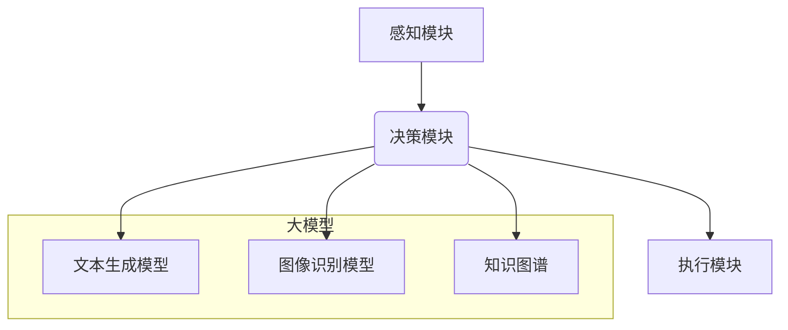

> 大模型、AI Agent、CAMEL、应用开发、实践指南、端到端

## 1. 背景介绍

近年来，大模型技术取得了飞速发展，其强大的泛化能力和知识表示能力为人工智能领域带来了革命性的变革。从文本生成、机器翻译到图像识别、语音合成，大模型已在各个领域展现出令人瞩目的应用潜力。然而，将大模型应用于实际场景仍然面临着诸多挑战，例如模型部署、资源消耗、可解释性等。

为了更好地解决这些问题，AI Agent 应运而生。AI Agent 是一种能够自主学习、决策和执行任务的智能体，它可以将大模型的强大能力与具体的应用场景相结合，实现更智能、更灵活的交互体验。

CAMEL（**C**omprehensive **A**gent **M**odel **E**nvironment for **L**earning）是一个开源的AI Agent开发平台，它提供了一套完整的工具和框架，帮助开发者快速构建和部署AI Agent应用。

## 2. 核心概念与联系

**2.1 AI Agent**

AI Agent 是一个能够感知环境、做出决策并执行行动的智能体。它通常由以下几个核心组件组成：

* **感知模块:** 收集环境信息，例如传感器数据、文本、图像等。
* **决策模块:** 基于感知到的信息，做出最优的行动选择。
* **执行模块:** 将决策转化为实际行动，例如控制机器人运动、生成文本、发送邮件等。

**2.2 大模型**

大模型是指参数量巨大、训练数据海量的人工智能模型。它通常采用深度学习技术，能够学习复杂的模式和关系，并表现出强大的泛化能力。

**2.3 CAMEL**

CAMEL 是一个开源的AI Agent开发平台，它提供了一套完整的工具和框架，帮助开发者快速构建和部署AI Agent应用。

**2.4 CAMEL 与 AI Agent 的关系**

CAMEL 可以将大模型作为 AI Agent 的决策模块，利用大模型强大的学习和推理能力，帮助 AI Agent 做出更智能、更准确的决策。

**2.5 CAMEL 架构**



## 3. 核心算法原理 & 具体操作步骤

### 3.1  算法原理概述

CAMEL 平台基于强化学习算法，训练 AI Agent 在特定环境中学习和决策。强化学习是一种监督学习的一种，它通过奖励机制来引导 AI Agent 学习最优的行为策略。

在 CAMEL 平台中，AI Agent 会与环境进行交互，根据环境的状态和自己的行动，获得奖励或惩罚。通过不断地学习和调整行为策略，AI Agent最终能够在环境中取得最佳的性能。

### 3.2  算法步骤详解

1. **环境建模:** 首先需要构建一个模拟真实世界的环境，并定义环境的状态、动作和奖励函数。
2. **AI Agent 初始化:** 初始化 AI Agent 的行为策略，例如随机策略或贪婪策略。
3. **环境交互:** AI Agent 与环境进行交互，根据环境状态选择动作，并获得奖励或惩罚。
4. **策略更新:** 根据获得的奖励信息，更新 AI Agent 的行为策略，使其朝着获得更高奖励的方向发展。
5. **重复步骤 3-4:** 重复上述步骤，直到 AI Agent 的性能达到预设目标。

### 3.3  算法优缺点

**优点:**

* **能够学习复杂的行为策略:** 强化学习算法能够学习到复杂、非线性的行为策略，适用于各种各样的应用场景。
* **无需明确的奖励函数:** 在某些情况下，可以利用环境反馈信息来学习奖励函数，无需事先定义奖励函数。
* **能够适应动态环境:** 强化学习算法能够适应动态变化的环境，并不断调整行为策略以获得最佳性能。

**缺点:**

* **训练时间长:** 强化学习算法的训练时间通常较长，需要大量的样本数据和计算资源。
* **奖励函数设计困难:** 设计一个合适的奖励函数是强化学习算法的关键，如果奖励函数设计不当，可能会导致 AI Agent 学习到不期望的行为。
* **局部最优解:** 强化学习算法可能会陷入局部最优解，无法找到全局最优解。

### 3.4  算法应用领域

强化学习算法在各个领域都有广泛的应用，例如：

* **机器人控制:** 训练机器人完成各种复杂的任务，例如导航、抓取、组装等。
* **游戏 AI:** 开发智能游戏对手，例如围棋、象棋、Go 等。
* **推荐系统:** 建立个性化的推荐系统，推荐用户感兴趣的内容。
* **金融交易:** 开发智能交易系统，自动进行股票、期货等金融交易。

## 4. 数学模型和公式 & 详细讲解 & 举例说明

### 4.1  数学模型构建

强化学习的数学模型主要包括状态空间、动作空间、奖励函数和价值函数。

* **状态空间:** 环境可能存在的全部状态集合。
* **动作空间:** AI Agent 在每个状态下可以执行的动作集合。
* **奖励函数:** 描述 AI Agent 在每个状态下执行每个动作后获得的奖励。
* **价值函数:** 描述 AI Agent 在某个状态下执行某个策略的长期奖励期望。

### 4.2  公式推导过程

**价值函数的更新公式:**

$$
V(s) = \max_{\pi} \sum_{t=0}^{\infty} \gamma^t r(s_t, a_t)
$$

其中:

* $V(s)$ 是状态 $s$ 的价值函数。
* $\pi$ 是 AI Agent 的策略。
* $r(s_t, a_t)$ 是在状态 $s_t$ 执行动作 $a_t$ 后获得的奖励。
* $\gamma$ 是折扣因子，控制未来奖励的权重。

**策略梯度算法:**

$$
\theta = \theta + \alpha \nabla_{\theta} J(\theta)
$$

其中:

* $\theta$ 是策略参数。
* $\alpha$ 是学习率。
* $J(\theta)$ 是策略的效用函数。

### 4.3  案例分析与讲解

假设我们训练一个 AI Agent 来玩一个简单的游戏，例如贪吃蛇。

* **状态空间:** 游戏中的蛇的位置和食物的位置。
* **动作空间:** 蛇可以向四个方向移动。
* **奖励函数:** 当蛇吃掉食物时获得奖励，当蛇撞到墙壁或自己身体时惩罚。

通过强化学习算法，AI Agent 可以学习到最优的移动策略，从而获得尽可能高的分数。

## 5. 项目实践：代码实例和详细解释说明

### 5.1  开发环境搭建

* Python 3.7+
* TensorFlow 2.x 或 PyTorch 1.x
* CAMEL 库

### 5.2  源代码详细实现

```python
# 导入必要的库
import tensorflow as tf

# 定义模型结构
class AgentModel(tf.keras.Model):
    def __init__(self):
        super(AgentModel, self).__init__()
        # 定义模型层
        self.dense1 = tf.keras.layers.Dense(64, activation='relu')
        self.dense2 = tf.keras.layers.Dense(32, activation='relu')
        self.output = tf.keras.layers.Dense(4, activation='softmax')

    def call(self, inputs):
        x = self.dense1(inputs)
        x = self.dense2(x)
        return self.output(x)

# 实例化模型
agent_model = AgentModel()

# 定义损失函数和优化器
loss_fn = tf.keras.losses.CategoricalCrossentropy()
optimizer = tf.keras.optimizers.Adam(learning_rate=0.001)

# 训练模型
for epoch in range(100):
    # 训练数据
    # ...
    # 计算损失
    with tf.GradientTape() as tape:
        predictions = agent_model(inputs)
        loss = loss_fn(targets, predictions)
    # 反向传播
    gradients = tape.gradient(loss, agent_model.trainable_variables)
    optimizer.apply_gradients(zip(gradients, agent_model.trainable_variables))
    # 打印损失
    print(f'Epoch {epoch+1}, Loss: {loss.numpy()}')

```

### 5.3  代码解读与分析

* **模型结构:** 代码定义了一个简单的深度神经网络模型，用于预测 AI Agent 在每个状态下执行的动作。
* **损失函数:** 使用交叉熵损失函数，用于衡量模型预测结果与真实标签之间的差异。
* **优化器:** 使用 Adam 优化器，用于更新模型参数。
* **训练过程:** 训练模型的过程包括迭代地输入训练数据，计算损失，反向传播梯度，更新模型参数。

### 5.4  运行结果展示

训练完成后，可以将训练好的模型应用于实际场景，例如控制机器人完成任务、开发智能游戏对手等。

## 6. 实际应用场景

### 6.1  智能客服

CAMEL 可以用于构建智能客服系统，帮助企业自动处理客户咨询和服务请求。AI Agent 可以理解用户自然语言，并根据知识库和规则提供准确的回复。

### 6.2  个性化推荐

CAMEL 可以用于构建个性化推荐系统，根据用户的兴趣和行为历史，推荐用户感兴趣的内容，例如商品、电影、音乐等。

### 6.3  自动驾驶

CAMEL 可以用于构建自动驾驶系统，帮助车辆感知周围环境，做出安全可靠的驾驶决策。

### 6.4  未来应用展望

随着大模型技术的不断发展，CAMEL 平台将有更广泛的应用场景，例如：

* **医疗诊断:** AI Agent 可以辅助医生诊断疾病，提高诊断准确率。
* **教育教学:** AI Agent 可以个性化教学，帮助学生更好地学习。
* **金融风险控制:** AI Agent 可以识别金融风险，帮助金融机构防范风险。

## 7. 工具和资源推荐

### 7.1  学习资源推荐

* **CAMEL 官方文档:** https://camel.ai/docs/
* **强化学习教程:** https://www.coursera.org/learn/reinforcement-learning

### 7.2  开发工具推荐

* **TensorFlow:** https://www.tensorflow.org/
* **PyTorch:** https://pytorch.org/

### 7.3  相关论文推荐

* **Deep Reinforcement Learning: An Overview:** https://arxiv.org/abs/1606.02937
* **Proximal Policy Optimization Algorithms:** https://arxiv.org/abs/1707.06347

## 8. 总结：未来发展趋势与挑战

### 8.1  研究成果总结

CAMEL 平台为AI Agent开发提供了强大的工具和框架，促进了大模型在实际应用中的落地。

### 8.2  未来发展趋势

* **模型规模和能力提升:** 大模型的规模和能力将不断提升，为AI Agent提供更强大的学习和推理能力。
* **多模态交互:** AI Agent 将能够处理多种模态信息，例如文本、图像、音频等，实现更丰富的交互体验。
* **可解释性增强:** 研究者将致力于提高AI Agent的可解释性，帮助人类更好地理解AI Agent的决策过程。

### 8.3  面临的挑战

* **数据安全和隐私保护:** AI Agent 的训练和应用需要大量数据，如何保证数据安全和隐私保护是一个重要的挑战。
* **伦理问题:** AI Agent 的决策可能会受到偏见的影响，如何避免AI Agent产生不公平或有害的决策是一个需要认真思考的伦理问题。
* **部署成本:** 大模型的部署成本较高，如何降低部署成本，使其更易于推广应用是一个需要解决的问题。

### 8.4  研究展望

未来，我们将继续致力于CAM