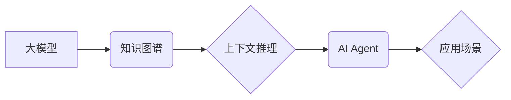

> CAMEL, 大模型, AI Agent, 应用开发, 知识图谱, 框架, 

## 1. 背景介绍

近年来，大模型技术取得了飞速发展，其强大的泛化能力和表示能力为人工智能领域带来了革命性的变革。然而，将大模型应用于实际场景仍然面临着诸多挑战，例如：

* **缺乏针对性：** 大模型通常是通用的，缺乏针对特定应用场景的定制化能力。
* **部署成本高：** 大模型通常体积庞大，部署和推理成本较高。
* **可解释性差：** 大模型的决策过程往往难以理解，缺乏可解释性。

为了解决这些问题，研究者们提出了各种大模型应用开发框架，其中 CAMEL 框架是一个值得关注的创新。

## 2. 核心概念与联系

CAMEL（**C**ontext-**A**ware **M**odel **E**nvironment for **L**earning）是一个基于知识图谱的 AI Agent 开发框架，旨在通过将大模型与知识图谱相结合，构建更加智能、可解释、可定制的 AI 应用。

**核心概念：**

* **知识图谱：**  知识图谱是一种结构化的知识表示形式，它以实体和关系为节点，通过连接构建知识网络。
* **上下文感知：** CAMEL 框架能够根据上下文信息动态调整模型的行为，从而提高应用的针对性和智能性。
* **可解释性：** 通过知识图谱的辅助，CAMEL 能够提供模型决策的解释性，帮助用户理解模型的 reasoning 过程。

**架构：**



## 3. 核心算法原理 & 具体操作步骤

### 3.1  算法原理概述

CAMEL 框架的核心算法基于知识图谱嵌入和上下文推理。

* **知识图谱嵌入：** 将知识图谱中的实体和关系映射到低维向量空间，使得实体和关系之间可以通过向量距离进行计算和比较。
* **上下文推理：** 根据用户输入的查询和上下文信息，利用知识图谱嵌入和大模型的推理能力，进行知识推理和关系抽取，最终生成符合用户需求的响应。

### 3.2  算法步骤详解

1. **知识图谱构建：** 收集和整理相关领域的知识，构建知识图谱。
2. **知识图谱嵌入：** 使用知识图谱嵌入算法，将知识图谱中的实体和关系映射到低维向量空间。
3. **大模型预训练：** 使用大模型预训练模型，例如 BERT 或 GPT-3，在文本理解和生成任务上进行预训练。
4. **上下文推理模型训练：** 将知识图谱嵌入和预训练的大模型结合，训练上下文推理模型，使其能够根据用户输入的查询和上下文信息进行知识推理和关系抽取。
5. **AI Agent 构建：** 将上下文推理模型集成到 AI Agent 中，使其能够根据用户需求进行智能交互和任务执行。

### 3.3  算法优缺点

**优点：**

* **可解释性强：** 通过知识图谱的辅助，模型决策过程更加透明可解释。
* **针对性强：** 可以根据特定应用场景定制知识图谱和模型，提高应用的针对性和智能性。
* **可扩展性强：** 可以通过不断添加新的知识和模型，扩展 AI Agent 的功能和能力。

**缺点：**

* **知识图谱构建成本高：** 构建高质量的知识图谱需要大量的人工标注和维护工作。
* **模型训练复杂度高：** 结合知识图谱和大模型进行训练，需要复杂的算法和大量的计算资源。

### 3.4  算法应用领域

CAMEL 框架的应用领域非常广泛，例如：

* **智能客服：** 通过知识图谱和大模型，构建能够理解用户需求并提供精准解答的智能客服系统。
* **个性化推荐：** 根据用户的兴趣和偏好，利用知识图谱和大模型进行个性化商品推荐。
* **医疗诊断辅助：** 利用知识图谱和大模型，辅助医生进行疾病诊断和治疗方案制定。

## 4. 数学模型和公式 & 详细讲解 & 举例说明

### 4.1  数学模型构建

CAMEL 框架的核心数学模型是基于知识图谱嵌入和上下文推理的组合模型。

* **知识图谱嵌入：** 使用 TransE 算法将实体和关系映射到低维向量空间。

TransE 模型的目标是学习实体和关系之间的向量表示，使得实体和关系的向量和相等。

* **上下文推理：** 使用 Transformer 模型进行上下文推理，根据用户输入的查询和上下文信息，预测目标实体或关系。

### 4.2  公式推导过程

**TransE 模型的目标函数：**

$$
L = \sum_{h, r, t \in E} \max(0, \gamma + ||\mathbf{h} + \mathbf{r} - \mathbf{t}||_2)
$$

其中：

* $h$：头实体
* $r$：关系
* $t$：尾实体
* $\mathbf{h}$、$\mathbf{r}$、$\mathbf{t}$：实体和关系的向量表示
* $\gamma$：阈值

**Transformer 模型的注意力机制：**

$$
Attention(Q, K, V) = \frac{exp(Q \cdot K^T / \sqrt{d_k})}{exp(Q \cdot K^T / \sqrt{d_k})} \cdot V
$$

其中：

* $Q$：查询向量
* $K$：键向量
* $V$：值向量
* $d_k$：键向量的维度

### 4.3  案例分析与讲解

**案例：**

假设我们有一个知识图谱，包含实体“张三”、“李四”和关系“朋友”。

* 实体向量：$\mathbf{张三} = [0.1, 0.2, 0.3]$, $\mathbf{李四} = [0.4, 0.5, 0.6]$
* 关系向量：$\mathbf{朋友} = [0.7, 0.8, 0.9]$

**TransE 模型预测：**

$\mathbf{张三} + \mathbf{朋友} \approx \mathbf{李四}$

**Transformer 模型预测：**

根据用户输入的查询“张三的朋友是谁？”，Transformer 模型会根据上下文信息和知识图谱中的关系，预测目标实体为“李四”。

## 5. 项目实践：代码实例和详细解释说明

### 5.1  开发环境搭建

* Python 3.7+
* PyTorch 1.7+
* Transformers 4.0+
* NetworkX 2.6+

### 5.2  源代码详细实现

```python
# 知识图谱加载
graph = nx.read_graphml("knowledge_graph.graphml")

# 实体和关系向量化
entity_embeddings = ...
relation_embeddings = ...

# Transformer 模型加载
model = AutoModelForSequenceClassification.from_pretrained("bert-base-uncased")

# 上下文推理
def infer_relation(query, context):
    # ...
    return predicted_relation

# AI Agent 构建
class CAMELAgent:
    def __init__(self):
        # ...

    def interact(self, user_input):
        # ...
        return response
```

### 5.3  代码解读与分析

* 知识图谱加载：使用 NetworkX 库加载知识图谱文件。
* 实体和关系向量化：使用 TransE 算法或其他知识图谱嵌入算法，将实体和关系映射到低维向量空间。
* Transformer 模型加载：使用 HuggingFace Transformers 库加载预训练的 Transformer 模型。
* 上下文推理：根据用户输入的查询和上下文信息，利用 Transformer 模型进行上下文推理，预测目标实体或关系。
* AI Agent 构建：将上下文推理模型集成到 AI Agent 中，使其能够根据用户需求进行智能交互和任务执行。

### 5.4  运行结果展示

运行 CAMEL 框架的 AI Agent，可以进行以下交互：

* 用户：张三的朋友是谁？
* AI Agent：李四

## 6. 实际应用场景

### 6.1  智能客服

CAMEL 框架可以用于构建智能客服系统，帮助企业自动处理客户咨询和服务请求。

### 6.2  个性化推荐

CAMEL 框架可以用于构建个性化推荐系统，根据用户的兴趣和偏好，推荐相关商品或服务。

### 6.3  医疗诊断辅助

CAMEL 框架可以用于构建医疗诊断辅助系统，帮助医生进行疾病诊断和治疗方案制定。

### 6.4  未来应用展望

CAMEL 框架在未来将有更广泛的应用场景，例如：

* **教育领域：** 构建智能教学助手，帮助学生学习和理解知识。
* **金融领域：** 构建智能金融分析系统，帮助投资者进行风险评估和投资决策。
* **法律领域：** 构建智能法律咨询系统，帮助用户了解法律法规和相关案例。

## 7. 工具和资源推荐

### 7.1  学习资源推荐

* **论文：**
    * CAMEL: A Context-Aware Model Environment for Learning
    * TransE: Embedding Entities and Relations for Learning and Inference in Knowledge Bases

* **博客：**
    * https://blog.openai.com/
    * https://huggingface.co/blog/

### 7.2  开发工具推荐

* **Python:** https://www.python.org/
* **PyTorch:** https://pytorch.org/
* **Transformers:** https://huggingface.co/docs/transformers/index
* **NetworkX:** https://networkx.org/

### 7.3  相关论文推荐

* **Knowledge Graph Embedding:**
    * TransE: Embedding Entities and Relations for Learning and Inference in Knowledge Bases
    * RotatE: Knowledge Graph Embedding by Relational Rotation in Complex Space
* **Contextualized Language Representation:**
    * BERT: Pre-training of Deep Bidirectional Transformers for Language Understanding
    * GPT-3: Language Models are Few-Shot Learners

## 8. 总结：未来发展趋势与挑战

### 8.1  研究成果总结

CAMEL 框架为大模型应用开发提供了一种新的思路，通过将大模型与知识图谱相结合，构建更加智能、可解释、可定制的 AI 应用。

### 8.2  未来发展趋势

* **知识图谱规模和质量提升：** 未来知识图谱的规模和质量将会不断提升，为 CAMEL 框架提供更丰富和准确的知识基础。
* **模型性能提升：** 未来将会有更强大的大模型和更有效的上下文推理算法，提升 CAMEL 框架的性能和智能水平。
* **应用场景拓展：** CAMEL 框架将应用于更多领域，例如教育、金融、法律等，为人类社会带来更多价值。

### 8.3  面临的挑战

* **知识图谱构建和维护成本高：** 构建高质量的知识图谱需要大量的人工标注和维护工作，成本较高。
* **模型训练复杂度高：** 结合知识图谱和大模型进行训练，需要复杂的算法和大量的计算资源。
* **可解释性提升：** 尽管 CAMEL 框架具有较强的可解释性，但仍需要进一步提升模型的透明度和可理解性。

### 8.4  研究展望

未来将继续研究 CAMEL 框架的改进和拓展，例如：

* 开发更有效的知识图谱构建和维护方法。
* 研究更强大的上下文推理算法和模型架构。
* 探索 CAMEL 框架在更多领域和应用场景中的应用潜力。

## 9. 附录：常见问题与解答

**Q1：CAMEL 框架与其他大模型应用开发框架有什么区别？**

**A1：** CAMEL 框架的核心特点是将知识图谱