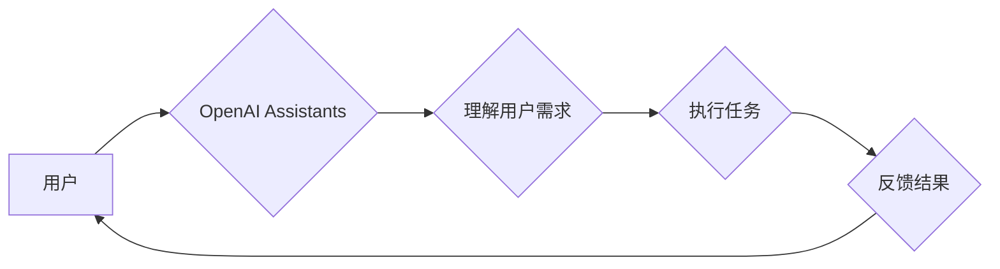

> 大模型、AI Agent、OpenAI、Assistants、应用开发、自然语言处理、对话系统

## 1. 背景介绍

近年来，人工智能（AI）技术取得了飞速发展，特别是大模型的出现，为AI应用带来了革命性的变革。大模型是指参数规模庞大、训练数据海量的人工智能模型，具备强大的泛化能力和学习能力，能够在各种自然语言处理（NLP）任务中表现出色。OpenAI公司作为AI领域的领军者，开发了多个知名的大模型，例如GPT-3、DALL-E 2等。其中，OpenAI的Assistants是基于大模型技术开发的一系列AI代理，旨在帮助用户完成各种任务，提高工作效率和生活品质。

## 2. 核心概念与联系

### 2.1  大模型

大模型是指参数规模庞大、训练数据海量的人工智能模型。其核心特点是：

* **规模庞大:** 大模型通常拥有数十亿甚至数千亿个参数，这使得它们能够学习到更复杂的模式和关系。
* **数据驱动:** 大模型的训练依赖于海量的数据，数据越多，模型的性能越好。
* **泛化能力强:** 由于训练数据丰富，大模型能够在不同领域和任务中表现出色，具有较强的泛化能力。

### 2.2  AI Agent

AI Agent是指能够感知环境、做出决策并执行行动的智能体。它通常由以下几个部分组成：

* **感知模块:** 用于获取环境信息，例如传感器数据、文本信息等。
* **决策模块:** 用于根据环境信息做出决策，例如选择行动、制定策略等。
* **执行模块:** 用于执行决策，例如控制机器人运动、生成文本等。

### 2.3  OpenAI Assistants

OpenAI Assistants是基于大模型技术开发的一系列AI代理，旨在帮助用户完成各种任务。它们可以理解自然语言、进行对话、生成文本、翻译语言等。OpenAI Assistants的应用场景非常广泛，例如：

* **客服机器人:** 自动回答用户问题，提供24小时服务。
* **写作助手:** 帮助用户撰写文章、邮件、代码等。
* **学习助手:** 提供知识问答、学习辅导等服务。

**Mermaid 流程图**



## 3. 核心算法原理 & 具体操作步骤

### 3.1  算法原理概述

OpenAI Assistants的核心算法是基于Transformer架构的语言模型，例如GPT-3。Transformer是一种新型的神经网络架构，能够有效地处理序列数据，例如文本。其核心特点是：

* **自注意力机制:** 能够捕捉文本中单词之间的长距离依赖关系。
* **多头注意力:** 使用多个注意力头，可以学习到不同层次的语义信息。
* **编码器-解码器结构:** 编码器用于对输入文本进行编码，解码器用于根据编码结果生成输出文本。

### 3.2  算法步骤详解

1. **预训练:** 在海量文本数据上进行预训练，学习语言的语法和语义知识。
2. **微调:** 根据特定任务的数据进行微调，例如客服机器人、写作助手等。
3. **用户交互:** 用户输入文本，AI Agent理解用户需求，并生成相应的文本输出。

### 3.3  算法优缺点

**优点:**

* 强大的语言理解和生成能力。
* 泛化能力强，能够应用于多种任务。
* 持续学习和改进的能力。

**缺点:**

* 训练成本高，需要大量的计算资源和数据。
* 存在潜在的偏见和错误。
* 对输入文本的格式和语义敏感。

### 3.4  算法应用领域

* **自然语言处理:** 文本分类、情感分析、机器翻译、文本摘要等。
* **对话系统:** 客服机器人、聊天机器人、虚拟助手等。
* **内容创作:** 文章写作、故事创作、诗歌创作等。
* **教育:** 知识问答、学习辅导、个性化教育等。

## 4. 数学模型和公式 & 详细讲解 & 举例说明

### 4.1  数学模型构建

Transformer模型的核心是自注意力机制，其数学模型可以表示为：

$$
Attention(Q, K, V) = \frac{exp(Q \cdot K^T / \sqrt{d_k})}{exp(Q \cdot K^T / \sqrt{d_k})} \cdot V
$$

其中：

* $Q$：查询矩阵
* $K$：键矩阵
* $V$：值矩阵
* $d_k$：键向量的维度

### 4.2  公式推导过程

自注意力机制的目的是计算每个单词与其他单词之间的相关性。公式中，$Q \cdot K^T$ 计算了查询向量和键向量的点积，然后通过softmax函数归一化，得到每个单词与其他单词的相关性分数。最后，将相关性分数与值向量相乘，得到每个单词的加权和，即注意力输出。

### 4.3  案例分析与讲解

例如，在句子“我爱吃苹果”中，单词“我”与单词“苹果”之间的相关性较高，因为它们共同表达了说话者的喜好。自注意力机制能够捕捉到这种关系，并将“苹果”的语义信息传递给“我”，从而使模型更好地理解句子的含义。

## 5. 项目实践：代码实例和详细解释说明

### 5.1  开发环境搭建

* Python 3.7+
* PyTorch 或 TensorFlow
* CUDA 和 cuDNN

### 5.2  源代码详细实现

```python
import torch
import torch.nn as nn

class Attention(nn.Module):
    def __init__(self, d_model, num_heads):
        super(Attention, self).__init__()
        self.d_model = d_model
        self.num_heads = num_heads
        self.head_dim = d_model // num_heads

        self.query = nn.Linear(d_model, d_model)
        self.key = nn.Linear(d_model, d_model)
        self.value = nn.Linear(d_model, d_model)
        self.fc_out = nn.Linear(d_model, d_model)

    def forward(self, query, key, value, mask=None):
        batch_size = query.size(0)

        # Linear projections
        Q = self.query(query).view(batch_size, -1, self.num_heads, self.head_dim).transpose(1, 2)
        K = self.key(key).view(batch_size, -1, self.num_heads, self.head_dim).transpose(1, 2)
        V = self.value(value).view(batch_size, -1, self.num_heads, self.head_dim).transpose(1, 2)

        # Scaled dot-product attention
        scores = torch.matmul(Q, K.transpose(-2, -1)) / torch.sqrt(torch.tensor(self.head_dim, dtype=torch.float))

        if mask is not None:
            scores = scores.masked_fill(mask == 0, -1e9)

        attention_weights = torch.softmax(scores, dim=-1)

        # Weighted sum of values
        context = torch.matmul(attention_weights, V)

        # Concatenate heads and project
        context = context.transpose(1, 2).contiguous().view(batch_size, -1, self.d_model)
        output = self.fc_out(context)

        return output, attention_weights
```

### 5.3  代码解读与分析

这段代码实现了Transformer模型中的自注意力机制。首先，将输入的查询、键和值向量进行线性变换，然后将它们reshape成多头注意力结构。接着，计算查询向量和键向量的点积，并通过softmax函数归一化得到注意力权重。最后，将注意力权重与值向量相乘，得到注意力输出。

### 5.4  运行结果展示

运行上述代码，可以得到注意力输出和注意力权重。注意力权重可以直观地展示每个单词与其他单词之间的相关性。

## 6. 实际应用场景

### 6.1  客服机器人

OpenAI Assistants可以被用于构建客服机器人，自动回答用户常见问题，提供24小时服务。例如，用户可以向客服机器人询问产品信息、订单状态等问题，机器人可以根据预先训练好的知识库和自然语言理解能力，准确地回答用户问题。

### 6.2  写作助手

OpenAI Assistants可以帮助用户撰写文章、邮件、代码等。例如，用户可以向写作助手提供一些关键词和主题，助手可以根据用户的需求生成相应的文本内容。

### 6.3  学习助手

OpenAI Assistants可以作为学习助手，提供知识问答、学习辅导等服务。例如，用户可以向学习助手提问一些知识问题，助手可以根据其知识库提供准确的答案。

### 6.4  未来应用展望

随着大模型技术的不断发展，OpenAI Assistants的应用场景将会更加广泛。例如，它们可以被用于医疗诊断、法律咨询、金融分析等领域，帮助人类解决更复杂的问题。

## 7. 工具和资源推荐

### 7.1  学习资源推荐

* **OpenAI官方文档:** https://openai.com/api/
* **HuggingFace Transformers库:** https://huggingface.co/transformers/
* **DeepLearning.AI课程:** https://www.deeplearning.ai/

### 7.2  开发工具推荐

* **Jupyter Notebook:** https://jupyter.org/
* **PyCharm:** https://www.jetbrains.com/pycharm/
* **VS Code:** https://code.visualstudio.com/

### 7.3  相关论文推荐

* **Attention Is All You Need:** https://arxiv.org/abs/1706.03762
* **BERT: Pre-training of Deep Bidirectional Transformers for Language Understanding:** https://arxiv.org/abs/1810.04805

## 8. 总结：未来发展趋势与挑战

### 8.1  研究成果总结

OpenAI Assistants是基于大模型技术的AI代理，具有强大的语言理解和生成能力，能够应用于多种任务。其核心算法是Transformer架构，能够有效地处理序列数据，并捕捉文本中单词之间的长距离依赖关系。

### 8.2  未来发展趋势

* **模型规模更大:** 未来的大模型将会拥有更大的参数规模，能够学习到更复杂的知识和模式。
* **多模态理解:** 大模型将能够理解多种模态数据，例如文本、图像、音频等，从而实现更全面的智能。
* **个性化定制:** 大模型将能够根据用户的需求进行个性化定制，提供更精准的服务。

### 8.3  面临的挑战

* **数据安全和隐私:** 大模型的训练需要海量数据，如何保证数据安全和隐私是一个重要的挑战。
* **模型可解释性:** 大模型的决策过程往往难以理解，如何提高模型的可解释性是一个重要的研究方向。
* **伦理问题:** 大模型的应用可能会带来一些伦理问题，例如算法偏见、信息操纵等，需要引起足够的重视。

### 8.4  研究展望

未来，大模型技术将会继续发展，并应用于更多领域，为人类社会带来更多福祉。我们需要加强对大模型技术的研究，解决其面临的挑战，并确保其安全、可控、可持续地发展。

## 9. 附录：常见问题与解答

### 9.1  Q: 如何训练一个OpenAI Assistants？

A: 训练一个OpenAI Assistants需要大量的计算资源和数据。您可以使用