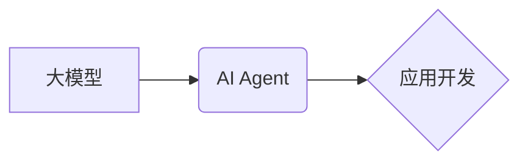

> 大模型、AI Agent、应用开发、自然语言处理、机器学习、对话系统、知识图谱、代码生成

## 1. 背景介绍

近年来，大模型技术取得了飞速发展，其强大的泛化能力和知识表示能力为人工智能的应用开辟了广阔的领域。大模型可以理解和生成人类语言，进行图像识别、文本摘要、代码生成等复杂任务，为我们创造了全新的智能体验。

然而，单纯的模型训练并不能直接应用于实际场景。我们需要将大模型与特定应用场景相结合，构建出能够真正解决实际问题的智能代理（AI Agent）。AI Agent 是一种能够感知环境、做出决策并执行行动的智能体，它可以自动化完成各种任务，提高工作效率和生活质量。

## 2. 核心概念与联系

### 2.1 大模型

大模型是指参数量巨大、训练数据海量的人工智能模型。它们通常基于 Transformer 架构，能够学习到复杂的语言模式和知识表示。

### 2.2 AI Agent

AI Agent 是一个能够感知环境、做出决策并执行行动的智能体。它可以自主学习、适应环境变化，并完成预设的任务。

### 2.3 应用开发

应用开发是指将大模型与特定应用场景相结合，构建出能够解决实际问题的智能代理。

**核心概念关系图:**



## 3. 核心算法原理 & 具体操作步骤

### 3.1 算法原理概述

构建 AI Agent 的核心算法通常包括以下几个方面：

* **自然语言理解 (NLU):** 理解用户输入的自然语言，提取关键信息和意图。
* **对话管理 (Dialogue Management):** 根据用户输入和对话历史，生成合适的回复，并引导对话走向。
* **知识表示和推理 (Knowledge Representation and Reasoning):** 将知识存储在知识图谱中，并利用推理机制进行知识抽取和问答。
* **行动执行 (Action Execution):** 根据用户需求，执行相应的行动，例如控制设备、查询信息等。

### 3.2 算法步骤详解

1. **数据预处理:** 收集和清洗相关数据，例如对话数据、知识图谱数据等。
2. **模型训练:** 使用大模型训练 NLU、对话管理、知识表示和推理等模型。
3. **系统集成:** 将训练好的模型集成到 AI Agent 系统中。
4. **测试和评估:** 对 AI Agent 进行测试和评估，并根据结果进行模型优化和调整。

### 3.3 算法优缺点

**优点:**

* **智能化:** AI Agent 可以自主学习和适应环境变化，提供更智能化的服务。
* **自动化:** AI Agent 可以自动化完成各种任务，提高工作效率和生活质量。
* **个性化:** AI Agent 可以根据用户的需求和喜好进行个性化定制。

**缺点:**

* **数据依赖:** AI Agent 的性能依赖于训练数据的质量和数量。
* **安全风险:** AI Agent 可能存在安全风险，例如被恶意攻击或滥用。
* **伦理问题:** AI Agent 的应用可能引发一些伦理问题，例如隐私保护和责任归属。

### 3.4 算法应用领域

AI Agent 的应用领域非常广泛，例如：

* **客服机器人:** 自动回答用户问题，提供24小时在线服务。
* **智能助理:** 帮助用户管理日程安排、发送邮件、查询信息等。
* **教育机器人:** 为学生提供个性化学习辅导和互动体验。
* **医疗诊断助手:** 辅助医生进行疾病诊断和治疗方案制定。

## 4. 数学模型和公式 & 详细讲解 & 举例说明

### 4.1 数学模型构建

在构建 AI Agent 时，我们可以使用各种数学模型来表示知识、理解语言和进行决策。例如：

* **词嵌入模型 (Word Embedding):** 将单词映射到向量空间，捕捉单词之间的语义关系。常用的词嵌入模型包括 Word2Vec 和 GloVe。
* **Transformer 模型:** 用于处理序列数据，例如文本和语音。Transformer 模型能够学习到长距离依赖关系，并具有强大的泛化能力。
* **强化学习 (Reinforcement Learning):** 用于训练 AI Agent 进行决策和行动。强化学习算法通过奖励机制来引导 AI Agent 学习最优策略。

### 4.2 公式推导过程

例如，我们可以使用 Word2Vec 模型来学习词嵌入。Word2Vec 模型使用神经网络来预测上下文单词，并根据预测结果更新词向量。

**目标函数:**

$$
J(\theta) = -\frac{1}{N} \sum_{i=1}^{N} \sum_{j \in C(w_i)} \log p(w_j | w_i; \theta)
$$

其中：

* $\theta$ 是模型参数
* $N$ 是训练样本数量
* $w_i$ 是中心词
* $C(w_i)$ 是中心词的上下文单词集合
* $p(w_j | w_i; \theta)$ 是模型预测中心词上下文单词 $w_j$ 的概率

**梯度下降算法:**

$$
\theta = \theta - \alpha \nabla J(\theta)
$$

其中：

* $\alpha$ 是学习率
* $\nabla J(\theta)$ 是目标函数的梯度

### 4.3 案例分析与讲解

我们可以使用 Word2Vec 模型来分析单词之间的语义关系。例如，我们可以计算 "国王" 和 "皇后" 之间的语义相似度。

如果 "国王" 和 "皇后" 的词向量相近，则表示它们在语义上相似。

## 5. 项目实践：代码实例和详细解释说明

### 5.1 开发环境搭建

* Python 3.x
* TensorFlow 或 PyTorch
* NLTK 或 spaCy

### 5.2 源代码详细实现

```python
# 使用 TensorFlow 构建一个简单的对话代理

import tensorflow as tf

# 定义对话模型
model = tf.keras.Sequential([
    tf.keras.layers.Embedding(input_dim=vocab_size, output_dim=embedding_dim),
    tf.keras.layers.LSTM(units=hidden_size),
    tf.keras.layers.Dense(units=vocab_size, activation='softmax')
])

# 训练模型
model.compile(optimizer='adam', loss='sparse_categorical_crossentropy', metrics=['accuracy'])
model.fit(train_data, train_labels, epochs=10)

# 生成回复
def generate_response(user_input):
    # 将用户输入转换为词向量
    input_vector = encoder.encode(user_input)
    # 使用模型预测回复
    predicted_index = model.predict(input_vector)
    # 将预测索引转换为回复文本
    response = decoder.decode(predicted_index)
    return response
```

### 5.3 代码解读与分析

* **词嵌入层:** 将单词映射到向量空间，捕捉单词之间的语义关系。
* **LSTM 层:** 用于处理序列数据，例如文本。LSTM 可以学习到长距离依赖关系。
* **全连接层:** 将 LSTM 输出映射到词汇表大小，预测下一个单词。
* **训练过程:** 使用训练数据训练模型，优化模型参数。
* **回复生成:** 将用户输入转换为词向量，使用模型预测回复，并将预测索引转换为文本。

### 5.4 运行结果展示

运行代码后，可以与 AI Agent 进行对话，例如：

```
用户: 你好
AI Agent: 你好！
用户: 你叫什么名字？
AI Agent: 我叫 AI Assistant。
```

## 6. 实际应用场景

### 6.1 客服机器人

AI Agent 可以作为客服机器人，自动回答用户常见问题，例如订单查询、退换货流程等。

### 6.2 智能助理

AI Agent 可以作为智能助理，帮助用户管理日程安排、发送邮件、查询信息等。

### 6.3 教育机器人

AI Agent 可以作为教育机器人，为学生提供个性化学习辅导和互动体验。

### 6.4 未来应用展望

AI Agent 的应用前景广阔，未来可能在以下领域得到更广泛的应用：

* **医疗保健:** 辅助医生进行诊断、治疗方案制定和患者管理。
* **金融服务:** 提供个性化理财建议、自动交易和欺诈检测。
* **交通运输:** 辅助驾驶、智能交通管理和物流优化。

## 7. 工具和资源推荐

### 7.1 学习资源推荐

* **书籍:**
    * 《深度学习》
    * 《自然语言处理》
    * 《强化学习》
* **在线课程:**
    * Coursera
    * edX
    * Udacity

### 7.2 开发工具推荐

* **TensorFlow:** 开源深度学习框架
* **PyTorch:** 开源深度学习框架
* **NLTK:** 自然语言处理工具包
* **spaCy:** 自然语言处理工具包

### 7.3 相关论文推荐

* **Attention Is All You Need:** https://arxiv.org/abs/1706.03762
* **BERT: Pre-training of Deep Bidirectional Transformers for Language Understanding:** https://arxiv.org/abs/1810.04805
* **GPT-3: Language Models are Few-Shot Learners:** https://arxiv.org/abs/2005.14165

## 8. 总结：未来发展趋势与挑战

### 8.1 研究成果总结

近年来，大模型技术取得了显著进展，AI Agent 的应用也越来越广泛。

### 8.2 未来发展趋势

* **模型规模和能力的提升:** 未来大模型将更加庞大，拥有更强的泛化能力和知识表示能力。
* **多模态交互:** AI Agent 将能够理解和生成多种模态信息，例如文本、图像、语音等。
* **个性化定制:** AI Agent 将能够根据用户的需求和喜好进行个性化定制。

### 8.3 面临的挑战

* **数据安全和隐私保护:** AI Agent 的训练和应用需要大量数据，如何保证数据安全和隐私保护是一个重要挑战。
* **算法可解释性和信任度:** AI Agent 的决策过程往往是复杂的，如何提高算法的可解释性和信任度是一个关键问题。
* **伦理问题:** AI Agent 的应用可能引发一些伦理问题，例如责任归属、偏见和歧视等。

### 8.4 研究展望

未来，我们需要继续探索大模型的潜力，开发更智能、更安全、更可靠的 AI Agent，并解决其面临的挑战，推动人工智能技术向更广泛的领域应用。

## 9. 附录：常见问题与解答

**常见问题:**

* **如何选择合适的 AI Agent 开发框架？**

**解答:**

选择 AI Agent 开发框架需要根据具体应用场景和需求进行考虑。例如，如果需要处理大量文本数据，可以选择使用 NLTK 或 spaCy 等自然语言处理工具包。如果需要构建更复杂的对话系统，可以选择使用 Rasa 或 Dialogflow 等对话平台。

* **如何训练一个高质量的 AI Agent？**

**解答:**

训练高质量的 AI Agent 需要高质量的训练数据、合适的模型架构和训练参数。还需要进行充分的模型评估和优化。

* **如何保证 AI Agent 的安全性？**

**解答:**

保证 AI Agent 的安全性需要从多个方面进行考虑，例如数据安全、模型安全和系统安全。需要采取相应的安全措施，例如数据加密、模型审计和安全测试。


作者：禅与计算机程序设计艺术 / Zen and the Art of Computer Programming 
<end_of_turn>