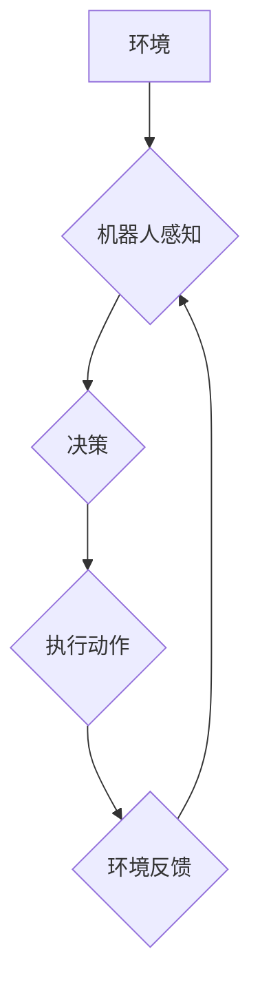

> Q-learning, 机器人, 强化学习, 决策, 映射, 智能控制

## 1. 背景介绍

在当今科技飞速发展的时代，人工智能（AI）正以惊人的速度改变着我们的世界。其中，强化学习（Reinforcement Learning，RL）作为机器学习的一个重要分支，在解决复杂决策问题方面展现出巨大的潜力。尤其是在机器人领域，强化学习能够赋予机器人自主学习和适应环境的能力，使其能够在复杂、动态的环境中高效地完成任务。

传统的机器人控制方法通常依赖于预先编程的规则和模型，这使得机器人难以应对未知情况和环境变化。而强化学习则通过建立一个“奖励-惩罚”机制，让机器人通过与环境的交互学习最优的策略。机器人通过执行动作，获得环境的反馈（奖励或惩罚），并根据这些反馈更新其策略，最终学习到最优的行动策略，从而实现智能控制。

## 2. 核心概念与联系

**2.1 强化学习的基本概念**

强化学习的核心概念是“代理”（Agent）与“环境”（Environment）之间的交互。代理是一个智能体，它可以感知环境的状态并采取行动。环境会根据代理的动作产生新的状态和奖励信号。代理的目标是通过学习最优的策略，最大化累积的奖励。

**2.2 Q-learning算法**

Q-learning是一种经典的强化学习算法，它通过学习一个Q值表来表示每个状态-动作对的价值。Q值表是一个表格，其中每个单元格存储了从当前状态执行特定动作后获得的期望奖励。

**2.3 映射关系**

在机器人领域，强化学习的应用可以看作是一种“映射”关系。机器人通过感知环境信息（输入），学习到最优的控制策略（输出）。这个映射关系可以被表示为一个函数，其中输入是环境状态，输出是机器人采取的动作。

**2.4 Mermaid 流程图**



## 3. 核心算法原理 & 具体操作步骤

### 3.1 算法原理概述

Q-learning算法的核心思想是通过迭代更新Q值表，使得Q值表中的每个单元格都反映了从当前状态执行特定动作后获得的期望奖励。

算法的更新规则如下：

$$Q(s, a) = Q(s, a) + \alpha [r + \gamma \max_{a'} Q(s', a') - Q(s, a)]$$

其中：

* $Q(s, a)$ 表示从状态 $s$ 执行动作 $a$ 后获得的期望奖励。
* $\alpha$ 是学习率，控制着学习速度。
* $r$ 是从状态 $s$ 执行动作 $a$ 后获得的即时奖励。
* $\gamma$ 是折扣因子，控制着未来奖励的权重。
* $s'$ 是执行动作 $a$ 后进入的新状态。
* $\max_{a'} Q(s', a')$ 是在新状态 $s'$ 中执行所有动作的期望奖励的最大值。

### 3.2 算法步骤详解

1. 初始化Q值表，将所有Q值设置为0。
2. 选择一个初始状态 $s_0$。
3. 在状态 $s_0$ 中随机选择一个动作 $a_0$。
4. 执行动作 $a_0$，观察环境反馈，获得即时奖励 $r$ 和新状态 $s_1$。
5. 根据更新规则更新Q值表：$Q(s_0, a_0) = Q(s_0, a_0) + \alpha [r + \gamma \max_{a'} Q(s_1, a') - Q(s_0, a_0)]$。
6. 将当前状态更新为 $s_1$，重复步骤3-5，直到达到终止条件。

### 3.3 算法优缺点

**优点：**

* 能够学习复杂的决策策略。
* 不需要事先知道环境模型。
* 能够在线学习和适应环境变化。

**缺点：**

* 学习过程可能很慢，需要大量的样本数据。
* 容易陷入局部最优解。
* 对于高维状态空间，Q值表可能难以存储和更新。

### 3.4 算法应用领域

Q-learning算法在机器人领域有着广泛的应用，例如：

* 机器人导航：机器人学习在未知环境中导航到目标位置。
* 机器人抓取：机器人学习如何抓取和移动物体。
* 机器人控制：机器人学习执行复杂的任务，例如跳舞、演奏乐器等。

## 4. 数学模型和公式 & 详细讲解 & 举例说明

### 4.1 数学模型构建

Q-learning算法的核心数学模型是Q值表，它是一个状态-动作对的映射关系，每个映射值代表从该状态执行该动作后获得的期望奖励。

**状态空间 (S):** 所有可能的机器人状态集合。

**动作空间 (A):** 所有可能的机器人动作集合。

**Q值表 (Q):** 一个二维数组，其中每个元素 $Q(s, a)$ 表示从状态 $s$ 执行动作 $a$ 后获得的期望奖励。

### 4.2 公式推导过程

Q-learning算法的更新规则如下：

$$Q(s, a) = Q(s, a) + \alpha [r + \gamma \max_{a'} Q(s', a') - Q(s, a)]$$

其中：

* $Q(s, a)$ 是当前状态 $s$ 执行动作 $a$ 后获得的期望奖励。
* $\alpha$ 是学习率，控制着学习速度。
* $r$ 是从状态 $s$ 执行动作 $a$ 后获得的即时奖励。
* $\gamma$ 是折扣因子，控制着未来奖励的权重。
* $s'$ 是执行动作 $a$ 后进入的新状态。
* $\max_{a'} Q(s', a')$ 是在新状态 $s'$ 中执行所有动作的期望奖励的最大值。

这个公式表示，Q值表中的每个元素 $Q(s, a)$ 会根据以下因素进行更新：

* 当前的Q值 $Q(s, a)$
* 即时奖励 $r$
* 折扣因子 $\gamma$ 乘以新状态 $s'$ 中所有动作的期望奖励最大值 $\max_{a'} Q(s', a')$
* 学习率 $\alpha$ 控制着更新幅度。

### 4.3 案例分析与讲解

假设一个机器人需要学习在迷宫中找到出口。

* 状态空间：迷宫中的所有位置。
* 动作空间：向上、向下、向左、向右四个方向。
* Q值表：每个位置对应四个动作，每个动作的Q值代表从该位置执行该动作后获得的期望奖励。

机器人通过与环境交互，不断更新Q值表。当机器人到达出口时，获得最大奖励；当机器人撞墙时，获得负奖励。通过不断学习，机器人最终能够找到最优的路径到达出口。

## 5. 项目实践：代码实例和详细解释说明

### 5.1 开发环境搭建

* Python 3.x
* OpenAI Gym 库

### 5.2 源代码详细实现

```python
import gym
import numpy as np

# 设置学习参数
alpha = 0.1  # 学习率
gamma = 0.9  # 折扣因子
epsilon = 0.1  # 探索率

# 创建环境
env = gym.make('CartPole-v1')

# 初始化Q值表
num_states = env.observation_space.n
num_actions = env.action_space.n
Q = np.zeros((num_states, num_actions))

# 训练循环
for episode in range(1000):
    state = env.reset()
    done = False

    while not done:
        # 选择动作
        if np.random.uniform(0, 1) < epsilon:
            action = env.action_space.sample()
        else:
            action = np.argmax(Q[state, :])

        # 执行动作
        next_state, reward, done, _ = env.step(action)

        # 更新Q值
        Q[state, action] = Q[state, action] + alpha * (reward + gamma * np.max(Q[next_state, :]) - Q[state, action])

        # 更新状态
        state = next_state

    # 打印进度
    print(f"Episode {episode+1} done")

# 测试
state = env.reset()
while True:
    action = np.argmax(Q[state, :])
    state, reward, done, _ = env.step(action)
    env.render()
    if done:
        break
env.close()
```

### 5.3 代码解读与分析

* 代码首先定义了学习参数，包括学习率、折扣因子和探索率。
* 然后创建了一个OpenAI Gym环境，并初始化了Q值表。
* 训练循环中，机器人会根据当前状态和Q值表选择动作，执行动作后获得奖励和下一个状态。
* 根据Q-learning算法的更新规则，更新Q值表中的对应元素。
* 训练结束后，可以测试机器人是否能够完成任务。

### 5.4 运行结果展示

运行代码后，机器人将在环境中学习并最终能够完成任务，例如在CartPole-v1环境中，机器人能够平衡杆子持续一段时间。

## 6. 实际应用场景

### 6.1 机器人导航

在无人驾驶汽车、自动导引车等领域，Q-learning算法可以帮助机器人学习在复杂环境中导航到目标位置。

### 6.2 机器人抓取

在工业机器人、服务机器人等领域，Q-learning算法可以帮助机器人学习如何抓取和移动物体。

### 6.3 机器人控制

在机器人手术、机器人陪伴等领域，Q-learning算法可以帮助机器人学习执行复杂的任务，例如跳舞、演奏乐器等。

### 6.4 未来应用展望

随着人工智能技术的不断发展，Q-learning算法在机器人领域的应用前景更加广阔。未来，Q-learning算法可能被应用于更复杂的任务，例如：

* 机器人协作
* 机器人学习和适应
* 机器人情感识别

## 7. 工具和资源推荐

### 7.1 学习资源推荐

* **书籍:**
    * Reinforcement Learning: An Introduction by Richard S. Sutton and Andrew G. Barto
    * Deep Reinforcement Learning Hands-On by Maxim Lapan
* **在线课程:**
    * Coursera: Reinforcement Learning Specialization by David Silver
    * Udacity: Deep Reinforcement Learning Nanodegree

### 7.2 开发工具推荐

* **OpenAI Gym:** 一个用于强化学习研究和开发的开源库。
* **TensorFlow:** 一个用于深度学习的开源库。
* **PyTorch:** 另一个用于深度学习的开源库。

### 7.3 相关论文推荐

* **Playing Atari with Deep Reinforcement Learning** by Mnih et al. (2013)
* **Human-level control through deep reinforcement learning** by Mnih et al. (2015)
* **Deep Q-Network** by Mnih et al. (2015)

## 8. 总结：未来发展趋势与挑战

### 8.1 研究成果总结

Q-learning算法在机器人领域取得了显著的成果，例如在导航、抓取、控制等任务中表现出色。

### 8.2 未来发展趋势

* **深度强化学习:** 将深度神经网络与Q-learning算法结合，提高算法的学习能力和泛化能力。
* **多智能体强化学习:** 研究多个机器人协同学习和合作完成任务。
* **安全强化学习:** 确保机器人学习到的策略安全可靠，避免出现危险行为。

### 8.3 面临的挑战

* **样本效率:** 强化学习算法通常需要大量的样本数据才能学习到有效的策略