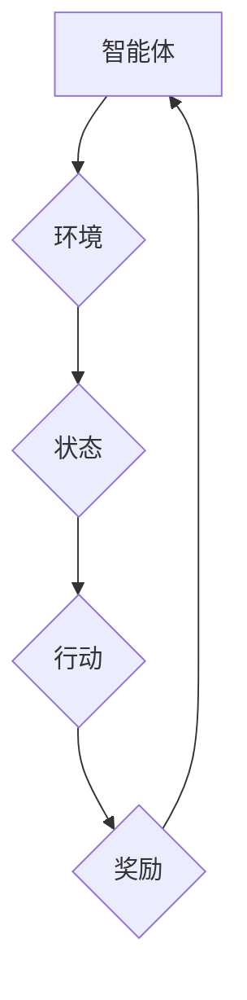

> Q-learning,金融风控,强化学习,机器学习,风险管理,AI算法

## 1. 背景介绍

金融风控作为金融机构的核心业务之一，旨在识别和管理金融风险，保障金融机构的稳定运营和客户利益。传统的风控模型主要依赖于规则引擎和统计模型，但随着金融市场日益复杂化和数据量的激增，传统方法面临着挑战。

近年来，人工智能（AI）技术在金融领域的应用日益广泛，特别是强化学习（RL）算法在金融风控中的应用展现出巨大的潜力。强化学习是一种机器学习方法，它通过让智能体在环境中进行交互，学习最优的策略来最大化奖励。

## 2. 核心概念与联系

**2.1 强化学习 (Reinforcement Learning)**

强化学习的核心概念是“智能体-环境-奖励”三者之间的交互。智能体在环境中采取行动，环境会根据智能体的行动产生状态变化和奖励信号。智能体的目标是通过不断学习，找到最优的策略，使得在长期内获得最大的总奖励。

**2.2 Q-learning**

Q-learning是强化学习中的一种经典算法，它通过构建一个Q表来存储智能体在不同状态下采取不同行动的期望回报。Q表中的每个元素代表智能体在特定状态下采取特定行动的价值，通过不断更新Q表，智能体可以学习到最优的策略。

**2.3 金融风控场景**

在金融风控场景中，智能体可以是风控模型，环境可以是金融市场，奖励可以是降低风险损失或提高风控效率。

**2.4 核心架构**



## 3. 核心算法原理 & 具体操作步骤

**3.1 算法原理概述**

Q-learning算法的核心思想是通过迭代更新Q表，使得智能体在每个状态下采取最优行动。Q表的更新规则如下：

$$
Q(s, a) = (1 - \alpha)Q(s, a) + \alpha [r + \gamma \max_{a'} Q(s', a')]
$$

其中：

* $Q(s, a)$：智能体在状态 $s$ 下采取行动 $a$ 的期望回报
* $\alpha$：学习率，控制着学习速度
* $r$：当前状态下获得的奖励
* $\gamma$：折扣因子，控制着未来奖励的权重
* $s'$：采取行动 $a$ 后进入的下一个状态
* $a'$：在下一个状态 $s'$ 下采取的最佳行动

**3.2 算法步骤详解**

1. 初始化Q表，将所有Q值设置为0。
2. 选择一个初始状态 $s$。
3. 在状态 $s$ 下随机选择一个行动 $a$。
4. 执行行动 $a$，观察环境的反馈，得到下一个状态 $s'$ 和奖励 $r$。
5. 更新Q表：

$$
Q(s, a) = (1 - \alpha)Q(s, a) + \alpha [r + \gamma \max_{a'} Q(s', a')]
$$

6. 将当前状态 $s$ 更新为下一个状态 $s'$。
7. 重复步骤3-6，直到达到终止条件。

**3.3 算法优缺点**

**优点：**

* 能够学习复杂的策略
* 不需要事先定义奖励函数
* 可以应用于离散和连续状态空间

**缺点：**

* 学习过程可能很慢
* 需要大量的训练数据
* 容易陷入局部最优解

**3.4 算法应用领域**

Q-learning算法在金融风控领域有广泛的应用，例如：

* 风险评估：根据历史数据和市场信息，学习预测不同投资组合的风险水平。
* 欺诈检测：学习识别异常交易行为，提高欺诈检测的准确率。
* 资产配置：学习制定最优的资产配置策略，最大化投资回报。

## 4. 数学模型和公式 & 详细讲解 & 举例说明

**4.1 数学模型构建**

在金融风控场景中，我们可以将问题建模为一个马尔可夫决策过程（MDP）。MDP由以下几个要素组成：

* 状态空间 $S$：表示系统可能存在的各种状态，例如客户信用评分、交易金额等。
* 动作空间 $A$：表示智能体可以采取的各种行动，例如拒绝贷款、降低信用额度等。
* 转移概率 $P(s', r | s, a)$：表示在状态 $s$ 下采取行动 $a$ 后，转移到状态 $s'$ 的概率，以及获得奖励 $r$ 的概率。
* 奖励函数 $R(s, a)$：表示在状态 $s$ 下采取行动 $a$ 后获得的奖励。

**4.2 公式推导过程**

Q-learning算法的目标是学习一个策略 $\pi(s)$，使得在长期内获得最大的总奖励。策略 $\pi(s)$ 指示在每个状态 $s$ 下采取哪个行动 $a$。

Q-learning算法通过迭代更新Q表来学习策略。Q表的更新规则如下：

$$
Q(s, a) = (1 - \alpha)Q(s, a) + \alpha [r + \gamma \max_{a'} Q(s', a')]
$$

其中：

* $Q(s, a)$：智能体在状态 $s$ 下采取行动 $a$ 的期望回报
* $\alpha$：学习率，控制着学习速度
* $r$：当前状态下获得的奖励
* $\gamma$：折扣因子，控制着未来奖励的权重
* $s'$：采取行动 $a$ 后进入的下一个状态
* $a'$：在下一个状态 $s'$ 下采取的最佳行动

**4.3 案例分析与讲解**

假设我们有一个金融机构，需要使用Q-learning算法来评估客户的信用风险。

* 状态空间 $S$：客户的信用评分
* 动作空间 $A$：批准贷款、拒绝贷款
* 转移概率 $P(s', r | s, a)$：根据客户的信用评分和贷款金额，计算客户违约的概率，以及获得贷款利息的概率。
* 奖励函数 $R(s, a)$：如果客户没有违约，则获得贷款利息作为奖励；如果客户违约，则损失贷款本金作为惩罚。

通过训练Q-learning模型，我们可以学习到每个信用评分下，批准贷款还是拒绝贷款的最佳策略，从而降低金融机构的信用风险。

## 5. 项目实践：代码实例和详细解释说明

**5.1 开发环境搭建**

* Python 3.x
* TensorFlow 或 PyTorch
* NumPy
* Pandas

**5.2 源代码详细实现**

```python
import numpy as np
from collections import defaultdict

class QLearningAgent:
    def __init__(self, state_space, action_space, learning_rate=0.1, discount_factor=0.9):
        self.state_space = state_space
        self.action_space = action_space
        self.learning_rate = learning_rate
        self.discount_factor = discount_factor
        self.q_table = defaultdict(lambda: np.zeros(len(action_space)))

    def choose_action(self, state):
        return np.argmax(self.q_table[state])

    def update_q_table(self, state, action, reward, next_state):
        best_next_action = np.argmax(self.q_table[next_state])
        self.q_table[state][action] = (1 - self.learning_rate) * self.q_table[state][action] + self.learning_rate * (reward + self.discount_factor * self.q_table[next_state][best_next_action])

# ... (其他代码实现)
```

**5.3 代码解读与分析**

* `QLearningAgent`类实现了Q-learning算法的核心逻辑。
* `choose_action`方法根据当前状态选择最优行动。
* `update_q_table`方法更新Q表的Q值，根据Bellman方程进行更新。

**5.4 运行结果展示**

通过训练Q-learning模型，我们可以观察到Q表的Q值随着训练次数的增加而逐渐收敛，最终学习到最优的策略。

## 6. 实际应用场景

**6.1 风险评估**

Q-learning可以用于评估不同投资组合的风险水平，帮助投资者做出更明智的投资决策。

**6.2 欺诈检测**

Q-learning可以学习识别异常交易行为，提高欺诈检测的准确率，帮助金融机构防范欺诈风险。

**6.3 资产配置**

Q-learning可以学习制定最优的资产配置策略，最大化投资回报，帮助投资者优化资产组合。

**6.4 未来应用展望**

随着人工智能技术的不断发展，Q-learning在金融风控领域的应用前景广阔。未来，Q-learning可以应用于更复杂的金融场景，例如：

* 个性化风控：根据客户的个体特征，制定个性化的风控策略。
* 动态风控：根据市场变化和风险水平动态调整风控策略。
* 跨机构风控：构建跨机构的风险共享平台，实现更全面的风险管理。

## 7. 工具和资源推荐

**7.1 学习资源推荐**

* 强化学习：强化学习：算法、策略和应用
* Q-learning：Q-learning算法详解
* TensorFlow：TensorFlow官方文档
* PyTorch：PyTorch官方文档

**7.2 开发工具推荐**

* Python：Python编程语言
* TensorFlow：深度学习框架
* PyTorch：深度学习框架
* Jupyter Notebook：交互式编程环境

**7.3 相关论文推荐**

* Sutton, R. S., & Barto, A. G. (2018). Reinforcement learning: An introduction. MIT press.
* Watkins, C. J. C. H. (1989). Learning from delayed rewards. PhD thesis, Cambridge University.

## 8. 总结：未来发展趋势与挑战

**8.1 研究成果总结**

Q-learning算法在金融风控领域取得了显著的成果，能够有效地评估风险、检测欺诈和优化资产配置。

**8.2 未来发展趋势**

未来，Q-learning算法将朝着以下方向发展：

* 更复杂的模型：开发更复杂的Q-learning模型，能够处理更复杂的金融场景。
* 更高效的算法：研究更高效的Q-learning算法，提高学习速度和准确率。
* 更强的解释性：提高Q-learning模型的解释性，帮助金融机构更好地理解模型的决策过程。

**8.3 面临的挑战**

Q-learning算法在金融风控领域也面临一些挑战：

* 数据稀缺：金融数据往往稀缺和难以获取。
* 复杂性：金融市场复杂多变，难以建模。
* 可解释性：Q-learning模型的决策过程难以解释，难以获得金融机构的信任。

**8.4 研究展望**

未来，我们需要继续研究Q-learning算法在金融风控领域的应用，克服其面临的挑战，并将其应用于更复杂的金融场景，为金融机构提供更有效的风险管理解决方案。

## 9. 附录：常见问题与解答

**9.1 Q：Q-learning算法的学习率如何设置？**

**A：** 学习率是一个重要的超参数，控制着学习速度。一般来说，学习率应该是一个较小的值，例如0.1或0.01。学习率过大可能会导致模型不稳定，学习率过小可能会导致学习速度过慢。

**9.2 Q：Q-learning算法的折扣因子如何设置？**

**A：** 折扣因子控制着未来奖励的权重。折扣因子应该是一个介于0和1之间的值