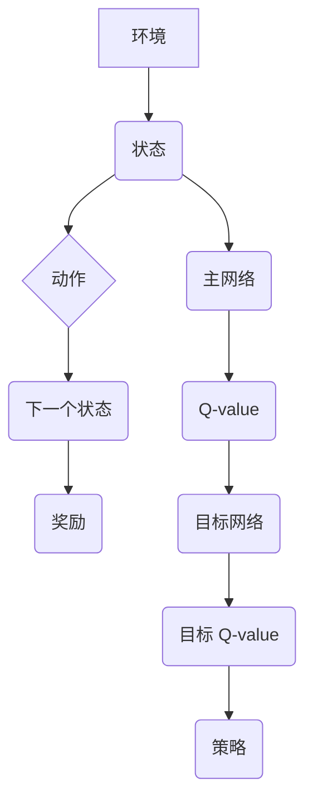

> Deep Q-Network (DQN), 目标网络, 经验回放, 训练稳定性, 价值函数估计

## 1. 背景介绍

深度强化学习 (Deep Reinforcement Learning, DRL) 近年来取得了令人瞩目的进展，在游戏、机器人控制、自动驾驶等领域展现出强大的应用潜力。其中，Deep Q-Network (DQN) 作为一种经典的 DRL 算法，凭借其高效性和易于实现的特点，在解决复杂决策问题方面取得了显著成果。

DQN 算法的核心思想是利用深度神经网络来估计状态-动作值函数 (Q-value)，并通过最大化 Q-value 的期望来学习最优策略。然而，在训练过程中，DQN 算法容易受到过拟合和震荡的影响，导致训练不稳定。为了解决这个问题，DQN 算法引入了目标网络 (Target Network) 的概念。

## 2. 核心概念与联系

目标网络是 DQN 算法中一个重要的组成部分，它与主网络 (Main Network) 共同作用，帮助 DQN 算法稳定地学习最优策略。

**目标网络的作用：**

* **稳定训练:** 目标网络的引入可以有效地缓解 DQN 算法训练过程中的震荡问题。
* **减少过拟合:** 目标网络的更新频率较低，可以防止模型过拟合训练数据。
* **提高收敛速度:** 目标网络可以提供一个稳定的 Q-value 估计，加速模型的收敛速度。

**DQN 算法架构：**



**核心概念原理和架构的 Mermaid 流程图：**


## 3. 核心算法原理 & 具体操作步骤

### 3.1  算法原理概述

DQN 算法的核心思想是利用深度神经网络来估计状态-动作值函数 (Q-value)，并通过最大化 Q-value 的期望来学习最优策略。

目标网络的作用是提供一个稳定的 Q-value 估计，用于更新主网络的权重。目标网络的权重与主网络的权重保持一致，但目标网络的更新频率较低，可以有效地缓解 DQN 算法训练过程中的震荡问题。

### 3.2  算法步骤详解

1. **初始化:** 初始化主网络和目标网络的权重。
2. **收集经验:** 在环境中与环境交互，收集状态、动作、奖励和下一个状态的经验数据，并将其存储在经验回放缓冲池中。
3. **采样经验:** 从经验回放缓冲池中随机采样一批经验数据。
4. **计算 Q-value:** 使用主网络计算当前状态下所有动作的 Q-value。
5. **计算目标 Q-value:** 使用目标网络计算目标状态下所有动作的 Q-value。
6. **更新主网络:** 使用目标 Q-value 和经验数据更新主网络的权重。
7. **更新目标网络:** 定期更新目标网络的权重，使其与主网络的权重保持一致。
8. **重复步骤 3-7:** 重复上述步骤，直到模型收敛。

### 3.3  算法优缺点

**优点:**

* 训练稳定性高
* 能够解决高维状态空间的问题
* 能够学习复杂的策略

**缺点:**

* 训练时间较长
* 需要大量的经验数据

### 3.4  算法应用领域

DQN 算法在以下领域具有广泛的应用前景:

* 游戏 AI
* 机器人控制
* 自动驾驶
* 金融交易
* 医疗诊断

## 4. 数学模型和公式 & 详细讲解 & 举例说明

### 4.1  数学模型构建

DQN 算法的核心是估计状态-动作值函数 (Q-value)，即在给定状态 s 和动作 a 的情况下，采取该动作获得的期望累积回报。

数学模型可以表示为：

$$Q(s, a) = E[\sum_{t=0}^{\infty} \gamma^t r_{t+1} | s_t = s, a_t = a]$$

其中：

* $Q(s, a)$ 是状态 s 下动作 a 的 Q-value。
* $r_{t+1}$ 是时间步 t+1 的奖励。
* $\gamma$ 是折扣因子，控制未来奖励的权重。
* $E$ 表示期望值。

### 4.2  公式推导过程

DQN 算法使用深度神经网络来估计 Q-value，并通过最大化 Q-value 的期望来学习最优策略。

目标函数可以表示为：

$$L = E[(y_i - Q(s_i, a_i))^2]$$

其中：

* $L$ 是损失函数。
* $y_i$ 是目标 Q-value，计算公式为：

$$y_i = r_{i+1} + \gamma \max_{a'} Q(s_{i+1}, a')$$

* $s_i$ 是时间步 i 的状态。
* $a_i$ 是时间步 i 的动作。
* $r_{i+1}$ 是时间步 i+1 的奖励。
* $s_{i+1}$ 是时间步 i+1 的状态。

### 4.3  案例分析与讲解

假设我们有一个简单的游戏环境，玩家可以选择向上、向下、向左、向右四个动作。

在某个状态下，玩家采取向上动作，获得的奖励为 1，下一个状态是玩家向上移动后的状态。

使用 DQN 算法，我们可以计算出该状态下向上动作的 Q-value，并将其与其他动作的 Q-value 进行比较，选择 Q-value 最高的动作作为最优策略。

## 5. 项目实践：代码实例和详细解释说明

### 5.1  开发环境搭建

* Python 3.6+
* TensorFlow 2.0+
* OpenAI Gym

### 5.2  源代码详细实现

```python
import tensorflow as tf
import numpy as np

class DQN:
    def __init__(self, state_size, action_size, learning_rate):
        self.state_size = state_size
        self.action_size = action_size
        self.learning_rate = learning_rate

        # 建立主网络
        self.main_network = self.build_network()

        # 建立目标网络
        self.target_network = self.build_network()

        # 初始化目标网络的权重
        self.target_network.set_weights(self.main_network.get_weights())

        # 创建训练器
        self.optimizer = tf.keras.optimizers.Adam(learning_rate=self.learning_rate)

    def build_network(self):
        model = tf.keras.Sequential()
        model.add(tf.keras.layers.Dense(64, activation='relu', input_shape=(self.state_size,)))
        model.add(tf.keras.layers.Dense(64, activation='relu'))
        model.add(tf.keras.layers.Dense(self.action_size))
        return model

    def predict(self, state):
        return self.main_network.predict(state)

    def update_target_network(self):
        self.target_network.set_weights(self.main_network.get_weights())

    def train(self, states, actions, rewards, next_states, dones):
        with tf.GradientTape() as tape:
            # 计算 Q-value
            q_values = self.main_network(states)

            # 计算目标 Q-value
            next_q_values = self.target_network(next_states)
            target_q_values = rewards + (1 - dones) * np.max(next_q_values, axis=1, keepdims=True)

            # 计算损失
            loss = tf.keras.losses.mean_squared_error(target_q_values, q_values[np.arange(len(states)), actions])

        # 更新主网络的权重
        gradients = tape.gradient(loss, self.main_network.trainable_variables)
        self.optimizer.apply_gradients(zip(gradients, self.main_network.trainable_variables))

```

### 5.3  代码解读与分析

* **DQN 类:** 定义了 DQN 算法的核心逻辑。
* **__init__ 方法:** 初始化主网络、目标网络、学习率等参数。
* **build_network 方法:** 定义了主网络和目标网络的结构。
* **predict 方法:** 使用主网络预测 Q-value。
* **update_target_network 方法:** 更新目标网络的权重。
* **train 方法:** 使用梯度下降算法更新主网络的权重。

### 5.4  运行结果展示

运行代码后，可以观察到模型的训练过程，包括损失函数的变化、奖励的累积等。

## 6. 实际应用场景

DQN 算法在以下领域具有广泛的应用前景:

### 6.1  游戏 AI

DQN 算法可以用于训练游戏 AI，使其能够学习最优策略，并与人类玩家进行竞争。

### 6.2  机器人控制

DQN 算法可以用于训练机器人控制系统，使其能够在复杂环境中自主导航和执行任务。

### 6.3  自动驾驶

DQN 算法可以用于训练自动驾驶系统，使其能够感知周围环境，并做出最优的驾驶决策。

### 6.4  未来应用展望

随着深度学习技术的不断发展，DQN 算法的应用场景将会更加广泛。

## 7. 工具和资源推荐

### 7.1  学习资源推荐

* **Deep Reinforcement Learning Hands-On** by Maxim Lapan
* **Reinforcement Learning: An Introduction** by Richard S. Sutton and Andrew G. Barto

### 7.2  开发工具推荐

* **TensorFlow**
* **PyTorch**
* **OpenAI Gym**

### 7.3  相关论文推荐

* **Playing Atari with Deep Reinforcement Learning** by Volodymyr Mnih et al.
* **Deep Q-Networks** by Volodymyr Mnih et al.

## 8. 总结：未来发展趋势与挑战

### 8.1  研究成果总结

DQN 算法取得了显著的成果，在解决复杂决策问题方面展现出强大的应用潜力。

### 8.2  未来发展趋势

* **探索更有效的训练算法:** 提高 DQN 算法的训练效率和稳定性。
* **解决稀疏奖励问题:** 探索解决 DQN 算法在稀疏奖励环境下的训练问题。
* **拓展应用场景:** 将 DQN 算法应用于更多领域，例如医疗诊断、金融交易等。

### 8.3  面临的挑战

* **数据需求:** DQN 算法需要大量的经验数据进行训练。
* **计算资源:** DQN 算法的训练过程需要大量的计算资源。
* **安全性和可靠性:** DQN 算法在实际应用中需要保证安全性和可靠性。

### 8.4  研究展望

未来，我们将继续探索 DQN 算法的改进方法，并将其应用于更多领域，推动深度强化学习技术的进步。

## 9. 附录：常见问题与解答

**Q1: DQN 算法为什么需要目标网络？**

**A1:** 目标网络可以提供一个稳定的 Q-value 估计，用于更新主