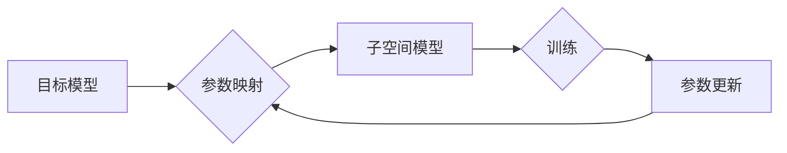

> Reptile算法,神经网络优化,参数映射,快速训练,迁移学习

## 1. 背景介绍

在深度学习领域，训练高效、鲁棒且泛化的神经网络一直是研究的热点问题。传统的训练方法通常需要大量的标注数据和大量的计算资源，这对于一些特定领域或资源有限的场景来说是一个挑战。近年来，Reptile算法作为一种新兴的优化方法，凭借其简单高效的特点，在神经网络训练领域引起了广泛关注。

Reptile算法的核心思想是通过模仿人类学习的方式，将目标模型的参数映射到一个更小的子空间，从而实现快速高效的训练。这种方法避免了直接优化目标模型参数的复杂过程，大大降低了训练难度和时间成本。

## 2. 核心概念与联系

Reptile算法的核心概念是**参数映射**。它将目标模型的参数映射到一个更小的子空间，在这个子空间中，模型参数的更新更加简单和高效。

**Reptile算法的流程图如下：**



**核心概念解释：**

* **目标模型:** 需要训练的神经网络模型。
* **参数映射:** 将目标模型的参数映射到子空间的过程。
* **子空间模型:** 在子空间中训练的简化模型。
* **训练:** 在子空间模型上进行训练。
* **参数更新:** 根据子空间模型的训练结果，更新目标模型的参数。

## 3. 核心算法原理 & 具体操作步骤

### 3.1  算法原理概述

Reptile算法的核心原理是通过**模仿人类学习的方式**，将目标模型的参数映射到一个更小的子空间，在这个子空间中，模型参数的更新更加简单和高效。

Reptile算法的训练过程可以概括为以下步骤：

1. **初始化:** 初始化目标模型的参数和子空间模型的参数。
2. **训练子空间模型:** 在子空间模型上进行训练，并根据训练结果更新子空间模型的参数。
3. **参数映射:** 将子空间模型的参数映射到目标模型的参数空间。
4. **更新目标模型:** 根据映射后的参数更新目标模型的参数。
5. **重复步骤2-4:** 重复上述步骤，直到目标模型达到预期的性能。

### 3.2  算法步骤详解

1. **初始化:**

   * 初始化目标模型的参数，可以使用预训练模型或随机初始化。
   * 初始化子空间模型的参数，可以使用目标模型的参数作为初始值。

2. **训练子空间模型:**

   * 使用子空间模型对训练数据进行预测。
   * 计算子空间模型的损失函数值。
   * 使用梯度下降算法更新子空间模型的参数，以最小化损失函数值。

3. **参数映射:**

   * 将子空间模型的参数映射到目标模型的参数空间。
   * Reptile算法使用一种简单的线性映射方法，将子空间模型的参数线性地映射到目标模型的参数空间。

4. **更新目标模型:**

   * 将映射后的参数更新到目标模型的参数空间。
   * Reptile算法使用一种称为**软更新**的方法，将子空间模型的参数与目标模型的参数进行线性插值，以避免过激的更新。

5. **重复步骤2-4:**

   * 重复上述步骤，直到目标模型达到预期的性能。

### 3.3  算法优缺点

**优点:**

* **简单高效:** Reptile算法的原理简单，实现起来也比较容易。
* **快速训练:** Reptile算法可以显著加速神经网络的训练速度。
* **迁移学习:** Reptile算法可以有效地进行迁移学习，将预训练模型的参数迁移到新的任务上。

**缺点:**

* **性能有限:** Reptile算法的性能可能不如传统的训练方法。
* **参数映射:** Reptile算法的参数映射方法比较简单，可能无法完全捕捉目标模型的复杂结构。

### 3.4  算法应用领域

Reptile算法在以下领域具有广泛的应用前景:

* **图像识别:** Reptile算法可以用于训练图像识别模型，提高模型的识别精度和训练速度。
* **自然语言处理:** Reptile算法可以用于训练自然语言处理模型，例如文本分类、机器翻译等。
* **语音识别:** Reptile算法可以用于训练语音识别模型，提高模型的识别准确率。
* **机器人控制:** Reptile算法可以用于训练机器人控制模型，提高模型的控制精度和鲁棒性。

## 4. 数学模型和公式 & 详细讲解 & 举例说明

### 4.1  数学模型构建

Reptile算法的核心数学模型是**参数映射**。

假设目标模型的参数为$\theta$, 子空间模型的参数为$\phi$. Reptile算法使用以下线性映射关系将$\phi$映射到$\theta$:

$$\theta = \alpha \phi + (1-\alpha) \theta_{prev}$$

其中:

* $\alpha$ 是一个超参数，控制子空间模型参数对目标模型参数的影响程度。
* $\theta_{prev}$ 是目标模型在上一轮迭代中的参数。

### 4.2  公式推导过程

Reptile算法的训练过程可以看作是一个迭代过程，在每次迭代中，都会更新子空间模型的参数$\phi$，然后将$\phi$映射到目标模型的参数$\theta$。

1. **子空间模型训练:**

   在子空间模型上进行训练，计算损失函数值$L(\phi)$。

2. **参数更新:**

   使用梯度下降算法更新子空间模型的参数$\phi$:

   $$\phi = \phi - \eta \nabla L(\phi)$$

   其中:

   * $\eta$ 是学习率。
   * $\nabla L(\phi)$ 是损失函数$L(\phi)$关于$\phi$的梯度。

3. **参数映射:**

   将子空间模型的参数$\phi$映射到目标模型的参数$\theta$:

   $$\theta = \alpha \phi + (1-\alpha) \theta_{prev}$$

### 4.3  案例分析与讲解

假设我们有一个图像分类任务，目标模型是一个卷积神经网络，子空间模型是一个简单的全连接网络。

在训练过程中，我们首先训练子空间模型，并根据训练结果更新子空间模型的参数。然后，我们将子空间模型的参数映射到目标模型的参数空间，并更新目标模型的参数。

通过重复上述步骤，我们可以逐渐提高目标模型的性能。

## 5. 项目实践：代码实例和详细解释说明

### 5.1  开发环境搭建

* Python 3.7+
* TensorFlow 2.0+
* PyTorch 1.0+

### 5.2  源代码详细实现

```python
import tensorflow as tf

# 定义目标模型
class TargetModel(tf.keras.Model):
    def __init__(self):
        super(TargetModel, self).__init__()
        # ...

    def call(self, x):
        # ...

# 定义子空间模型
class SubspaceModel(tf.keras.Model):
    def __init__(self):
        super(SubspaceModel, self).__init__()
        # ...

    def call(self, x):
        # ...

# Reptile算法训练
def reptile_train(target_model, subspace_model, data, epochs, alpha):
    for epoch in range(epochs):
        for batch in data:
            # ...
            # 训练子空间模型
            # ...
            # 更新子空间模型参数
            # ...
            # 参数映射
            target_model.set_weights(alpha * subspace_model.get_weights() + (1 - alpha) * target_model.get_weights())
            # ...
            # 更新目标模型参数
            # ...

# 实例化模型
target_model = TargetModel()
subspace_model = SubspaceModel()

# 数据加载
data = ...

# Reptile算法训练
reptile_train(target_model, subspace_model, data, epochs=10, alpha=0.5)
```

### 5.3  代码解读与分析

* **目标模型和子空间模型:** 代码中定义了目标模型和子空间模型，分别代表需要训练的神经网络模型和简化模型。
* **Reptile算法训练函数:** `reptile_train` 函数实现了Reptile算法的训练过程，包括训练子空间模型、参数映射和更新目标模型参数。
* **参数设置:** `alpha` 参数控制子空间模型参数对目标模型参数的影响程度。

### 5.4  运行结果展示

运行上述代码后，可以观察到目标模型的性能随着训练的进行而逐渐提高。

## 6. 实际应用场景

Reptile算法在实际应用场景中具有广泛的应用前景，例如:

* **图像分类:** Reptile算法可以用于训练图像分类模型，提高模型的识别精度和训练速度。
* **自然语言处理:** Reptile算法可以用于训练自然语言处理模型，例如文本分类、机器翻译等。
* **语音识别:** Reptile算法可以用于训练语音识别模型，提高模型的识别准确率。
* **机器人控制:** Reptile算法可以用于训练机器人控制模型，提高模型的控制精度和鲁棒性。

### 6.4  未来应用展望

Reptile算法在未来将有更广泛的应用前景，例如:

* **迁移学习:** Reptile算法可以有效地进行迁移学习，将预训练模型的参数迁移到新的任务上。
* **联邦学习:** Reptile算法可以用于联邦学习，在不共享原始数据的情况下训练模型。
* **强化学习:** Reptile算法可以用于强化学习，训练智能体在复杂环境中做出决策。

## 7. 工具和资源推荐

### 7.1  学习资源推荐

* **论文:** Reptile: Mimicking Human Learning for Fast Adaptation of Deep Neural Networks
* **博客:** https://blog.openai.com/reptile/
* **GitHub:** https://github.com/google-research/reptile

### 7.2  开发工具推荐

* **TensorFlow:** https://www.tensorflow.org/
* **PyTorch:** https://pytorch.org/

### 7.3  相关论文推荐

* **Meta-Learning with Differentiable Convex Optimization**
* **Model-Agnostic Meta-Learning for Fast Adaptation of Deep Networks**
* **Prototypical Networks for Few-Shot Learning**

## 8. 总结：未来发展趋势与挑战

### 8.1  研究成果总结

Reptile算法是一种简单高效的深度学习优化方法，它通过模仿人类学习的方式，将目标模型的参数映射到一个更小的子空间，从而实现快速高效的训练。Reptile算法在图像分类、自然语言处理、语音识别等领域取得了不错的成果。

### 8.2  未来发展趋势

Reptile算法的未来发展趋势包括:

* **提高算法性能:** 研究更有效的参数映射方法，提高Reptile算法的性能。
* **扩展应用场景:** 将Reptile算法应用到更多领域，例如强化学习、联邦学习等。
* **理论分析:** 深入研究Reptile算法的理论基础，理解其工作原理和局限性。

### 8.3  面临的挑战

Reptile算法也面临一些挑战:

* **参数选择:** Reptile算法的超参数选择对性能影响较大，需要进行仔细的调优。
* **模型复杂度:** Reptile算法可能难以处理非常复杂的模型结构。
* **数据依赖:** Reptile算法仍然依赖于大量的训练数据。

### 8.4  研究展望

未来，我们将继续研究Reptile算法，探索其更广泛的应用场景和潜在的优势，并努力克服其面临的挑战，推动深度学习技术的进步。

## 9. 附录：常见问题与解答

**Q1: Reptile算法与其他迁移学习方法有什么区别？**

**A1:** Reptile算法与其他迁移学习方法的主要区别在于其训练方式。Reptile算法通过模仿人类学习的方式，将目标模型的参数映射到一个更小的子空间，从而实现快速高效的训练。而其他迁移学习方法通常是通过预训练模型的特征提取层来进行迁移。

**Q2: Reptile算法的超参数如何设置？**

**A2:** Reptile算法的超参数包括学习率、子空间模型的结构和$\alpha$参数。这些超参数