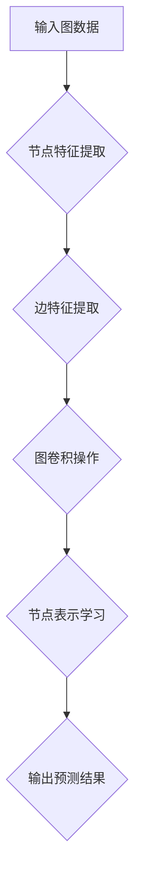

> 图神经网络(GNN)、图数据、节点特征、边特征、图卷积、深度学习、机器学习、推荐系统、社交网络分析

## 1. 背景介绍

在数据爆炸的时代，传统机器学习算法难以有效处理复杂、非结构化的图数据。图数据，以节点和边表示关系，广泛存在于社交网络、生物网络、知识图谱等领域。如何有效挖掘图数据中的隐藏信息，成为一个重要的研究方向。

图神经网络(Graph Neural Network, GNN)应运而生，它将深度学习的强大能力与图结构的特性相结合，能够有效学习图数据中的节点特征和关系，并进行预测和推理。GNN的出现，为图数据分析开辟了新的篇章，在推荐系统、社交网络分析、药物研发等领域展现出巨大的应用潜力。

## 2. 核心概念与联系

图神经网络的核心概念是将图数据转化为节点特征和边特征，并通过图卷积操作学习节点之间的关系。

**图结构:**

* **节点(Node):** 图中的基本单元，代表实体或对象。
* **边(Edge):** 连接节点的线，代表实体之间的关系。
* **图(Graph):** 由节点和边组成的集合。

**图特征:**

* **节点特征(Node Feature):** 描述节点属性的向量，例如用户年龄、性别、兴趣爱好等。
* **边特征(Edge Feature):** 描述边属性的向量，例如用户之间的关系类型、社交距离等。

**图卷积操作:**

图卷积操作是GNN的核心，它通过聚合邻居节点的信息，学习节点的表示。

**Mermaid 流程图:**



## 3. 核心算法原理 & 具体操作步骤

### 3.1  算法原理概述

图神经网络的核心算法原理是通过图卷积操作，学习节点之间的关系，并最终得到每个节点的表示。图卷积操作可以看作是将邻居节点的信息聚合起来，并传递给当前节点，从而学习节点的上下文信息。

### 3.2  算法步骤详解

1. **初始化节点特征:** 为每个节点赋予初始特征向量。
2. **图卷积层:** 对每个节点进行图卷积操作，聚合邻居节点的信息，更新节点特征。
3. **激活函数:** 对更新后的节点特征应用激活函数，引入非线性。
4. **重复步骤2和3:** 重复图卷积层和激活函数，进行多层学习，提升模型表达能力。
5. **输出层:** 将最终的节点特征输入到输出层，进行预测或分类。

### 3.3  算法优缺点

**优点:**

* **能够有效处理图数据:** GNN能够学习图结构中的复杂关系，并进行预测和推理。
* **表达能力强:** 多层图卷积操作可以学习节点的上下文信息，提升模型表达能力。
* **可扩展性强:** GNN可以处理规模较大的图数据。

**缺点:**

* **训练复杂:** GNN的训练过程相对复杂，需要考虑图结构和节点关系。
* **参数量大:** GNN模型参数量较大，需要大量的训练数据。
* **可解释性差:** GNN的决策过程相对复杂，难以解释模型的决策结果。

### 3.4  算法应用领域

GNN在以下领域具有广泛的应用前景:

* **推荐系统:** 基于用户-商品交互图，推荐个性化商品。
* **社交网络分析:** 分析用户关系网络，预测用户行为。
* **知识图谱:** 构建知识图谱，进行知识推理和问答。
* **药物研发:** 预测药物分子结构和活性，加速药物研发。

## 4. 数学模型和公式 & 详细讲解 & 举例说明

### 4.1  数学模型构建

图神经网络的数学模型可以表示为一个图卷积层堆叠结构。每个图卷积层包含以下操作:

* **邻居节点聚合:** 对每个节点，聚合其邻居节点的信息。
* **特征更新:** 根据聚合后的信息，更新节点的特征向量。

### 4.2  公式推导过程

假设图G包含N个节点，每个节点都有一个特征向量h_i。图卷积操作可以表示为:

$$
h'_i = \sigma(\sum_{j \in N(i)} \frac{e_{ij}}{ \sum_{k \in N(i)} e_{ik}} h_j)
$$

其中:

* h'_i: 更新后的节点i的特征向量。
* σ: 激活函数。
* N(i): 节点i的邻居节点集合。
* e_{ij}: 节点i和j之间的边权重。

### 4.3  案例分析与讲解

例如，在社交网络分析中，我们可以使用GNN预测用户之间的友谊关系。

* 节点: 用户
* 边: 用户之间的友谊关系
* 节点特征: 用户的年龄、性别、兴趣爱好等
* 边特征: 用户之间的社交距离、互动频率等

通过图卷积操作，GNN可以学习用户之间的关系，并预测用户之间的友谊关系。

## 5. 项目实践：代码实例和详细解释说明

### 5.1  开发环境搭建

* Python 3.6+
* PyTorch 1.0+
* 其他依赖库: numpy, pandas, matplotlib等

### 5.2  源代码详细实现

```python
import torch
import torch.nn as nn

class GCNLayer(nn.Module):
    def __init__(self, in_features, out_features):
        super(GCNLayer, self).__init__()
        self.linear = nn.Linear(in_features, out_features)

    def forward(self, x, adj):
        x = torch.matmul(adj, x)
        x = self.linear(x)
        return x

class GCN(nn.Module):
    def __init__(self, in_features, hidden_features, out_features):
        super(GCN, self).__init__()
        self.layer1 = GCNLayer(in_features, hidden_features)
        self.layer2 = GCNLayer(hidden_features, out_features)

    def forward(self, x, adj):
        x = self.layer1(x, adj)
        x = self.layer2(x, adj)
        return x

# 实例化模型
model = GCN(in_features=10, hidden_features=64, out_features=2)

# 输入数据
x = torch.randn(10, 10)
adj = torch.randn(10, 10)

# 前向传播
output = model(x, adj)

# 打印输出
print(output)
```

### 5.3  代码解读与分析

* GCNLayer类定义了一个图卷积层，包含一个线性层。
* GCN类定义了一个图神经网络模型，包含两层图卷积层。
* forward()方法定义了模型的前向传播过程。
* 代码实例演示了如何实例化模型，输入数据，进行前向传播，并打印输出结果。

### 5.4  运行结果展示

运行代码后，会输出一个形状为(10, 2)的张量，表示每个节点的最终特征向量。

## 6. 实际应用场景

### 6.1  推荐系统

GNN可以用于构建基于图数据的推荐系统，例如：

* **用户-商品交互图:** 将用户和商品作为节点，用户购买商品的记录作为边，构建用户-商品交互图。
* **商品相似度图:** 将商品作为节点，商品的相似度作为边，构建商品相似度图。

通过学习图结构中的关系，GNN可以推荐用户可能感兴趣的商品。

### 6.2  社交网络分析

GNN可以用于分析社交网络，例如：

* **用户关系网络:** 将用户作为节点，用户之间的关系作为边，构建用户关系网络。
* **信息传播模型:** 使用GNN模拟信息在社交网络中的传播过程。

通过学习用户关系网络的结构，GNN可以预测用户行为，例如用户是否会转发信息、加入某个群组等。

### 6.3  知识图谱

GNN可以用于构建和推理知识图谱，例如：

* **实体关系图:** 将实体作为节点，实体之间的关系作为边，构建实体关系图。
* **知识问答:** 使用GNN回答基于知识图谱的问题。

通过学习实体关系图的结构，GNN可以进行知识推理，例如推断实体之间的关系、预测实体的属性等。

### 6.4  未来应用展望

GNN在未来将有更广泛的应用前景，例如：

* **药物研发:** 预测药物分子结构和活性，加速药物研发。
* **材料科学:** 预测材料的性能，设计新型材料。
* **金融风险管理:** 识别金融风险，进行风险控制。

## 7. 工具和资源推荐

### 7.1  学习资源推荐

* **书籍:**
    * 《图神经网络》
    * 《深度学习》
* **在线课程:**
    * Coursera: Graph Neural Networks Specialization
    * Udacity: Deep Learning Nanodegree

### 7.2  开发工具推荐

* **PyTorch Geometric:** 图神经网络的深度学习框架。
* **DGL:** 图神经网络的深度学习框架。
* **TensorFlow Graph:** 图神经网络的深度学习框架。

### 7.3  相关论文推荐

* 《Semi-Supervised Classification with Graph Convolutional Networks》
* 《Graph Attention Networks》
* 《Inductive Representation Learning on Large Graphs》

## 8. 总结：未来发展趋势与挑战

### 8.1  研究成果总结

图神经网络近年来取得了显著的进展，在图数据分析领域展现出巨大的应用潜力。

### 8.2  未来发展趋势

* **模型效率:** 提高GNN模型的训练效率和推理效率。
* **可解释性:** 提升GNN模型的可解释性，使得模型的决策过程更加透明。
* **动态图:** 处理动态图数据，例如社交网络中的用户关系变化。
* **联邦学习:** 在隐私保护的前提下，进行图数据分析。

### 8.3  面临的挑战

* **数据稀疏性:** 图数据往往是稀疏的，这会影响GNN模型的训练效果。
* **图结构复杂性:** 现实世界中的图结构往往非常复杂，难以建模。
* **可扩展性:** 对于规模较大的图数据，GNN模型的训练和推理效率会下降。

### 8.4  研究展望

未来，GNN的研究将继续朝着更有效、更可解释、更强大的方向发展，为图数据分析提供更强大的工具。

## 9. 附录：常见问题与解答

* **什么是图神经网络(GNN)?**

GNN是一种能够学习图结构中节点关系的深度学习模型。

* **GNN有哪些应用场景?**

GNN在推荐系统、社交网络分析、知识图谱构建等领域具有广泛的应用前景。

* **如何选择合适的GNN模型?**

选择合适的GNN模型需要根据具体应用场景和数据特点进行选择。

* **如何训练GNN模型?**

GNN模型的训练过程需要使用图数据和相应的标签信息。

* **如何评估GNN模型的性能?**

GNN模型的性能可以根据具体的应用场景进行评估，例如推荐系统的准确率、社交网络分析的预测精度等。


作者：禅与计算机程序设计艺术 / Zen and the Art of Computer Programming 
<end_of_turn>