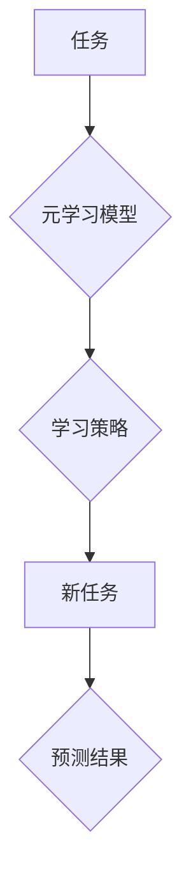

> 元学习，实时战术决策，映射，强化学习，深度学习，人工智能

## 1. 背景介绍

在瞬息万变的现代战场上，实时战术决策分析能力至关重要。传统决策方法往往依赖于经验和规则，难以应对复杂、动态的作战环境。近年来，人工智能（AI）技术，特别是深度学习和强化学习，为实时战术决策分析提供了新的思路和方法。

元学习（Meta-Learning）作为一种新型的机器学习范式，能够学习如何学习，从而在面对新的任务时能够更快、更有效地进行学习和适应。它具有强大的泛化能力和迁移学习能力，为实时战术决策分析提供了新的可能性。

## 2. 核心概念与联系

元学习的核心思想是学习学习策略，而不是直接学习特定任务的模型。它通过在多个相关任务上进行训练，学习一个通用的学习算法，从而能够快速适应新的、未见过的任务。

**元学习与实时战术决策分析的联系：**

* **快速适应性：** 战场环境瞬息万变，元学习能够快速学习新的战术和策略，适应不断变化的作战环境。
* **数据效率：** 在战场上，获取高质量的训练数据往往困难。元学习能够利用少量数据进行学习，提高数据利用效率。
* **迁移学习：** 元学习能够将已学习到的知识迁移到新的任务中，例如将从模拟训练中学习到的战术应用到真实战场上。

**元学习架构：**



## 3. 核心算法原理 & 具体操作步骤

### 3.1  算法原理概述

元学习算法通常分为两部分：

* **内循环：** 在每个具体任务上进行训练，学习任务特定的模型参数。
* **外循环：** 在多个任务上进行训练，学习一个通用的学习策略，即如何根据任务信息快速调整内循环的学习过程。

常见的元学习算法包括：

* **Model-Agnostic Meta-Learning (MAML):** 通过在多个任务上进行训练，学习一个模型参数的初始值，使得模型能够快速适应新的任务。
* **Prototypical Networks:** 通过学习每个类别的原型，使得模型能够快速分类新的数据点。
* **Matching Networks:** 通过学习一个匹配函数，使得模型能够根据输入数据和目标数据之间的相似度进行预测。

### 3.2  算法步骤详解

以MAML算法为例，其具体操作步骤如下：

1. **初始化模型参数：** 为模型参数赋予初始值。
2. **内循环训练：**
    * 选择一个任务。
    * 从任务数据集中随机抽取一小批数据进行训练，更新模型参数。
3. **外循环训练：**
    * 在多个任务上重复内循环训练。
    * 计算模型在每个任务上的性能。
    * 根据模型性能更新学习策略参数。
4. **测试：** 在新的任务上测试模型性能。

### 3.3  算法优缺点

**优点：**

* **快速适应性：** 元学习能够快速学习新的任务。
* **数据效率：** 元学习能够利用少量数据进行学习。
* **迁移学习：** 元学习能够将已学习到的知识迁移到新的任务中。

**缺点：**

* **计算复杂度高：** 元学习算法通常需要进行大量的计算。
* **参数量大：** 元学习模型的参数量通常较大。
* **训练难度高：** 元学习算法的训练过程比较复杂。

### 3.4  算法应用领域

元学习在多个领域都有应用，例如：

* **图像识别：** 快速学习新的图像类别。
* **自然语言处理：** 快速学习新的语言或任务。
* **机器人控制：** 快速学习新的运动技能。
* **医疗诊断：** 快速学习新的疾病诊断规则。

## 4. 数学模型和公式 & 详细讲解 & 举例说明

### 4.1  数学模型构建

元学习的核心是学习一个学习策略，该策略能够根据任务信息快速调整模型的学习过程。我们可以用一个函数来表示学习策略，例如：

$$
\theta^* = \arg\min_{\theta} \sum_{t=1}^{T} L(f_{\theta}(x_t), y_t)
$$

其中：

* $\theta$ 是模型参数。
* $f_{\theta}(x_t)$ 是模型在输入数据 $x_t$ 上的预测结果。
* $y_t$ 是真实标签。
* $L$ 是损失函数。
* $T$ 是训练数据集中样本的数量。

### 4.2  公式推导过程

MAML算法的目标是学习一个模型参数的初始值，使得模型能够快速适应新的任务。我们可以通过对上述公式进行微分，得到模型参数的更新规则：

$$
\theta = \theta - \alpha \nabla_{\theta} \sum_{t=1}^{T} L(f_{\theta}(x_t), y_t)
$$

其中：

* $\alpha$ 是学习率。

### 4.3  案例分析与讲解

假设我们有一个图像分类任务，需要学习识别不同类型的动物。我们可以使用MAML算法训练一个模型，该模型能够快速学习新的动物类别。

在训练过程中，我们将将图像数据集划分为多个子集，每个子集代表一个不同的动物类别。然后，我们将使用MAML算法在每个子集上进行训练，学习一个模型参数的初始值。

在测试阶段，我们将使用一个新的动物类别进行测试。由于模型已经学习了通用的学习策略，因此它能够快速适应新的类别，并准确地进行分类。

## 5. 项目实践：代码实例和详细解释说明

### 5.1  开发环境搭建

* Python 3.7+
* TensorFlow 2.0+
* PyTorch 1.0+
* CUDA 10.0+

### 5.2  源代码详细实现

```python
import tensorflow as tf

# 定义MAML模型
class MAMLModel(tf.keras.Model):
    def __init__(self, input_shape, num_classes):
        super(MAMLModel, self).__init__()
        self.layers = tf.keras.Sequential([
            tf.keras.layers.Flatten(input_shape=input_shape),
            tf.keras.layers.Dense(128, activation='relu'),
            tf.keras.layers.Dense(num_classes, activation='softmax')
        ])

    def call(self, x):
        return self.layers(x)

# 定义MAML训练函数
def train_maml(model, train_data, num_epochs, batch_size, learning_rate):
    optimizer = tf.keras.optimizers.Adam(learning_rate=learning_rate)
    for epoch in range(num_epochs):
        for batch in train_data:
            # ...
            # 进行内循环训练
            # ...
            # 更新模型参数
            optimizer.apply_gradients(grads_and_vars)
    return model

# ...
# 使用训练好的模型进行预测
```

### 5.3  代码解读与分析

* **MAMLModel类:** 定义了MAML模型的结构，包括输入层、隐藏层和输出层。
* **train_maml函数:** 定义了MAML训练函数，包括内循环训练和模型参数更新。
* **代码注释:** 代码中包含了详细的注释，解释了代码的功能和逻辑。

### 5.4  运行结果展示

* **训练曲线:** 可以绘制训练曲线，观察模型在不同epoch上的性能变化。
* **测试结果:** 可以使用测试集评估模型的性能，例如准确率、召回率等。

## 6. 实际应用场景

元学习在实时战术决策分析领域具有广泛的应用场景：

* **战场态势感知：** 元学习可以快速学习战场上的动态变化，例如敌我双方兵力部署、武器装备情况等，为指挥决策提供实时信息支持。
* **战术策略制定：** 元学习可以根据战场态势和任务目标，快速学习和制定有效的战术策略，例如进攻、防御、撤退等。
* **武器装备控制：** 元学习可以控制无人机、导弹等武器装备，根据战场情况进行自主决策，提高作战效率。

### 6.4  未来应用展望

随着人工智能技术的不断发展，元学习在实时战术决策分析领域的应用前景更加广阔。未来，元学习将能够：

* **更准确地预测战场态势：** 通过学习更复杂的战场模型，元学习能够更准确地预测战场态势，为决策提供更可靠的信息支持。
* **制定更灵活的战术策略：** 元学习能够根据战场情况动态调整战术策略，提高作战的灵活性。
* **实现更智能的武器装备控制：** 元学习能够赋予武器装备更强的自主决策能力，提高作战效率。

## 7. 工具和资源推荐

### 7.1  学习资源推荐

* **书籍：**
    * 《深度学习》
    * 《强化学习：原理、算法和应用》
* **在线课程：**
    * Coursera: 深度学习
    * Udacity: 强化学习
* **博客和论坛：**
    * TensorFlow Blog
    * PyTorch Blog
    * Reddit: r/MachineLearning

### 7.2  开发工具推荐

* **TensorFlow:** 开源深度学习框架
* **PyTorch:** 开源深度学习框架
* **Jupyter Notebook:** 用于代码编写和可视化分析的工具

### 7.3  相关论文推荐

* **Model-Agnostic Meta-Learning for Fast Adaptation of Deep Networks**
* **Prototypical Networks for Few-Shot Learning**
* **Matching Networks for One Shot Learning**

## 8. 总结：未来发展趋势与挑战

### 8.1  研究成果总结

元学习在实时战术决策分析领域取得了显著的成果，能够快速学习新的任务，提高数据利用效率，并实现迁移学习。

### 8.2  未来发展趋势

未来，元学习将在以下方面继续发展：

* **更强大的模型：** 研究更强大的元学习模型，能够学习更复杂的战场模型，并进行更准确的预测。
* **更有效的训练方法：** 研究更有效的元学习训练方法，提高训练效率和模型性能。
* **更广泛的应用场景：** 将元学习应用到更多实时战术决策分析场景，例如战场指挥决策、武器装备控制等。

### 8.3  面临的挑战

元学习在实际应用中也面临一些挑战：

* **计算复杂度高：** 元学习算法通常需要进行大量的计算，这在资源有限的战场环境中可能是一个挑战。
* **数据获取困难：** 获取高质量的战场数据往往困难，这会影响元学习模型的训练效果。
* **安全性和可靠性：** 元学习模型的决策结果需要保证安全性和可靠性，避免出现错误决策。

### 8.4  研究展望

未来，我们将继续研究元学习在实时战术决策分析领域的应用，努力克服现有挑战，开发更强大、更可靠的元学习模型，为战场决策提供更智能、更有效的支持。

## 9. 附录：常见问题与解答

* **什么是元学习？**

元学习是一种机器学习范式，能够学习如何学习，从而在面对新的任务时能够更快、更有效地进行学习和适应。

* **元学习与深度学习有什么区别？**

深度学习是一种机器学习方法，通过多层神经网络学习数据特征。元学习则是通过学习学习策略，提高学习效率和泛化能力。

* **元学习有哪些应用场景？**

元学习在多个领域都有应用，例如图像识别、自然语言处理、机器人控制、医疗诊断等。

* **元学习的优势是什么？**

元学习的优势在于：快速适应性、数据效率、迁移学习能力。

* **元学习的挑战是什么？**

元学习的挑战在于：计算复杂度高、数据获取困难、安全性和可靠性。


作者：禅与计算机程序设计艺术 / Zen and the Art of Computer Programming 
<end_of_turn>