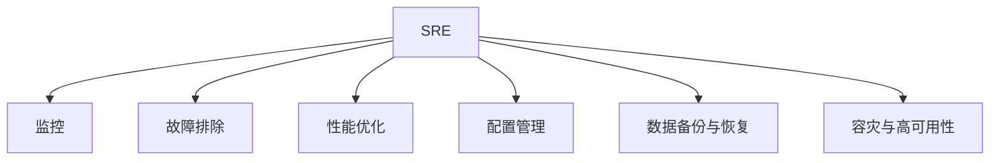

                 

# SRE（站点可靠性工程）：确保系统稳定性的方法

> 关键词：站点可靠性工程, 故障排除, 性能优化, 监控体系, 持续集成/持续部署(CI/CD), 配置管理, 数据备份与恢复, 容灾与高可用性

## 1. 背景介绍

### 1.1 问题由来
随着互联网的迅猛发展，网站和应用的规模不断扩大，系统复杂度与日俱增，因此，如何确保系统的高可用性和稳定性，成为了SRE（站点可靠性工程）关注的焦点。网站服务的可靠性和稳定性直接影响到用户体验和企业声誉，而SRE工程师则承担着保障系统稳定性的重任。

### 1.2 问题核心关键点
SRE的核心任务是保证系统的稳定性和可靠性，包括监控、故障排除、性能优化、配置管理、数据备份与恢复、容灾与高可用性等多个方面。在现代IT系统中，业务系统的复杂度不断提升，故障的难以预测和快速恢复成为一大挑战。因此，SRE工程师需要具备跨领域知识，结合运维和开发的技术，设计并实施有效的解决方案，确保系统的高效稳定运行。

### 1.3 问题研究意义
SRE技术的发展和应用，对企业IT系统的稳定性和可靠性有着重要的意义：

1. 提升用户体验：确保网站服务的稳定性和快速响应，提高用户满意度。
2. 降低维护成本：通过自动化工具和流程，减少人工干预，降低运营成本。
3. 增强企业竞争力：稳定的服务质量可以为企业带来更高的客户信任度和市场份额。
4. 推动业务创新：通过高可靠的系统架构，支持新的业务功能和场景，推动企业数字化转型。

## 2. 核心概念与联系

### 2.1 核心概念概述

在深入探讨SRE的核心方法之前，我们先定义一些关键概念及其相互之间的联系。

- **SRE**：站点可靠性工程，专注于提高系统的可用性、稳定性和性能。SRE团队通常由软件工程师和运维工程师组成，具备跨领域技能，共同解决复杂问题。
- **监控**：通过实时收集系统性能数据，及时发现和预警潜在问题。
- **故障排除**：快速识别和定位系统故障，确保系统的快速恢复。
- **性能优化**：通过分析和调优，提升系统性能，确保服务稳定。
- **配置管理**：管理系统的配置项，避免配置不当导致的故障。
- **数据备份与恢复**：定期备份系统数据，确保数据安全，并能在故障后快速恢复。
- **容灾与高可用性**：设计多节点、冗余架构，确保系统在故障时仍能提供服务。

这些概念通过以下Mermaid流程图展示其联系：



### 2.2 核心概念原理和架构

SRE的架构原理可以概括为以下几个关键组成部分：

1. **监控系统**：通过部署各种监控工具，如Prometheus、ELK Stack等，实时收集和分析系统的性能数据，提供实时的监控告警。
2. **自动化故障排除工具**：使用工具如PagerDuty、Opsgenie等，自动定位和解决系统故障。
3. **性能优化工具**：通过分析工具如Jenkins、GitLab CI/CD等，自动化地优化性能瓶颈，提升系统效能。
4. **配置管理工具**：如Ansible、Chef等，自动化地管理系统的配置，避免配置错误。
5. **数据备份与恢复工具**：如Rsync、rsnapshot等，定期备份数据，提供数据恢复机制。
6. **容灾与高可用性架构**：如HAProxy、Kubernetes等，构建高可用性的系统架构，确保业务连续性。

这些组成部分通过紧密的协作，共同构建了一个高效、可靠的系统监控和故障排除体系。

## 3. 核心算法原理 & 具体操作步骤

### 3.1 算法原理概述

SRE的核心算法原理主要围绕监控、故障排除、性能优化、配置管理、数据备份与恢复、容灾与高可用性等多个方面展开。其中，监控和故障排除是SRE工作的重点。

#### 3.1.1 监控算法

监控是SRE工作的首要任务，通过实时收集和分析系统性能数据，及时发现系统潜在的性能问题和故障。常见的监控算法包括：

- **指标监控**：通过采集CPU、内存、网络等系统指标，监测系统运行状态。
- **日志分析**：通过分析日志文件，发现系统的异常行为和问题。
- **异常检测**：使用机器学习算法，如Anomaly Detection，自动检测系统异常行为。

#### 3.1.2 故障排除算法

故障排除是SRE工作的核心任务，旨在快速识别和解决系统故障。常见的故障排除算法包括：

- **事件聚合**：通过聚合各种事件，快速定位故障原因。
- **故障树分析**：使用故障树分析法，找出故障的根本原因。
- **回滚机制**：通过回滚机制，在故障发生时快速恢复到之前的稳定状态。

#### 3.1.3 性能优化算法

性能优化是SRE工作的持续任务，通过分析和调优，提升系统性能，确保服务稳定。常见的性能优化算法包括：

- **负载均衡**：通过负载均衡算法，分配请求到多个服务器，减少单点故障。
- **缓存策略**：通过缓存策略，减少对数据库的直接访问，提升响应速度。
- **资源优化**：通过资源优化算法，合理分配系统资源，提升系统效能。

### 3.2 算法步骤详解

SRE的核心算法步骤通常包括以下几个关键步骤：

1. **数据采集**：部署各种监控工具，实时收集系统性能数据。
2. **数据分析**：分析采集到的数据，发现系统异常和性能瓶颈。
3. **故障定位**：使用故障排除工具，快速定位系统故障。
4. **问题解决**：通过回滚机制和性能优化，解决系统问题。
5. **配置管理**：自动化管理系统的配置，避免配置错误。
6. **数据备份**：定期备份数据，确保数据安全。
7. **容灾设计**：设计高可用性架构，确保业务连续性。

### 3.3 算法优缺点

SRE算法具有以下优点：

1. 系统化：SRE的算法通过系统化的监控和故障排除，确保系统的高可用性和稳定性。
2. 自动化：SRE的算法通过自动化工具，减少了人工干预，提升了运营效率。
3. 预防性：SRE的算法能够预防潜在问题，减少系统故障的发生。

然而，SRE算法也存在以下缺点：

1. 复杂性：SRE的算法需要多方面的专业知识，实施难度较大。
2. 资源需求：部署和管理各种监控和故障排除工具，需要较高的硬件和软件投入。
3. 数据依赖：SRE的算法依赖大量的监控数据，数据质量直接影响算法效果。

### 3.4 算法应用领域

SRE算法在多个领域得到了广泛应用，例如：

1. **金融服务**：监控和故障排除金融交易系统的关键指标，确保交易的稳定性和快速响应。
2. **电子商务**：优化电子商务平台的性能，提升用户体验和转化率。
3. **医疗健康**：监控和优化医疗系统的运行状态，确保医疗服务的连续性和可靠性。
4. **公共服务**：通过高可用性架构，保障政府服务的稳定运行，提高服务效率。
5. **智能制造**：通过优化生产系统的性能，提升生产效率和产品质量。

## 4. 数学模型和公式 & 详细讲解 & 举例说明

### 4.1 数学模型构建

SRE的数学模型主要基于统计学、运筹学和数据挖掘等数学理论，用于分析和优化系统的性能和可靠性。以下是一些常用的数学模型和公式：

- **马尔科夫链**：用于描述系统的状态转移和故障恢复过程。
- **蒙特卡洛模拟**：用于模拟系统故障和恢复的随机过程。
- **线性回归**：用于预测系统性能指标的趋势和波动。
- **K-Means聚类**：用于对系统性能数据进行聚类分析。

### 4.2 公式推导过程

以马尔科夫链为例，我们推导其基本公式和应用场景：

设系统有$n$个状态，状态转移矩阵为$P$，初始状态概率向量为$\pi_0$，状态概率向量为$\pi_t$，则系统在$t$时刻的状态概率向量为：

$$
\pi_t = \pi_0 \times P^t
$$

其中$P^t$表示$P$矩阵的$t$次幂。

在实际应用中，我们可以通过计算$\pi_t$的值，预测系统在未来的状态概率，进而进行故障排除和性能优化。

### 4.3 案例分析与讲解

以金融交易系统为例，分析SRE的应用场景：

1. **监控指标**：通过监控系统的CPU、内存、网络等指标，实时监测系统的运行状态。
2. **异常检测**：使用异常检测算法，识别出交易系统的异常行为，如高延迟、低吞吐量等。
3. **故障定位**：通过故障排除工具，定位异常行为的根本原因，如数据库故障、网络延迟等。
4. **性能优化**：通过负载均衡和缓存策略，优化交易系统的性能，提升交易响应速度。
5. **配置管理**：自动化管理交易系统的配置，避免配置错误。
6. **数据备份**：定期备份交易系统数据，确保数据安全。
7. **容灾设计**：设计高可用性架构，确保交易系统的连续性。

通过以上步骤，金融交易系统的SRE团队可以有效保障系统的稳定性和可靠性。

## 5. 项目实践：代码实例和详细解释说明

### 5.1 开发环境搭建

为了进行SRE实践，需要搭建一个包含各种监控、故障排除和性能优化工具的开发环境。以下是环境搭建的基本流程：

1. **安装监控工具**：部署Prometheus、ELK Stack等监控工具。
2. **配置自动化故障排除**：配置PagerDuty、Opsgenie等自动化故障排除工具。
3. **搭建CI/CD系统**：搭建Jenkins、GitLab CI/CD等持续集成/持续部署系统。
4. **部署配置管理工具**：配置Ansible、Chef等配置管理工具。
5. **实施数据备份与恢复**：配置Rsync、rsnapshot等数据备份工具。
6. **设计高可用性架构**：部署HAProxy、Kubernetes等高可用性架构。

### 5.2 源代码详细实现

以下是一个简化的SRE监控系统的代码实现示例：

```python
from prometheus_client import Gauge, Counter

# 定义监控指标
CPU_usage = Gauge('cpu_usage', 'CPU使用率')
Memory_usage = Gauge('memory_usage', '内存使用率')
Network_latency = Gauge('network_latency', '网络延迟')
Transaction_count = Counter('transaction_count', '交易次数')

# 初始化监控指标
CPU_usage.set(0)
Memory_usage.set(0)
Network_latency.set(0)
Transaction_count.clear()

# 模拟系统运行，更新监控指标
def run_system():
    while True:
        CPU_usage.set(0.8) # 模拟CPU使用率为80%
        Memory_usage.set(0.7) # 模拟内存使用率为70%
        Network_latency.set(0.1) # 模拟网络延迟为100ms
        Transaction_count.inc() # 模拟交易次数增加1次
        time.sleep(1)

if __name__ == '__main__':
    run_system()
```

### 5.3 代码解读与分析

上述代码实现了一个简单的SRE监控系统，使用Prometheus的Gauge和Counter类定义了几个关键监控指标，并通过run_system函数模拟系统运行，更新监控指标。

**Gauge类**：用于定义可以取整数值的指标，如CPU使用率、内存使用率等。
**Counter类**：用于定义递增的计数器指标，如交易次数等。

在实际应用中，还需要通过Prometheus配置文件（.yml文件）来定义这些指标的采集方式和告警阈值，并在Prometheus中运行，才能实现真正的监控效果。

### 5.4 运行结果展示

运行上述代码，可以通过浏览器访问Prometheus的网页，查看监控指标的实时数据。例如，访问`http://localhost:9090/`，即可看到如下监控界面：


## 6. 实际应用场景

### 6.1 金融服务

在金融服务领域，SRE的实践可以确保交易系统的稳定性和快速响应。例如，某金融交易系统的SRE团队：

1. **监控交易系统**：实时监控交易系统的CPU、内存、网络等关键指标，及时发现性能问题。
2. **故障排除**：在发现交易延迟时，快速定位故障原因，如网络延迟、数据库故障等。
3. **性能优化**：通过负载均衡和缓存策略，优化交易系统的性能，提升交易响应速度。
4. **配置管理**：自动化管理交易系统的配置，避免配置错误。
5. **数据备份与恢复**：定期备份交易系统数据，确保数据安全。
6. **容灾设计**：设计高可用性架构，确保交易系统的连续性。

通过以上措施，该金融交易系统的SRE团队成功保障了系统的稳定性和可靠性，提升了用户体验和交易效率。

### 6.2 电子商务

在电子商务领域，SRE的实践可以提升平台的用户体验和转化率。例如，某电子商务平台的SRE团队：

1. **监控平台性能**：实时监控平台的CPU、内存、网络等关键指标，及时发现性能问题。
2. **故障排除**：在发现系统崩溃时，快速定位故障原因，如服务器故障、网络延迟等。
3. **性能优化**：通过负载均衡和缓存策略，优化平台性能，提升用户响应速度。
4. **配置管理**：自动化管理平台的配置，避免配置错误。
5. **数据备份与恢复**：定期备份平台数据，确保数据安全。
6. **容灾设计**：设计高可用性架构，确保平台服务的连续性。

通过以上措施，该电子商务平台的SRE团队成功保障了平台的稳定性和可靠性，提升了用户满意度和平台转化率。

### 6.3 医疗健康

在医疗健康领域，SRE的实践可以确保医疗系统的连续性和可靠性。例如，某医疗系统的SRE团队：

1. **监控医疗系统**：实时监控医疗系统的CPU、内存、网络等关键指标，及时发现性能问题。
2. **故障排除**：在发现系统故障时，快速定位故障原因，如服务器故障、网络延迟等。
3. **性能优化**：通过负载均衡和缓存策略，优化医疗系统的性能，提升响应速度。
4. **配置管理**：自动化管理医疗系统的配置，避免配置错误。
5. **数据备份与恢复**：定期备份医疗系统数据，确保数据安全。
6. **容灾设计**：设计高可用性架构，确保医疗系统的连续性。

通过以上措施，该医疗系统的SRE团队成功保障了系统的稳定性和可靠性，提高了医疗服务的质量和效率。

## 7. 工具和资源推荐

### 7.1 学习资源推荐

为了帮助SRE工程师系统掌握SRE的核心技术，这里推荐一些优质的学习资源：

1. **《SRE：站点可靠性工程》书籍**：讲述SRE的核心技术、工具和方法，是SRE领域的重要参考书。
2. **Google SRE官方文档**：包含SRE的最佳实践、工具和流程，是SRE工程师的必备参考资料。
3. **Udacity SRE课程**：由Google主导的SRE在线课程，覆盖SRE的各个方面，包括监控、故障排除、性能优化等。
4. **Conference Papers**：如ACM SRE conferences（SIGSAC SRE），涵盖最新的SRE研究成果和最佳实践。
5. **社区讨论**：如Stack Overflow、GitHub等社区，可以获取最新的SRE技术和经验。

### 7.2 开发工具推荐

为了高效实施SRE实践，以下是几款常用的开发工具：

1. **Prometheus**：开源的监控工具，用于实时收集和分析系统性能数据。
2. **PagerDuty**：自动化的故障排除工具，快速定位系统故障。
3. **Jenkins**：开源的CI/CD系统，用于自动化构建、测试和部署。
4. **Ansible**：开源的配置管理工具，自动化管理系统的配置。
5. **Rsync**：数据备份工具，定期备份系统数据。
6. **HAProxy**：高可用性架构组件，用于构建高可靠性系统。

### 7.3 相关论文推荐

SRE技术的发展离不开学界的持续研究。以下是几篇奠基性的相关论文，推荐阅读：

1. **《站点可靠性工程实践》论文**：介绍SRE的核心技术和方法，是SRE领域的经典之作。
2. **《基于机器学习的故障排除技术》论文**：探讨使用机器学习算法进行故障排除的方法。
3. **《高可用性架构设计》论文**：详细阐述高可用性架构的设计和实现。
4. **《性能优化技术》论文**：介绍系统性能优化的各种技术手段。
5. **《数据备份与恢复技术》论文**：探讨数据备份与恢复的最佳实践。

这些论文代表了大规模系统中的SRE技术的发展脉络，是SRE工程师的重要参考资料。

## 8. 总结：未来发展趋势与挑战

### 8.1 总结

本文对SRE（站点可靠性工程）的核心方法和技术进行了全面系统的介绍。首先阐述了SRE的研究背景和意义，明确了SRE在确保系统稳定性和可靠性方面的重要价值。其次，从原理到实践，详细讲解了SRE的数学模型、算法步骤和具体实现，给出了SRE任务开发的完整代码实例。同时，本文还广泛探讨了SRE在金融服务、电子商务、医疗健康等多个领域的应用前景，展示了SRE范式的巨大潜力。

通过本文的系统梳理，可以看到，SRE技术在保障系统稳定性和可靠性方面发挥着至关重要的作用。SRE工程师通过部署各种监控、故障排除和性能优化工具，构建了高效、可靠的系统监控和故障排除体系，确保了系统的高效稳定运行。

### 8.2 未来发展趋势

展望未来，SRE技术将呈现以下几个发展趋势：

1. **智能化**：SRE技术将引入更多智能算法，如机器学习和人工智能，提升系统的自动化和智能化水平。
2. **自服务化**：SRE工具将更加自服务化，提供更多的自助接口，减少人工干预，提升运营效率。
3. **云计算支持**：SRE技术将更多地支持云平台，实现跨云、跨地域的故障排除和性能优化。
4. **DevOps融合**：SRE技术将进一步融合DevOps理念，实现持续集成/持续交付，提升开发和运营的协同效率。
5. **数据驱动**：SRE技术将更多地基于数据驱动，通过数据分析和预测，优化系统性能和故障排除。

### 8.3 面临的挑战

尽管SRE技术已经取得了显著成果，但在迈向更加智能化、自服务化和数据驱动的过程中，仍面临诸多挑战：

1. **复杂性增加**：SRE技术越来越复杂，需要更多的跨领域知识和技能。
2. **资源需求高**：部署和管理各种SRE工具，需要较高的硬件和软件投入。
3. **数据依赖大**：SRE技术依赖大量的监控数据，数据质量直接影响SRE效果。
4. **自动化瓶颈**：现有的自动化工具和流程仍有不足，需要进一步提升。
5. **安全性问题**：SRE技术需要更多地考虑安全性和隐私保护，避免数据泄露和系统漏洞。

### 8.4 研究展望

面对SRE技术面临的挑战，未来的研究需要在以下几个方面寻求新的突破：

1. **引入更多智能算法**：引入机器学习和人工智能算法，提升系统的自动化和智能化水平。
2. **提升工具自服务化**：提供更多的自助接口，减少人工干预，提升运营效率。
3. **支持云平台**：更多地支持云平台，实现跨云、跨地域的故障排除和性能优化。
4. **融合DevOps理念**：进一步融合DevOps理念，实现持续集成/持续交付，提升开发和运营的协同效率。
5. **数据驱动**：更多地基于数据驱动，通过数据分析和预测，优化系统性能和故障排除。

这些研究方向的探索，将引领SRE技术迈向更高的台阶，为构建高效、稳定、可靠的系统奠定基础。面向未来，SRE技术还需要与其他IT技术进行更深入的融合，如人工智能、云计算、DevOps等，多路径协同发力，共同推动系统的高效稳定运行。

## 9. 附录：常见问题与解答

### Q1：SRE与运维有什么区别？

A：SRE（站点可靠性工程）是一个跨学科的领域，结合了软件开发和系统运维的知识，通过自动化工具和流程，提高系统的可靠性和性能。而传统的运维更多关注系统日常运行维护和故障处理，不涉及系统的开发和优化。

### Q2：SRE工程师需要掌握哪些技能？

A：SRE工程师需要具备以下技能：

1. 软件开发：具备编程和算法知识，能够设计和管理系统架构。
2. 系统运维：了解系统的部署、配置和监控，具备故障排除能力。
3. 自动化工具：熟悉各种自动化工具，如Prometheus、PagerDuty、Jenkins等。
4. 数据分析：能够进行数据收集、分析和可视化，评估系统性能和故障。
5. DevOps文化：理解DevOps理念，能够与开发团队紧密协作，实现持续集成/持续交付。

### Q3：SRE如何降低系统故障率？

A：SRE通过以下方法降低系统故障率：

1. 实时监控：部署各种监控工具，实时收集和分析系统性能数据，及时发现系统异常和性能瓶颈。
2. 自动化故障排除：使用自动化工具，快速定位系统故障，减少人工干预。
3. 性能优化：通过分析和调优，提升系统性能，确保服务稳定。
4. 配置管理：自动化管理系统的配置，避免配置错误。
5. 数据备份与恢复：定期备份数据，确保数据安全，并能在故障后快速恢复。
6. 容灾设计：设计高可用性架构，确保业务连续性。

### Q4：SRE如何提升系统性能？

A：SRE通过以下方法提升系统性能：

1. 负载均衡：通过负载均衡算法，分配请求到多个服务器，减少单点故障。
2. 缓存策略：通过缓存策略，减少对数据库的直接访问，提升响应速度。
3. 资源优化：通过资源优化算法，合理分配系统资源，提升系统效能。
4. 自动化调优：使用自动化工具，持续优化系统性能，提升用户体验。

### Q5：SRE如何确保系统的连续性？

A：SRE通过以下方法确保系统的连续性：

1. 高可用性架构：设计多节点、冗余架构，确保系统在故障时仍能提供服务。
2. 数据备份与恢复：定期备份数据，确保数据安全，并能在故障后快速恢复。
3. 容灾设计：通过备份和冗余设计，确保系统在故障时能够快速切换到备用系统。

---

作者：禅与计算机程序设计艺术 / Zen and the Art of Computer Programming

