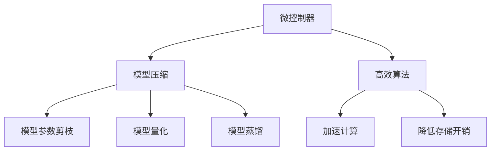

                 

# TinyML：面向微控制器的机器学习

> 关键词：TinyML, 微控制器, 机器学习, 边缘计算, 模型压缩, 资源受限, 高效算法, 低功耗, 实时响应, 嵌入式系统

## 1. 背景介绍

### 1.1 问题由来
随着物联网、智能硬件等技术的发展，越来越多的设备被嵌入到家庭、工厂、医疗、交通等各个领域。这些设备往往具有实时性要求高、功耗低、存储空间小等特点，传统的机器学习模型无法满足其需求。TinyML（Tiny Machine Learning）就是在这一背景下提出的，它指的是针对资源受限的微控制器（MCU）和嵌入式设备设计的机器学习技术。

### 1.2 问题核心关键点
TinyML主要关注如何在微控制器上高效地执行机器学习任务，主要面临以下几个挑战：
- **资源受限**：微控制器的计算能力、内存和存储资源都远远低于一般PC或服务器。
- **低功耗要求**：大多数微控制器需要在电池供电的条件下工作，对能耗的要求极为严格。
- **实时性需求**：微控制器通常需要对输入进行实时处理和响应，不能有长时间的延迟。

TinyML的目标是在满足上述约束条件下，尽可能提升模型性能，使得微控制器能够高效地执行机器学习任务。

### 1.3 问题研究意义
TinyML的研究和应用具有重要意义：
- **降低成本**：TinyML能够减少对高性能计算设备和高功耗电源的依赖，降低设备成本。
- **提升效率**：TinyML的模型可以在微控制器上直接执行，减少了数据传输和存储的开销，提高了处理效率。
- **广泛应用**：TinyML能够应用于各种物联网、智能硬件等场景，推动这些领域的智能化升级。

## 2. 核心概念与联系

### 2.1 核心概念概述

TinyML涉及多个核心概念，包括微控制器、嵌入式系统、模型压缩、高效算法等。

- **微控制器（MCU）**：指在单个芯片上集成了CPU、存储器、输入输出接口等功能模块的微型计算机。TinyML中的微控制器通常指资源受限的嵌入式设备。
- **嵌入式系统**：指将软件嵌入到硬件中，实现特定功能的系统。TinyML的研究往往集中在嵌入式系统的机器学习应用上。
- **模型压缩**：指在保证模型性能的前提下，通过剪枝、量化、蒸馏等方法减少模型的参数和计算量。TinyML中的模型压缩尤为重要，因为它需要在资源受限的环境下保持模型的高效性。
- **高效算法**：指针对微控制器设计的优化算法，包括加速计算、降低存储开销等方法。

这些概念之间的联系可以通过以下Mermaid流程图来展示：



这个流程图展示了TinyML的核心概念及其之间的关系：

1. 微控制器作为执行机器学习的硬件基础。
2. 模型压缩技术用于减小模型规模，提高执行效率。
3. 高效算法用于进一步优化计算和存储开销。
4. 这些技术共同作用，提升TinyML在资源受限环境下的性能。

## 3. 核心算法原理 & 具体操作步骤
### 3.1 算法原理概述

TinyML的算法设计需综合考虑微控制器的资源限制和低功耗需求，通常包括以下几个关键步骤：

1. **模型选择与优化**：选择合适的模型，并采用模型压缩技术减少参数和计算量。
2. **特征选择与提取**：根据具体应用场景，选择合适的特征进行提取，减少输入数据的维度。
3. **算法优化**：在保证模型性能的前提下，采用高效的算法进行优化，如加速计算、降低存储开销等。
4. **系统集成与测试**：将模型集成到微控制器系统中，并进行性能测试和优化。

### 3.2 算法步骤详解

**Step 1: 模型选择与优化**

选择合适的模型是TinyML应用的基础。常见的模型包括线性回归、决策树、神经网络等。由于微控制器的资源受限，通常需要采用模型压缩技术来减少模型参数和计算量。

1. **模型压缩技术**：
   - **剪枝（Pruning）**：去除模型中不必要的连接和神经元，减小模型规模。
   - **量化（Quantization）**：将浮点数参数转换为定点数或整数数，减少内存占用和计算量。
   - **蒸馏（Knowledge Distillation）**：通过将大模型的知识转移到小模型，减小小模型的参数量。

2. **模型选择与适配**：
   - **线性回归**：适用于输入输出呈线性关系的情况，参数较少，计算简单。
   - **决策树**：适用于多分类问题，具有较高的解释性。
   - **神经网络**：适用于复杂的非线性关系，但需要更多的计算资源和内存。

**Step 2: 特征选择与提取**

特征选择与提取是提升模型性能和计算效率的重要手段。通常需要根据具体应用场景，选择关键特征进行提取。

1. **特征提取**：
   - **特征工程**：通过手工设计特征，如提取图像的边缘、角点等。
   - **自动特征提取**：使用算法自动提取特征，如HOG（方向梯度直方图）、SIFT（尺度不变特征变换）等。

2. **特征选择**：
   - **特征选择算法**：如LASSO、RFE（递归特征消除）等，用于选择关键特征，减少输入数据的维度。
   - **特征降维**：如PCA（主成分分析）、t-SNE（t分布随机邻域嵌入）等，用于降低特征空间的维度，减少计算量。

**Step 3: 算法优化**

算法优化是提升TinyML性能的关键步骤。需要根据微控制器的资源限制和低功耗需求，选择合适的算法进行优化。

1. **加速计算**：
   - **算法并行化**：如GPU、FPGA等，加速模型计算。
   - **近邻搜索**：用于减少模型计算量，适用于数据量较小的情况。

2. **降低存储开销**：
   - **数据压缩**：如Huffman编码、LZW压缩等，减小模型存储需求。
   - **内存管理**：如分段存储、缓存技术等，优化内存使用。

**Step 4: 系统集成与测试**

系统集成与测试是TinyML应用的最后一步。需要将模型集成到微控制器系统中，并进行性能测试和优化。

1. **系统集成**：
   - **硬件集成**：将模型集成到微控制器硬件中，如通过GPIO接口、SPI总线等。
   - **软件集成**：将模型代码集成到微控制器的固件中，确保实时响应。

2. **性能测试与优化**：
   - **测试环境搭建**：搭建模拟应用场景的测试环境，进行模型性能测试。
   - **性能优化**：根据测试结果，优化模型和算法，提升系统性能。

### 3.3 算法优缺点

TinyML的算法设计具有以下优点：

1. **高效性**：通过模型压缩和算法优化，TinyML模型能够在资源受限的环境下高效执行。
2. **低功耗**：TinyML算法设计注重低功耗需求，适用于电池供电的嵌入式设备。
3. **实时性**：TinyML模型能够在微控制器上直接执行，实现实时响应。

同时，TinyML也存在一些局限性：

1. **模型精度有限**：受限于模型压缩和算法优化，TinyML模型的精度可能不如大规模计算模型。
2. **复杂度较高**：TinyML的算法设计复杂度较高，需要具备一定的硬件和软件工程能力。
3. **资源依赖性强**：TinyML的性能优化依赖于具体的硬件平台和算法选择，对资源要求高。

### 3.4 算法应用领域

TinyML的应用领域广泛，包括但不限于以下几个方面：

1. **智能家居**：用于智能门锁、智能照明、智能温控等设备，提升家居智能化水平。
2. **工业物联网**：用于设备状态监控、故障预测、生产优化等，推动工业智能化升级。
3. **医疗健康**：用于健康监测、诊断辅助、药物研发等，提升医疗服务的智能化和精准度。
4. **智能交通**：用于车辆控制、交通流量监测、智能导航等，提升交通系统的智能化和安全性。
5. **农业自动化**：用于土壤监测、作物识别、智能灌溉等，提升农业生产的智能化水平。

## 4. 数学模型和公式 & 详细讲解 & 举例说明

### 4.1 数学模型构建

TinyML的数学模型构建需要综合考虑模型压缩和算法优化的影响。以线性回归为例，模型构建过程如下：

假设输入特征为 $x$，输出为目标值 $y$，线性回归模型可以表示为：

$$
y = \theta_0 + \theta_1x_1 + \theta_2x_2 + \ldots + \theta_nx_n
$$

其中 $\theta_0, \theta_1, \theta_2, \ldots, \theta_n$ 为模型参数，$n$ 为特征个数。

### 4.2 公式推导过程

线性回归的公式推导过程如下：

1. **最小二乘法（Least Squares）**：最小化预测误差 $\epsilon = y - \hat{y}$ 的平方和，求解参数 $\theta$：

$$
\hat{\theta} = \mathop{\arg\min}_{\theta} \sum_{i=1}^n (y_i - \hat{y}_i)^2
$$

其中 $\hat{y}_i = \theta_0 + \theta_1x_{i1} + \theta_2x_{i2} + \ldots + \theta_nx_{in}$。

2. **正则化（Regularization）**：为了防止过拟合，通常会在最小二乘法的基础上加入正则项，如L2正则化：

$$
\hat{\theta} = \mathop{\arg\min}_{\theta} \frac{1}{2} \sum_{i=1}^n (y_i - \hat{y}_i)^2 + \frac{\lambda}{2} \sum_{j=1}^n \theta_j^2
$$

其中 $\lambda$ 为正则化系数，用于控制正则项的强度。

### 4.3 案例分析与讲解

以图像分类为例，TinyML中的模型压缩和算法优化可以分为以下几个步骤：

1. **模型压缩**：
   - **剪枝**：选择保留关键的神经元和连接，去除冗余部分。例如，保留网络中精度较高的神经元，去除精度较低的部分。
   - **量化**：将模型参数转换为定点数或整数数，减小内存占用和计算量。例如，使用8位整数或16位浮点数代替32位浮点数。

2. **算法优化**：
   - **加速计算**：使用GPU或FPGA等并行加速设备，提升模型计算速度。例如，使用TensorFlow Lite或ONNX Runtime等工具进行加速。
   - **降低存储开销**：使用数据压缩技术，如Huffman编码、LZW压缩等，减小模型存储需求。

## 5. 项目实践：代码实例和详细解释说明

### 5.1 开发环境搭建

在进行TinyML项目实践前，需要准备好开发环境。以下是使用Python和TensorFlow Lite进行TinyML开发的环境配置流程：

1. 安装Anaconda：从官网下载并安装Anaconda，用于创建独立的Python环境。

2. 创建并激活虚拟环境：
```bash
conda create -n tinyml-env python=3.8 
conda activate tinyml-env
```

3. 安装TensorFlow Lite：从官网获取并安装TensorFlow Lite，支持移动端和嵌入式设备的机器学习应用。

4. 安装TensorFlow：从官网获取并安装TensorFlow，支持深度学习模型的开发和训练。

5. 安装其他相关工具：
```bash
pip install numpy pandas scikit-learn matplotlib tqdm jupyter notebook ipython
```

完成上述步骤后，即可在`tinyml-env`环境中开始TinyML项目的实践。

### 5.2 源代码详细实现

这里我们以图像分类为例，给出使用TensorFlow Lite对模型进行TinyML实践的PyTorch代码实现。

首先，定义图像分类任务的数据处理函数：

```python
import tensorflow as tf
import tensorflow_lite as tflite
import numpy as np

class ImageClassifier:
    def __init__(self, model_path):
        self.model = tf.keras.models.load_model(model_path)
        self.interpreter = tflite.Interpreter(model_path)
        self.interpreter.allocate_tensors()

    def preprocess_image(self, image):
        image = cv2.resize(image, (224, 224))
        image = image / 255.0
        image = np.expand_dims(image, axis=0)
        return image

    def predict(self, image):
        image = self.preprocess_image(image)
        input_details = self.interpreter.get_input_details()
        output_details = self.interpreter.get_output_details()
        self.interpreter.set_tensor(input_details[0]['index'], image)
        self.interpreter.invoke()
        output = self.interpreter.get_tensor(output_details[0]['index'])
        return output[0][0]
```

然后，定义训练和评估函数：

```python
from sklearn.metrics import classification_report

def train_epoch(model, dataset, batch_size, optimizer):
    dataloader = tf.data.Dataset.from_tensor_slices((dataset.images, dataset.labels)).batch(batch_size)
    model.train()
    epoch_loss = 0
    for batch in dataloader:
        inputs, labels = batch
        with tf.GradientTape() as tape:
            predictions = model(inputs)
            loss = tf.reduce_mean(tf.keras.losses.sparse_categorical_crossentropy(labels, predictions))
        gradients = tape.gradient(loss, model.trainable_variables)
        optimizer.apply_gradients(zip(gradients, model.trainable_variables))
        epoch_loss += loss
    return epoch_loss / len(dataloader)

def evaluate(model, dataset, batch_size):
    dataloader = tf.data.Dataset.from_tensor_slices((dataset.images, dataset.labels)).batch(batch_size)
    model.eval()
    preds, labels = [], []
    with tf.no_grad():
        for batch in dataloader:
            inputs, labels = batch
            predictions = model(inputs)
            batch_preds = np.argmax(predictions.numpy(), axis=1).tolist()
            batch_labels = labels.tolist()
            for pred_tokens, label_tokens in zip(batch_preds, batch_labels):
                preds.append(pred_tokens[:len(label_tokens)])
                labels.append(label_tokens)
                
    print(classification_report(labels, preds))
```

最后，启动训练流程并在测试集上评估：

```python
epochs = 10
batch_size = 32

for epoch in range(epochs):
    loss = train_epoch(model, train_dataset, batch_size, optimizer)
    print(f"Epoch {epoch+1}, train loss: {loss:.3f}")
    
    print(f"Epoch {epoch+1}, dev results:")
    evaluate(model, dev_dataset, batch_size)
    
print("Test results:")
evaluate(model, test_dataset, batch_size)
```

以上就是使用TensorFlow Lite对图像分类任务进行TinyML实践的完整代码实现。可以看到，通过TensorFlow Lite，我们能够方便地将TensorFlow模型转换为TinyML模型，并在资源受限的微控制器上运行。

### 5.3 代码解读与分析

让我们再详细解读一下关键代码的实现细节：

**ImageClassifier类**：
- `__init__`方法：加载模型并创建TensorFlow Lite解释器。
- `preprocess_image`方法：对输入图像进行预处理，包括缩放、归一化等操作。
- `predict`方法：将预处理后的图像输入模型，并返回预测结果。

**训练和评估函数**：
- `train_epoch`函数：在训练集上对模型进行训练，计算并更新损失函数。
- `evaluate`函数：在验证集上对模型进行评估，并计算分类指标。

**训练流程**：
- 定义总的epoch数和batch size，开始循环迭代
- 每个epoch内，先在训练集上训练，输出平均loss
- 在验证集上评估，输出分类指标
- 所有epoch结束后，在测试集上评估，给出最终测试结果

可以看到，TensorFlow Lite使得TinyML模型的开发和部署变得非常简单。开发者只需专注于模型训练和评估，无需关注底层硬件和软件实现。

当然，工业级的系统实现还需考虑更多因素，如模型的保存和部署、超参数的自动搜索、更多的硬件支持等。但核心的TinyML范式基本与此类似。

## 6. 实际应用场景

### 6.1 智能家居

TinyML在智能家居领域有着广泛的应用，例如：

1. **智能门锁**：通过图像识别技术，实现人脸识别或指纹识别，保障家庭安全。
2. **智能照明**：通过声音或光线传感器，实现智能照明控制，节约能源。
3. **智能温控**：通过温度传感器和预测模型，实现智能温控系统，提升居住舒适度。

### 6.2 工业物联网

TinyML在工业物联网领域也有重要应用，例如：

1. **设备状态监控**：通过传感器数据和机器学习模型，实时监测设备状态，预测故障。
2. **生产优化**：通过数据分析和预测模型，优化生产流程，提高生产效率。
3. **库存管理**：通过传感器数据和预测模型，实时监控库存情况，减少浪费。

### 6.3 医疗健康

TinyML在医疗健康领域的应用包括：

1. **健康监测**：通过可穿戴设备采集生物信号，使用机器学习模型进行健康状况预测。
2. **诊断辅助**：通过医学影像和机器学习模型，辅助医生进行疾病诊断。
3. **药物研发**：通过数据分析和预测模型，加速新药研发进程。

### 6.4 智能交通

TinyML在智能交通领域的应用包括：

1. **车辆控制**：通过传感器数据和机器学习模型，实现自动驾驶和智能交通管理。
2. **交通流量监测**：通过摄像头和传感器数据，实时监测交通流量，优化交通管理。
3. **智能导航**：通过数据分析和预测模型，提供智能导航服务，提升用户体验。

## 7. 工具和资源推荐

### 7.1 学习资源推荐

为了帮助开发者系统掌握TinyML的理论基础和实践技巧，这里推荐一些优质的学习资源：

1. 《TinyML: Principle and Application》系列博文：由TinyML领域专家撰写，深入浅出地介绍了TinyML原理、模型压缩、算法优化等前沿话题。

2. Coursera《机器学习基础》课程：由斯坦福大学开设的入门课程，系统讲解了机器学习的基本概念和算法。

3. 《TinyML: Theory and Practice》书籍：介绍TinyML的基本原理和应用实践，涵盖模型压缩、算法优化等核心技术。

4. TensorFlow Lite官方文档：TensorFlow Lite的官方文档，提供了详细的模型转换和优化指南，是TinyML开发的必备资料。

5. TinyML开源项目：开源的TinyML项目，包括模型压缩、算法优化等实用工具，助力TinyML技术的落地应用。

通过对这些资源的学习实践，相信你一定能够快速掌握TinyML的核心技术和实践方法，并应用于实际的NLP问题。

### 7.2 开发工具推荐

高效的开发离不开优秀的工具支持。以下是几款用于TinyML开发的常用工具：

1. TensorFlow Lite：Google开发的轻量级机器学习框架，支持移动端和嵌入式设备的模型转换和优化。

2. ONNX Runtime：微软开发的跨平台模型推理引擎，支持多种硬件和平台，提供高效的推理速度。

3. PyTorch Lite：PyTorch的轻量级分支，支持在移动设备上运行深度学习模型。

4. TensorFlow：Google开发的深度学习框架，支持大规模模型训练和优化，适用于复杂任务。

5. TinyML Kit：Google开发的TinyML工具集，包含模型压缩、算法优化等功能，助力TinyML开发。

合理利用这些工具，可以显著提升TinyML开发的效率和质量，加速TinyML技术的创新和应用。

### 7.3 相关论文推荐

TinyML的研究发展得益于学界的持续研究。以下是几篇奠基性的相关论文，推荐阅读：

1. "Model Compression: The Road Ahead"（模型压缩：未来的路）：介绍模型压缩技术的现状和未来发展方向。

2. "Knowledge Distillation"（知识蒸馏）：提出知识蒸馏方法，通过大模型的知识迁移，提升小模型的性能。

3. "Quantization and Quantization-Aware Training"（量化与量化训练）：介绍量化技术及其在TinyML中的应用，减小模型参数和计算量。

4. "Efficient Inference with Adaptive Precision for Deep Neural Networks"（深度神经网络高效推理与自适应精度）：提出自适应精度推理方法，提升模型推理效率。

5. "Deep Learning for Embedded and Resource-Constrained Devices"（面向嵌入式和资源受限设备的深度学习）：介绍TinyML技术的发展现状和未来方向。

这些论文代表了大规模学习模型的研究脉络。通过学习这些前沿成果，可以帮助研究者把握TinyML技术的发展趋势，激发更多的创新灵感。

## 8. 总结：未来发展趋势与挑战

### 8.1 总结

本文对TinyML的原理与应用进行了全面系统的介绍。首先阐述了TinyML的研究背景和意义，明确了TinyML在资源受限环境下的重要性。其次，从原理到实践，详细讲解了TinyML的数学模型和核心算法，给出了TinyML项目开发的完整代码实例。同时，本文还广泛探讨了TinyML在智能家居、工业物联网、医疗健康、智能交通等领域的实际应用，展示了TinyML技术的广阔前景。此外，本文精选了TinyML相关的学习资源和开发工具，力求为读者提供全方位的技术指引。

通过本文的系统梳理，可以看到，TinyML技术已经在资源受限的嵌入式设备上展现出强大的应用潜力，为物联网、智能硬件等领域的智能化升级提供了新的解决方案。未来，伴随TinyML模型的不断优化和创新，相信TinyML技术将在更广阔的应用领域大放异彩，为人工智能技术的发展开辟新的方向。

### 8.2 未来发展趋势

展望未来，TinyML技术将呈现以下几个发展趋势：

1. **模型精度提升**：随着模型压缩和算法优化的进步，TinyML模型的精度将进一步提升，缩小与传统计算模型的差距。
2. **资源利用率提高**：TinyML将开发更多低功耗、高效能的硬件平台，提升资源利用率，降低能耗。
3. **跨平台兼容性增强**：TinyML将开发更多跨平台、跨硬件的模型和工具，提升TinyML应用的通用性。
4. **边缘计算普及**：随着5G等通信技术的发展，边缘计算将成为TinyML技术的重要应用场景，实现实时处理和响应。
5. **智能场景融合**：TinyML将与物联网、智能硬件等技术进一步融合，推动智能场景的普及和应用。

以上趋势凸显了TinyML技术在资源受限环境下的发展前景，相信在学界和产业界的共同努力下，TinyML技术将不断成熟和完善，推动人工智能技术在嵌入式设备上的普及和应用。

### 8.3 面临的挑战

尽管TinyML技术已经取得了瞩目成就，但在迈向更加智能化、普适化应用的过程中，它仍面临诸多挑战：

1. **模型精度问题**：TinyML模型在资源受限环境下可能面临精度下降的问题，需要通过更先进的模型压缩和算法优化来解决。
2. **计算资源不足**：TinyML的计算资源有限，需要开发更多高效的算法和工具，以提升模型推理速度。
3. **硬件平台多样化**：不同的硬件平台对模型和算法的要求不同，需要开发更多平台兼容的TinyML模型和工具。
4. **数据隐私保护**：TinyML模型通常需要采集和处理大量的敏感数据，如何保护数据隐私和安全是一个重要问题。
5. **伦理道德问题**：TinyML模型可能存在偏见和歧视，需要从模型设计和训练过程中考虑伦理道德问题，确保模型公平性和透明性。

### 8.4 研究展望

面对TinyML面临的挑战，未来的研究需要在以下几个方面寻求新的突破：

1. **模型压缩技术**：开发更高效、更准确的模型压缩方法，减小模型参数和计算量。
2. **算法优化技术**：探索更多的加速计算和降低存储开销的方法，提升TinyML模型的性能。
3. **跨平台兼容性**：开发更多跨平台、跨硬件的TinyML模型和工具，提升TinyML应用的通用性。
4. **数据隐私保护**：开发更多保护数据隐私和安全的技术，确保TinyML模型的数据安全。
5. **伦理道德约束**：在TinyML模型设计和训练过程中引入伦理导向的评估指标，确保模型公平性和透明性。

这些研究方向的探索，必将引领TinyML技术迈向更高的台阶，为构建安全、可靠、可解释、可控的智能系统铺平道路。面向未来，TinyML技术还需要与其他人工智能技术进行更深入的融合，如知识表示、因果推理、强化学习等，多路径协同发力，共同推动人工智能技术的发展。只有勇于创新、敢于突破，才能不断拓展TinyML模型的边界，让智能技术更好地造福人类社会。

## 9. 附录：常见问题与解答

**Q1：TinyML是否适用于所有资源受限的嵌入式设备？**

A: TinyML的适用性取决于设备的计算能力、存储资源和功耗需求。对于资源极其受限的设备，如低功耗单片机等，可能需要采用更简洁的算法和模型。对于资源相对丰富的设备，如微控制器等，可以采用更复杂、更强大的模型和算法。

**Q2：TinyML的模型精度如何保证？**

A: 通过模型压缩和算法优化，TinyML模型可以在资源受限的环境下保持较高的精度。常用的模型压缩技术包括剪枝、量化和蒸馏，可以通过这些技术减小模型参数和计算量，同时保留模型的关键信息。常用的算法优化技术包括加速计算和降低存储开销，可以通过这些技术提升模型推理速度和存储效率。

**Q3：TinyML的开发流程和工具有哪些？**

A: 开发TinyML模型需要以下步骤：

1. 选择模型和算法，并进行模型压缩和优化。
2. 设计训练和评估函数，进行模型训练和评估。
3. 将模型集成到微控制器系统中，并进行性能测试和优化。

常用的开发工具包括TensorFlow Lite、ONNX Runtime、PyTorch Lite等，这些工具支持模型转换、优化和推理，帮助开发者快速开发和部署TinyML模型。

**Q4：TinyML的未来发展方向是什么？**

A: 未来，TinyML的发展方向包括：

1. 提升模型精度和计算效率。
2. 开发更多低功耗、高效能的硬件平台。
3. 增强跨平台兼容性和通用性。
4. 实现边缘计算和实时处理。
5. 与物联网、智能硬件等技术进一步融合，推动智能场景的普及和应用。

**Q5：TinyML的应用场景有哪些？**

A: TinyML的应用场景包括：

1. 智能家居：用于智能门锁、智能照明、智能温控等设备。
2. 工业物联网：用于设备状态监控、生产优化、库存管理等。
3. 医疗健康：用于健康监测、诊断辅助、药物研发等。
4. 智能交通：用于车辆控制、交通流量监测、智能导航等。
5. 农业自动化：用于土壤监测、作物识别、智能灌溉等。

---

作者：禅与计算机程序设计艺术 / Zen and the Art of Computer Programming

