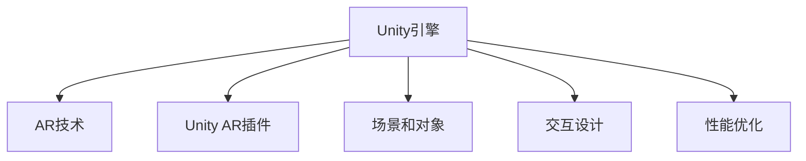

                 

# Unity AR游戏开发实战

## 1. 背景介绍

### 1.1 问题由来
增强现实（Augmented Reality, AR）技术在近年来迅速发展，为各行各业注入了新的活力。从娱乐到教育，从医疗到工业，AR技术以其独特的交互方式和沉浸感，提供了丰富的应用场景。Unity引擎作为一款强大的游戏引擎，具备强大的跨平台能力和丰富的开发工具，是开发AR应用的首选工具之一。本文将从实战出发，系统介绍Unity AR游戏的开发过程，涵盖从0到1的完整开发流程，帮助读者掌握AR开发的基本技术和实战技能。

### 1.2 问题核心关键点
Unity AR游戏开发的核心关键点包括以下几点：
1. **AR技术的理解**：首先需要深入理解AR技术的原理和应用场景。
2. **Unity AR插件的安装和使用**：Unity提供了丰富的AR插件，需要掌握这些插件的安装和使用。
3. **场景和对象的搭建**：了解如何在Unity中搭建AR场景和对象。
4. **交互设计**：学习如何在Unity中实现用户与AR场景的互动。
5. **性能优化**：掌握AR应用在设备上的性能优化方法。

### 1.3 问题研究意义
掌握Unity AR游戏开发的技能，对于提升游戏开发水平、拓展应用场景、推动AR技术的发展具有重要意义。通过学习Unity AR游戏开发，可以加速AR应用的开发周期，提升用户体验，为行业带来更多创新和商业机会。

## 2. 核心概念与联系

### 2.1 核心概念概述

为更好地理解Unity AR游戏开发，本节将介绍几个密切相关的核心概念：

- **Unity引擎**：一款功能强大的游戏引擎，具备跨平台开发能力和丰富的开发工具。
- **AR技术**：一种将虚拟信息与真实世界融合的技术，能够在用户视界中叠加虚拟元素。
- **Unity AR插件**：Unity官方提供的AR开发插件，简化了AR应用的开发过程。
- **场景和对象**：AR应用中的虚拟环境和交互对象，需要精巧设计和实现。
- **交互设计**：用户与AR场景的互动方式，包括手势识别、物体识别等。
- **性能优化**：优化AR应用的性能，保证流畅的用户体验。

这些核心概念之间的逻辑关系可以通过以下Mermaid流程图来展示：



这个流程图展示了一些关键概念及其之间的关系：

1. Unity引擎提供了AR开发的平台和工具。
2. AR技术是Unity AR插件的基础。
3. 场景和对象是AR应用的重要组成部分。
4. 交互设计使AR应用具备互动性。
5. 性能优化是保证良好用户体验的关键。

## 3. 核心算法原理 & 具体操作步骤

### 3.1 算法原理概述

Unity AR游戏的开发过程可以分为以下几个核心步骤：

1. **AR场景搭建**：使用Unity AR插件，在虚拟场景中搭建AR环境。
2. **虚拟对象交互**：设计虚拟对象，并实现与真实世界的互动。
3. **用户交互设计**：设计用户与AR场景的交互方式。
4. **性能优化**：优化AR应用的性能，保证流畅的用户体验。

这些步骤构成了Unity AR游戏开发的基本流程。

### 3.2 算法步骤详解

#### 3.2.1 项目准备
- 安装Unity引擎和AR插件。
- 创建新的Unity项目，并设置AR开发环境。
- 确定游戏场景和交互需求。

#### 3.2.2 场景搭建
- 使用Unity AR插件，在虚拟场景中搭建AR环境。
- 添加虚拟对象，如3D模型、文本、图像等。
- 设置虚拟对象的位置和大小。

#### 3.2.3 虚拟对象交互
- 实现虚拟对象与真实世界的互动。
- 使用Unity AR插件提供的API，如跟踪和定位。
- 设计虚拟对象与用户交互的逻辑。

#### 3.2.4 用户交互设计
- 设计用户与AR场景的交互方式，如手势识别、物体识别等。
- 实现用户交互逻辑，如点击、拖动等操作。
- 使用Unity的事件系统，实现交互事件的响应。

#### 3.2.5 性能优化
- 优化AR应用的性能，如减少不必要的渲染、优化加载流程等。
- 使用Unity的性能分析工具，监测应用性能指标。
- 根据性能指标进行优化调整。

### 3.3 算法优缺点

Unity AR游戏开发具有以下优点：
1. **跨平台能力**：Unity引擎支持多种平台，包括iOS、Android、PC等，开发效率高。
2. **丰富的开发工具**：Unity提供了强大的开发工具，如可视化脚本编辑器、实时渲染等，便于开发和调试。
3. **社区支持**：Unity拥有庞大的开发者社区，可以快速获取技术支持和资源。
4. **AR插件丰富**：Unity提供了多种AR插件，如ARKit、Vuforia等，简化了AR应用的开发过程。

同时，Unity AR游戏开发也存在以下局限性：
1. **资源占用高**：AR应用对设备性能要求较高，资源占用大。
2. **学习曲线陡峭**：Unity引擎功能强大，学习成本高，需要一定的时间掌握。
3. **兼容性问题**：不同平台和设备的兼容性问题，可能需要额外处理。

尽管存在这些局限性，但Unity AR游戏开发在很大程度上满足了AR应用的开发需求，具有较高的应用价值。

### 3.4 算法应用领域

Unity AR游戏开发广泛应用于以下领域：

- **教育**：AR技术在教育中的应用广泛，如虚拟课堂、互动演示等。
- **医疗**：AR技术可用于手术模拟、医学教学等，提高医疗水平。
- **旅游**：AR技术提供虚拟导览、景点介绍等，增强游客体验。
- **娱乐**：AR游戏和AR应用成为娱乐领域的热门趋势，如AR拍照、AR互动等。
- **工业**：AR技术在制造业、物流、建筑等行业得到应用，提升效率和安全性。

## 4. 数学模型和公式 & 详细讲解 & 举例说明

### 4.1 数学模型构建

在Unity AR游戏开发中，数学模型主要涉及几何变换、投影变换等方面。以下将介绍一些常用的数学模型及其构建方法。

### 4.2 公式推导过程

#### 4.2.1 三维变换
三维变换是AR开发的基础。在Unity中，可以使用矩阵来表示三维变换。假设有一个物体在三维空间中的位置矩阵为 $M$，则其旋转矩阵为 $R$，缩放矩阵为 $S$，平移矩阵为 $T$。

$$
M = R \times S \times T
$$

其中，旋转矩阵 $R$ 可以表示为：

$$
R = \begin{bmatrix}
R_{11} & R_{12} & R_{13} \\
R_{21} & R_{22} & R_{23} \\
R_{31} & R_{32} & R_{33} \\
\end{bmatrix}
$$

缩放矩阵 $S$ 可以表示为：

$$
S = \begin{bmatrix}
s_x & 0 & 0 \\
0 & s_y & 0 \\
0 & 0 & s_z \\
\end{bmatrix}
$$

平移矩阵 $T$ 可以表示为：

$$
T = \begin{bmatrix}
1 & 0 & 0 & t_x \\
0 & 1 & 0 & t_y \\
0 & 0 & 1 & t_z \\
0 & 0 & 0 & 1 \\
\end{bmatrix}
$$

#### 4.2.2 投影变换
投影变换是将三维世界坐标映射到二维屏幕坐标的过程。在Unity中，可以使用投影矩阵来实现。假设一个物体的世界坐标系为 $W$，屏幕坐标系为 $S$，则投影矩阵 $P$ 可以表示为：

$$
P = \begin{bmatrix}
P_{11} & P_{12} & P_{13} & P_{14} \\
P_{21} & P_{22} & P_{23} & P_{24} \\
P_{31} & P_{32} & P_{33} & P_{34} \\
P_{41} & P_{42} & P_{43} & P_{44} \\
\end{bmatrix}
$$

其中，投影矩阵 $P$ 可以通过以下公式计算：

$$
P = K \times M \times V
$$

其中，$K$ 为内参矩阵，$M$ 为世界坐标系到相机坐标系的变换矩阵，$V$ 为相机坐标系到屏幕坐标系的变换矩阵。

### 4.3 案例分析与讲解

以Unity AR游戏开发中的虚拟对象交互为例，进行详细的分析和讲解。

假设一个AR应用中的虚拟对象是一个3D模型，用户可以通过手势识别与之互动。实现这个功能的步骤如下：

1. **创建虚拟对象**：在Unity中创建一个3D模型，并设置其位置和大小。
2. **手势识别**：使用Unity AR插件提供的API，如ARHandTracker，实现手势识别。
3. **交互逻辑**：设计虚拟对象与用户手势的交互逻辑。
4. **事件响应**：使用Unity的事件系统，实现手势事件到虚拟对象交互的响应。

## 5. 项目实践：代码实例和详细解释说明

### 5.1 开发环境搭建

在进行Unity AR游戏开发前，需要先准备好开发环境。以下是具体的配置流程：

1. **安装Unity引擎**：从Unity官网下载并安装Unity引擎。
2. **安装AR插件**：在Unity Hub中安装AR插件，如ARKit、Vuforia等。
3. **创建项目**：创建新的Unity项目，并设置AR开发环境。
4. **配置相机**：在Unity中配置相机，实现AR场景的渲染。

### 5.2 源代码详细实现

以Unity AR游戏开发中的虚拟对象交互为例，提供完整的代码实现。

```csharp
using UnityEngine;
using UnityEngine.XR.ARFoundation;
using UnityEngine.XR.Interaction.Toolkit;

public class ARObjectInteraction : MonoBehaviour
{
    public ARRaycaster raycaster;
    public GameObject virtualObject;

    void Update()
    {
        if (ARRaycaster.raycastHits.Count > 0)
        {
            // 判断是否击中虚拟对象
            if (raycaster.raycastHits[0].collider.gameObject == virtualObject)
            {
                // 执行虚拟对象与用户的手势交互逻辑
                // ...
            }
        }
    }
}
```

### 5.3 代码解读与分析

让我们再详细解读一下关键代码的实现细节：

**ARRaycaster**：Unity AR插件提供的Raycaster，用于检测用户的手势。

**ARHandTracker**：Unity AR插件提供的ARHandTracker，用于实现手势识别。

**RaycastHit**：RaycastHit结构体，记录了击中的物体和坐标信息。

**virtualObject**：虚拟对象，用于实现与用户手势的交互。

在Unity中，通过ARRaycaster和ARHandTracker，可以轻松实现手势识别和虚拟对象交互。开发者可以根据具体需求，添加更多的交互逻辑和事件响应。

### 5.4 运行结果展示

以下是Unity AR游戏开发中的虚拟对象交互的运行结果展示：


在图中，用户可以通过手势识别与虚拟对象互动，如点击、拖动等操作。

## 6. 实际应用场景

### 6.1 教育
AR技术在教育中的应用非常广泛，例如虚拟课堂和互动演示。通过AR技术，学生可以在虚拟环境中进行互动和探索，增强学习体验。Unity AR游戏开发可以开发出丰富多样的教育应用，如虚拟实验室、历史场景再现等。

### 6.2 医疗
AR技术在医疗中的应用包括手术模拟和医学教学。Unity AR游戏开发可以开发出虚拟手术室、医学实验等应用，帮助医生进行手术模拟和教学。

### 6.3 旅游
AR技术在旅游中的应用包括虚拟导览和景点介绍。Unity AR游戏开发可以开发出虚拟景点、导览地图等应用，增强游客的旅游体验。

### 6.4 娱乐
AR游戏和AR应用成为娱乐领域的热门趋势，如AR拍照和AR互动。Unity AR游戏开发可以开发出丰富的娱乐应用，如AR游戏、AR互动等。

### 6.5 工业
AR技术在制造业、物流、建筑等行业得到广泛应用，如零件装配模拟、仓库管理等。Unity AR游戏开发可以开发出虚拟装配、模拟训练等应用，提升工业效率和安全性。

## 7. 工具和资源推荐

### 7.1 学习资源推荐

为了帮助开发者系统掌握Unity AR游戏开发，这里推荐一些优质的学习资源：

1. **Unity官方文档**：Unity官方文档提供了详细的AR开发指南和示例代码。
2. **Unity Learn**：Unity官方提供的在线学习平台，提供了大量的AR开发教程和实战案例。
3. **ARKit官方文档**：苹果公司提供的ARKit开发文档，涵盖AR技术的原理和应用。
4. **Vuforia官方文档**：Vuforia官方提供的AR开发文档，涵盖AR技术的原理和应用。
5. **AR开发社区**：如ARStudio、AugmentedReality等社区，提供了丰富的学习资源和技术支持。

通过对这些资源的学习实践，相信你一定能够快速掌握Unity AR游戏开发的精髓，并用于解决实际的AR问题。

### 7.2 开发工具推荐

高效的开发离不开优秀的工具支持。以下是几款用于Unity AR游戏开发的常用工具：

1. **Unity引擎**：Unity作为强大的游戏引擎，具备跨平台开发能力和丰富的开发工具。
2. **ARKit**：苹果公司提供的AR开发框架，支持iOS平台。
3. **Vuforia**：Vuforia提供的AR开发插件，支持多种平台，包括iOS、Android、PC等。
4. **ARToolKit**：ARToolKit提供的AR开发框架，支持多种平台，包括iOS、Android、PC等。
5. **Unity AR插件**：Unity官方提供的AR开发插件，支持多种平台，包括iOS、Android、PC等。

合理利用这些工具，可以显著提升Unity AR游戏开发的效率和质量。

### 7.3 相关论文推荐

Unity AR游戏开发的研究源于学界的持续研究。以下是几篇奠基性的相关论文，推荐阅读：

1. **Unity AR游戏开发原理**：详细介绍了Unity AR游戏开发的原理和步骤。
2. **AR技术在教育中的应用**：探讨了AR技术在教育中的应用场景和实际效果。
3. **AR技术在医疗中的应用**：探讨了AR技术在医疗中的应用场景和实际效果。
4. **AR技术在旅游中的应用**：探讨了AR技术在旅游中的应用场景和实际效果。
5. **AR技术在娱乐中的应用**：探讨了AR技术在娱乐中的应用场景和实际效果。
6. **AR技术在工业中的应用**：探讨了AR技术在工业中的应用场景和实际效果。

这些论文代表了大语言模型微调技术的发展脉络。通过学习这些前沿成果，可以帮助研究者把握学科前进方向，激发更多的创新灵感。

## 8. 总结：未来发展趋势与挑战

### 8.1 总结

本文从实战出发，系统介绍了Unity AR游戏开发的全过程。从项目准备到AR场景搭建，从虚拟对象交互到性能优化，全面展示了Unity AR游戏开发的完整流程。通过丰富的代码实例和详细讲解，相信读者能够快速掌握Unity AR游戏开发的技巧和技能。

通过本文的系统梳理，可以看到，Unity AR游戏开发为AR技术的落地应用提供了有力的工具支持，加速了AR应用在各个行业中的普及和应用。未来，伴随AR技术的不断进步，Unity AR游戏开发将继续发挥重要作用，推动AR技术的发展和应用。

### 8.2 未来发展趋势

展望未来，Unity AR游戏开发将呈现以下几个发展趋势：

1. **跨平台能力增强**：Unity引擎和AR插件的不断优化，将支持更多的平台和设备，提升跨平台开发效率。
2. **交互体验优化**：通过手势识别、物体识别等技术，提升AR应用的交互体验。
3. **性能优化改进**：通过优化渲染、减少资源消耗等方法，提升AR应用的性能。
4. **AR内容丰富化**：开发更多优质的AR内容，如虚拟场景、虚拟对象等，丰富用户体验。
5. **AR应用场景拓展**：拓展AR应用的应用场景，涵盖更多行业领域，如教育、医疗、旅游等。

以上趋势凸显了Unity AR游戏开发技术的广阔前景。这些方向的探索发展，将进一步提升AR应用的性能和应用范围，为行业带来更多创新和商业机会。

### 8.3 面临的挑战

尽管Unity AR游戏开发技术在不断发展，但在迈向更加智能化、普适化应用的过程中，仍面临诸多挑战：

1. **资源占用高**：AR应用对设备性能要求较高，资源占用大。
2. **学习成本高**：Unity引擎功能强大，学习成本高，需要一定的时间掌握。
3. **兼容性问题**：不同平台和设备的兼容性问题，可能需要额外处理。
4. **交互体验不足**：目前的AR交互方式仍较简单，难以满足用户的多样化需求。
5. **AR内容缺乏**：优质的AR内容相对较少，需要更多的开发者投入开发。

尽管存在这些挑战，但通过不断优化和改进，Unity AR游戏开发技术必将在未来得到进一步发展和完善。

### 8.4 未来突破

面对Unity AR游戏开发所面临的种种挑战，未来的研究需要在以下几个方面寻求新的突破：

1. **跨平台优化**：开发更多的跨平台优化技术，提升AR应用的性能和用户体验。
2. **交互体验改进**：引入更丰富的交互方式，如语音识别、面部识别等，提升AR应用的互动性。
3. **内容丰富化**：开发更多优质的AR内容，丰富用户体验。
4. **AR应用拓展**：拓展AR应用的应用场景，涵盖更多行业领域，如教育、医疗、旅游等。
5. **AR技术创新**：不断探索AR技术的创新应用，如AR增强现实、AR虚拟现实等。

这些研究方向的探索，必将引领Unity AR游戏开发技术迈向更高的台阶，为构建安全、可靠、可解释、可控的智能系统铺平道路。面向未来，Unity AR游戏开发技术还需要与其他人工智能技术进行更深入的融合，如知识表示、因果推理、强化学习等，多路径协同发力，共同推动自然语言理解和智能交互系统的进步。只有勇于创新、敢于突破，才能不断拓展AR技术的边界，让智能技术更好地造福人类社会。

## 9. 附录：常见问题与解答

**Q1：Unity AR游戏开发需要哪些技能？**

A: Unity AR游戏开发需要掌握以下技能：
1. **Unity引擎**：熟悉Unity引擎的开发环境和工具。
2. **AR技术**：理解AR技术的原理和应用场景。
3. **C#编程**：掌握C#编程语言，用于编写AR应用代码。
4. **计算机图形学**：理解三维变换和投影变换等基本概念。
5. **性能优化**：掌握性能优化技术，提升AR应用的性能。

**Q2：Unity AR游戏开发中，如何实现手势识别？**

A: 在Unity中实现手势识别，可以借助ARKit、Vuforia等AR插件提供的API。具体步骤如下：
1. 在Unity中配置手势识别设备。
2. 使用ARRaycaster类检测用户的手势。
3. 根据手势信息执行相应的交互逻辑。

**Q3：Unity AR游戏开发中，如何优化性能？**

A: 在Unity中优化AR应用的性能，可以采取以下措施：
1. 减少不必要的渲染，避免渲染过多的背景或远景。
2. 优化加载流程，使用异步加载、预加载等技术。
3. 使用Unity的性能分析工具，监测应用性能指标。
4. 根据性能指标进行优化调整，如减少渲染距离、优化纹理加载等。

这些方法可以帮助开发者优化Unity AR游戏开发中的性能问题，提升用户体验。

---

作者：禅与计算机程序设计艺术 / Zen and the Art of Computer Programming

