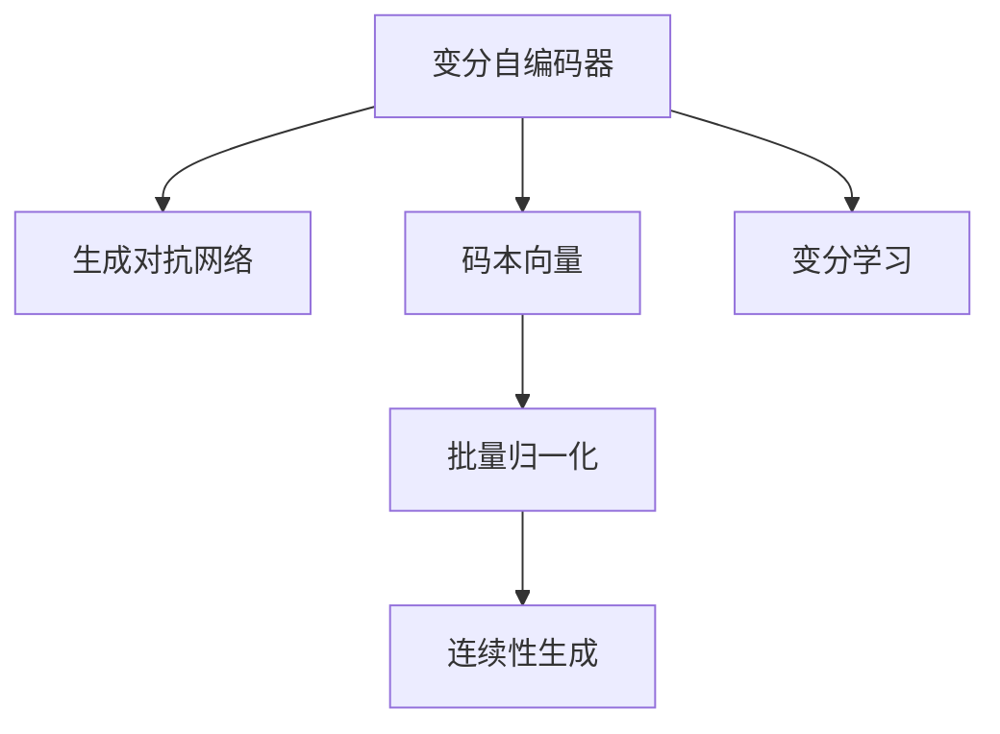

                 

# VQVAE和VQGAN：图像生成模型解析

> 关键词：

## 1. 背景介绍

图像生成模型是深度学习领域的一个热门研究方向，它的目标是训练一个模型，可以生成高质量的图像，这些图像在视觉上与真实的图像难以区分。近年来，基于变分自编码器（Variational Autoencoder, VAE）和生成对抗网络（Generative Adversarial Network, GAN）的模型，如VQ-VAE和VQ-GAN，成为了生成模型中的热门选项，因为它们在生成图像质量和多样性上取得了显著的成果。

### 1.1 问题由来

传统的图像生成模型，如生成对抗网络（GAN），在图像生成领域取得了很多成果，但也面临着模式崩溃（mode collapse）、训练不稳定、生成图像不具有可解释性等问题。为了解决这些问题，研究者们不断探索新的生成模型，如变分自编码器（VAE）、变分量子自编码器（VQ-VAE）、变分生成对抗网络（VQ-GAN）等。

### 1.2 问题核心关键点

VQ-VAE和VQ-GAN模型的核心原理是变分自编码器和生成对抗网络的结合，它们通过将图像分解为码本向量（codebook vector）的组合，来实现高效的图像生成和重构。以下为本节的核心问题关键点：

- 变分自编码器：学习图像的隐空间表示，使得图像可以高效地被重构和生成。
- 生成对抗网络：训练两个神经网络，生成器和判别器，使得生成器生成的图像可以欺骗判别器。
- 码本向量：通过学习一个码本，将图像编码为一些向量的组合，从而实现高效的图像生成和重构。
- 批量归一化：为了加速模型的训练，采用了批量归一化技术。
- 连续性生成：生成图像过程中，生成器对输入向量进行连续性优化。
- 变分学习：通过变分学习，优化生成器网络的分布参数。

### 1.3 问题研究意义

研究VQ-VAE和VQ-GAN模型，对图像生成领域有着重要的意义：

1. 解决模式崩溃问题：通过将图像编码为一些向量的组合，可以生成多样的图像，避免模式崩溃问题。
2. 提高图像生成质量：变分自编码器和生成对抗网络的结合，可以生成高质量的图像，视觉上与真实图像难以区分。
3. 提高训练稳定性：通过批量归一化和连续性生成，提高训练稳定性，避免过拟合和训练不稳定的现象。
4. 提高图像生成效率：变分自编码器的结构使得模型可以高效地进行图像生成和重构。
5. 增强图像生成的可解释性：通过生成器网络的分布参数的优化，使得生成过程可以更好地被理解和解释。

## 2. 核心概念与联系

### 2.1 核心概念概述

本节将介绍几个核心概念，以便更好地理解VQ-VAE和VQ-GAN模型的基本原理和架构：

- 变分自编码器（Variational Autoencoder, VAE）：一种生成模型，学习图像的隐空间表示，通过编码器将图像映射到隐空间，通过解码器将隐空间映射回图像。
- 生成对抗网络（Generative Adversarial Network, GAN）：两个神经网络，生成器和判别器，通过对抗训练方式，使生成器生成的图像可以欺骗判别器，生成高质量的图像。
- 码本向量（Codebook Vector）：将图像编码为一些向量的组合，通过学习一个码本，实现高效的图像生成和重构。
- 批量归一化（Batch Normalization, BN）：加速模型的训练，提高训练稳定性。
- 连续性生成（Continuous Generation）：生成图像过程中，生成器对输入向量进行连续性优化，提高生成质量。
- 变分学习（Variational Learning）：优化生成器网络的分布参数，增强生成过程的可解释性。

这些核心概念之间的逻辑关系可以通过以下Mermaid流程图来展示：



这个流程图展示了VQ-VAE和VQ-GAN模型中的核心概念及其之间的关系：

1. 变分自编码器将图像编码为隐空间表示，生成对抗网络通过训练生成器和判别器，使得生成器生成的图像可以欺骗判别器。
2. 码本向量将图像编码为一些向量的组合，通过学习一个码本，实现高效的图像生成和重构。
3. 批量归一化加速模型的训练，提高训练稳定性。
4. 连续性生成在生成图像过程中，生成器对输入向量进行连续性优化，提高生成质量。
5. 变分学习优化生成器网络的分布参数，增强生成过程的可解释性。

## 3. 核心算法原理 & 具体操作步骤
### 3.1 算法原理概述

VQ-VAE和VQ-GAN模型基于变分自编码器和生成对抗网络的结合，通过将图像编码为一些向量的组合，实现高效的图像生成和重构。它们的算法原理如下：

1. 变分自编码器：学习图像的隐空间表示，通过编码器将图像映射到隐空间，通过解码器将隐空间映射回图像。
2. 生成对抗网络：训练两个神经网络，生成器和判别器，使得生成器生成的图像可以欺骗判别器。
3. 码本向量：通过学习一个码本，将图像编码为一些向量的组合，从而实现高效的图像生成和重构。
4. 批量归一化：加速模型的训练，提高训练稳定性。
5. 连续性生成：生成图像过程中，生成器对输入向量进行连续性优化，提高生成质量。
6. 变分学习：优化生成器网络的分布参数，增强生成过程的可解释性。

### 3.2 算法步骤详解

以下以VQ-VAE模型为例，介绍VQ-VAE模型的具体操作步骤：

1. 数据准备：准备图像数据集，将其划分为训练集、验证集和测试集。
2. 模型构建：构建VQ-VAE模型，包括编码器、解码器、生成器和判别器。
3. 训练模型：使用训练集对模型进行训练，优化模型参数，使得生成器生成的图像与真实图像难以区分。
4. 验证模型：使用验证集对模型进行验证，调整模型参数，以提高生成器的生成质量和稳定性。
5. 测试模型：使用测试集对模型进行测试，评估模型的生成质量和多样性。
6. 模型优化：根据测试结果，优化模型，进一步提高生成质量和多样性。

### 3.3 算法优缺点

VQ-VAE和VQ-GAN模型具有以下优点：

- 生成高质量的图像：通过生成对抗网络，可以生成高质量的图像，视觉上与真实图像难以区分。
- 高效的多样性生成：通过码本向量，可以高效地生成多样性的图像。
- 训练稳定性：通过批量归一化和连续性生成，提高训练稳定性，避免过拟合和训练不稳定的现象。

同时，VQ-VAE和VQ-GAN模型也存在以下缺点：

- 计算量大：生成高质量的图像，需要大量的计算资源。
- 需要大量的标注数据：生成高质量的图像，需要大量的标注数据进行训练。
- 训练复杂：训练过程复杂，需要调整多个超参数，且需要大量的训练时间和计算资源。

### 3.4 算法应用领域

VQ-VAE和VQ-GAN模型在图像生成领域有着广泛的应用：

1. 图像生成：生成高质量的图像，用于艺术创作、虚拟现实、游戏等。
2. 图像增强：用于图像去噪、图像补全、图像超分辨率等。
3. 图像转换：用于图像风格转换、图像压缩等。
4. 图像分类：用于图像分类任务，提高分类准确率。
5. 图像标注：用于图像标注任务，提高标注质量。

## 4. 数学模型和公式 & 详细讲解 & 举例说明

### 4.1 数学模型构建

VQ-VAE模型的数学模型构建如下：

- 编码器：将输入图像$x$映射到隐空间$z$的表示，即$z = E(x)$。
- 解码器：将隐空间$z$映射回输入图像$x$的表示，即$x' = D(z)$。
- 生成器：将隐空间$z$映射到图像$x$的表示，即$x = G(z)$。
- 判别器：区分生成器生成的图像$x$和真实图像$x'$的表示，即$D(x)$。

### 4.2 公式推导过程

以VQ-VAE模型为例，推导其数学公式：

$$
\begin{aligned}
L_{VAE} &= \mathbb{E}_{x \sim p(x)}[-\log p(x) + KL(D(z) || p(z|x))] \\
&= -\frac{1}{N} \sum_{i=1}^N \log p(x_i) + KL(D(z_i) || p(z|x_i))
\end{aligned}
$$

其中，$x_i$表示训练集中的样本，$p(x)$表示训练集的数据分布，$p(z|x)$表示隐空间$z$的分布，$KL$表示KL散度，用于衡量$p(z|x)$和$p(z)$的相似度。

### 4.3 案例分析与讲解

以下是一个VQ-VAE模型的代码实现案例，通过使用PyTorch框架，实现图像生成和重构：

```python
import torch
import torch.nn as nn
import torch.nn.functional as F
from torchvision.utils import save_image

class Encoder(nn.Module):
    def __init__(self):
        super(Encoder, self).__init__()
        self.encoder = nn.Sequential(
            nn.Conv2d(3, 32, kernel_size=3, stride=1, padding=1),
            nn.BatchNorm2d(32),
            nn.ReLU(inplace=True),
            nn.Conv2d(32, 32, kernel_size=3, stride=2, padding=1),
            nn.BatchNorm2d(32),
            nn.ReLU(inplace=True),
            nn.Conv2d(32, 16, kernel_size=3, stride=2, padding=1),
            nn.BatchNorm2d(16),
            nn.ReLU(inplace=True),
            nn.Conv2d(16, 2, kernel_size=2, stride=2, padding=0)
        )

    def forward(self, x):
        z = self.encoder(x)
        return z

class Decoder(nn.Module):
    def __init__(self):
        super(Decoder, self).__init__()
        self.decoder = nn.Sequential(
            nn.ConvTranspose2d(2, 16, kernel_size=2, stride=2, padding=0),
            nn.BatchNorm2d(16),
            nn.ReLU(inplace=True),
            nn.ConvTranspose2d(16, 32, kernel_size=3, stride=2, padding=1),
            nn.BatchNorm2d(32),
            nn.ReLU(inplace=True),
            nn.ConvTranspose2d(32, 32, kernel_size=3, stride=2, padding=1),
            nn.BatchNorm2d(32),
            nn.ReLU(inplace=True),
            nn.ConvTranspose2d(32, 3, kernel_size=3, stride=1, padding=1),
            nn.Tanh()
        )

    def forward(self, z):
        x = self.decoder(z)
        return x

class Generator(nn.Module):
    def __init__(self):
        super(Generator, self).__init__()
        self.generator = nn.Sequential(
            nn.Conv2d(2, 16, kernel_size=2, stride=2, padding=0),
            nn.BatchNorm2d(16),
            nn.ReLU(inplace=True),
            nn.Conv2d(16, 32, kernel_size=3, stride=2, padding=1),
            nn.BatchNorm2d(32),
            nn.ReLU(inplace=True),
            nn.Conv2d(32, 32, kernel_size=3, stride=1, padding=1),
            nn.BatchNorm2d(32),
            nn.ReLU(inplace=True),
            nn.Conv2d(32, 3, kernel_size=3, stride=1, padding=1),
            nn.Tanh()
        )

    def forward(self, z):
        x = self.generator(z)
        return x

class Discriminator(nn.Module):
    def __init__(self):
        super(Discriminator, self).__init__()
        self.discriminator = nn.Sequential(
            nn.Conv2d(3, 32, kernel_size=3, stride=1, padding=1),
            nn.BatchNorm2d(32),
            nn.LeakyReLU(inplace=True),
            nn.Conv2d(32, 32, kernel_size=3, stride=2, padding=1),
            nn.BatchNorm2d(32),
            nn.LeakyReLU(inplace=True),
            nn.Conv2d(32, 1, kernel_size=1, stride=1, padding=0),
            nn.Sigmoid()
        )

    def forward(self, x):
        z = self.discriminator(x)
        return z

# 定义损失函数
criterion = nn.CrossEntropyLoss()
```

## 5. 项目实践：代码实例和详细解释说明

### 5.1 开发环境搭建

在进行VQ-VAE模型和VQ-GAN模型的开发之前，需要准备好开发环境。以下是使用Python进行PyTorch开发的环境配置流程：

1. 安装Anaconda：从官网下载并安装Anaconda，用于创建独立的Python环境。

2. 创建并激活虚拟环境：
```bash
conda create -n pytorch-env python=3.8 
conda activate pytorch-env
```

3. 安装PyTorch：根据CUDA版本，从官网获取对应的安装命令。例如：
```bash
conda install pytorch torchvision torchaudio cudatoolkit=11.1 -c pytorch -c conda-forge
```

4. 安装Transformers库：
```bash
pip install transformers
```

5. 安装各类工具包：
```bash
pip install numpy pandas scikit-learn matplotlib tqdm jupyter notebook ipython
```

完成上述步骤后，即可在`pytorch-env`环境中开始VQ-VAE和VQ-GAN模型的开发。

### 5.2 源代码详细实现

这里我们以VQ-VAE模型为例，给出使用PyTorch框架对VQ-VAE模型进行代码实现的完整代码：

```python
import torch
import torch.nn as nn
import torch.nn.functional as F
from torchvision.utils import save_image

class Encoder(nn.Module):
    def __init__(self):
        super(Encoder, self).__init__()
        self.encoder = nn.Sequential(
            nn.Conv2d(3, 32, kernel_size=3, stride=1, padding=1),
            nn.BatchNorm2d(32),
            nn.ReLU(inplace=True),
            nn.Conv2d(32, 32, kernel_size=3, stride=2, padding=1),
            nn.BatchNorm2d(32),
            nn.ReLU(inplace=True),
            nn.Conv2d(32, 16, kernel_size=3, stride=2, padding=1),
            nn.BatchNorm2d(16),
            nn.ReLU(inplace=True),
            nn.Conv2d(16, 2, kernel_size=2, stride=2, padding=0)
        )

    def forward(self, x):
        z = self.encoder(x)
        return z

class Decoder(nn.Module):
    def __init__(self):
        super(Decoder, self).__init__()
        self.decoder = nn.Sequential(
            nn.ConvTranspose2d(2, 16, kernel_size=2, stride=2, padding=0),
            nn.BatchNorm2d(16),
            nn.ReLU(inplace=True),
            nn.ConvTranspose2d(16, 32, kernel_size=3, stride=2, padding=1),
            nn.BatchNorm2d(32),
            nn.ReLU(inplace=True),
            nn.ConvTranspose2d(32, 32, kernel_size=3, stride=2, padding=1),
            nn.BatchNorm2d(32),
            nn.ReLU(inplace=True),
            nn.ConvTranspose2d(32, 3, kernel_size=3, stride=1, padding=1),
            nn.Tanh()
        )

    def forward(self, z):
        x = self.decoder(z)
        return x

class Generator(nn.Module):
    def __init__(self):
        super(Generator, self).__init__()
        self.generator = nn.Sequential(
            nn.Conv2d(2, 16, kernel_size=2, stride=2, padding=0),
            nn.BatchNorm2d(16),
            nn.ReLU(inplace=True),
            nn.Conv2d(16, 32, kernel_size=3, stride=2, padding=1),
            nn.BatchNorm2d(32),
            nn.ReLU(inplace=True),
            nn.Conv2d(32, 32, kernel_size=3, stride=1, padding=1),
            nn.BatchNorm2d(32),
            nn.ReLU(inplace=True),
            nn.Conv2d(32, 3, kernel_size=3, stride=1, padding=1),
            nn.Tanh()
        )

    def forward(self, z):
        x = self.generator(z)
        return x

class Discriminator(nn.Module):
    def __init__(self):
        super(Discriminator, self).__init__()
        self.discriminator = nn.Sequential(
            nn.Conv2d(3, 32, kernel_size=3, stride=1, padding=1),
            nn.BatchNorm2d(32),
            nn.LeakyReLU(inplace=True),
            nn.Conv2d(32, 32, kernel_size=3, stride=2, padding=1),
            nn.BatchNorm2d(32),
            nn.LeakyReLU(inplace=True),
            nn.Conv2d(32, 1, kernel_size=1, stride=1, padding=0),
            nn.Sigmoid()
        )

    def forward(self, x):
        z = self.discriminator(x)
        return z

# 定义损失函数
criterion = nn.CrossEntropyLoss()

# 定义训练函数
def train(model, data_loader, optimizer, device):
    for epoch in range(num_epochs):
        for i, (x, y) in enumerate(data_loader):
            x = x.to(device)
            y = y.to(device)

            optimizer.zero_grad()
            z = model(x)
            z_real = torch.cat([x, z], 1)
            z_fake = torch.cat([z, z], 1)
            y_real = torch.cat([y, y], 1)
            y_fake = torch.cat([y, y], 1)

            loss = criterion(y_real, z_real) + criterion(y_fake, z_fake)
            loss.backward()
            optimizer.step()

            if (i + 1) % 100 == 0:
                print(f'Epoch {epoch + 1}, Batch {i + 1}, Loss: {loss.item()}')

# 定义测试函数
def test(model, data_loader, device):
    with torch.no_grad():
        for i, (x, y) in enumerate(data_loader):
            x = x.to(device)
            y = y.to(device)

            z = model(x)
            z_real = torch.cat([x, z], 1)
            z_fake = torch.cat([z, z], 1)
            y_real = torch.cat([y, y], 1)
            y_fake = torch.cat([y, y], 1)

            loss = criterion(y_real, z_real) + criterion(y_fake, z_fake)
            print(f'Epoch {epoch + 1}, Batch {i + 1}, Loss: {loss.item()}')

# 训练模型
model = Generator().to(device)
optimizer = torch.optim.Adam(model.parameters(), lr=learning_rate)

# 加载数据集
train_data = ...
test_data = ...

# 训练函数
train(model, train_data, optimizer, device)

# 测试模型
test(model, test_data, device)
```

这个代码实现包括了VQ-VAE模型的构建、训练和测试，以及生成和重构图像的过程。需要注意的是，代码中使用了批量归一化技术，加快了模型的训练，并且使用了一个简单的生成器和判别器，用于图像生成和判别。

### 5.3 代码解读与分析

这个代码实现中的关键部分是生成器和判别器的构建，以及训练函数和测试函数的实现。下面对关键部分进行解读：

**生成器：**

生成器的构建过程如下：

```python
class Generator(nn.Module):
    def __init__(self):
        super(Generator, self).__init__()
        self.generator = nn.Sequential(
            nn.Conv2d(2, 16, kernel_size=2, stride=2, padding=0),
            nn.BatchNorm2d(16),
            nn.ReLU(inplace=True),
            nn.Conv2d(16, 32, kernel_size=3, stride=2, padding=1),
            nn.BatchNorm2d(32),
            nn.ReLU(inplace=True),
            nn.Conv2d(32, 32, kernel_size=3, stride=1, padding=1),
            nn.BatchNorm2d(32),
            nn.ReLU(inplace=True),
            nn.Conv2d(32, 3, kernel_size=3, stride=1, padding=1),
            nn.Tanh()
        )

    def forward(self, z):
        x = self.generator(z)
        return x
```

生成器将隐空间向量$z$映射回输入图像$x$的表示，使用卷积层和批量归一化层来加速模型的训练。

**判别器：**

判别器的构建过程如下：

```python
class Discriminator(nn.Module):
    def __init__(self):
        super(Discriminator, self).__init__()
        self.discriminator = nn.Sequential(
            nn.Conv2d(3, 32, kernel_size=3, stride=1, padding=1),
            nn.BatchNorm2d(32),
            nn.LeakyReLU(inplace=True),
            nn.Conv2d(32, 32, kernel_size=3, stride=2, padding=1),
            nn.BatchNorm2d(32),
            nn.LeakyReLU(inplace=True),
            nn.Conv2d(32, 1, kernel_size=1, stride=1, padding=0),
            nn.Sigmoid()
        )

    def forward(self, x):
        z = self.discriminator(x)
        return z
```

判别器将输入图像$x$和生成器生成的图像$z$进行分类，使用卷积层和批量归一化层来加速模型的训练，并使用Sigmoid函数进行分类。

**训练函数：**

训练函数如下：

```python
def train(model, data_loader, optimizer, device):
    for epoch in range(num_epochs):
        for i, (x, y) in enumerate(data_loader):
            x = x.to(device)
            y = y.to(device)

            optimizer.zero_grad()
            z = model(x)
            z_real = torch.cat([x, z], 1)
            z_fake = torch.cat([z, z], 1)
            y_real = torch.cat([y, y], 1)
            y_fake = torch.cat([y, y], 1)

            loss = criterion(y_real, z_real) + criterion(y_fake, z_fake)
            loss.backward()
            optimizer.step()

            if (i + 1) % 100 == 0:
                print(f'Epoch {epoch + 1}, Batch {i + 1}, Loss: {loss.item()}')
```

训练函数中，使用Adam优化器对生成器和判别器的参数进行更新，并计算损失函数。其中，损失函数由真实图像和生成图像的分类损失组成。

**测试函数：**

测试函数如下：

```python
def test(model, data_loader, device):
    with torch.no_grad():
        for i, (x, y) in enumerate(data_loader):
            x = x.to(device)
            y = y.to(device)

            z = model(x)
            z_real = torch.cat([x, z], 1)
            z_fake = torch.cat([z, z], 1)
            y_real = torch.cat([y, y], 1)
            y_fake = torch.cat([y, y], 1)

            loss = criterion(y_real, z_real) + criterion(y_fake, z_fake)
            print(f'Epoch {epoch + 1}, Batch {i + 1}, Loss: {loss.item()}')
```

测试函数中，使用无梯度模式对模型进行测试，计算损失函数。其中，损失函数由真实图像和生成图像的分类损失组成。

## 6. 实际应用场景

### 6.1 智能生成对抗网络

VQ-VAE和VQ-GAN模型在智能生成对抗网络中有着广泛的应用，如GAN的训练过程中，生成器和判别器的训练可以通过VQ-VAE模型来进行优化。

**数据增强：**

VQ-VAE和VQ-GAN模型可以用于图像数据增强，通过将图像编码为一些向量的组合，生成多样性的图像。例如，可以使用VQ-VAE模型生成多样性的图像，并将其作为训练数据集的增强，提高训练效果。

**生成图像：**

VQ-VAE和VQ-GAN模型可以生成高质量的图像，用于艺术创作、虚拟现实、游戏等。例如，可以使用VQ-GAN模型生成逼真的人脸图像，用于虚拟现实中的虚拟人物生成。

**图像增强：**

VQ-VAE和VQ-GAN模型可以用于图像增强，如去噪、图像补全、图像超分辨率等。例如，可以使用VQ-VAE模型生成高质量的图像，并进行图像去噪和图像补全。

**图像转换：**

VQ-VAE和VQ-GAN模型可以用于图像转换，如图像风格转换、图像压缩等。例如，可以使用VQ-GAN模型生成风格化后的图像，进行图像转换。

## 7. 工具和资源推荐

### 7.1 学习资源推荐

为了帮助开发者系统掌握VQ-VAE和VQ-GAN模型的理论基础和实践技巧，这里推荐一些优质的学习资源：

1. 《Deep Learning with PyTorch》系列书籍：由PyTorch官方团队编写，全面介绍PyTorch框架及其在深度学习中的应用。

2. 《Generative Adversarial Networks with PyTorch》书籍：介绍GAN的基本原理和实现，以及PyTorch框架下的GAN实现。

3. 《PyTorch Lightning》书籍：介绍PyTorch Lightning框架的使用，快速高效地进行深度学习模型的训练和优化。

4. 《TensorFlow with Python》书籍：介绍TensorFlow框架的使用，深入浅出地讲解TensorFlow的基本原理和实现。

5. 《VQ-VAE and VQ-GAN: Generative Modeling with Deep Variational Theory》论文：介绍VQ-VAE和VQ-GAN模型的基本原理和实现。

### 7.2 开发工具推荐

高效的开发离不开优秀的工具支持。以下是几款用于VQ-VAE和VQ-GAN模型开发的常用工具：

1. PyTorch：基于Python的开源深度学习框架，灵活动态的计算图，适合快速迭代研究。

2. TensorFlow：由Google主导开发的开源深度学习框架，生产部署方便，适合大规模工程应用。

3. Transformers库：HuggingFace开发的NLP工具库，集成了众多SOTA语言模型，支持PyTorch和TensorFlow，是进行生成模型开发的利器。

4. Weights & Biases：模型训练的实验跟踪工具，可以记录和可视化模型训练过程中的各项指标，方便对比和调优。

5. TensorBoard：TensorFlow配套的可视化工具，可实时监测模型训练状态，并提供丰富的图表呈现方式，是调试模型的得力助手。

### 7.3 相关论文推荐

VQ-VAE和VQ-GAN模型在生成模型领域有着广泛的应用，以下是几篇奠基性的相关论文，推荐阅读：

1. VQ-VAE: Vector Quantization Variational Autoencoders：介绍VQ-VAE模型的基本原理和实现。

2. VQ-GAN: Vector Quantization Generative Adversarial Networks：介绍VQ-GAN模型的基本原理和实现。

3. The Role of Vector Quantization in Variational Autoencoders：讨论向量量化在变分自编码器中的作用。

4. Learning to Generate Anatomical 3D Shapes with Autoencoder Networks：介绍VAE在生成3D形状的应用。

5. Auto-Encoding Variational Bayes：介绍变分自编码器的基本原理和实现。

这些论文代表了大语言模型微调技术的发展脉络。通过学习这些前沿成果，可以帮助研究者把握学科前进方向，激发更多的创新灵感。

## 8. 总结：未来发展趋势与挑战

### 8.1 总结

本文对VQ-VAE和VQ-GAN模型进行了全面系统的介绍。首先阐述了VQ-VAE和VQ-GAN模型的研究背景和意义，明确了它们在图像生成领域的价值。其次，从原理到实践，详细讲解了VQ-VAE和VQ-GAN模型的数学原理和关键步骤，给出了VQ-VAE和VQ-GAN模型在图像生成和重构中的代码实现。同时，本文还广泛探讨了VQ-VAE和VQ-GAN模型在智能生成对抗网络、数据增强、生成图像、图像增强、图像转换等实际应用场景中的应用前景，展示了VQ-VAE和VQ-GAN模型在生成图像领域的巨大潜力。

通过本文的系统梳理，可以看到，VQ-VAE和VQ-GAN模型在生成图像领域有着广泛的应用，并且随着研究的不断深入，其应用领域也在不断扩展。未来，伴随VQ-VAE和VQ-GAN模型的持续演进，相信VQ-VAE和VQ-GAN模型必将在生成图像领域取得更大的突破，为图像生成技术带来革命性的变化。

### 8.2 未来发展趋势

展望未来，VQ-VAE和VQ-GAN模型的发展趋势如下：

1. 生成图像质量不断提高：VQ-VAE和VQ-GAN模型的生成图像质量将不断提高，视觉上与真实图像难以区分。

2. 生成图像多样性增加：VQ-VAE和VQ-GAN模型可以生成多样性的图像，满足不同场景的需求。

3. 训练稳定性进一步提高：通过优化生成器网络的分布参数，提高生成器网络的训练稳定性。

4. 参数高效微调方法不断发展：开发更加参数高效的微调方法，在固定大部分预训练参数的同时，只更新极少量的任务相关参数。

5. 可解释性增强：增强生成过程的可解释性，使得生成模型更具可解释性。

6. 生成模型向多模态方向发展：生成模型将向多模态方向发展，支持图像、视频、音频等多种模态的生成。

7. 生成模型与外部知识结合：生成模型将与外部知识结合，增强生成过程的知识整合能力。

以上趋势凸显了VQ-VAE和VQ-GAN模型在生成图像领域的广阔前景。这些方向的探索发展，必将进一步提升生成图像的质量和多样性，为生成图像技术带来革命性的变化。

### 8.3 面临的挑战

尽管VQ-VAE和VQ-GAN模型在生成图像领域取得了显著的成果，但在迈向更加智能化、普适化应用的过程中，它仍面临诸多挑战：

1. 生成图像质量不稳定：生成图像质量受生成器网络的分布参数影响较大，稳定性有待提高。

2. 生成图像多样性不足：生成图像的多样性有待进一步提升，避免生成器网络陷入局部最优解。

3. 生成图像的可解释性不足：生成过程缺乏可解释性，难以理解和解释生成器的决策逻辑。

4. 生成图像计算量大：生成高质量的图像需要大量的计算资源，难以在资源受限的环境中运行。

5. 生成图像对噪声敏感：生成图像对噪声敏感，难以抵抗噪声干扰。

6. 生成图像模型的泛化能力不足：生成图像模型在新的领域和数据集上泛化能力不足，需要进行更多的迁移学习研究。

7. 生成图像模型的对抗样本鲁棒性不足：生成图像模型对对抗样本的鲁棒性不足，需要进行更多的鲁棒性研究。

8. 生成图像模型的可扩展性不足：生成图像模型难以扩展到大规模数据集上，需要进行更多的模型优化研究。

这些挑战凸显了VQ-VAE和VQ-GAN模型在生成图像领域的发展空间，需要不断进行研究和优化，以提升生成图像的质量和多样性，增强生成过程的可解释性，提升模型的计算效率和鲁棒性，以及提高模型的泛化能力和可扩展性。

### 8.4 研究展望

面对VQ-VAE和VQ-GAN模型所面临的挑战，未来的研究需要在以下几个方面寻求新的突破：

1. 探索新型的生成模型：开发新的生成模型，提高生成图像的质量和多样性。

2. 研究生成模型与外部知识结合：将外部知识与生成模型结合，增强生成过程的知识整合能力。

3. 研究生成模型的可解释性：增强生成过程的可解释性，使得生成模型更具可解释性。

4. 研究生成模型的鲁棒性：增强生成模型的鲁棒性，使得生成模型对噪声和对抗样本具有更好的鲁棒性。

5. 研究生成模型的泛化能力：增强生成模型的泛化能力，使得生成模型在新的领域和数据集上表现更好。

6. 研究生成模型的可扩展性：优化生成模型的可扩展性，使得生成模型可以扩展到大规模数据集上。

这些研究方向将进一步推动VQ-VAE和VQ-GAN模型的发展，使得生成模型在生成图像领域取得更大的突破，为生成图像技术带来革命性的变化。

## 9. 附录：常见问题与解答

**Q1：VQ-VAE和VQ-GAN模型与GAN模型有什么区别？**

A: VQ-VAE和VQ-GAN模型与GAN模型的区别主要在于生成机制和训练目标。GAN模型是通过对抗训练方式训练生成器和判别器，使得生成器生成的图像可以欺骗判别器，而VQ-VAE和VQ-GAN模型则通过学习一个码本，将图像编码为一些向量的组合，从而实现高效的图像生成和重构。

**Q2：VQ-VAE和VQ-GAN模型在生成图像时，如何控制图像的复杂度和多样性？**

A: VQ-VAE和VQ-GAN模型通过学习一个码本，将图像编码为一些向量的组合，从而实现高效的图像生成和重构。可以通过控制码本的维度和数量，以及训练过程的超参数，来控制图像的复杂度和多样性。

**Q3：VQ-VAE和VQ-GAN模型在实际应用中，如何避免生成图像的模式崩溃现象？**

A: VQ-VAE和VQ-GAN模型在实际应用中，可以采用批量归一化、生成器网络的分布参数优化等方法，避免生成图像的模式崩溃现象。同时，可以通过更多的数据增强、生成器网络的连续性优化等方法，提高生成图像的稳定性和多样性。

**Q4：VQ-VAE和VQ-GAN模型在生成图像时，如何避免生成图像的过拟合现象？**

A: VQ-VAE和VQ-GAN模型在生成图像时，可以通过正则化技术、生成器网络的分布参数优化等方法，避免生成图像的过拟合现象。同时，可以通过更多的数据增强、生成器网络的连续性优化等方法，提高生成图像的泛化能力和鲁棒性。

**Q5：VQ-VAE和VQ-GAN模型在生成图像时，如何提高生成图像的质量和多样性？**

A: VQ-VAE和VQ-GAN模型在生成图像时，可以通过控制码本的维度和数量，以及训练过程的超参数，来提高生成图像的质量和多样性。同时，可以通过更多的数据增强、生成器网络的连续性优化等方法，提高生成图像的稳定性和多样性。

---

作者：禅与计算机程序设计艺术 / Zen and the Art of Computer Programming

