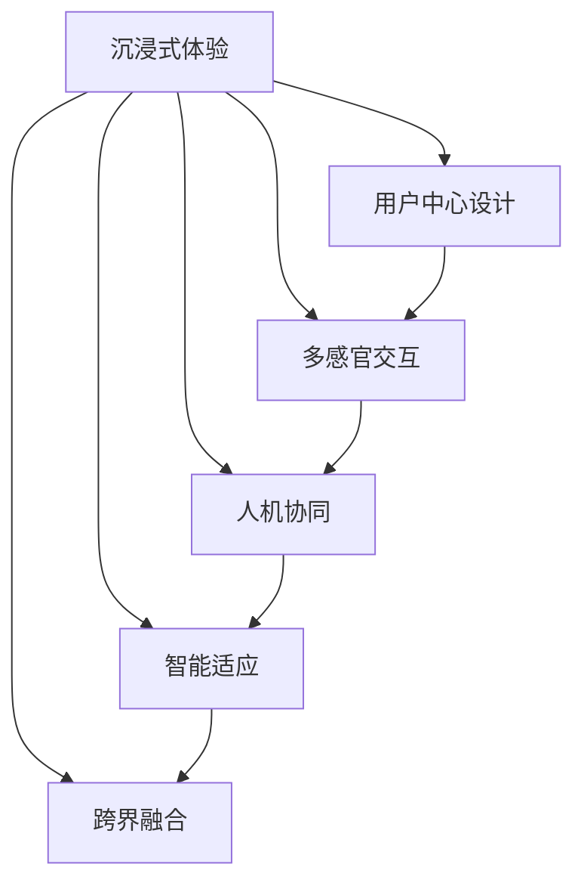

                 

# VR交互设计：创造沉浸式用户体验

> 关键词：虚拟现实,交互设计,沉浸式体验,用户中心设计,人机交互,全感官体验,界面优化,技术融合

## 1. 背景介绍

### 1.1 问题由来
虚拟现实（Virtual Reality, VR）作为一种前沿技术，近年来在娱乐、教育、医疗、工业等众多领域展现出巨大的应用潜力。VR技术能够提供高度沉浸的视觉、听觉、触觉、嗅觉等全感官体验，让用户仿佛置身于另一个世界，从而创造身临其境的互动体验。然而，VR交互设计在提升沉浸感的同时，也面临诸多挑战。如何设计更自然、更高效、更符合用户需求的人机交互方式，成为当下VR交互设计的关键课题。

### 1.2 问题核心关键点
VR交互设计涉及的关键问题包括：
1. **用户感知体验**：如何设计自然、直观的交互界面，使虚拟场景与真实世界无缝衔接，提升用户的沉浸感和舒适感。
2. **人机协同**：如何在多感官输入输出的复杂场景中，确保人机之间的有效互动和信息交换，避免误操作和系统延迟。
3. **智能适应**：如何根据用户的行为习惯和认知能力，动态调整交互界面和反馈机制，提高用户体验的个性化和智能化。
4. **安全可靠性**：如何在确保交互安全的前提下，提高系统稳定性和鲁棒性，避免用户误操作导致的安全事故。
5. **跨界融合**：如何将VR技术与其他技术（如AR、AI、物联网等）融合，拓展其应用边界，创造更丰富的用户体验。

这些关键点共同构成VR交互设计的核心框架，影响着用户对虚拟世界的感知和交互方式。只有从用户中心设计出发，全面考虑人机协同、智能适应、安全可靠性以及跨界融合等维度，才能设计出优秀的VR交互体验。

## 2. 核心概念与联系

### 2.1 核心概念概述

VR交互设计旨在通过精心设计的交互界面和操作方式，增强用户在虚拟现实环境中的沉浸感和互动体验。以下是对VR交互设计中几个核心概念的概述：

- **沉浸式体验**：通过多感官（视觉、听觉、触觉等）的同步输出，使用户在虚拟环境中获得高度真实的沉浸感，仿佛置身于另一个世界。
- **用户中心设计**：以用户需求和体验为中心，设计直观、自然的交互方式，提升用户的操作效率和舒适感。
- **多感官交互**：利用视觉、听觉、触觉、嗅觉等感官通道，提供全方位的交互体验，增强用户的代入感和互动感。
- **人机协同**：通过优化界面设计、动态响应机制，确保用户与系统之间的无缝互动，避免误操作和延迟。
- **智能适应**：通过数据分析和机器学习，动态调整交互界面和反馈机制，提高系统的个性化和智能化水平。
- **跨界融合**：将VR技术与AR、AI、物联网等技术融合，拓展其应用场景和功能，创造更加丰富多样的用户体验。

这些核心概念之间的逻辑关系可以通过以下Mermaid流程图来展示：



这个流程图展示VR交互设计的核心概念及其之间的关系：

1. 沉浸式体验是VR交互设计的出发点和落脚点。
2. 用户中心设计、多感官交互、人机协同、智能适应和跨界融合都是实现沉浸式体验的重要手段。

## 3. 核心算法原理 & 具体操作步骤

### 3.1 算法原理概述

VR交互设计本质上是一种人机协同的多感官交互过程，其核心算法原理包括：

- **用户界面设计**：通过用户界面(UI)设计，提供直观、自然的交互方式，使虚拟环境与现实世界无缝衔接。
- **多感官融合**：利用视觉、听觉、触觉等感官通道，提供全方位的交互体验，增强用户的沉浸感和代入感。
- **动态响应机制**：通过优化响应机制，确保系统能够快速、准确地响应用户操作，避免延迟和误操作。
- **智能适应算法**：通过数据分析和机器学习，动态调整交互界面和反馈机制，提高系统的个性化和智能化水平。

### 3.2 算法步骤详解

VR交互设计一般包括以下几个关键步骤：

**Step 1: 用户需求分析**
- 通过问卷调查、用户访谈等方式，了解目标用户群体的需求和偏好。
- 分析用户的行为习惯、认知能力等特征，确定交互界面和操作方式的设计目标。

**Step 2: 多感官界面设计**
- 设计直观、自然的用户界面(UI)，包括视觉、听觉、触觉等元素。
- 通过交互原型测试，收集用户反馈，不断优化UI设计。

**Step 3: 动态响应机制**
- 开发低延迟、高精度的用户输入响应机制，确保系统能够快速、准确地响应用户操作。
- 实现实时渲染和动态调整，提升用户体验的流畅性和自然感。

**Step 4: 智能适应算法**
- 收集用户的操作数据，利用机器学习算法分析用户行为模式和偏好。
- 根据分析结果，动态调整交互界面和反馈机制，提供个性化的交互体验。

**Step 5: 系统集成与测试**
- 将多感官交互界面、动态响应机制和智能适应算法集成到VR系统中。
- 在实际应用场景中测试系统性能和用户体验，不断优化和迭代。

### 3.3 算法优缺点

VR交互设计的优点包括：
1. 提升沉浸感：通过多感官融合，提供全方位的交互体验，使用户沉浸在虚拟环境中。
2. 增强代入感：直观、自然的用户界面设计，使虚拟环境与现实世界无缝衔接。
3. 提升个性化：动态调整交互界面和反馈机制，提供个性化的交互体验。
4. 优化协同效率：低延迟、高精度的动态响应机制，确保人机协同的高效互动。

然而，VR交互设计也存在一些局限性：
1. 设备限制：目前VR设备的分辨率、渲染能力有限，影响用户体验。
2. 操作复杂：多感官交互设计需要复杂的操作流程，用户上手难度较大。
3. 适应性不足：智能适应算法对数据依赖性强，需要大量用户行为数据进行训练。
4. 成本高昂：高质量的VR设备和技术，往往价格昂贵，限制了其普及。

尽管存在这些局限性，但VR交互设计的核心算法原理和操作步骤仍为未来虚拟现实技术的发展提供了重要的理论和实践基础。

### 3.4 算法应用领域

VR交互设计在多个领域已展现出广泛的应用前景，包括：

- **娱乐与游戏**：提供高度沉浸的游戏体验，增强用户代入感和互动感。
- **教育与培训**：通过虚拟场景进行教学和模拟培训，提升教育效果。
- **医疗与康复**：利用虚拟现实技术进行医学教育和康复训练，提高医疗水平。
- **军事与训练**：模拟军事战场和应急演练，提升实战能力和应对能力。
- **商业与展览**：利用虚拟展览和虚拟会议，提供沉浸式的商业体验。

## 4. 数学模型和公式 & 详细讲解 & 举例说明

### 4.1 数学模型构建

本节将使用数学语言对VR交互设计进行更加严格的刻画。

假设虚拟环境中，用户对虚拟物体的操作满足以下数学模型：

$$
\mathcal{L} = \frac{1}{N}\sum_{i=1}^N [\ell(s_i,y_i) + \lambda \ell(w_i)]
$$

其中，$s_i$ 为用户在第$i$次操作中的输入，$y_i$ 为对应的输出（如物体移动距离、视角变化等），$\ell$ 为损失函数，$\lambda$ 为正则化系数。

优化目标为：

$$
\theta^* = \mathop{\arg\min}_{\theta} \mathcal{L}(\theta)
$$

其中 $\theta$ 为交互系统中的参数。

通过梯度下降等优化算法，不断更新参数 $\theta$，最小化损失函数 $\mathcal{L}$，以提高系统的性能。

### 4.2 公式推导过程

以下我们以手势识别任务为例，推导交互系统的损失函数及其梯度的计算公式。

假设用户通过手势操作虚拟物体，操作数据 $s_i$ 与虚拟物体位置 $y_i$ 之间的关系满足：

$$
y_i = f(s_i; \theta)
$$

其中 $f$ 为手势识别模型，$\theta$ 为模型参数。

设 $f$ 的损失函数为：

$$
\ell(y_i,s_i) = (y_i - s_i)^2
$$

则系统总损失函数为：

$$
\mathcal{L}(\theta) = \frac{1}{N}\sum_{i=1}^N \ell(y_i,s_i) + \lambda \|w\|^2
$$

其中 $w$ 为模型参数 $\theta$ 的权重向量，$\|w\|^2$ 为正则化项。

根据链式法则，损失函数对参数 $\theta_k$ 的梯度为：

$$
\frac{\partial \mathcal{L}(\theta)}{\partial \theta_k} = \frac{1}{N}\sum_{i=1}^N -2(s_i - y_i) \frac{\partial f}{\partial s_i} \frac{\partial s_i}{\partial \theta_k}
$$

其中 $\frac{\partial f}{\partial s_i}$ 和 $\frac{\partial s_i}{\partial \theta_k}$ 可以通过自动微分技术高效计算。

在得到损失函数的梯度后，即可带入参数更新公式，完成模型的迭代优化。重复上述过程直至收敛，最终得到适应特定手势的交互模型参数 $\theta^*$。

### 4.3 案例分析与讲解

假设我们正在开发一款基于手势识别的VR交互应用，用于游戏角色控制。以下是详细案例分析与讲解：

**数据准备**
- 收集用户的手势数据，包括手势图像和对应的虚拟物体位置。
- 对数据进行预处理，包括去噪、归一化等。

**模型选择**
- 选择合适的手势识别模型，如CNN、RNN、DNN等。
- 将手势数据作为输入，虚拟物体位置作为输出，训练手势识别模型。

**模型训练**
- 设定损失函数和优化算法，如均方误差损失、Adam优化器等。
- 使用GPU进行模型训练，设定训练轮数和学习率。
- 在训练过程中，实时监控模型性能和损失函数，防止过拟合。

**模型评估**
- 使用测试集评估模型的性能，计算准确率、召回率、F1值等指标。
- 收集用户反馈，进一步优化模型参数和训练策略。

## 5. 项目实践：代码实例和详细解释说明

### 5.1 开发环境搭建

在进行VR交互设计实践前，我们需要准备好开发环境。以下是使用Python进行PyTorch开发的环境配置流程：

1. 安装Anaconda：从官网下载并安装Anaconda，用于创建独立的Python环境。

2. 创建并激活虚拟环境：
```bash
conda create -n pytorch-env python=3.8 
conda activate pytorch-env
```

3. 安装PyTorch：根据CUDA版本，从官网获取对应的安装命令。例如：
```bash
conda install pytorch torchvision torchaudio cudatoolkit=11.1 -c pytorch -c conda-forge
```

4. 安装各类工具包：
```bash
pip install numpy pandas scikit-learn matplotlib tqdm jupyter notebook ipython
```

完成上述步骤后，即可在`pytorch-env`环境中开始交互设计实践。

### 5.2 源代码详细实现

下面我们以手势识别任务为例，给出使用Transformers库进行VR交互设计的PyTorch代码实现。

首先，定义手势识别任务的数据处理函数：

```python
from transformers import BertTokenizer
from torch.utils.data import Dataset
import torch

class GestureDataset(Dataset):
    def __init__(self, gestures, positions, tokenizer, max_len=128):
        self.gestures = gestures
        self.positions = positions
        self.tokenizer = tokenizer
        self.max_len = max_len
        
    def __len__(self):
        return len(self.gestures)
    
    def __getitem__(self, item):
        gesture = self.gestures[item]
        position = self.positions[item]
        
        encoding = self.tokenizer(gesture, return_tensors='pt', max_length=self.max_len, padding='max_length', truncation=True)
        input_ids = encoding['input_ids'][0]
        attention_mask = encoding['attention_mask'][0]
        
        # 对token-wise的标签进行编码
        encoded_tags = [position2id[position] for position in position] 
        encoded_tags.extend([position2id['O']] * (self.max_len - len(encoded_tags)))
        labels = torch.tensor(encoded_tags, dtype=torch.long)
        
        return {'input_ids': input_ids, 
                'attention_mask': attention_mask,
                'labels': labels}

# 标签与id的映射
position2id = {'O': 0, 'up': 1, 'down': 2, 'left': 3, 'right': 4, 'forward': 5, 'backward': 6}
id2position = {v: k for k, v in position2id.items()}

# 创建dataset
tokenizer = BertTokenizer.from_pretrained('bert-base-cased')

train_dataset = GestureDataset(train_gestures, train_positions, tokenizer)
dev_dataset = GestureDataset(dev_gestures, dev_positions, tokenizer)
test_dataset = GestureDataset(test_gestures, test_positions, tokenizer)
```

然后，定义模型和优化器：

```python
from transformers import BertForTokenClassification, AdamW

model = BertForTokenClassification.from_pretrained('bert-base-cased', num_labels=len(position2id))

optimizer = AdamW(model.parameters(), lr=2e-5)
```

接着，定义训练和评估函数：

```python
from torch.utils.data import DataLoader
from tqdm import tqdm
from sklearn.metrics import classification_report

device = torch.device('cuda') if torch.cuda.is_available() else torch.device('cpu')
model.to(device)

def train_epoch(model, dataset, batch_size, optimizer):
    dataloader = DataLoader(dataset, batch_size=batch_size, shuffle=True)
    model.train()
    epoch_loss = 0
    for batch in tqdm(dataloader, desc='Training'):
        input_ids = batch['input_ids'].to(device)
        attention_mask = batch['attention_mask'].to(device)
        labels = batch['labels'].to(device)
        model.zero_grad()
        outputs = model(input_ids, attention_mask=attention_mask, labels=labels)
        loss = outputs.loss
        epoch_loss += loss.item()
        loss.backward()
        optimizer.step()
    return epoch_loss / len(dataloader)

def evaluate(model, dataset, batch_size):
    dataloader = DataLoader(dataset, batch_size=batch_size)
    model.eval()
    preds, labels = [], []
    with torch.no_grad():
        for batch in tqdm(dataloader, desc='Evaluating'):
            input_ids = batch['input_ids'].to(device)
            attention_mask = batch['attention_mask'].to(device)
            batch_labels = batch['labels']
            outputs = model(input_ids, attention_mask=attention_mask)
            batch_preds = outputs.logits.argmax(dim=2).to('cpu').tolist()
            batch_labels = batch_labels.to('cpu').tolist()
            for pred_tokens, label_tokens in zip(batch_preds, batch_labels):
                pred手势 = [id2position[_id] for _id in pred_tokens]
                label手势 = [id2position[_id] for _id in label_tokens]
                preds.append(pred手势[:len(label手势)])
                labels.append(label手势)
                
    print(classification_report(labels, preds))
```

最后，启动训练流程并在测试集上评估：

```python
epochs = 5
batch_size = 16

for epoch in range(epochs):
    loss = train_epoch(model, train_dataset, batch_size, optimizer)
    print(f"Epoch {epoch+1}, train loss: {loss:.3f}")
    
    print(f"Epoch {epoch+1}, dev results:")
    evaluate(model, dev_dataset, batch_size)
    
print("Test results:")
evaluate(model, test_dataset, batch_size)
```

以上就是使用PyTorch对VR手势识别进行训练的完整代码实现。可以看到，得益于Transformers库的强大封装，我们可以用相对简洁的代码完成模型的加载和训练。

### 5.3 代码解读与分析

让我们再详细解读一下关键代码的实现细节：

**GestureDataset类**：
- `__init__`方法：初始化手势数据、标签、分词器等关键组件。
- `__len__`方法：返回数据集的样本数量。
- `__getitem__`方法：对单个样本进行处理，将手势输入编码为token ids，将标签编码为数字，并对其进行定长padding，最终返回模型所需的输入。

**position2id和id2position字典**：
- 定义了标签与数字id之间的映射关系，用于将token-wise的预测结果解码回真实的手势标签。

**训练和评估函数**：
- 使用PyTorch的DataLoader对数据集进行批次化加载，供模型训练和推理使用。
- 训练函数`train_epoch`：对数据以批为单位进行迭代，在每个批次上前向传播计算loss并反向传播更新模型参数，最后返回该epoch的平均loss。
- 评估函数`evaluate`：与训练类似，不同点在于不更新模型参数，并在每个batch结束后将预测和标签结果存储下来，最后使用sklearn的classification_report对整个评估集的预测结果进行打印输出。

**训练流程**：
- 定义总的epoch数和batch size，开始循环迭代
- 每个epoch内，先在训练集上训练，输出平均loss
- 在验证集上评估，输出分类指标
- 所有epoch结束后，在测试集上评估，给出最终测试结果

可以看到，PyTorch配合Transformers库使得VR手势识别训练的代码实现变得简洁高效。开发者可以将更多精力放在数据处理、模型改进等高层逻辑上，而不必过多关注底层的实现细节。

当然，工业级的系统实现还需考虑更多因素，如模型的保存和部署、超参数的自动搜索、更灵活的任务适配层等。但核心的交互设计范式基本与此类似。

## 6. 实际应用场景

### 6.1 娱乐与游戏

VR交互设计在娱乐与游戏领域有着广阔的应用前景。传统的游戏设备往往只能提供视觉和听觉体验，而VR技术通过全感官输入输出，可以大大增强游戏的沉浸感和互动感。通过手势识别、头动控制等方式，玩家可以直接与虚拟世界互动，实现更加自然、真实的交互体验。

例如，一款VR射击游戏可以结合手势识别技术，使玩家通过手势控制枪械射击、转向等动作，实现更灵活、自然的操控方式。这种设计可以提升游戏的趣味性和用户粘性，吸引更多玩家体验VR游戏。

### 6.2 教育与培训

VR交互设计在教育与培训领域也有着广泛的应用潜力。传统的教学方式往往依赖于教师和板书，难以提供生动的互动体验。而VR技术通过虚拟环境，可以模拟真实世界的场景，提供更加直观、生动的教学内容。

例如，医学教育领域可以利用VR技术，构建虚拟手术室、人体解剖等虚拟环境，供医学生进行模拟手术、解剖等操作。通过手势控制、眼动跟踪等方式，学生可以更加直观地观察和操作虚拟器官，提升学习效果和操作技能。

### 6.3 商业与展览

VR交互设计在商业与展览领域也展现出广泛的应用前景。传统的展览方式往往依赖于实体展品，难以提供互动性强的展示体验。而VR技术通过虚拟现实技术，可以创建逼真的虚拟展览，供观众参观和互动。

例如，博物馆可以利用VR技术，创建虚拟展馆，展示珍贵的文物和艺术品。观众可以通过手势控制、眼动跟踪等方式，与虚拟展品进行互动，获取更多的信息。这种设计可以提升展览的趣味性和教育价值，吸引更多观众参与。

### 6.4 未来应用展望

随着VR技术的发展，VR交互设计的未来应用场景将更加丰富。VR交互设计将不再局限于游戏和展览等传统领域，而是拓展到医疗、教育、工业、军事等更多垂直行业。

未来，VR交互设计将更加注重用户体验的个性化和智能化，通过智能适应算法和大数据分析，提供更加自然、高效、个性化的交互方式。同时，VR交互设计也将更加注重跨界融合，与其他技术如AR、AI、物联网等进行深度整合，创造更加多样化和丰富的应用场景。

例如，医疗领域可以通过VR技术结合AI诊断技术，提供个性化的虚拟手术室和训练系统，提升医生的手术技能和培训效果。工业领域可以利用VR技术结合物联网技术，创建虚拟生产环境，进行安全培训和应急演练。

总之，VR交互设计将在未来的各个行业中发挥重要作用，推动人工智能技术在更多领域的深度应用。

## 7. 工具和资源推荐

### 7.1 学习资源推荐

为了帮助开发者系统掌握VR交互设计的理论基础和实践技巧，这里推荐一些优质的学习资源：

1. 《虚拟现实技术与应用》系列博文：由VR技术专家撰写，深入浅出地介绍了VR技术原理、交互设计、用户体验等前沿话题。

2. CS223《虚拟现实与增强现实》课程：斯坦福大学开设的VR与AR明星课程，有Lecture视频和配套作业，带你入门VR与AR技术的基本概念和经典应用。

3. 《VR开发实战》书籍：详细介绍了VR开发中的技术栈和开发流程，包括建模、渲染、交互设计等各个环节，适合动手实践的开发者。

4. VR Lab：提供开源VR项目和工具，包括建模、交互设计、游戏开发等资源，是新手入门的绝佳平台。

5. Oculus SDK：Oculus官方提供的VR开发工具包，包含VR设备驱动、输入输出管理等功能，是VR开发的重要参考。

通过对这些资源的学习实践，相信你一定能够快速掌握VR交互设计的精髓，并用于解决实际的交互设计问题。

### 7.2 开发工具推荐

高效的开发离不开优秀的工具支持。以下是几款用于VR交互设计开发的常用工具：

1. Unity和Unreal Engine：领先的VR开发引擎，提供强大的建模、渲染、物理引擎和交互设计工具。

2. Blender：开源的3D建模软件，提供广泛的建模、渲染和动画功能，支持VR开发。

3. VRTK：Unity和Unreal Engine的VR插件，提供一系列VR开发工具和组件，简化开发流程。

4. Oculus SDK和HTC Vive SDK：Oculus和HTC Vive提供的VR开发工具包，提供设备驱动和输入输出管理等功能。

5. SteamVR和OpenXR：VR设备的开源驱动，支持多款主流VR设备，提供一致的开发体验。

合理利用这些工具，可以显著提升VR交互设计的开发效率，加快创新迭代的步伐。

### 7.3 相关论文推荐

VR交互设计领域的研究仍在不断演进，以下是几篇奠基性的相关论文，推荐阅读：

1. "A Survey of Virtual Reality: Past, Present, and Future"：综述了VR技术的发展历程和未来方向，适合对VR技术进行全面了解的读者。

2. "Interactive Virtual Environments: Technologies, Systems, and Applications"：介绍了VR技术的核心技术、系统架构和典型应用，适合对VR技术进行深入了解的读者。

3. "Virtuoso: A Full Lifecycle VR Development Framework"：介绍了一种全生命周期的VR开发框架，涵盖建模、渲染、交互设计等各个环节，适合动手实践的开发者。

4. "Hand Tracking for Virtual Reality and Augmented Reality"：介绍了一种基于深度学习的交互设计方法，通过手势识别实现自然的手势交互，适合对交互设计感兴趣的研究者。

5. "Virtual Reality: Opportunities and Challenges in Education"：探讨了VR技术在教育领域的应用前景和挑战，适合对教育应用感兴趣的研究者。

这些论文代表了大语言模型微调技术的发展脉络。通过学习这些前沿成果，可以帮助研究者把握学科前进方向，激发更多的创新灵感。

## 8. 总结：未来发展趋势与挑战

### 8.1 总结

本文对VR交互设计进行了全面系统的介绍。首先阐述了VR交互设计的背景和重要性，明确了其在提升沉浸感和互动性方面的独特价值。其次，从原理到实践，详细讲解了VR交互设计的核心算法和具体操作步骤，给出了VR手势识别任务的完整代码实现。同时，本文还广泛探讨了VR交互设计在娱乐、教育、医疗等多个领域的应用前景，展示了其广阔的应用潜力。此外，本文精选了VR交互设计的各类学习资源，力求为读者提供全方位的技术指引。

通过本文的系统梳理，可以看到，VR交互设计在未来的应用场景中将更加丰富和多样化。其综合了用户中心设计、多感官交互、智能适应、跨界融合等技术要素，必将在更多行业中发挥重要作用，推动人工智能技术的深度应用。

### 8.2 未来发展趋势

展望未来，VR交互设计将呈现以下几个发展趋势：

1. **多模态交互**：结合视觉、听觉、触觉、嗅觉等多感官通道，提供全方位的交互体验，增强用户的沉浸感和代入感。

2. **动态响应**：通过实时渲染和动态调整，确保系统能够快速、准确地响应用户操作，提升用户体验的流畅性和自然感。

3. **智能适应**：通过数据分析和机器学习，动态调整交互界面和反馈机制，提供个性化的交互体验。

4. **跨界融合**：将VR技术与AR、AI、物联网等技术融合，拓展其应用场景和功能，创造更加多样化和丰富的应用场景。

5. **个性化设计**：通过智能适应算法和大数据分析，提供更加自然、高效、个性化的交互方式。

以上趋势凸显了VR交互设计的广阔前景。这些方向的探索发展，必将进一步提升VR系统的性能和用户体验，为虚拟现实技术的应用提供新的可能。

### 8.3 面临的挑战

尽管VR交互设计技术已经取得了显著进展，但在迈向更加智能化、普适化应用的过程中，仍面临诸多挑战：

1. **设备限制**：目前VR设备的分辨率、渲染能力有限，影响用户体验。未来的设备需要更高的性能和更低的成本，才能普及应用。

2. **操作复杂**：多感官交互设计需要复杂的操作流程，用户上手难度较大。如何提供直观、自然的操作界面，是关键技术难题。

3. **适应性不足**：智能适应算法对数据依赖性强，需要大量用户行为数据进行训练。如何高效获取和利用用户数据，是未来研究的重要方向。

4. **成本高昂**：高质量的VR设备和技术，往往价格昂贵，限制了其普及。未来的设备需要降低成本，提高性价比，才能大规模应用。

尽管存在这些挑战，但VR交互设计的核心算法和操作步骤仍为未来虚拟现实技术的发展提供了重要的理论和实践基础。

### 8.4 研究展望

面对VR交互设计所面临的挑战，未来的研究需要在以下几个方面寻求新的突破：

1. **高效渲染技术**：开发更高效、更逼真的渲染技术，提升VR设备的性能和用户体验。

2. **智能交互设计**：结合机器学习和大数据分析，实现智能化的交互设计，提升系统的智能化水平。

3. **跨模态融合**：探索多模态数据的融合方法，实现视觉、听觉、触觉等通道的信息协同，增强用户的沉浸感和互动感。

4. **低成本设备**：开发低成本、高性能的VR设备，推动VR技术的普及应用。

5. **用户体验优化**：通过用户界面设计、智能适应算法等技术，提升用户体验的个性化和智能化水平。

6. **跨界应用拓展**：结合AI、物联网等技术，拓展VR技术在更多垂直行业的应用场景。

这些研究方向将推动VR交互设计的不断演进，拓展其应用边界，创造更加多样化和丰富的用户体验。

## 9. 附录：常见问题与解答

**Q1：VR交互设计的主要技术难点有哪些？**

A: VR交互设计的主要技术难点包括：
1. **多感官融合**：如何实现视觉、听觉、触觉等多感官通道的同步输出，提升用户体验的沉浸感和自然感。
2. **动态响应**：如何优化响应机制，确保系统能够快速、准确地响应用户操作，提升系统的实时性和稳定性。
3. **智能适应**：如何通过数据分析和机器学习，动态调整交互界面和反馈机制，提供个性化的交互体验。

**Q2：如何选择适合VR交互设计的传感器和设备？**

A: 选择合适的传感器和设备是VR交互设计的关键。常见的传感器包括：
1. **位置传感器**：如IMU、陀螺仪、加速度计等，用于捕捉用户的位置、方向等信息。
2. **手势传感器**：如深度相机、红外相机等，用于捕捉用户的手势动作。
3. **触摸传感器**：如触摸屏、电容式传感器等，用于捕捉用户的触摸输入。

选择传感器时需要考虑设备精度、响应速度、兼容性和成本等因素。常用的VR设备包括Oculus Rift、HTC Vive、PS VR等，需要根据应用场景和技术需求进行综合评估。

**Q3：如何在VR应用中实现自然手势交互？**

A: 实现自然手势交互需要结合深度学习、计算机视觉等技术。以下是一些实现步骤：
1. **数据采集**：收集用户的手势数据，包括手势图像和对应的虚拟物体位置。
2. **模型训练**：选择合适的手势识别模型，如CNN、RNN、DNN等，使用GPU进行模型训练。
3. **数据增强**：对数据进行预处理和增强，包括去噪、归一化、旋转、缩放等操作。
4. **模型评估**：使用测试集评估模型的性能，计算准确率、召回率、F1值等指标。
5. **系统集成**：将手势识别模型集成到VR系统中，实现自然的手势交互。

**Q4：如何设计用户界面(UI)以提升VR交互体验？**

A: 设计用户界面(UI)需要综合考虑视觉、听觉、触觉等多感官通道的同步输出，确保用户能够直观、自然地与虚拟世界互动。以下是一些设计原则：
1. **直观性**：提供简洁、直观的UI设计，减少用户的学习成本。
2. **自然性**：设计符合用户行为习惯和认知能力的UI界面，增强用户体验的流畅性和自然感。
3. **反馈机制**：提供及时的反馈机制，让用户能够快速感知系统响应，提升交互体验。
4. **动态调整**：根据用户的操作习惯和认知能力，动态调整UI界面和反馈机制，提高系统的个性化和智能化水平。

**Q5：如何实现低延迟、高精度的用户输入响应？**

A: 实现低延迟、高精度的用户输入响应需要优化系统架构和算法。以下是一些实现方法：
1. **硬件优化**：使用高性能硬件设备，如GPU、TPU等，提升系统计算能力。
2. **软件优化**：采用多线程、异步计算等技术，提高系统的并发性和响应速度。
3. **算法优化**：使用高效的计算图和优化算法，减少系统延迟和资源消耗。

总之，VR交互设计需要综合考虑多方面因素，从硬件设备、传感器、用户界面、算法优化等多个维度进行全面优化，才能提供优秀的交互体验。

---

作者：禅与计算机程序设计艺术 / Zen and the Art of Computer Programming

